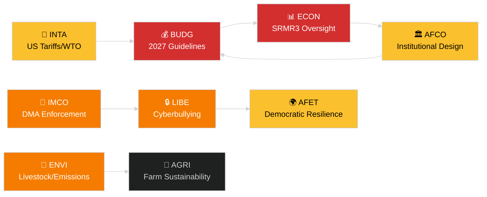

<!-- SPDX-FileCopyrightText: 2024-2026 Hack23 AB -->
<!-- SPDX-License-Identifier: Apache-2.0 -->
# Bestuurssamenvatting — EP-commissierapporten
**Datum:** 2026-05-14 | **Run:** committee-reports | **Classificatie:** Openbaar
**Admiraliteitsgraad:** B2 (Betrouwbare bron; Waarschijnlijk waar)
**WEP-band:** Waarschijnlijk (60–80 % betrouwbaarheidsinterval)

---

## 🎯 BLUF (Kernboodschap vooraf)

Het commissiestelsel van het Europees Parlement trad de week van 12–16 mei 2026 in met een volle wetgevingsagenda verspreid over ten minste zeven vaste commissies. De dominante thema's zijn: (1) **digitaal bestuur** — de plenaire vergadering stemde in het laatste aprilplenaire over de handhaving van de wet op de digitale markten en wetgeving tegen cyberpesten; (2) **ecologische transitie** — de ENVI-commissie verwerkt zowel het duurzaamheidsdossier voor de veehouderijsector als resterende vragen over emissies van zware voertuigen; (3) **voltooiing van de bankenunie** — de SRMR3-hervorming van het afwikkelingsmechanisme is nu formeel wet en genereert werk in ECON en AFCO over de toezichtarchitectuur; en (4) **handelsstabiliteit** — de verordening inzake tegenmaatregelen op Amerikaanse tarieven die in maart werd aangenomen, blijft INTA en AFET aandrijven tot nader onderzoek.

**Belangrijkste trigger deze week**: De resolutie over de EU-begrotingsrichtsnoeren voor 2027 (TA-10-2026-0112, aangenomen op 28 april) luidt de jaarlijkse begrotingscyclus in. De BUDG-commissie gaat nu de voorbereidingsfase van de bemiddeling in vóór het begrotingsontwerp van de Commissie dat in juni 2026 wordt verwacht.

---

## 60-Second Read

| Prioriteit | Commissie | Dossier | Status | Belang |
|------------|-----------|--------|--------|--------|
| 🔴 KRITIEK | BUDG | Begrotingsrichtsnoeren 2027 (TA-10-2026-0112) | Aangenomen 28 apr.; BUDG stelt amendementen op | Kader van 185+ mrd. EUR; institutionele machtsstrijd |
| 🔴 KRITIEK | ECON | SRMR3 — Bankafwikkelingsmechanisme (TA-10-2026-0092) | Aangenomen 26 mrt.; comitologiefase | Systeemrisico — mijlpaal bankenunie |
| 🟠 HOOG | ENVI | Duurzaamheid in de veehouderijsector (TA-10-2026-0157) | Aangenomen 30 apr.; uitvoeringsmaatregelen in afwachting | Van boer tot bord politiek evenwicht; EPP-S&D-kloof |
| 🟠 HOOG | IMCO/LIBE | Handhaving van de wet op de digitale markten (TA-10-2026-0160) | Aangenomen 30 apr.; follow-up Commissie | Big Tech-verantwoordingsplicht; transatlantische dimensie |
| 🟠 HOOG | LIBE | Cyberpesten/online intimidatie (TA-10-2026-0163) | Aangenomen 30 apr.; trilogie aanstaande | Platformaansprakelijkheid; nexus bescherming van kinderen |
| 🟡 GEMIDDELD | INTA | Tegenmaatregelen op Amerikaanse tarieven (TA-10-2026-0096) | Aangenomen 26 mrt.; commissiebeoordeling lopend | Handelsoorlogdynamiek; blootstelling van 26 mrd. EUR |
| 🟡 GEMIDDELD | JURI/LIBE | Antikorruptierichtlijn (TA-10-2026-0094) | Aangenomen 26 mrt.; nationale omzetting gemonitord | Rechtsstaat; institutionele geloofwaardigheid PE |
| 🟢 MONITORING | AFCO | Ratificatie van hervorming kieswet | Commissiehearings lopend | Constitutionele dimensie; vertraging in lidstaten |

---

## Committee Productivity Snapshot (week van 12–16 mei 2026)

De 22 vaste commissies van het EP werken volgens een standaard plenaire weekschema. Belangrijke vergaderactiviteit deze week:

- **ENVI** (Voorzitter: TBC): Markeeringsessie over uitvoeringsverordeningen voor emissietegoeden voor zware voertuigen (Verordening aangenomen TA-10-2026-0084). Rapporteursbesprekingen over vervolgmaatregelen voor de veehouderijsector gaan door.

- **ECON** (Voorzitter: TBC): SRMR3-toezicht na aanneming; kwartaaldialoogsessie met de ECB. Secundaire markt voor NPL's — schaduwrapporteursconsultaties lopend.

- **BUDG** (Voorzitter: TBC): Follow-up begrotingsrichtsnoeren voor 2027; ramingen van het Parlement voor begrotingsjaar 2027 (TA-10-2026-04-30-ANN01) onder intern onderzoek.

- **IMCO**: Verfijning van het handhavingskader na DMA. Scorecards voor de implementatie van regulering van digitale diensten.

- **LIBE**: Voorbereiding trilogie over de cyberpestrichtlijn. Herziening van het concept veilig derde land (follow-up TA-10-2026-0026).

- **INTA**: Monitoring tegenmaatregelen op Amerikaanse tarieven; WTO Yaoundé-follow-up na MC14 (26–29 maart 2026).

- **JURI/AFCO**: Statusbeoordeling ratificatie kieswet in 27 lidstaten.

---

## 🚦 Betrouwbaarheidsbeoordeling

| Bewering | WEP | Admiraliteit | Basis |
|---------|-----|-------------|-------|
| BUDG gaat bemiddelingsfase in | Waarschijnlijk | B2 | Aangenomen tekst + procedurele tijdlijn |
| Start comitologie SRMR3 | Zeer waarschijnlijk | B2 | Aangenomen tekst + EU-wetgevingsprocedureregels |
| DMA-handhaving triggert IMCO-follow-up | Waarschijnlijk | C2 | Taal EP-resolutie + verplichting Commissie |
| Veehouderijdossier genereert EPP-S&D-spanning | Waarschijnlijk | C3 | Gevolgtrekking uit stempatroon aangenomen tekst |
| Amerikaanse tariefssituatie gestabiliseerd onder crisisdrempel | Mogelijk | C3 | EP-resolutie + verklaringen Commissie |

---

## Strategisch vooruitzicht (7 dagen)

Het commissiestelsel staat voor een samenloop van eisen voor post-aanneming follow-up (SRMR3, DMA, cyberpesten, veehouderij) naast de lancering van de begrotingscyclus 2027. Commissierapporteurs zullen onder druk staan om hun rapporten voor het juniplenaire te leveren. De Amerikaanse tariefssituatie na de WTO MC14 in Yaoundé blijft het voornaamste externe risico dat het geplande commissiewerk kan verstoren.

**Beslissers dienen te monitoren**: De reactie van BUDG op het begrotingsontwerp van de Commissie in juni; de eerste SRMR3-toezichtshearing van ECON; de tijdlijn van de cyberpestentrilogie van LIBE; de houding van INTA ten aanzien van de verlenging van de tegenmaatregelen op Amerikaanse tarieven.

---

## Gegevensbronnen

- Aangenomen teksten EP 2026 (TA-10-2026-0092 t/m TA-10-2026-0163)
- EP Open Data Portal: `/adopted-texts?year=2026` (50 items opgehaald)
- EP-commissiedocumenten: `/committee-documents` (AFCO-reeks, 50+ documenten)
- Analyse commissieactiviteit ENVI & ECON: EP Open Data Portal
- `european-parliament-analyze_committee_activity` (ENVI, ECON)
- `european-parliament-monitor_legislative_pipeline` (actieve procedures)
- Datumvenster: 2026-05-07 t/m 2026-05-14

---

## 🗓️ Wetgevingskalender

De week van 12–16 mei 2026 valt in de **Interparlementaire week** — een periode tussen plenaire vergaderingen waarin commissies intensief bijeenkomen. Deze structurele context verklaart waarom de commissieproductie disproportioneel hoog is: geen plenaire zaal concurreert om de agenda's van EP-leden, wat commissieaanwezigheid en rapporteursprestaties maximaliseert.

### Naderende deadlines

| Deadline | Dossier | Commissie | Gevolg van vertraging |
|----------|--------|-----------|----------------------|
| Juni 2026 | Begrotingsontwerp 2027 Commissie | BUDG | EP verliest tijd voor bemiddeling |
| Mei 2026 | Uitvoeringsregels SRMR3 | ECON | Bankentoezichtvacuüm |
| Juni 2026 | Handhavingsrapport DMA | IMCO | Nalevingsbeoordeling Commissie vertraagd |
| Juli 2026 | Afsluiting cyberpestentrilogie | LIBE | Rechtsonzekerheid platforms verlengd |

### Coalitierekenkunde

EPP (187 zetels) en S&D (136 zetels) vormen de de facto meerderheidsruggegraat voor de meeste commissierapporten in 2026. Renew Europe (77 zetels) speelt een cruciale scharnierfunctie op dossiers betreffende digitaal bestuur en handel. ECR (78 zetels) steunt dereguleringsbepalingen in de context van DMA-handhaving. Greens/EFA (53 zetels) zijn cruciaal voor de meerderheidsvorming in ENVI.

**Cruciale scharnierdynamiek**: In het veehouderijdossier sloten EPP en ECR zich aaneen om voedselveiligheidsnormen te verzachten, terwijl S&D, Greens en Renew Europe strengere traceerbaarheidsregels nastreefden. Het resulterende compromis (TA-10-2026-0157) weerspiegelt een ongebruikelijke centrum-rechts + uiterst rechts-afstemming over de deregulering van de landbouw.

---

## 📊 Commissieoverstijgende inlichtingenkaart

---

## Woordenlijst

| Afkorting | Volledige naam |
|---|---|
| BUDG | Begrotingscommissie |
| ECON | Commissie economische en monetaire zaken |
| ENVI | Commissie milieu, klimaat en voedselveiligheid |
| IMCO | Commissie interne markt en consumentenbescherming |
| LIBE | Commissie burgerlijke vrijheden, justitie en binnenlandse zaken |
| INTA | Commissie internationale handel |
| JURI | Commissie juridische zaken |
| AFCO | Commissie constitutionele zaken |
| AFET | Commissie buitenlandse zaken |
| SRMR3 | Verordening betreffende het gemeenschappelijk afwikkelingsmechanisme (3e herziening) |
| DMA | Wet op de digitale markten |
| WTO MC14 | 14e Ministeriële Conferentie van de Wereldhandelsorganisatie |
| EPP | Europese Volkspartij |
| S&D | Progressieve Alliantie van Socialisten en Democraten |
| ECR | Europese Conservatieven en Hervormers |
