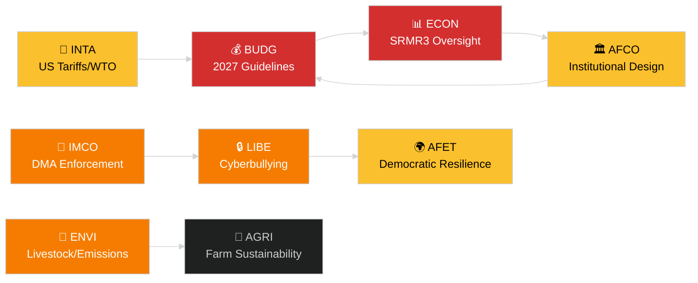

<!-- SPDX-FileCopyrightText: 2024-2026 Hack23 AB -->
<!-- SPDX-License-Identifier: Apache-2.0 -->
# Ledersammendrag — EP-komitérapporter
**Dato:** 2026-05-14 | **Kjøring:** committee-reports | **Klassifisering:** Offentlig
**Admiralitetsgrad:** B2 (Pålitelig kilde; Sannsynligvis sant)
**WEP-bånd:** Sannsynlig (60–80 % konfidensintervall)

---

## 🎯 BLUF (Bunnlinje på forhånd)

Europaparlamentets komitésystem innledet uken 12.–16. mai 2026 med en fullpakket lovgivningsagenda på tvers av minst syv stående komitéer. De dominerende temaene er: (1) **digital styring** — plenumsmøtet stemte over håndhevelse av den digitale markedsloven og lovgivning mot nettmobbing på det siste aprilplenumsmøtet; (2) **miljøomstilling** — ENVI-komitéen behandler både bærekraftfilen for husdyrsektoren og gjenstående spørsmål om utslipp fra tunge kjøretøy; (3) **fullføring av bankunionen** — SRMR3-reformen av resolusjonsmekanismen er nå formelt lov og skaper arbeid i ECON og AFCO om tilsynsarkitekturen; og (4) **handelsmessig motstandsdyktighet** — forordningen om mottiltak mot amerikanske toll som ble vedtatt i mars, fortsetter å drive INTA og AFETs gransking.

**Viktigste begivenhet denne uken**: Resolusjonen om EUs budsjettretningslinjer for 2027 (TA-10-2026-0112, vedtatt 28. april) innleder den årlige budsjettsyklusen. BUDG-komitéen er nå i forliksforberedelsesfase i forkant av Kommisjonens budsjettforslag som forventes i juni 2026.

---

## 60-Second Read

| Prioritet | Komité | Fil | Status | Betydning |
|-----------|--------|-----|--------|-----------|
| 🔴 KRITISK | BUDG | 2027 Budsjettretningslinjer (TA-10-2026-0112) | Vedtatt 28. apr; BUDG utarbeider endringsforslag | 185+ mrd. EUR rammeverk; institusjonell maktkamp |
| 🔴 KRITISK | ECON | SRMR3 — Bankresolusjonsmekanisme (TA-10-2026-0092) | Vedtatt 26. mar; komitologifase | Systemrisiko — milepæl for bankunionen |
| 🟠 HØY | ENVI | Bærekraft i husdyrsektoren (TA-10-2026-0157) | Vedtatt 30. apr; gjennomføringstiltak avventer | Jord-til-bord politisk balanse; EPP-S&D-skillelinje |
| 🟠 HØY | IMCO/LIBE | Håndhevelse av den digitale markedsloven (TA-10-2026-0160) | Vedtatt 30. apr; Kommisjonens oppfølging | Big Tech-ansvarlighet; transatlantisk dimensjon |
| 🟠 HØY | LIBE | Nettmobbing/online-trakassering (TA-10-2026-0163) | Vedtatt 30. apr; trilog forestår | Plattformsansvar; barnebeskyttelsesneksus |
| 🟡 MIDDELS | INTA | Mottiltak mot amerikanske toll (TA-10-2026-0096) | Vedtatt 26. mar; komitégransking pågår | Handelskrigsdynamikk; 26 mrd. EUR eksponering |
| 🟡 MIDDELS | JURI/LIBE | Korrupsjonsdirektiv (TA-10-2026-0094) | Vedtatt 26. mar; nasjonal transposisjon overvåkes | Rettsstatsprinsippet; EPs institusjonelle troverdighet |
| 🟢 OVERVÅKING | AFCO | Ratifisering av valglovreform | Komitéhøringer pågår | Konstitusjonell dimensjon; forsinkelse i medlemsstatene |

---

## Committee Productivity Snapshot (uke 12.–16. mai 2026)

EPs 22 stående komitéer arbeider etter en standard plenumsukeplan. Viktig møteaktivitet denne uken:

- **ENVI** (leder: TBC): Markeringssesjon om gjennomføringsforordninger for utslippskreditter for tunge kjøretøy (forordning vedtatt TA-10-2026-0084). Ordførerdrøftinger om oppfølgingstiltak for husdyrsektoren fortsetter.

- **ECON** (leder: TBC): SRMR3 etter-vedtakelsesovervåking; kvartalsvis ECB-dialogsesjon. Sekundærmarkedet for misligholdte lån — skyggeordførerkonsultasjoner pågår.

- **BUDG** (leder: TBC): Oppfølging av budsjettretningslinjer for 2027; Parlamentets overslag for regnskapsår 2027 (TA-10-2026-04-30-ANN01) under intern gjennomgang.

- **IMCO**: Forfining av håndhevelsesrammeverk etter DMA. Implementeringsscorecard for regulering av digitale tjenester.

- **LIBE**: Forberedelse av trilog om nettmobbingsdirektivet. Gjennomgang av begrepet sikkert tredjeland (oppfølging av TA-10-2026-0026).

- **INTA**: Overvåking av mottiltak mot amerikanske toll; WTO Yaoundé-oppfølging etter MC14 (26.–29. mars 2026).

- **JURI/AFCO**: Statusgjennomgang av ratifisering av valgloven i 27 medlemsstater.

---

## 🚦 Konfidensvurdering

| Påstand | WEP | Admiralitet | Grunnlag |
|---------|-----|-------------|----------|
| BUDG går inn i forliksfase | Sannsynlig | B2 | Vedtatt tekst + prosedyremessig tidslinje |
| SRMR3 komitologistart | Svært sannsynlig | B2 | Vedtatt tekst + EUs lovgivningsprosedyreregler |
| DMA-håndhevelse utløser IMCO-oppfølging | Sannsynlig | C2 | EP-resolusjonsspråk + Kommisjonens forpliktelse |
| Husdyrfilen skaper EPP-S&D-spenning | Sannsynlig | C3 | Vedtatt teksts avstemingsmønster-slutning |
| Amerikansk tollsituasjon stabilisert under kriseterskelen | Mulig | C3 | EP-resolusjon + Kommisjonsuttalelser |

---

## Strategisk utsikt (7 dager)

Komitésystemet møter en konvergens av krav om oppfølging etter vedtakelse (SRMR3, DMA, nettmobbing, husdyr) parallelt med lanseringen av 2027-budsjettsyklusen. Komitéordførere vil stå under press for å levere sine rapporter i forkant av juniplenumsmøtet. Den amerikanske tollsituasjonen etter WTOs MC14 i Yaoundé er fortsatt den viktigste eksterne risikoen som kan forstyrre planlagt komitéarbeid.

**Beslutningstakere bør overvåke**: BUDGs respons på Kommisjonens budsjettforslag i juni; ECONs første SRMR3-tilsynshøring; LIBEs tidslinje for nettmobbingstrilogen; INTAs holdning til fornyelse av mottiltak mot amerikanske toll.

---

## Datakilder

- EPs vedtatte tekster 2026 (TA-10-2026-0092 til TA-10-2026-0163)
- EPs åpne dataportal: `/adopted-texts?year=2026` (50 elementer hentet)
- EP-komitédokumenter: `/committee-documents` (AFCO-serien, 50+ dokumenter)
- ENVI & ECON-komitéaktivitetsanalyse: EPs åpne dataportal
- `european-parliament-analyze_committee_activity` (ENVI, ECON)
- `european-parliament-monitor_legislative_pipeline` (aktive prosedyrer)
- Datovindu: 2026-05-07 til 2026-05-14

---

## 🗓️ Lovgivningsmessig kalender

Uken 12.–16. mai 2026 faller i **Interparlamentarisk uke** — en periode mellom plenumsmøtene der komitéer møtes intensivt. Denne strukturelle konteksten forklarer hvorfor komitéproduktiviteten er uforholdsmessig høy: ingen plenumssal konkurrerer om MEPs tidsplaner, noe som maksimerer komitédeltakelse og ordførerresultater.

### Forestående frister

| Frist | Fil | Komité | Konsekvens av forsinkelse |
|-------|-----|--------|--------------------------|
| Juni 2026 | Kommisjonens budsjettforslag 2027 | BUDG | EP mister tid til forliksforhandlinger |
| Mai 2026 | SRMR3 gjennomføringsregler | ECON | Banktilsynsvakuum |
| Juni 2026 | DMA-håndhevelsesrapport | IMCO | Kommisjonens etterlevingsvurdering forsinkes |
| Juli 2026 | Avslutning av nettmobbingstrilog | LIBE | Plattformers rettslige usikkerhet forlenges |

### Koalisjonsaritmetikk

EPP (187 seter) og S&D (136 seter) utgjør den de facto majoritetsryggraden for de fleste komitérapporter i 2026. Renew Europe (77 seter) spiller en avgjørende svingrollerrolle på digitale styrings- og handelsfiler. ECR (78 seter) støtter dereguleringsprovisionene i DMA-håndhevelseskonteksten. Greens/EFA (53 seter) er avgjørende for ENVI-majoritetsbygging.

**Viktig svingdynamikk**: På husdyrsektorfilen sluttet EPP og ECR seg sammen for å myke opp mattrygghetsstandardene, mens S&D, Greens og Renew Europe søkte sterkere sporbarhetskrav. Det resulterende kompromisset (TA-10-2026-0157) reflekterer en uvanlig sentrum-høyre + ytterste høyre-tilpasning om landbruksderegulering.

---

## 📊 Tverrkomité etterretningskart

---

## Ordliste

| Forkortelse | Fullt navn |
|---|---|
| BUDG | Budsjettkomitéen |
| ECON | Komitéen for økonomi og pengepolitikk |
| ENVI | Komitéen for miljø, klima og mattrygghet |
| IMCO | Komitéen for det indre marked og forbrukerbeskyttelse |
| LIBE | Komitéen for borgernes rettigheter og rettslige og innenrikse anliggender |
| INTA | Komitéen for internasjonal handel |
| JURI | Rettskomitéen |
| AFCO | Komitéen for konstitusjonelle anliggender |
| AFET | Utenrikskomitéen |
| SRMR3 | Forordningen om den felles resolusjonsmekanismen (3. revisjon) |
| DMA | Den digitale markedsloven |
| WTO MC14 | Verdenshandelsorganisasjonens 14. ministerkonferanse |
| EPP | Det europeiske folkepartiet |
| S&D | Det progressive forbundet av sosialdemokrater |
| ECR | De europeiske konservative og reformistene |
