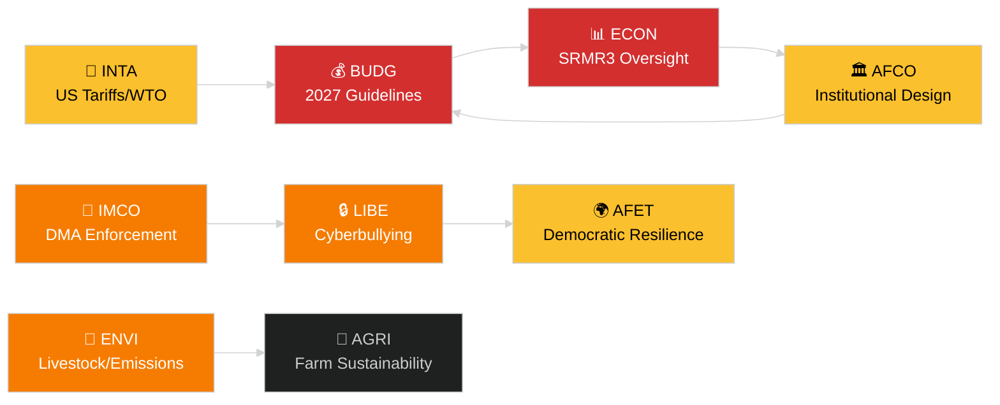

<!-- SPDX-FileCopyrightText: 2024-2026 Hack23 AB -->
<!-- SPDX-License-Identifier: Apache-2.0 -->
# Verksamhetsöversikt — EP-utskottsrapporter
**Datum:** 2026-05-14 | **Körning:** committee-reports | **Klassificering:** Offentlig
**Admiralitetsbetyg:** B2 (Tillförlitlig källa; Troligtvis sant)
**WEP-band:** Troligtvis (60–80 % konfidensintervall)

---

## 🎯 BLUF (Slutsats i förväg)

Europaparlamentets utskottssystem inledde veckan 12–16 maj 2026 med en fullspäckad lagstiftningsagenda i minst sju stående utskott. De dominerande temana är: (1) **digital styrning** — plenarsammanträdet röstade om tillämpningen av den digitala marknadslagen och lagstiftning mot nätmobbning vid det sista aprilplenariet; (2) **miljöomställning** — ENVI-utskottet behandlar hållbarhetsfilen för boskapssektorn och återstående frågor om avgasutsläpp från tunga fordon; (3) **slutförande av bankunionen** — SRMR3-reformen för resolutionsmekanismen har nu trätt i kraft och sätter avtryck i ECON och AFCO vad gäller tillsynsarkitekturen; och (4) **handelsmotståndskraft** — förordningen om motåtgärder mot amerikanska tullar som antogs i mars fortsätter att driva granskning i INTA och AFET.

**Viktigaste händelse denna vecka**: Resolutionen om EU:s budgetriktlinjer för 2027 (TA-10-2026-0112, antagen 28 april) inleder den årliga budgetcykeln. BUDG-utskottet går nu in i förlikningsförberedande fas inför kommissionens utkast till budget som förväntas i juni 2026.

---

## 60-Second Read

| Prioritet | Utskott | Fil | Status | Betydelse |
|-----------|---------|-----|--------|-----------|
| 🔴 KRITISK | BUDG | 2027 Budgetriktlinjer (TA-10-2026-0112) | Antagen 28 apr; BUDG utarbetar ändringsförslag | 185 miljarder euro+ ramverk; institutionell maktkonflikt |
| 🔴 KRITISK | ECON | SRMR3 — Bankresoltningsmekanism (TA-10-2026-0092) | Antagen 26 mars; kommittologifas | Systemrisk — milstolpe för bankunionen |
| 🟠 HÖG | ENVI | Hållbarhet inom boskapssektorn (TA-10-2026-0157) | Antagen 30 apr; genomförandeåtgärder väntar | Politisk balans från jord till bord; EPP-S&D-skiljelinje |
| 🟠 HÖG | IMCO/LIBE | Tillämpning av den digitala marknadslagen (TA-10-2026-0160) | Antagen 30 apr; kommissionens uppföljning | Ansvarsskyldighet för Big Tech; transatlantisk dimension |
| 🟠 HÖG | LIBE | Nätmobbning/online-trakasserier (TA-10-2026-0163) | Antagen 30 apr; trilog förestår | Plattformsansvar; kopplingen till barnsskydd |
| 🟡 MEDEL | INTA | Motåtgärder mot amerikanska tullar (TA-10-2026-0096) | Antagen 26 mars; utskottsgranskning pågår | Handelskrigsdynamik; 26 miljarder euro i riskzon |
| 🟡 MEDEL | JURI/LIBE | Korruptionsdirektiv (TA-10-2026-0094) | Antagen 26 mars; nationell transposition bevakas | Rättsstatsprincipen; EP:s institutionella trovärdighet |
| 🟢 BEVAKNING | AFCO | Ratificering av vallagreform | Utskottshörningar pågår | Konstitutionell dimension; eftersläpning i medlemsstaterna |

---

## Committee Productivity Snapshot (vecka 12–16 maj 2026)

EP:s 22 stående utskott arbetar enligt ett ordinarie plenarveckoschema. Viktig mötesaktivitet denna vecka:

- **ENVI** (ordförande: TBC): Markeringssession om genomförandeförordningar för utsläppskrediter för tunga fordon (förordning antagen TA-10-2026-0084). Föredragandediskussioner om uppföljningsåtgärder för boskapssektorn fortsätter.

- **ECON** (ordförande: TBC): SRMR3 post-antagningsöversyn; kvartalsdialog med ECB. Sekundärmarknaden för NPLer — skuggföredragandekonsultationer pågår.

- **BUDG** (ordförande: TBC): Uppföljning av budgetriktlinjerna för 2027; parlamentets beräkningar för budgetåret 2027 (TA-10-2026-04-30-ANN01) under intern granskning.

- **IMCO**: Förfining av tillämpningsramverk efter DMA. Rapportkort för genomförande av digitala tjänsteregleringar.

- **LIBE**: Förberedelse för trilog om cybermobbningstdirektivet. Granskning av begreppet säkert tredjeland (uppföljning av TA-10-2026-0026).

- **INTA**: Övervakning av motåtgärder mot amerikanska tullar; WTO Yaoundé-uppföljning efter MC14 (26–29 mars 2026).

- **JURI/AFCO**: Statusgranskning av ratificering av vallagen i 27 medlemsstater.

---

## 🚦 Konfidensanalys

| Påstående | WEP | Admiralitet | Grund |
|-----------|-----|-------------|-------|
| BUDG går in i förlikningsfas | Troligtvis | B2 | Antagen text + processuell tidslinje |
| SRMR3 kommittologistart | Mycket troligtvis | B2 | Antagen text + EU:s lagstiftningsprocedurregler |
| DMA-tillämpning utlöser IMCO-uppföljning | Troligtvis | C2 | EP-resolutionsspråk + kommissionsförpliktelse |
| Boskapsfilen skapar EPP-S&D-spänning | Troligtvis | C3 | Slutsats av röstningsmönster för antagen text |
| USA-tullsituationen stabiliserad under kriströskel | Möjligen | C3 | EP-resolution + kommissionsuttalanden |

---

## Strategisk prognos (7 dagar)

Utskottssystemet står inför en konvergens av krav på uppföljning efter antagning (SRMR3, DMA, nätmobbning, boskap) parallellt med starten av 2027 års budgetcykel. Utskottsföredraganden kommer att stå under press att leverera sina betänkanden inför juniplenaret. Den amerikanska tullsituationen efter WTO:s MC14 i Yaoundé kvarstår som den huvudsakliga externa risken som kan störa planerat utskottsarbete.

**Beslutsfattare bör bevaka**: BUDG:s svar på kommissionens budgetutkast i juni; ECON:s första SRMR3-granskningsmöte; LIBE:s tidslinje för nätmobbningstrilogen; INTA:s hållning om förnyelse av motåtgärder mot amerikanska tullar.

---

## Datakällor

- EP antagna texter 2026 (TA-10-2026-0092 till TA-10-2026-0163)
- EP:s öppna dataportal: `/adopted-texts?year=2026` (50 poster hämtade)
- EP-utskottsdokument: `/committee-documents` (AFCO-serien, 50+ dokument)
- Analys av ENVI- och ECON-utskottens aktivitet: EP:s öppna dataportal
- `european-parliament-analyze_committee_activity` (ENVI, ECON)
- `european-parliament-monitor_legislative_pipeline` (aktiva förfaranden)
- Datumintervall: 2026-05-07 till 2026-05-14

---

## 🗓️ Lagstiftningskalender

Veckan 12–16 maj 2026 infaller under **Interparlamentarisk vecka** — en period mellan plenarsammanträdena då utskotten möts intensivt. Detta strukturella sammanhang förklarar varför utskottsproduktionen är oproportionerligt hög: inget plenararbete konkurrerar om ledamöternas scheman, vilket maximerar utskottsnärvaron och föredragandenas leveranser.

### Kommande deadlines

| Deadline | Fil | Utskott | Konsekvens av försening |
|----------|-----|---------|------------------------|
| Juni 2026 | Kommissionens budgetutkast 2027 | BUDG | EP förlorar tid för förlikning |
| Maj 2026 | SRMR3 genomföranderegler | ECON | Tillsynsvakuum inom bankväsendet |
| Juni 2026 | DMA-tillämpningsrapport | IMCO | Kommissionens efterlevnadsbedömning fördröjs |
| Juli 2026 | Avslutning av nätmobbningstrilogen | LIBE | Rättslig osäkerhet för plattformar kvarstår |

### Koalitionsaritmetik

EPP (187 mandat) och S&D (136 mandat) bildar ryggraden i den faktiska majoriteten för de flesta utskottsbetänkanden 2026. Renew Europe (77 mandat) spelar en central svängroll i digitala styrnings- och handelsfiler. ECR (78 mandat) stöder avregleringsbestämmelserna i DMA-tillämpningssammanhanget. Greens/EFA (53 mandat) är avgörande för ENVI-majoritetsskapandet.

**Viktig svängdynamik**: I boskapssektorfilen förenade sig EPP och ECR för att mildra livsmedelssäkerhetsstandarderna, medan S&D, Greens och Renew Europe sökte starkare spårbarhetskrav. Den resulterande kompromissen (TA-10-2026-0157) återspeglar en ovanlig center-höger + ytterst höger-anpassning vad gäller jordbruksavreglering.

---

## 📊 Tvärutskottlig underrättelsekarta

---

## Ordlista

| Förkortning | Fullständigt namn |
|---|---|
| BUDG | Budgetutskottet |
| ECON | Utskottet för ekonomi och valutafrågor |
| ENVI | Utskottet för miljö, klimat och livsmedelssäkerhet |
| IMCO | Utskottet för den inre marknaden och konsumentskydd |
| LIBE | Utskottet för medborgerliga fri- och rättigheter samt rättsliga och inrikes frågor |
| INTA | Utskottet för internationell handel |
| JURI | Utskottet för rättsliga frågor |
| AFCO | Utskottet för konstitutionella frågor |
| AFET | Utskottet för utrikesfrågor |
| SRMR3 | Förordningen om den gemensamma resolutionsmekanismen (3:e revisionen) |
| DMA | Den digitala marknadslagen |
| WTO MC14 | Världshandelsorganisationens 14:e ministerkonferens |
| EPP | Europeiska folkpartiet |
| S&D | Progressiva förbundet av socialdemokrater och demokrater |
| ECR | Europeiska konservativa och reformister |
