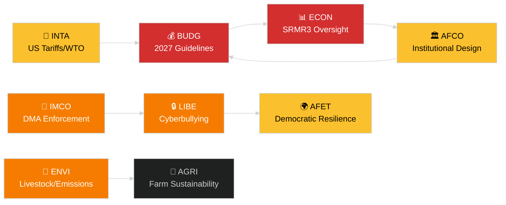

<!-- SPDX-FileCopyrightText: 2024-2026 Hack23 AB -->
<!-- SPDX-License-Identifier: Apache-2.0 -->
# 执行简报 — 欧洲议会委员会报告
**日期：** 2026-05-14 | **运行：** committee-reports | **分类：** 公开
**可信度评级：** B2（可靠来源；可能属实）
**WEP区间：** 可能（置信区间60–80%）

---

## 🎯 BLUF（结论在前）

欧洲议会委员会体系以至少七个常设委员会的充实立法议程开启了2026年5月12至16日这一周。主要议题包括：（1）**数字治理** — 全体会议在4月最后一次全体会议上就《数字市场法》执法和网络欺凌立法进行了表决；（2）**环境转型** — ENVI委员会正在处理畜牧业可持续发展文件和重型车辆残余排放问题；（3）**完善银行业联盟** — SRMR3破产处置机制改革现已正式成为法律，在监管架构方面为ECON和AFCO创造了工作；（4）**贸易韧性** — 3月通过的对美关税反制措施条例继续推动INTA和AFET的审查。

**本周核心触发点**：2027年欧盟预算准则决议（TA-10-2026-0112，4月28日通过）启动年度预算周期。BUDG委员会现已进入调解准备阶段，等待欧盟委员会在2026年6月发布预算草案。

---

## 60-Second Read

| 优先级 | 委员会 | 文件 | 状态 | 重要性 |
|-------|--------|------|------|--------|
| 🔴 紧急 | BUDG | 2027年预算准则（TA-10-2026-0112） | 4月28日通过；BUDG起草修正案 | 1850亿欧元以上框架；机构权力争夺 |
| 🔴 紧急 | ECON | SRMR3 — 银行破产处置机制（TA-10-2026-0092） | 3月26日通过；共同体程序阶段 | 系统性风险 — 银行业联盟里程碑 |
| 🟠 高 | ENVI | 畜牧业可持续发展（TA-10-2026-0157） | 4月30日通过；实施措施待定 | 从农场到餐桌的政治平衡；EPP-S&D分歧 |
| 🟠 高 | IMCO/LIBE | 《数字市场法》执法（TA-10-2026-0160） | 4月30日通过；欧盟委员会跟进 | Big Tech问责；跨大西洋维度 |
| 🟠 高 | LIBE | 网络欺凌/在线骚扰（TA-10-2026-0163） | 4月30日通过；三方谈判即将启动 | 平台责任；儿童保护关联 |
| 🟡 中 | INTA | 对美关税反制措施（TA-10-2026-0096） | 3月26日通过；委员会审查进行中 | 贸易战动态；260亿欧元敞口 |
| 🟡 中 | JURI/LIBE | 反腐指令（TA-10-2026-0094） | 3月26日通过；各国转化立法监测中 | 法治；欧洲议会的机构公信力 |
| 🟢 监测 | AFCO | 选举法改革批准 | 委员会听证进行中 | 宪法维度；成员国滞后 |

---

## Committee Productivity Snapshot（2026年5月12至16日周）

欧洲议会22个常设委员会按标准全体会议周日程运作。本周重要会议活动：

- **ENVI**（主席：TBC）：重型车辆排放配额实施法规标注会议（条例已通过 TA-10-2026-0084）。畜牧业后续措施的报告员审议仍在持续。

- **ECON**（主席：TBC）：SRMR3通过后监督；与欧洲中央银行的季度对话会议。不良贷款二级市场 — 影子报告员磋商进行中。

- **BUDG**（主席：TBC）：2027年预算准则跟进；2027财年议会估算（TA-10-2026-04-30-ANN01）接受内部审查。

- **IMCO**：完善DMA后执法框架。数字服务监管实施评分卡。

- **LIBE**：网络欺凌指令三方谈判准备。审查安全第三国概念（TA-10-2026-0026跟进）。

- **INTA**：监测对美关税反制措施；MC14后WTO雅温得跟进（2026年3月26至29日）。

- **JURI/AFCO**：27个成员国选举法批准状态审查。

---

## 🚦 可信度评估

| 主张 | WEP | 可信度 | 依据 |
|------|-----|--------|------|
| BUDG进入调解阶段 | 可能 | B2 | 已通过文本＋程序时间表 |
| SRMR3共同体程序启动 | 很可能 | B2 | 已通过文本＋欧盟立法程序规则 |
| DMA执法触发IMCO跟进 | 可能 | C2 | 欧洲议会决议措辞＋委员会义务 |
| 畜牧业文件引发EPP-S&D紧张 | 可能 | C3 | 从通过文本的投票模式推断 |
| 美国关税局势稳定在危机门槛以下 | 有可能 | C3 | 欧洲议会决议＋委员会声明 |

---

## 战略展望（7天）

委员会体系面临通过后跟进工作（SRMR3、DMA、网络欺凌、畜牧业）与2027年预算周期启动同步交汇的局面。各委员会报告员将承受在6月全体会议前完成报告的压力。雅温得WTO MC14之后的美欧关税形势依然是可能扰乱委员会预定工作的主要外部风险。

**决策者应关注**：BUDG对6月委员会预算草案的回应；ECON首次SRMR3监督听证；LIBE网络欺凌三方谈判时间表；INTA在续期对美关税反制措施上的立场。

---

## 数据来源

- 欧洲议会2026年通过文本（TA-10-2026-0092至TA-10-2026-0163）
- 欧洲议会开放数据门户：`/adopted-texts?year=2026`（已检索50条）
- 欧洲议会委员会文件：`/committee-documents`（AFCO系列，50余份）
- ENVI与ECON委员会活动分析：欧洲议会开放数据门户
- `european-parliament-analyze_committee_activity`（ENVI，ECON）
- `european-parliament-monitor_legislative_pipeline`（活跃程序）
- 日期范围：2026-05-07至2026-05-14

---

## 🗓️ 立法日历

2026年5月12至16日所在周为**欧洲议会间周** — 两次全体会议之间委员会密集开会的时期。这一结构性背景解释了为何委员会层面的产出格外高：没有任何全体会议会场与议员时间表竞争，从而最大化委员会出席率和报告员的成果。

### 临近截止日期

| 截止日期 | 文件 | 委员会 | 延误后果 |
|---------|------|--------|---------|
| 2026年6月 | 欧盟委员会2027年预算草案 | BUDG | 欧洲议会失去调解时间 |
| 2026年5月 | SRMR3实施规则 | ECON | 银行监管真空 |
| 2026年6月 | DMA执法报告 | IMCO | 委员会合规评估延误 |
| 2026年7月 | 网络欺凌三方谈判结束 | LIBE | 平台法律不确定性延续 |

### 联盟算术

EPP（187席）与S&D（136席）构成2026年大多数委员会报告的事实上的多数骨干。Renew Europe（77席）在数字治理和贸易文件上扮演关键摇摆角色。ECR（78席）在DMA执法背景下支持放松管制条款。Greens/EFA（53席）对ENVI多数形成至关重要。

**关键摇摆动态**：在畜牧业文件上，EPP与ECR联手软化食品安全标准，而S&D、Greens与Renew Europe则寻求更严格的可追溯性规则。由此产生的妥协方案（TA-10-2026-0157）体现了中右翼与极右翼在农业放松管制上罕见的协调。

---

## 📊 跨委员会情报地图

---

## 术语表

| 缩写 | 全称 |
|---|---|
| BUDG | 预算委员会 |
| ECON | 经济货币事务委员会 |
| ENVI | 环境、气候与食品安全委员会 |
| IMCO | 内部市场与消费者保护委员会 |
| LIBE | 公民自由、司法与内政委员会 |
| INTA | 国际贸易委员会 |
| JURI | 法律事务委员会 |
| AFCO | 宪法事务委员会 |
| AFET | 外交事务委员会 |
| SRMR3 | 单一处置机制条例（第三次修订） |
| DMA | 数字市场法 |
| WTO MC14 | 世界贸易组织第十四届部长级会议 |
| EPP | 欧洲人民党 |
| S&D | 社会主义者与民主主义者进步联盟 |
| ECR | 欧洲保守主义与改革主义者 |
