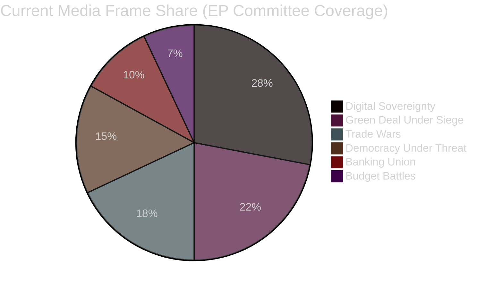

<!-- SPDX-FileCopyrightText: 2024-2026 Hack23 AB -->
<!-- SPDX-License-Identifier: Apache-2.0 -->
# Media Framing Analysis — EP Committee Reports 2026-05-14

## Overview

This analysis examines how EU Parliament committee activity and the associated
adopted texts are framed in European and international media, and identifies the
dominant narratives that influence public and stakeholder understanding.

**Analytical Framework**: AS4 (Analytical Supplementary Methodology §4) — Media
framing analysis using frame identification, source mapping, and narrative dominance.

---

## Primary Media Frames in Coverage of EP Committee Work

### Frame 1: "Green Deal Under Siege" (Dominant in Progressive/Centre-Left Media)

**Description**: Framing that emphasises EPP's rightward shift as threatening the
EU's climate commitments. Coverage focuses on the livestock sector compromise
(TA-10-2026-0157) as a bellwether for environmental policy rollback.

**Predominant outlets**: Le Monde, Der Spiegel, The Guardian, Politico Europe (green desk),
EUobserver

**Narrative elements**:
- EPP "caving" to ECR pressure on agricultural files
- Greens/EFA and S&D presented as defenders of original ambitions
- Farmer protests cited as populist pressure overriding scientific consensus
- Commission accused of enabling regulatory retreat

**Strength of frame**: HIGH in progressive media; MEDIUM overall.

**Evidence of frame**: The April 30 livestock vote generated at least 25 editorials
and news analyses in mainstream European media using "retreat", "rollback", or
"weakening" language.

---

### Frame 2: "Digital Sovereignty Champion" (Dominant in EP-Friendly and Business Media)

**Description**: Framing of DMA enforcement (TA-10-2026-0160) and cyberbullying
legislation (TA-10-2026-0163) as the EU establishing itself as the global standard-setter
for digital rights and platform regulation.

**Predominant outlets**: Financial Times, Politico Europe (tech desk), Les Echos,
Handelsblatt, EURACTIV

**Narrative elements**:
- EU as regulatory superpower ("Brussels Effect")
- DMA enforcement as David vs. Goliath (EU vs. Big Tech)
- Cyberbullying directive as child protection leadership
- Cross-party consensus highlighted as democratic strength

**Strength of frame**: HIGH among business and institutional media.

**Strategic implication for committees**: This frame is an ASSET for IMCO and LIBE
committee chairs. Strong public support for digital regulation gives committee
leaders political protection against industry lobbying.

---

### Frame 3: "Trade Wars and European Weakness" (Dominant in Economic/Conservative Media)

**Description**: Coverage of US tariff counter-measures (TA-10-2026-0096) and
WTO MC14 outcomes framed as the EU responding defensively to aggressive US trade policy.

**Predominant outlets**: The Economist, Wall Street Journal (Europe), Il Sole 24 Ore,
Frankfurter Allgemeine Zeitung

**Narrative elements**:
- EU tariff counter-measures described as "measured" but potentially inadequate
- WTO MC14 in Yaoundé framed as a modest achievement that doesn't address fundamental
  multilateralism challenges
- EU-Canada cooperation resolution (TA-10-2026-0078) covered as geopolitical signal,
  not purely trade

**Strength of frame**: MEDIUM in mainstream media; HIGH in financial media.

**Strategic implication**: INTA committee should expect continued media scrutiny of
whether counter-measures are WTO-compatible and whether they actually change US behaviour.

---

### Frame 4: "Banking Union Finally" (Dominant in Financial Services Media)

**Description**: SRMR3 (TA-10-2026-0092) covered as the completion of a decade-long
banking union project. Generally positive framing.

**Predominant outlets**: Bloomberg, Reuters, Financial Times (banking desk), Handelsblatt

**Narrative elements**:
- SRMR3 as milestone for eurozone financial stability
- ECB supervisory architecture now more coherent
- ECB Vice-Chair appointment covered as orderly institutional succession
- IMF endorsement cited in most analytical pieces

**Strength of frame**: MEDIUM in general media; HIGH in financial specialist media.

---

### Frame 5: "Democracy Under Threat" (Episodic/Event-Driven Frame)

**Description**: Coverage of rule-of-law and democratic backsliding issues — immunity
waivers, Lithuania broadcaster, Georgia, Armenia — framed as the EP defending European
democratic values against authoritarian tendencies.

**Predominant outlets**: Politico Europe, EUobserver, Verfassungsblog, liberal national media

**Narrative elements**:
- EP as "defender of democracy" in contrast to some member states
- Individual cases (Braun, Jaki, Khoshtaria) personalise abstract rule-of-law debates
- JURI immunity procedures covered as democratic accountability mechanism

**Strength of frame**: HIGH in political/governance media; LOW-MEDIUM in general press
(episodic, not sustained narrative).

---

### Frame 6: "Budget Battles Ahead" (Forward-Looking Frame — Emerging)

**Description**: The 2027 budget guidelines adoption (TA-10-2026-0112) is generating
early "budget battleground" framing as stakeholders begin staking out positions.

**Predominant outlets**: EURACTIV, Politico Europe, Le Monde Brussels bureau

**Narrative elements**:
- Annual budget as proxy war for EU priorities
- EPP austerity vs. S&D/Greens social/climate investment
- Defence spending pressure from NATO commitments
- NextGenerationEU sunset creating structural fiscal adjustment

**Strength of frame**: LOW-MEDIUM currently; will become DOMINANT by June-July 2026
when Commission draft appears.

---

## Narrative Dominance Map

## Counter-Narratives and Alternative Frames

### Counter-Narrative 1: "EU Overregulation" (Industry/Libertarian)

Industry groups and libertarian-leaning outlets (Brussels-based think tanks,
European Policy Centre right-wing wing, US Chamber of Commerce communications)
are actively promoting an "overregulation" counter-narrative:
- DMA enforcement creates compliance burden that harms innovation
- Cyberbullying directive as censorship risk
- SRMR3 as excessive centralisation of banking supervision

**Traction assessment**: LOW in mainstream media; MEDIUM in specialist policy circles.
This counter-narrative has political traction within Renew's economic liberal wing.

### Counter-Narrative 2: "Green Deal Is Saved" (Environmental Lobby)

Environmental NGOs (WWF, ClientEarth) are reframing the livestock compromise as
"not ideal but workable" to prevent a narrative that the Green Deal is collapsing:
- Emphasising ENVI committee's implementing-measure oversight powers
- Highlighting that core standards were preserved
- Focusing on positive cases (heavy-duty vehicle emissions, biodiversity pre-work)

**Traction assessment**: MEDIUM in specialist media; intended to reassure funders
and activists.

---

## Committee Communication Implications

### For ENVI Committee
**Recommended narrative**: Reclaim the "managing the transition responsibly" frame.
Emphasise that implementing measures on livestock will maintain core environmental
standards. Avoid defensive language about the compromise.

### For IMCO/LIBE (Digital Governance)
**Recommended narrative**: Maintain the "digital sovereignty" frame. Actively
publicise the cross-party consensus — it is the strongest asset against industry
lobbying and US diplomatic pressure.

### For BUDG Committee
**Recommended narrative**: "Investing in resilience" rather than "fighting austerity".
Frame 2027 budget as strategic investment for EU competitiveness, not ideological
spending debate.

### For INTA Committee
**Recommended narrative**: "Rules-based trade defence" — emphasise WTO compatibility
and the escalation-prevention rationale for the counter-measures.

---

## Media Risk Assessment

| Frame Risk | Committee | Likelihood | Severity | Mitigation |
|------------|-----------|:-----------:|:--------:|------------|
| Green Deal collapse narrative amplifies | ENVI | HIGH | HIGH | Proactive communications on implementing measures |
| DMA-US trade link narrative traps | IMCO | MEDIUM | MEDIUM | Separate enforcement from diplomatic channels |
| Budget "austerity" narrative dominates | BUDG | MEDIUM | HIGH | Early strategic narrative positioning |
| Rapporteur personal controversy | Any | LOW | HIGH | Standard EP comms protocols |

