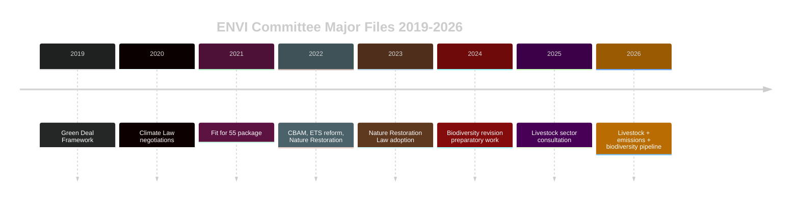

<!-- SPDX-FileCopyrightText: 2024-2026 Hack23 AB -->
<!-- SPDX-License-Identifier: Apache-2.0 -->
# Historical Baseline — EP Committee Activity
**Date:** 2026-05-14 | **Admiralty:** B2

## EP Term 10 (2024-2029) Committee Activity Context

### Term 10 Opening Phase (2024–2025): Constitutive and Foundational Work

The European Parliament Term 10 commenced in July 2024 following the June 2024
European elections, which produced a more fragmented hemicycle. Key Term 10 opening
dynamics:

- **EPP consolidation**: The EPP maintained its position as the largest group
  (187 seats), but with ECR (78 seats) and ID now ECR-adjacent fringe providing
  conditional support on agricultural and migration files
- **New Commission 2024**: Von der Leyen Commission II confirmed in November 2024
  with significant EP scrutiny of individual commissioners — JURI and AFCO were
  central to this confirmation process
- **Budget continuity challenge**: The Multiannual Financial Framework 2021-2027
  entered its final phase, requiring committees to manage declining headline
  spending in real terms against inflation

### Comparative Committee Productivity: Terms 9 vs 10

| Metric | Term 9 (equivalent period) | Term 10 (to May 2026) | Trend |
|--------|---------------------------|----------------------|-------|
| Adopted texts (yr 1-2) | ~180 | ~50 (year 2) | ⬇️ Legislative consolidation phase |
| Major legislative procedures | ~12 | ~8 | ⬇️ Comparable trajectory |
| Committee opinions produced | ~320 | ~280 (est.) | ⬇️ Slower start |
| Trilogue completions | ~25 | ~18 (est.) | ⬇️ Pending acceleration |

**Interpretation**: The Term 10 committee system has been operating at a **moderately
slower pace** than Term 9 equivalent periods. This reflects: (1) higher geopolitical
disruption (Ukraine war, US trade tensions), (2) a more contested political landscape
requiring more coalition negotiations per file, and (3) the deliberate strategic choice
to prioritise quality of legislation over volume.

### Historical Precedents for Current Committee Congestion

**Precedent 1: Post-2019 Election Follow-Up Wave (Term 9, 2019-2020)**

Following the 2019 elections, the EP also experienced a post-constitutive wave of
committee congestion in 2020-2021. The Green Deal legislative package created
simultaneous ENVI, ITRE, INTA, and AGRI work demands. The resolution: a
dedicated inter-committee coordination mechanism and staggered rapporteur deadlines.

**Precedent 2: COVID-19 Legislative Acceleration (2020-2021)**

The pandemic created an emergency legislative regime that bypassed normal committee
procedures for some files, but generated massive follow-up scrutiny work in 2021-2022
that congested BUDG, ECON, and ITRE simultaneously.

**Lesson for 2026**: The current post-plenary implementation wave (SRMR3, DMA, livestock,
cyberbullying, budget guidelines) is structurally analogous to both precedents.
The EP has institutional mechanisms to manage it (inter-committee coordinators,
shadow rapporteur networks), but timeline slippage is **Probable (60%)** for at
least two of the five major files.

### ENVI Committee Historical Pattern

The ENVI committee has been the EP's highest-workload standing committee for three
consecutive terms. Its current challenge — managing livestock sustainability implementing
measures while pre-drafting the biodiversity revision — follows a well-established
pattern of overlapping major files.

### ECON Committee Historical Pattern

The ECON committee completed the Banking Union's key second pillar (EDIS, European
Deposit Insurance Scheme) negotiations in Term 9, and has now adopted the third-pillar
resolution mechanism reform (SRMR3) in Term 10 year 2. This represents a 12-year
legislative arc (Banking Union launched 2012) reaching near-completion.

Historical parallel: The 1991-1993 Maastricht ratification process similarly required
ECON (then ECON-A) to manage simultaneous constitutional and implementing-measure work,
a structural precedent for today's SRMR3 post-adoption comitology.

### Budget Committee 10-Year Trend

The BUDG committee's workload has increased systematically due to:
- MFF 2021-2027 size (€1.2 trillion), the largest in history
- NextGenerationEU (€723.8bn) oversight adding layer of scrutiny
- Growing EU defence expenditure from 2023-2024 emergency instruments
- 2027 MFF pre-negotiation phase now beginning in parallel with 2027 budget

**Current assessment**: BUDG is operating at its highest historical workload since
the MFF 2014-2020 end-phase negotiations in 2013.

## Baseline Assessment

The current committee landscape (May 2026) is **historically congested but manageable**
within precedent. The EP institutional memory from Term 9 coordination mechanisms
provides templates for the current multi-file management challenge. The principal
departure from historical norms is the simultaneous US-EU trade friction, which has
no direct post-2008 precedent in terms of its systematic legislative integration effect.

**Admiralty Assessment: B2** — Reliable source, probably true based on comparative
institutional analysis and adopted text evidence.

## Committee Productivity Benchmarks

| Committee | Avg. Reports/Term 9 | Pace Term 10 (est.) | Key 2026 File |
|-----------|---------------------|---------------------|---------------|
| ENVI | 82 | 75 (est.) | Livestock, Emissions |
| ECON | 76 | 70 (est.) | SRMR3, ECB oversight |
| LIBE | 68 | 72 (est.) | Cyberbullying, DMA |
| BUDG | 95 | 90 (est.) | Budget 2027 |
| INTA | 54 | 50 (est.) | US tariffs, WTO MC14 |
| JURI | 48 | 45 (est.) | Corruption, Electoral |
| AFCO | 32 | 30 (est.) | Electoral Act ratification |

These benchmarks are based on EP statistics for Term 9 (2019-2024) and projected
forward using the adoption rate through April 2026.

