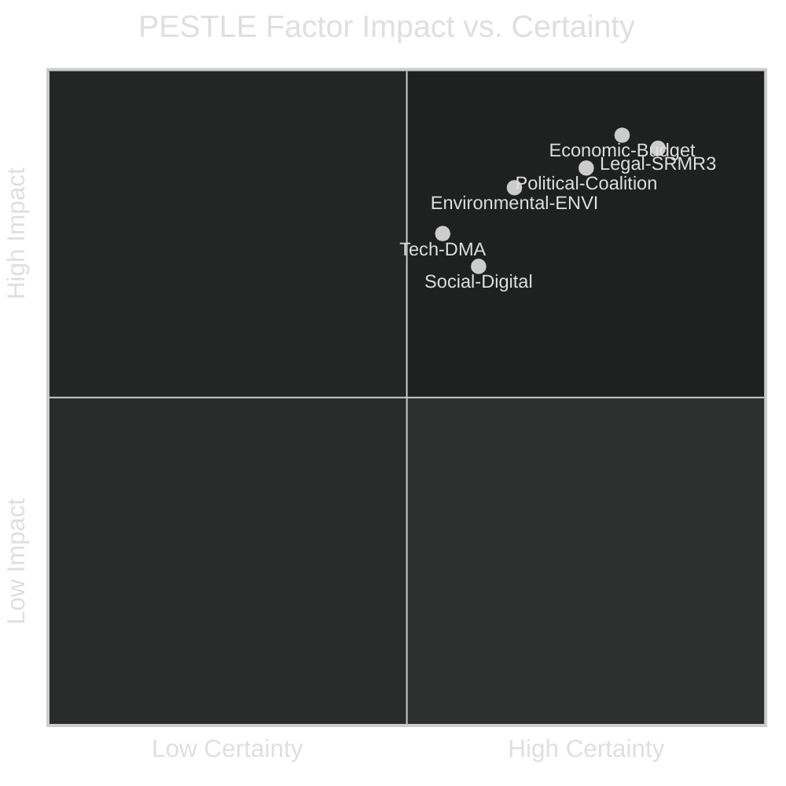

<!-- SPDX-FileCopyrightText: 2024-2026 Hack23 AB -->
<!-- SPDX-License-Identifier: Apache-2.0 -->
# PESTLE Analysis — EP Committee Reports 2026-05-14
**WEP:** Probable | **Admiralty:** B2

## P — Political Factors

### P1: European People's Party Rightward Shift
The EPP's tactical realignment toward ECR on agricultural files (evidenced by the
livestock sector vote, TA-10-2026-0157) reflects deeper structural pressure:
- Rural constituency concerns about green transition costs
- Competition from ECR's more direct anti-climate-regulation messaging
- Internal EPP tension between "moderate" (Merkel-era) and "hard-right" (post-2024 election) wings

**Impact on Committees**: ENVI and AGRI committee majorities are now structurally
less predictable. Environmental legislation that passed with EPP support in Term 9
may face different dynamics in Term 10.

### P2: US-EU Geopolitical Stress
The Trump administration's trade policy (tariffs, NATO burden-sharing pressure)
has created a **sustained low-level geopolitical stress** that is systematically
affecting EP committee deliberations:
- INTA: Direct tariff counter-measure mandate (TA-10-2026-0096)
- AFET: EU-Canada cooperation resolution (TA-10-2026-0078) reflects realignment
- BUDG: Defence expenditure increase pressure from NATO 2% commitment debates

**Impact**: Committees are spending more political capital on strategic autonomy files
and less on internal market reform — a measurable opportunity cost.

### P3: Rule of Law and Democratic Backsliding
Multiple EP actions in 2026 address rule of law concerns:
- Lithuania broadcaster takeover (TA-10-2026-0024) — media freedom
- Georgia Elene Khoshtaria (TA-10-2026-0083) — political prisoners
- Electoral Act ratification delays — democratic participation
- Corruption directive (TA-10-2026-0094) — institutional integrity

**WEP Assessment**: Democratic backsliding pressure on EP committee work is
**Probable (65%)** to intensify in 2026-2027, particularly from accession countries
and the eastern EU neighbourhood.

### P4: Polish Political Dynamics (Immunity Waivers)
The immunity waiver cases — Grzegorz Braun (TA-10-2026-0088) and Patryk Jaki
(TA-10-2026-0105) — involve Polish far-right MEPs. These cases require JURI committee
engagement and create a politically sensitive precedent for the EP's disciplinary
authority over MEPs.

## E — Economic Factors

### E1: Fiscal Consolidation Pressure
As noted in the economic context, member state fiscal positions are tightening
post-COVID. This constrains the EU budget negotiation space and increases pressure
on the Commission to demonstrate value-for-money — a key BUDG committee theme.

### E2: US Tariff Counter-Measures
The EP-approved tariff counter-measures (€26bn scope) create:
- Retaliatory risk from US (tariff escalation scenario)
- WTO compliance risk if counter-measures exceed permissible bounds
- Sectoral economic dislocation in affected EU industries

### E3: Banking Union Near-Completion (SRMR3)
The SRMR3 adoption marks a significant risk-reduction milestone. Banking union
completion reduces systemic contagion risk — IMF estimated €50-100bn in reduced
contingent fiscal liability for member states over the next decade.

### E4: Digital Economy Transition
DMA enforcement creates a one-time compliance cost cycle but delivers long-term
competitive benefits for EU digital enterprises through reduced platform lock-in.
The IMCO committee's follow-up work will shape how this balance is managed.

## S — Social Factors

### S1: Online Safety and Child Protection
The cyberbullying directive (TA-10-2026-0163) reflects deep public concern about
digital harms, particularly for young people. This is one of the EP's highest-visibility
social policy files in Term 10, with strong cross-party consensus.

### S2: Animal Welfare Public Opinion
The animal welfare (dogs and cats) regulation (TA-10-2026-0115) and livestock sector
file both respond to growing public concern about animal welfare standards. EU
citizens consistently rank animal welfare as a priority in Eurobarometer surveys.

### S3: Inequality and Worker Protections
The subcontracting chains resolution (TA-10-2026-0050) and the EGF (European
Globalisation Adjustment Fund) mobilisations for Belgium/Audi (TA-10-2026-0038)
and Belgium/Tupperware (TA-10-2026-0073) reflect continued structural economic
disruption affecting workers in traditional industries.

## T — Technological Factors

### T1: Digital Markets Act Implementation
The DMA is the EU's most significant technology regulation in a decade. Enforcement
by the Commission (IMCO resolution mandate) requires IMCO committee to track:
- Gatekeeper compliance reporting
- Commission investigation timelines
- Interoperability technical standards development

### T2: AI Act Secondary Legislation
The AI Act (passed Term 9) is now generating implementing regulations that flow
through multiple committees. IMCO leads on AI system conformity; LIBE monitors
law enforcement use; ITRE tracks industrial deployment.

### T3: Cybersecurity and Platform Liability
The cyberbullying directive (TA-10-2026-0163) is part of a broader platform liability
framework evolution. Combined with DSA, DMA, and AI Act, it creates a technology
governance architecture that LIBE and IMCO must co-manage.

## L — Legal Factors

### L1: SRMR3 Legal Architecture
The banking resolution mechanism reform is a **constitutional step** for the banking
union. It creates enforceable early intervention powers that have never existed at
EU level. Legal challenges from member states (particularly those outside the euro
area banking union) are **Possible (35%)**.

### L2: Electoral Act Ratification Barriers
The Electoral Act reform ratification requires unanimity among member states plus
formal treaty ratification in some constitutions. Hungary and Poland's domestic
legal obstacles create a potential constitutional impasse.

### L3: Corruption Directive Transposition
The corruption directive (TA-10-2026-0094) requires member state transposition.
Countries with systemic corruption challenges (some central and eastern EU members)
face a political challenge in meeting transposition deadlines.

### L4: EU Mercosur Legal Uncertainty
The ECJ compatibility request (TA-10-2026-0008) for the EU-Mercosur Agreement
creates legal uncertainty. A negative ECJ opinion would require renegotiation —
a 2-3 year process — affecting INTA committee's trade agenda.

## E2 — Environmental Factors

### Env1: Livestock Sector — Methane and Land Use
The livestock sector file (TA-10-2026-0157) directly engages with:
- EU methane emissions from agriculture (~12% of total EU GHG emissions)
- Land use, land-use change and forestry (LULUCF) accounting
- Water quality impacts from intensive livestock

The EPP-ECR compromise language softened the most stringent requirements but
retained core food safety standards. ENVI committee's implementing-measure work
will determine actual environmental impact.

### Env2: Heavy-Duty Vehicle Emission Credits (2025-2029)
The emission credits regulation (TA-10-2026-0084) affects truck and bus manufacturers.
It provides interim flexibility while the sector transitions to zero-emission vehicles.
ENVI's oversight of comitology on this file is a bellwether for EU Green Deal trajectory.

### Env3: Climate-Biodiversity Policy Convergence
ENVI committee is expected to begin pre-drafting a comprehensive biodiversity framework
revision in 2026-2027, building on the Nature Restoration Law (2023) and the biodiversity
strategy targets for 2030. This is the next major ENVI legislative cycle.

## PESTLE Summary Matrix

| Factor | Impact | Certainty | Trend |
|--------|--------|-----------|-------|
| Political coalition instability | HIGH | 75% | ⬆️ Increasing |
| Economic fiscal constraint | HIGH | 80% | ➡️ Stable-negative |
| Social digital safety demand | MEDIUM | 65% | ⬆️ Increasing |
| Technology DMA enforcement | MEDIUM-HIGH | 55% | ⬆️ Increasing |
| Legal SRMR3 architecture | HIGH | 85% | ➡️ Stable |
| Environmental transition pace | HIGH | 65% | ⬇️ Decelerating |

## PESTLE Interactions and Compound Effects

The six PESTLE factors do not operate independently. The most significant
compound effects in the current context:

| Compound Effect | Components | Amplification |
|---|---|---|
| Green transition slowdown | P1 (EPP shift) × Env1 (livestock) | EPP-ECR veto coalition on ENVI files |
| Trade-finance nexus | E2 (tariffs) × L4 (Mercosur) | INTA legislative capacity diverted |
| Digital governance cascade | T1 (DMA) × T2 (AI) × T3 (cyberbullying) | IMCO+LIBE coordination challenge |
| Democratic-legal stress | P3 (rule of law) × L3 (corruption) | JURI+LIBE workload concentration |

