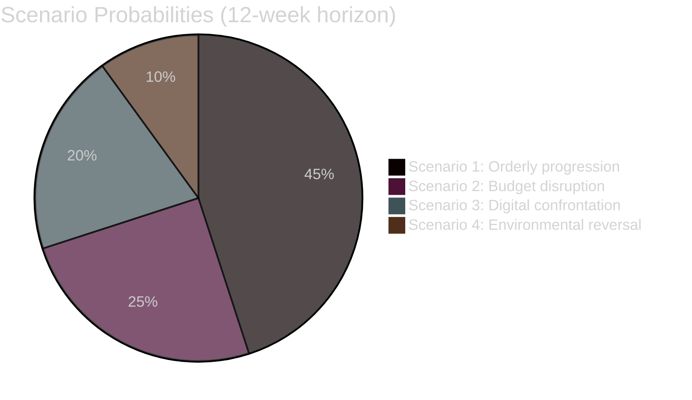

<!-- SPDX-FileCopyrightText: 2024-2026 Hack23 AB -->
<!-- SPDX-License-Identifier: Apache-2.0 -->
# Scenario Forecast — EP Committee Reports 2026-05-14
**WEP:** Probable (60%) | **Admiralty:** B2 | **Horizon:** 12 weeks (to August 2026)

## Overview

Four principal scenarios for EP committee system evolution through August 2026.
Scenarios are structured to be mutually exclusive and collectively exhaustive at
the principal-pathway level.

## Scenario 1: Orderly Legislative Progression *(Base Case — 45% probability)*

**WEP:** Probable | **Time horizon:** 4–12 weeks

**Description**: The EP committee system manages the post-plenary implementation
wave successfully. Commission delivers budget draft on schedule. BUDG conciliation
begins smoothly. Digital governance trilogues (cyberbullying) conclude by July 2026.
SRMR3 implementing acts process without major complications.

**Enabling conditions**:
- Commission delivers 2027 budget draft by mid-June as expected
- No escalation in US tariff dispute
- Council maintains cooperative posture in trilogues
- EPP coalition remains stable; no major political shock in member states

**Key indicators to watch**:
- Commission budget presentation date (should be before June 20)
- Cyberbullying trilogue kickoff date (should be before June 15)
- ECON SRMR3 implementing rules first reading date

**Implications for committees**:
- BUDG: Full conciliation preparation phase — smooth legislative work
- ECON: Textbook comitology — no surprises
- LIBE: Productive trilogue — cyberbullying directive completed by late July
- ENVI: Livestock implementing measures progressing on time
- IMCO: DMA enforcement framework progressing

---

## Scenario 2: Budget Cycle Disruption *(Low-Medium — 25% probability)*

**WEP:** Possible | **Time horizon:** 6–12 weeks

**Description**: The Commission delays the 2027 budget draft (post-June) or submits
a draft that triggers immediate political crisis in BUDG committee. This scenario
cascades into cross-committee disruption as all committees must defer budget
amendment work.

**Enabling conditions**:
- Commission internal coordination failure (multiple DGs competing priorities)
- Member state fiscal disagreement requiring Commission to restart budget modelling
- Political crisis in Commission (resignation, scandal)
- Unexpected revenue shortfall (macroeconomic shock)

**Cascade effects**:
- BUDG amendment timetable slips to October/November
- EP-Council conciliation pushed to December (end of year crunch)
- Risk of 12-month provisional budget if no agreement (constitutional crisis risk)
- Other committee work partially displaced as EP political attention diverts

**Key indicators**:
- Commission budget signals at June ECOFIN
- BUDG committee chair statements
- S&D/EPP coordination meeting outcomes

**Implications**: This is the **most disruptive scenario** for the committee system
as a whole — a budget crisis touches every committee's agenda.

---

## Scenario 3: Digital Governance Confrontation *(Low-Medium — 20% probability)*

**WEP:** Possible | **Time horizon:** 8–12 weeks

**Description**: DMA enforcement action against a major platform creates a
diplomatic incident with the US government, escalating the trade friction context.
The Commission faces political pressure to pause DMA enforcement; IMCO committee
becomes a contested political arena.

**Enabling conditions**:
- Commission launches DMA investigation against a US-headquartered gatekeeper
- US government responds with tariff escalation or diplomatic pressure
- EP political groups divide (Renew/EPP supportive of pause; S&D/Greens oppose)
- Member states with strong US trade links (Germany, Netherlands) lobby Council

**Cascade effects**:
- IMCO committee becomes the focal point of EU-US digital sovereignty debate
- LIBE cyberbullying directive trilogue complicated by platform relations context
- INTA committee urgent session on combined tariff + digital governance scenario
- JURI committee engaged on DMA legal interpretation

**Key indicators**:
- Commission DMA enforcement timeline announcements
- US government statements on DMA
- EPP/Renew position statements on DMA enforcement pace

---

## Scenario 4: Environmental Policy Reversal *(Low — 10% probability)*

**WEP:** Unlikely | **Time horizon:** 8–16 weeks

**Description**: A combination of rural protests (France, Germany) and EPP-ECR
parliamentary coordination produces a formal ENVI committee initiative to reopen
the livestock sector regulation or the heavy-duty vehicle emissions framework.
This creates a direct conflict between the EP's legislative adoption record and a
new political majority that wants to revise the same legislation.

**Enabling conditions**:
- Escalation of European farmer protests (analogous to 2024 protests)
- EPP Executive Committee endorses environmental deregulation package
- ECR/ID formal cooperation agreement with EPP on agricultural files
- Member state governments (France, Germany, Poland) support reopening

**Institutional complexity**: Reopening formally adopted legislation requires a
Commission proposal — the EP cannot self-initiate full legislative revision.
However, the EP can pass a resolution (non-binding) calling for revision, which
creates political pressure on the Commission.

**Key indicators**:
- European farmers' associations escalation signals
- EPP Executive Committee statements
- Commission's response to ENVI committee hearings on implementing measures

---

## Compound Scenario: Trade-Digital-Budget Trifecta *(Low — 5% probability)*

**Description**: Scenarios 2 and 3 occur simultaneously — a US tariff escalation
response to DMA enforcement coincides with Commission budget delays. This creates
maximum legislative disruption.

**WEP Assessment**: **Unlikely (10-15%)** that any two of the above scenarios
co-occur within the same 12-week window.

## Scenario Probability Summary

## Key Assumptions

1. No major armed conflict escalation in European neighbourhood
2. ECB monetary policy remains on disinflation path
3. US administration continues current trade policy without extreme escalation
4. EP leadership (President Metsola) maintains cross-party consensus management
5. Polish Council Presidency completes normal handover to Danish Presidency (July 2026)

## Signpost Indicators

| Indicator | Scenario 1 Signal | Scenario 2 Signal | Scenario 3 Signal |
|-----------|-------------------|-------------------|-------------------|
| Commission budget | On schedule | Delayed / contested | On schedule |
| DMA enforcement | Routine | Routine | Diplomatic incident |
| Cyberbullying trilogue | Progress | Stalled | Complicated |
| US-EU relations | Stable | Stable-negative | Escalating |
| Farmer protests | Quiet | Quiet | Quiet |
| EPP cohesion | Stable | Fractured | Divided |

## Advisory Intelligence for Decision-Makers

**If you are a committee rapporteur**: Scenario 1 probability is 45% — plan for
it, but hedge against Scenario 2 by maintaining a flexible amendment calendar.
The budget timeline is outside your control; build in a 4-week buffer.

**If you are a political group coordinator**: Monitor the EPP-ECR cohesion on
environmental files. If Scenario 4 develops, S&D+Greens+Renew have a majority
to block environmental rollback — but only if they hold together.

**If you are from the Commission**: DMA enforcement sequencing matters. Avoid
simultaneous major enforcement action during the budget draft presentation window.

**If you are tracking EU-US relations**: The DMA enforcement calendar is the
single most important variable for transatlantic digital governance. A post-July
enforcement action (after budget cycle normalises) reduces escalation risk.

