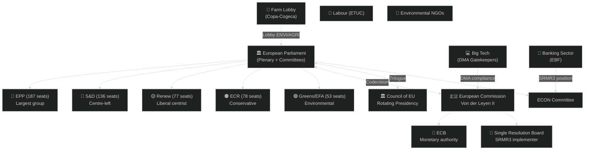
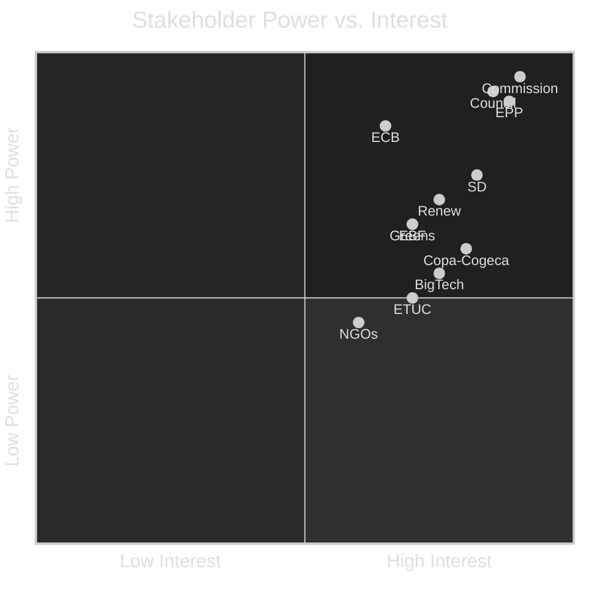

<!-- SPDX-FileCopyrightText: 2024-2026 Hack23 AB -->
<!-- SPDX-License-Identifier: Apache-2.0 -->
# Stakeholder Map — EP Committee Reports 2026-05-14
**Admiralty:** B2 | **WEP:** Probable

## Stakeholder Ecosystem Overview

## Institutional Stakeholders

### European Commission (Von der Leyen II)

**Role in committee work**: The Commission is the EP's primary institutional
counterpart. It initiates most legislation (right of initiative), responds to
committee resolutions, and implements adopted texts through delegated and implementing acts.

**Key 2026 positions**:
- **Budget 2027**: Commission draft expected June 2026 — will determine BUDG's
  workload for the second half of the year
- **DMA enforcement**: Commission DG CONNECT leads enforcement action; IMCO
  committee monitors compliance
- **SRMR3 comitology**: Commission chairs the implementing acts committee;
  SRB (Single Resolution Board) is the operational implementer
- **Trade**: DG TRADE managing US counter-measures and WTO MC14 follow-up

**Perspective on current committee agenda**: The Commission broadly supports the
legislative programme but faces resource constraints in parallel managing NGEU
disbursement oversight, MFF review, and trade negotiations. The Commission's ability
to deliver on time will determine whether the committee calendar holds.

**Alignment score**: HIGH alignment with EP on digital governance; MEDIUM on
agricultural files; HIGH on banking union; MEDIUM-HIGH on budget.

---

### Council of the European Union (Polish Presidency, Jan-June 2026)

**Role**: Co-legislator in ordinary procedure; negotiates directly with EP in trilogue.

**Polish Presidency priorities** (Jan-June 2026):
- Security and defence (responding to geopolitical context)
- Competitiveness (Draghi report follow-up)
- Rule of law (somewhat paradoxically given Poland's own history)
- Agricultural resilience

**Tensions with EP**:
- Agricultural file (livestock): Council position historically more permissive
  than EP on food safety standards
- Budget: Council traditionally favours lower total MFF expenditure than EP
- US tariffs: Council more cautious on escalation risk than EP

**Trilogue priority 2026**: Cyberbullying directive, DMA enforcement framework,
SRMR3 implementing regulations.

---

### European Central Bank (ECB)

**Role**: Subject to quarterly Monetary Dialogue in ECON committee; SRMR3 reform
directly affects ECB's bank supervision function.

**2026 position**: ECB under new Vice-Chair (confirmed TA-10-2026-0060, March 2026).
The bank is managing the disinflation endgame while preparing for potential
financial stability stress from US trade friction.

**ECON committee relationship**: Highly institutionalised — quarterly hearings,
annual report scrutiny, president appearances. ECB broadly supportive of SRMR3
as it clarifies the division of labour between ECB supervision and SRB resolution.

---

### Single Resolution Board (SRB)

**Role**: Direct beneficiary of SRMR3 (TA-10-2026-0092). Gains enhanced early
intervention powers and clearer resolution funding rules.

**Stakeholder interest**: Strongly supportive of SRMR3. Will need to engage ECON
committee on implementing rules, particularly on MREL recalibration and bail-in
instrument technical standards.

---

## Political Group Stakeholders

### EPP (European People's Party) — 187 seats

**Committee leadership**: Holds chairs or coordinators in most major committees.
**Key 2026 positions**:
- BUDG: Fiscal prudence narrative; resist spending increases
- ENVI/AGRI: Agricultural deregulation; softening environmental standards
- ECON: Financial stability emphasis; pro-SRMR3
- IMCO: Pro-DMA enforcement but concerned about competitiveness impact

**Internal tensions**: Growing gap between centre-EPP (pro-European, accepting
green transition) and hard-right EPP (anti-regulatory, agricultural interests dominant).
The livestock vote demonstrated that EPP will tolerate ECR coalitions on some files.

**Perspective on committee agenda**: EPP wants to use 2026 as a "competitiveness
year" — delivering on Draghi agenda, reducing regulatory burden, while maintaining
fiscal orthodoxy.

---

### S&D (Progressive Alliance of Socialists and Democrats) — 136 seats

**Key 2026 positions**:
- ENVI: Strong environmental standards; opposed EPP-ECR livestock compromise
- LIBE: Leading cyberbullying directive; pro-human rights files
- ECON: Worker protections in banking context; fair burden-sharing in SRMR3
- BUDG: Social investment defence; resist austerity framing

**Perspective**: S&D sees the cyberbullying directive and anti-corruption work as
its flagship Term 10 contributions. The livestock compromise is seen as a defeat
but not a strategic reversal.

---

### Greens/EFA — 53 seats

**Key 2026 positions**:
- ENVI: Strongest climate protection stance; deeply critical of livestock compromise
- LIBE: Civil liberties emphasis in cyberbullying (privacy concerns)
- BUDG: Climate investment defence

**Strategic role**: Greens are essential to environmental committee majority formation
when EPP defects to ECR. Their departure from ENVI coalitions can block legislation.

---

## Civil Society and Industry Stakeholders

### Copa-Cogeca (European Farmers' Association)

**Role**: Primary agricultural lobby. Significant influence on ENVI and AGRI
committee deliberations.
**2026 position**: Strongly supportive of EPP-ECR compromise on livestock sector file.
Lobbying for further softening of implementing measures.
**Influence channel**: Direct MEP contacts; Commission advisory committees; public
campaigns during April 2026 EP plenary week.

---

### European Banking Federation (EBF)

**Role**: Banking sector trade association. Key ECON committee interlocutor.
**2026 position**: Broadly supportive of SRMR3 as it provides clarity. Concerns
about MREL calibration in implementing acts.
**Influence channel**: Technical input to ECON committee rapporteur and shadow
rapporteurs; Commission comitology participation.

---

### Big Tech (Platform Companies — DMA Gatekeepers)

**Role**: Companies designated as DMA "gatekeepers" (Google, Apple, Meta, Amazon,
Microsoft, TikTok) are subject to enforcement.
**2026 position**: Prefer lighter enforcement; engaging IMCO committee on
implementation timeline and compliance standards.
**Influence channel**: Direct MEP engagement; US government diplomatic channels;
legal challenge preparation.

---

### European Trade Union Confederation (ETUC)

**Role**: Workers' interests across all labour-relevant committee files.
**2026 position**: Supportive of subcontracting chains resolution (TA-10-2026-0050);
monitoring EGF mobilisations for affected workers.
**Influence channel**: EMPL committee relationship; S&D coordination.

---

### Environmental NGOs (WWF, ClientEarth, Greenpeace)

**Role**: Environmental lobby; provide technical expertise and public mobilisation.
**2026 position**: Deeply concerned about EPP-ECR agricultural compromise; actively
monitoring ENVI committee implementing-measure drafts.
**Influence channel**: Greens/EFA coordination; public campaigns; expert testimony.

## Stakeholder Power-Interest Matrix

