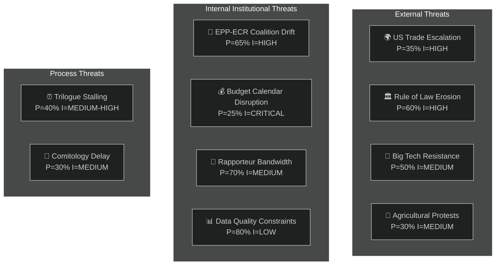

<!-- SPDX-FileCopyrightText: 2024-2026 Hack23 AB -->
<!-- SPDX-License-Identifier: Apache-2.0 -->
# Threat Model — EP Committee Reports 2026-05-14
**WEP:** Probable | **Admiralty:** B2 | Classification: Public

## Institutional Threat Landscape

## Threat Register

### THREAT-01: US-EU Trade Escalation
**Probability**: 35% | **Impact**: HIGH | **WEP**: Possible
**Timeframe**: 4–16 weeks

The US-EU tariff counter-measures (TA-10-2026-0096) create a retaliatory loop risk.
If the Trump administration responds with additional tariff escalation:
- INTA becomes an emergency committee
- BUDG faces revenue uncertainty
- Commission is politically pressured to pause DMA enforcement
- Multiple committee agendas disrupted

**Mitigation**: EP resolution (TA-10-2026-0096) provides a WTO-compatible mandate.
The Commission has prepared a graduated response framework. EP committees should
maintain contingency amendment language that can be activated within 2 weeks.

**Indicators**: US USTR statements; USMCA Council decisions; EU-US summit outcomes.

---

### THREAT-02: Democratic Backsliding Escalation
**Probability**: 60% | **Impact**: HIGH | **WEP**: Probable
**Timeframe**: Persistent

Multiple member states (Hungary, Slovakia, Poland, Serbia as accession candidate)
are exhibiting democratic backsliding signals. The EP's rule of law toolbox
(Article 7, conditionality, immunity procedures) is systematically tested.

**Current activation level**: MODERATE (Hungary under Article 7 procedure; Poland
immunity waivers active — Braun TA-10-2026-0088, Jaki TA-10-2026-0105)

**Threat vector for committees**: JURI committee workload increases with each
immunity waiver case; AFCO electoral reform ratification faces obstacles; LIBE
civil liberties monitoring diverts from digital governance priorities.

**Mitigation**: Robust JURI and AFCO procedures; cross-party consensus on rule of
law (EPP under pressure to maintain this consensus with ECR coalition pressures).

---

### THREAT-03: Big Tech Regulatory Resistance
**Probability**: 50% | **Impact**: MEDIUM | **WEP**: Possible
**Timeframe**: 8–26 weeks

Designated DMA gatekeepers (primarily US-headquartered) may engage in:
- Legal challenges to Commission enforcement decisions
- Lobbying of key IMCO and JURI MEPs
- Technical non-compliance claims requiring extended implementation timelines
- Coalition with US government diplomatic pressure (compound with THREAT-01)

**Mitigation**: IMCO committee enforcement resolution (TA-10-2026-0160) provides
strong political backing for Commission enforcement. Cross-party support for DMA
(EPP+Renew+S&D) limits political traction for derogations.

---

### THREAT-04: Agricultural Protest Escalation
**Probability**: 30% | **Impact**: MEDIUM | **WEP**: Possible
**Timeframe**: 4–12 weeks

European farmer associations have demonstrated organisational capacity for
disruptive protests (February 2024 wave). Triggers could include:
- ENVI implementing measures on livestock that exceed the compromises in TA-10-2026-0157
- Drought or adverse weather affecting the 2026 harvest
- US tariff impacts on agri-food sector export markets

**Mitigation**: The EPP-ECR compromise in TA-10-2026-0157 was specifically designed
to reduce protest risk. Copa-Cogeca has signalled acceptance. Risk is REDUCED but
not eliminated by the April 30 adoption.

---

### THREAT-05: EPP-ECR Coalition Drift
**Probability**: 65% | **Impact**: HIGH | **WEP**: Probable
**Timeframe**: Persistent through Term 10

The most important **internal institutional threat**. If EPP continues tactical
coordination with ECR on environmental and agricultural files:
- ENVI committee loses predictable majority for green legislation
- Nature Restoration Law implementation could be delayed or weakened
- LIBE may face contested majorities on border-related files
- The entire Term 10 legislative programme could be skewed rightward from the
  Commission's original intent

**Evidence**: The livestock sector vote (TA-10-2026-0157) was not a one-off.
AFCO electoral reform resistance correlates with ECR-adjacent positions in
some EPP national delegations.

**Mitigation**: S&D+Greens+Renew "progressive majority" on environmental files
(~266 seats) can hold the line if they coordinate. But Renew is not always
reliable on agricultural files.

---

### THREAT-06: Budget Calendar Disruption
**Probability**: 25% | **Impact**: CRITICAL | **WEP**: Possible
**Timeframe**: 6–16 weeks

*As detailed in Scenario 2 above*. The most potentially disruptive single event
for the committee system in the next 12 weeks.

---

### THREAT-07: Rapporteur Bandwidth Exhaustion
**Probability**: 70% | **Impact**: MEDIUM | **WEP**: Probable
**Timeframe**: Imminent (4–8 weeks)

Seven major committees each face 2+ simultaneous high-priority files. Key risk:
the rapporteur system assigns ONE MEP per file, and in high-workload environments,
individual MEPs become systemic single points of failure.

**High-risk rapporteur assignments** (estimated):
- ECON: SRMR3 comitology + ECB oversight + potentially EU banking competition file
- LIBE: Cyberbullying trilogue + migration/asylum follow-up + DMA enforcement opinion
- BUDG: Budget guidelines follow-up + 2027 draft budget + NGEU oversight

**Mitigation**: Shadow rapporteur delegation; inter-group coordination; extended
committee meeting schedules. Usual institutional adaptation mechanisms.

---

## Threat Summary Matrix

| Threat | Probability | Impact | Urgency | Status |
|--------|-------------|--------|---------|--------|
| US trade escalation | 35% | HIGH | WATCH | Active monitoring |
| Democratic backsliding | 60% | HIGH | PERSISTENT | Ongoing procedures |
| Big Tech resistance | 50% | MEDIUM | EMERGING | DMA enforcement pending |
| Agricultural protests | 30% | MEDIUM | LATENT | Copa-Cogeca accepted |
| EPP-ECR drift | 65% | HIGH | ONGOING | ENVI most exposed |
| Budget disruption | 25% | CRITICAL | 6-WEEK | Commission delivery critical |
| Rapporteur bandwidth | 70% | MEDIUM | IMMINENT | Normal institutional adaptation |

