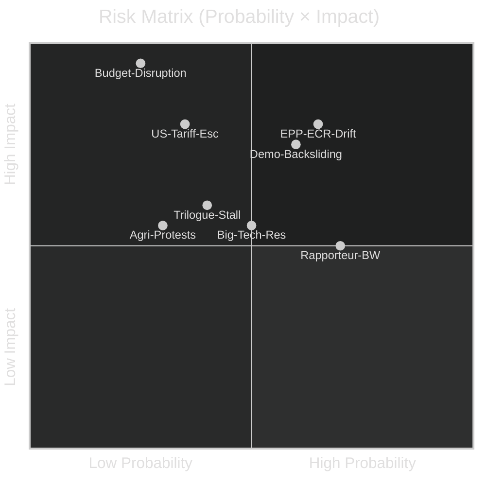

<!-- SPDX-FileCopyrightText: 2024-2026 Hack23 AB -->
<!-- SPDX-License-Identifier: Apache-2.0 -->
# Risk Matrix — EP Committee Reports 2026-05-14
**WEP:** Probable | **Admiralty:** B2

## 5×5 Risk Matrix

## Risk Register (Probability × Impact = Score, max 25)

| Risk ID | Description | Probability (1-5) | Impact (1-5) | Score | Treatment |
|---------|-------------|:-----------------:|:------------:|:-----:|-----------|
| R-01 | Budget calendar disruption | 2 | 5 | **10** | Contingency planning |
| R-02 | EPP-ECR coalition drift on environmental files | 3 | 4 | **12** | S&D-Greens-Renew coordination |
| R-03 | Democratic backsliding (rule of law erosion) | 3 | 4 | **12** | Article 7; conditionality; JURI |
| R-04 | US tariff escalation | 2 | 4 | **8** | WTO-compatible response; INTA monitor |
| R-05 | Rapporteur bandwidth exhaustion | 4 | 3 | **12** | Shadow rapporteur delegation |
| R-06 | Big Tech regulatory resistance (DMA) | 3 | 3 | **9** | IMCO enforcement resolution |
| R-07 | Cyberbullying trilogue stalling | 2 | 3 | **6** | Polish Presidency drive |
| R-08 | Agricultural protest re-escalation | 2 | 3 | **6** | Copa-Cogeca accepted compromise |
| R-09 | SRMR3 comitology delay | 2 | 3 | **6** | Commission/SRB pre-coordination |
| R-10 | Electoral Act ratification failure | 3 | 3 | **9** | Member state engagement |
| R-11 | Wildcard: Major cyber attack on EP | 1 | 4 | **4** | CERT-EU; resilience measures |
| R-12 | Wildcard: ECJ blocks Mercosur | 2 | 4 | **8** | INTA contingency |
| R-13 | Wildcard: Commission leadership crisis | 1 | 5 | **5** | Constitutional procedures |

## Risk Heat Map (Colour-Coded)

| Score | Risk Level | Current risks |
|-------|-----------|------|
| 15-25 | 🔴 CRITICAL | — (none in critical zone) |
| 10-14 | 🟠 HIGH | R-02, R-03, R-05, R-01 |
| 6-9 | 🟡 MEDIUM | R-04, R-06, R-10, R-07, R-08, R-09, R-12 |
| 1-5 | 🟢 LOW | R-11, R-13 |

## Top 3 Risk Profiles (Detail)

### R-05: Rapporteur Bandwidth Exhaustion (Score: 12)
**Current state**: HIGH probability (4/5) that one or more major rapporteur
assignments will experience timeline slippage due to simultaneous demands.
**Most exposed committees**: ECON (SRMR3 + ECB), LIBE (cyberbullying + migration),
BUDG (budget + NGEU oversight).
**Treatment effectiveness**: Shadow rapporteur delegation is the primary control.
Effectiveness depends on political group willingness to empower shadow rapporteurs —
**Medium (55%)** effectiveness.

### R-02 & R-03: Coalition Drift and Democratic Backsliding (Score: 12 each)
These two risks interact: EPP's willingness to coordinate with ECR is partly driven
by the fact that some ECR-adjacent positions on rule of law (Hungary, Poland) are
no longer politically costly for EPP's eastern European delegations.
**Compound risk**: If EPP loses its credibility as the rule-of-law anchor,
the S&D-EPP grand coalition rationale weakens — systemic risk for the entire
Term 10 legislative programme.
**Treatment**: Cross-party rule-of-law coordination (Venice Commission collaboration;
AFCO constitutional hearings; consistent EPP leadership statements against Article
7 violations).

### R-01: Budget Calendar Disruption (Score: 10)
Despite a lower probability (2/5 = ~25%), the catastrophic potential (5/5) makes
this the most important single monitored risk.
**Treatment**: Commission should be engaged early; BUDG committee should schedule
informal consultations with DG Budget in May-June to track draft preparation.
**Lead indicator**: Commission signals at May/June ECOFIN meeting.

## Risk Trend Analysis

| Risk | Last Month | Current | Trend |
|---|---|---|---|
| EPP-ECR drift | MEDIUM | HIGH | ⬆️ Livestock vote confirmed |
| Budget disruption | LOW | MEDIUM | ⬆️ Commission work intensifying |
| Rapporteur BW | MEDIUM | HIGH | ⬆️ Post-plenary wave hitting |
| US tariff risk | HIGH | MEDIUM-HIGH | ➡️ Stabilised but not resolved |
| Democratic backsliding | MEDIUM | MEDIUM-HIGH | ⬆️ Immunity cases increasing |

## Risk Treatment Summary

| Priority | Action | Owner | Timeline |
|----------|--------|-------|----------|
| R-05: Rapporteur BW | Activate shadow rapporteur delegation protocols | Group coordinators | Immediate |
| R-02: Coalition drift | Progressive bloc coordination meeting | S&D/Greens/Renew coordinators | This week |
| R-01: Budget | Informal BUDG-Commission pre-consultation | BUDG Chair | By end May |
| R-04: US tariffs | INTA contingency resolution preparation | INTA Coordinator | 4 weeks |
| R-10: Electoral Act | AFCO ratification barrier analysis | AFCO Rapporteur | 6 weeks |

