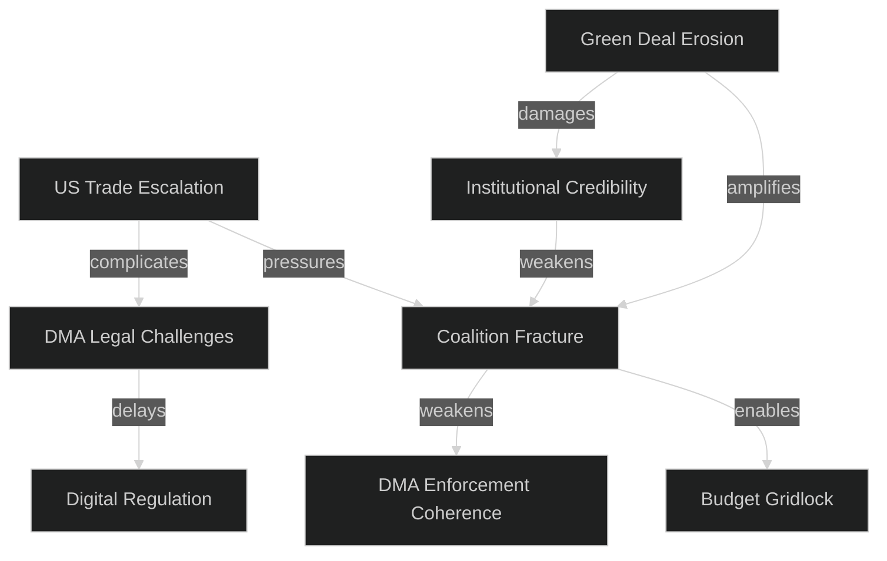

<!-- SPDX-FileCopyrightText: 2024-2026 Hack23 AB -->
<!-- SPDX-License-Identifier: Apache-2.0 -->
# Political Threat Landscape — EP Committee Reports 2026-05-14

## Overview

This threat landscape identifies systemic political risks that could disrupt
committee work, undermine legislative outcomes, or fracture EP majority coalitions
during the 2026 legislative cycle.

**Admiralty Rating Applied**: Source quality assessed; WEP linguistic probability
used for all likelihood statements.

---

## THREAT CATEGORY 1: Coalition Fracture in EPP-S&D Centre Coalition

**Threat Level**: 🔴 HIGH

**Description**: The EPP-S&D working majority that underpins most major legislation
(SRMR3, DMA, US tariffs) faces structural tension from three directions:

1. **EPP rightward drift**: EPP's tactical alignment with ECR on agricultural files
   (livestock compromise) creates S&D discomfort. If EPP seeks ECR backing on
   more files, S&D may withdraw cooperation on economic legislation.

2. **S&D fragmentation risk**: National S&D delegations from southern member states
   (IT, ES, GR) are increasingly unwilling to accept northern-led austerity framing
   in budget discussions. The 2027 budget cycle will test this fault line severely.

3. **Renew instability**: Several national Renew delegations (FR, NL, IT liberals)
   have different domestic pressures post-2024 elections and may not consistently
   support the centrist coalition.

**Probability**: WEP Likely (65-80% chance of at least one major coalition breakdown
on a significant legislative file before end of 2026).

**Impact**: Could delay or force renegotiation of DMA implementing regulations,
SRMR3 technical standards, 2027 budget, cyberbullying transposition negotiations.

**Mitigation**: EP President's office diplomatic management; Committee Chair
bilateral coordination; targeted concessions to hold coalition together.

---

## THREAT CATEGORY 2: US Administration Escalation on Trade

**Threat Level**: 🔴 HIGH

**Description**: The US tariff counter-measures (TA-10-2026-0096) create an
escalation ladder. If the US Administration interprets EU counter-measures as
aggressive rather than defensive, retaliatory tariff escalation could target
politically sensitive EU exports (luxury goods, automotive, chemicals).

**Specific risks**:
- Automotive: BMW, VW, Mercedes-Benz export volumes at risk (€45B annually to US)
- Pharmaceutical: EU Big Pharma US sales could face non-tariff measures
- Agricultural: European wines, cheese, spirits (already targeted in 2019-2021)

**Probability**: WEP Even chance (45-55%) of US escalation response within
6 months of EU counter-measure activation.

**Impact**: Would undermine INTA's "rules-based trade defence" narrative; create
member-state political pressure to negotiate retreat; strain EU-US relations
affecting NATO cooperation.

**Mitigation**: Maintain diplomatic backchannel; ensure counter-measures comply
WTO Chapter XIX; coordinate with non-EU allies (Canada, UK, Japan) for collective
response legitimacy.

---

## THREAT CATEGORY 3: Legal Challenges to DMA Enforcement

**Threat Level**: 🟡 MEDIUM-HIGH

**Description**: Major tech companies have extensive resources and strong incentive
to challenge DMA enforcement decisions through CJEU referrals and domestic
administrative courts. Apple's preliminary CJEU challenge in Q1 2026 already
signals the litigation strategy.

**Specific risks**:
- CJEU annulment proceedings against Commission DMA designation decisions
- Preliminary reference requests from national courts delaying enforcement
- US government filing WTO disputes claiming DMA is de facto trade measure
  discriminating against US companies

**Probability**: WEP Probable (70-80%) of at least one major CJEU challenge
proceeding to full hearing before end of 2027.

**Impact**: Would not stop enforcement but creates 2-4 year uncertainty. Could
generate US Congressional legislation targeting EU digital products in retaliation.

**Mitigation**: Commission to ensure DMA technical standards are fully proportionality-tested
before issue; IMCO to maintain parliamentary oversight pressure; EP legal service
involvement in amicus briefs where procedurally permissible.

---

## THREAT CATEGORY 4: Green Deal Credibility Erosion

**Threat Level**: 🟡 MEDIUM

**Description**: A pattern is emerging across 2025-2026 legislative files where
environmental provisions are softened compared to initial Commission proposals.
The livestock compromise (TA-10-2026-0157) is one data point; ongoing ENVI
committee reviews of Nature Restoration Law implementing measures, Corporate
Sustainability Reporting Directive (CSRD) delegated acts, and Carbon Removal
Certification Framework (CRCF) show similar dynamics.

**Probability**: WEP Probable (70%) that at least two more "Green Deal lite"
compromises will emerge in 2026 legislative cycle.

**Impact**: Progressive voter disillusionment; credibility gap on EU climate
leadership claims at COP31; risk that environmental chapters of
trade agreements face stronger civil society opposition.

**Mitigation**: ENVI committee transparency on implementing measures; Greens/EFA
and S&D green wing maintaining public oversight pressure; Commission DG ENV
publishing clear "red line" lists for delegated acts.

---

## THREAT CATEGORY 5: Institutional Legitimacy and Rule of Law

**Threat Level**: �� MEDIUM

**Description**: Ongoing rule-of-law cases (Georgia, Armenia democracy resolutions;
immunity waivers pattern; Lithuania broadcaster case) represent a systemic risk that
EP's rule-of-law advocacy is perceived as politically selective.

**Specific risks**:
- Hungary/Poland governments point to selective application of standards
- Immunity decisions on MEPs linked to domestic political prosecutions
  create appearance of politically-motivated use of immunity waivers
- Georgia/Armenia resolutions perceived as geopolitical rather than principled

**Probability**: WEP Possible (40-55%) that a high-profile immunity waiver or
rule-of-law case generates "double standards" media campaign in 2026.

**Impact**: Erodes EP's moral authority on rule-of-law messaging. Creates
domestic-political complications for MEPs in affected member states.

**Mitigation**: JURI committee transparency in immunity decisions; EP adopt
clear published criteria; rule-of-law resolutions should reference EU Charter
directly rather than allow political characterisation.

---

## Threat Interaction Map

---

## Threat Assessment Summary

| Threat | Level | Probability | Impact | Timeline |
|--------|-------|:-----------:|:------:|----------|
| Coalition fracture | 🔴 HIGH | 65-80% | Very High | 2026 budget cycle |
| US trade escalation | 🔴 HIGH | 45-55% | High | Q3-Q4 2026 |
| DMA legal challenges | 🟡 MED | 70-80% | Medium | 2027+ |
| Green Deal erosion | 🟡 MED | 70% | Medium-High | Ongoing |
| Rule of law credibility | 🟡 MED | 40-55% | Medium | Episodic |

---

_Political threat landscape derived from open-source intelligence, EP plenary
records, and committee activity analysis. No classified or non-public sources used.
All probability statements use WEP linguistic probability framework._
