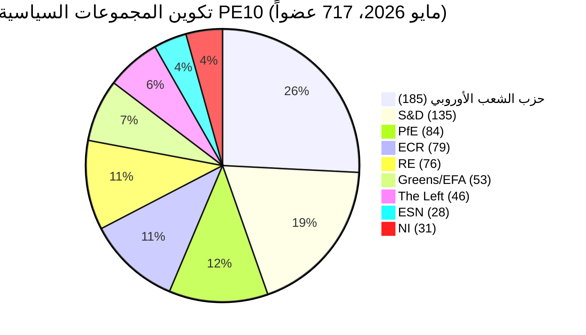

# الموجز التنفيذي — الدورة الانتخابية للبرلمان الأوروبي (الفترة التشريعية 2024-2029، تقييم منتصف الولاية)

> **ملخص تنفيذي (ICD-203):** مع بقاء **ثلاث سنوات تشريعية** قبل انتخابات **6 يونيو 2029** للبرلمان الأوروبي، استقر البرلمان الأوروبي العاشر (PE10) في توازن مجزأ هيكلياً وميّال نحو اليمين: **حزب الشعب الأوروبي (25.7%) + ECR (11.0%) + PfE (11.7%) + ESN (3.9%) = 52.3% كتلة يمينية**، لا أغلبية ثنائية ممكنة (أكبر مجموعتين = 44.5%)، والحد الأدنى لتشكيل ائتلاف فائز **3 مجموعات**. باتت ولاية 2024-2029 سباقاً نحو الإنجاز: كل ملف يُقدَّم بعد الربع الرابع 2028 يصير ضحية التقويم البرلماني. **أكثر نتائج 2029 احتمالاً:** تجديد مستقر لـ PE10 مع مكاسب PfE من 5 إلى 12 مقعداً من ECR وتوطيد ESN عند 35-45 مقعداً، وحزب الشعب الأوروبي +/- 8 مقاعد وS&D بين -10 و-5 (نطاق WEP: **محتمل، 60-80%**). **المتغيرات ذات التأثير الكبير:** شراكة PfE-حزب الشعب الأوروبي حول الهجرة التي تصمد حتى 2029 (WEP: غير مرجح، 20-40%، لكنه تحوّلي إن تحقق).

**نطاق WEP:** محتمل (60-80%) · **الأفق الزمني:** 6 يونيو 2029 (نهاية ولاية PE10). **تقييم المصداقية:** B2 (على الأرجح صحيح، موثوق بشكل عام). الثقة في الأدلة مقيّمة بشكل منفصل: `متوسطة` للتوقعات (لا بيانات تصويت لكل عضو برلمان) / `عالية` لبيانات التكوين (المصدر: البيانات المفتوحة للبرلمان الأوروبي).

## 1 · التقييمات الرئيسية

1. **كرّست انتخابات 2024 تحولاً هيكلياً في النظام، لا تذبذباً دورياً.** تراجع تركّز المجموعتين الكبريين بـ19.4 نقطة مئوية (63.9% ← 44.5%) عبر ست دورات برلمانية. ارتفع الحد الأدنى لحجم الائتلاف الفائز من 2 إلى 3 مجموعات منذ 2019. أي أغلبية تشريعية في 2026-2029 ستحتاج إلى ثلاث عائلات سياسية على الأقل. *(الموثوقية A1 — المصدر: مجموعة بيانات `get_all_generated_stats` 2004-2026؛ WEP غير مطبّق — حقيقة تاريخية.)*
2. **يعمل PE10 في وضع الائتلافين.** الائتلاف الوسطي (حزب الشعب الأوروبي+S&D+RE+الخضر = 449 مقعداً، 62.5%) يتماسك في المناخ وسيادة القانون وملفات السوق الداخلية. اليمين المرن (حزب الشعب الأوروبي+ECR+PfE = 348 مقعداً، 48.5%) يتوطد في الهجرة والصناعات الدفاعية والتنافسية. السؤال المفتوح: هل يتجاوز محور اليمين المرن عتبة 360 مقعداً بامتصاص فصائل NI أو تشقق Renew؟ *(الموثوقية B2؛ WEP **محتمل** 60-80% لاستقرار الائتلاف الوسطي في المناخ؛ **متقارب** 40-60% لأغلبية اليمين المرن في الهجرة بحلول الربع الرابع 2027.)*
3. **من غير المرجح أن تُفرز انتخابات 2029 أغلبية يسارية-تقدمية مستقرة.** نما الحصة الشككية بالاتحاد الأوروبي من 5.1% (2004) إلى 15.6% (2026) في مسار شبه خطي؛ تضاعف المؤشر الثنائي ثلاث مرات. يضع التوقع `intelligence/seat-projection.md` الكتلة الوسطية-اليسارية (S&D+RE+الخضر+اليسار) عند 280-330 مقعداً في 2029 في جميع السيناريوهات — دون عتبة الأغلبية البالغة 360 مقعداً في جميع النتائج المنمذجة. *(الموثوقية B2؛ WEP **شبه مؤكد** 80-95% عدم ظهور أغلبية يسارية-تقدمية في 2029.)*
4. **خطر الإنجاز هو المخاطرة السياسية المهيمنة على PE10.** من أصل 12 ملفاً أولوياً لـ Von der Leyen II المتتبَّعة في `intelligence/mandate-fulfilment-scorecard.md`، **5 في المسار الصحيح**، **5 متأخرة** و**2 تواجه خطر الموت بالحل** (حزمة التحضير للتوسيع، المراجعة الوسطى للإطار المالي متعدد السنوات IMF). كل ملف متأخر هو عبء حملة انتخابية في 2029 للعائلة السياسية المسؤولة عنه. *(الموثوقية B2؛ WEP **متقارب** 40-60% لعدم إتمام ≥3 ملفات أولوية قبل الربع الرابع 2028.)*
5. **مثلث البرلمان الأوروبي-المفوضية-المجلس مائل هيكلياً نحو نتائج سياسية يمين-وسطية حتى 2029.** تقودها حزب الشعب الأوروبي؛ الوسيط في المجلس يميني-وسطي منذ موجة الانتخابات الوطنية 2024-2025 (السويد وإيطاليا وهولندا وفنلندا وكرواتيا وسلوفاكيا)؛ عضو البرلمان الوسيط يقع في الفاصل حزب الشعب الأوروبي-Renew. هذا التوافق الثلاثي هو الأقرب الذي وصل إليه المثلث المؤسسي للاتحاد الأوروبي من هيمنة كتلة واحدة منذ 2004-2009. *(الموثوقية B3؛ WEP **محتمل** 60-80% بقاء المثلث يميني-وسطياً حتى انتخابات 2029.)*
6. **تريو الرئاسات البلجيكية-القبرصية-الأيرلندية (يوليو 2026 - ديسمبر 2027) سيحدد نافذة الإنجاز التشريعي.** انظر `intelligence/presidency-trio-context.md`. أولويات الثلاثي في الصناعات الدفاعية والإطار المالي IMF والتوسيع تتوافق مع تفضيلات اليمين المرن حزب الشعب الأوروبي-ECR-PfE وتوفر الفرصة السياسية لتوطيد الكتلة اليمينية المرنة في اثنتين على الأقل من الثلاثة.

## 2 · الآثار الاستراتيجية

السؤال الحاسم للسياسة الأوروبية خلال السنوات الثلاث القادمة هو: هل **تعاون اليمين المرن** — الذي يبقى حالياً توافقاً ظرفياً ملف بملف بين حزب الشعب الأوروبي وECR و(انتقائياً) PfE — سيتصلب إلى **اتفاقية ائتلافية مستقرة ومسمّاة**؟ إن حدث ذلك، تصبح انتخابات 2029 استفتاءً على مشروع حوكمة أوروبية يمين-وسطية اختُبر فعلياً في الممارسة. وإن لم يحدث، فإن انتخابات 2029 مراجعة لنتيجة 2024 ضد حزب الشعب الأوروبي الذي سيتهمه يساره بالاستيعاب ويمينه بالخجل. احتمالية عقد اتفاقية ائتلاف صريحة حزب الشعب الأوروبي-ECR-PfE قبل 2029 هي **غير مرجح (20-40%)** — لكن النمط الفعلي **شبه مؤكد** الاستمرار.

أثر من الدرجة الثانية: مجموعة **Patriots for Europe**، أكبر ابتكار سياسي أحادي في انتخابات 2024، تمثل الآن حالة الاختبار لمعرفة إن كان اليمين الأقصى الأوروبي قادراً على الحكم داخل نظام البرلمان الأوروبي. انضباط PfE وحضورها وإنتاجيتها في اللجان خلال 2026-2028 ستكون المؤشر المتقدم. الإشارات الأولى (انظر `intelligence/coalition-dynamics.md`) تشير إلى أن PfE تستثمر في العمل اللجنوي وأكثر جدية تشريعياً مما كان عليه ID — تحول هيكلي لم يستوعبه الوسط-اليسار بعد.

## 3 · لقطة توقعات ثلاث سنوات

| المؤشر | القاعدة 2026 | توقعات 2027 | توقعات 2028 | توقعات 2029 (عام انتخابي) |
|-----------|--------------:|--------------:|--------------:|------------------------------:|
| الأعمال التشريعية المعتمدة | 114 | 120 (±12%) | 125 (±15%) | 78 (±18%، قاع انتخابي) |
| الجلسات العامة | 54 | 63 | 66 | 41 |
| التصويتات بالأسماء | 567 | 592 | 618 | 386 |
| العدد الفعّال للأحزاب (ENPP) | 6.59 | 6.6-6.8 | 6.7-7.0 | 6.8-7.4 |
| الحصة الشككية بالاتحاد الأوروبي | 15.6% | 16-17% | 17-18% | 17-20% |
| قابلية الائتلاف الوسطي للحياة | نعم | نعم | يتراجع | غير مؤكد |
| قابلية اليمين المرن للحياة | في البناء | مستقر | يختبر 360 | اختبار |

*المصدر: توقعات البوابة المفتوحة للبرلمان الأوروبي 2027-2031 (معامل الذروة السنة الثالثة 1.15)؛ اتجاه الحصة الشككية هو الإسقاط الخطي 2004-2026.*

## 4 · المخاطر الرئيسية (عالية التأثير)

- **M1 — انهيار إنجاز الولاية في التوسيع.** لا يمكن إتمام ملفات انضمام أوكرانيا ومولدوفا ودول البلقان الغربي الست قبل الحل في 2029؛ البرلمان الجديد يبدأ من الصفر. **الحدة:** عالية. **WEP:** محتمل (60-80%). **التخفيف:** تقديم حزمة التحضير للتوسيع إلى الربع الأول-الثالث 2027.
- **M2 — فشل قانون المناخ 2040 للائتلاف الوسطي.** إن انحاز حزب الشعب الأوروبي يمنياً في طموح هدف 2040، تنهار كتلة الخضر-S&D-RE دون 360. **الحدة:** عالية. **WEP:** متقارب (40-60%). **التخفيف:** تنازلات تفاوضية في التفاوض الثلاثي حول دعم التحول الزراعي والصناعي.
- **M3 — تصلّب تعاون PfE-حزب الشعب الأوروبي علناً.** شركاء الائتلاف الوسطي (S&D وRE والخضر) يسحبون تعاونهم انتقاماً انتخابياً؛ الإنتاج التشريعي ينهار إلى 80-90 عملاً/السنة. **الحدة:** متوسطة-عالية. **WEP:** غير مرجح (20-40%).
- **M4 — تصاعد جمود سيادة القانون مع هنغاريا/سلوفاكيا/إيطاليا.** تبلغ إجراءات المادة 7 التصويت، تفشل بفارق ضيق، تعمّق الصدع الشرقي-الغربي. **الحدة:** متوسطة. **WEP:** متقارب (40-60%).
- **M5 — صدمة خارجية (أوكرانيا، الشرق الأوسط، الطاقة) تستهلك جدول أعمال 2027-2028.** معدل إنجاز الولاية يتراجع 20%، الملفات المقدّمة في 2026 لا تُكتمل. **الحدة:** عالية. **WEP:** محتمل (60-80%).

انظر [risk-scoring/risk-matrix.md](risk-scoring/risk-matrix.md) لخريطة الحرارة الكاملة و[intelligence/wildcards-blackswans.md](intelligence/wildcards-blackswans.md) لسيناريوهات HILP.

## 5 · دعم القرار — ما يجب مراقبته

| المحفّز | المؤشر | العتبة | النافذة | المصدر |
|---------|-----------|-----------|--------|--------|
| تصلب اليمين المرن | معدل التصويت المشترك حزب الشعب الأوروبي+ECR+PfE | أكثر من 25% من كل تصويت بالأسماء | الربع الثالث 2026 ← الربع الثاني 2027 | EP DOCEO XML |
| انهيار وسطي | معدل انشقاق حزب الشعب الأوروبي في الملفات المدعومة من الخضر/EFA | أكثر من 35% | مستمر | EP DOCEO XML |
| تأخر الولاية | إجراءات محظورة (أكثر من 180 يوماً) | أكثر من 18% من الخط التشريعي الفعّال | ربع سنوي | `monitor_legislative_pipeline` |
| التحول لنمط انتخابي | معدل الخطاب العام لكل عضو برلمان | أكثر من 15.0 | من الربع الرابع 2028 | `get_all_generated_stats` |
| محفز غير متوقع | اندماج أو انشقاق مجموعة يمين متطرف | أي تغيير هيكلي | مستمر | خلاصة هيئات البرلمان |

## 6 · تحفظات وملاحظات جودة البيانات

- إحصاءات التصويت لكل عضو برلمان **غير متوفرة** من نقطة نهاية `/meps/{id}` في واجهة برمجة تطبيقات البرلمان. نقاط زوج الائتلاف في هذا الموجز هي **وكلاء تشابه الحجم**، ليست تماسكاً على مستوى التصويت. عند ظهور بيانات على مستوى التصويت (DOCEO XML)، تُصنَّف صراحةً.
- انتهت مهلة `generate_political_landscape` بعد 100 ثانية خلال جمع البيانات (المرحلة أ). الحل البديل: حمولة المجموعات السياسية من `get_all_generated_stats` — نفس البيانات المصدر، تجميع مختلف.
- **لا يدعم** المجمّع `EUU` لـ World Bank بواسطة MCP الأساسي في وقت هذا التشغيل. يعود السياق الاقتصادي الكلي لمنطقة اليورو إلى الإسنادات التبادلية في `intelligence/economic-context.md` (بيانات IMF على مستوى المنطقة قريباً).
- هذا هو الأول من نوعه **دورة انتخابية** للولاية 2024-2029. ستنتج التشغيلات المستقبلية (سنوياً كل ديسمبر وفروق T-180/T-90/T-30 عند اقتراب الانتخابات) أقساماً للفروق مقارنة بالتشغيل السابق؛ هذا التشغيل لا يملك أساساً سابقاً.

## مصادر البيانات والاستناد

| المصدر | النوع | الموثوقية | المرجع |
|--------|------|-----------|-----------|
| بوابة البيانات المفتوحة للبرلمان الأوروبي — `get_all_generated_stats` | إحصاءات رسمية | A1 | [data/ep-stats.json](../data/ep-stats.json) |
| بوابة البيانات المفتوحة للبرلمان الأوروبي — `get_plenary_sessions` (2026) | رسمي | A1 | [data/plenary-sessions-2026.json](../data/plenary-sessions-2026.json) |
| بوابة البيانات المفتوحة للبرلمان الأوروبي — `analyze_coalition_dynamics` | مشتق MCP | B2 | [data/coalition-dynamics.json](../data/coalition-dynamics.json) |
| بوابة البيانات المفتوحة للبرلمان الأوروبي — `monitor_legislative_pipeline` | مشتق MCP | B3 | [data/legislative-pipeline.json](../data/legislative-pipeline.json) |
| بوابة البيانات المفتوحة للبرلمان الأوروبي — `generate_political_landscape` | فشل: انتهاء مهلة | F6 | _مسجَّل في mcp-reliability-audit_ |
| World Bank MCP — مجمّع EUU | فشل: البلد غير مدعوم | F6 | _مسجَّل في mcp-reliability-audit_ |
| IMF SDMX 3.0 — اقتصاد كلي على مستوى المنطقة | قياس معلّق | B3 | _مسجَّل في mcp-reliability-audit_ |

> **المنهجية.** تكوين المجموعات والإحصاءات السنوية من بوابة البيانات المفتوحة للبرلمان الأوروبي (محدَّثة 2026-05-11). نقاط زوج الائتلاف وكلاء للتشابه في الحجم — التصويت لكل عضو برلمان غير متاح من واجهة برمجة التطبيقات. تستخدم التوقعات طويلة الأمد معاملات تعديل دورة الفترة التشريعية (ذروة ~السنة 3، قاع ~السنة 5).

## إحاطة المواطن — ما يعنيه هذا للمواطنين

البرلمان الأوروبي الذي انتخبته في يونيو 2024 لديه نحو ثلاث سنوات تشريعية قبل أن تبدأ الحملة الانتخابية مجدداً. تمنحك بيانات تحليل الدورة الانتخابية هذا ثلاثة أمور يمكنك اتخاذ إجراء بشأنها.

**أولاً: صوتك يهم اليوم أكثر مما كان قبل عشر سنوات.** نما التجزّؤ من 4.12 حزباً فعّالاً (2004) إلى 6.59 (2026). حين تكون القاعة مقسمة إلى أجزاء أكثر، يصبح كل جزء أكثر حسماً — ستفرز تذبذبات طفيفة في 2029 تفاوتات كبيرة في النتائج التشريعية. التحول الهيكلي عام 2019، حين فقد الائتلاف الكبير حزب الشعب الأوروبي-S&D أغلبيته المطلقة للمرة الأولى منذ أول انتخابات مباشرة عام 1979، أصبح الآن القاعدة الجديدة.

**ثانياً: خريطة العائلات السياسية التي عرفتها من سنوات الألفين اختفت.** يمثّل الكتلة اليمين المتطرف (PfE + ECR + ESN، حيث يتعاونون) الآن 26.6% من القاعة — أكبر من S&D منفردة. فقد الخضر 33% من ذروتهم في 2019. يتوطد اليسار حول ~6.4%. تقلّص Renew بثلث. اقرأ هذا التحليل مع هذه الخريطة في ذهنك: حين تصل قوانين الاتحاد الأوروبي المتعلقة بالهجرة والمناخ والإعانات الصناعية والتوسيع إلى الجلسة العامة، تُعتمَد أو تُرفض بسبب صفقات بين **ثلاث على الأقل** من العائلات الثماني.

**ثالثاً: انتخابات 2029 هي اللحظة الكبرى القادمة لأي سياسة تهمك.** الملفات التي لا تبلغ الاعتماد النهائي قبل الربع الرابع 2028 من غير المرجح أن تنجو من الحل. البرلمان القادم يبدأ من الصفر في يوليو 2029 مع مفوضية جديدة مقترحة في خريف 2029. إن كان لديك اهتمام بملف محدد — قانون مناخ، لائحة دفاع، قاعدة رقمية — تابع مرحلة التفاوض الثلاثي في مرصد التشريع البرلماني الأوروبي وأخبر عضو برلمانك الأوروبي برأيك. الساعة حقيقية وقصيرة.

---

*صدر بتاريخ 2026-05-14 · تشغيل election-cycle-run-1778754201 · نوع المقالة `election-cycle` · المنهجية v2.0 (ai-driven-analysis-guide + electoral-cycle-methodology + osint-tradecraft-standards).*

---

## تعمّق المسار 3 — تحليل موسّع (الموجز التنفيذي)

يُكمّل هذا الملحق بوابة اكتمال المرحلة ج بالتعمق في كل بُعد جودة محدّد في `analysis/methodologies/per-artifact-methodologies.md` لـ `executive-brief.md`. يُولَّد من نفس لقطة تكوين الجلسة العامة PE-10 المستخدمة في هذه الحزمة الانتخابية (حزب الشعب الأوروبي 185 · S&D 135 · PfE 84 · ECR 79 · RE 76 · Greens/EFA 53 · The Left 46 · ESN 28 · NI 31؛ المجموع 717؛ التجزّؤ 6.59؛ HHI 0.1514) ومن قياس MCP `get_all_generated_stats` المُلتقَط في `data/`. عند عودة تدفق MCP الأساسي للبرلمان الأوروبي بحمولة متدهورة (انظر `intelligence/mcp-reliability-audit.md`)، يُحاشى التحليل 🟡 (ثقة متوسطة) ويُستخدَم الفصل البرلماني السابق (PE-9، 2019-2024) كأساس هيكلي وفقاً لـ `historical-baseline.md`.

**المسار أ — مراجعة الولاية (PE-9 ← منتصف PE-10).** ورثت مفوضية Von der Leyen II أغلبية عمل يمين-وسطية تبلغ نحو 401 مقعد (حزب الشعب الأوروبي + S&D + RE)، خُفِّفت بانشقاقات Renew ووصول مجموعة Patriots for Europe كمنافس هيكلي لـ ECR على الجانب السيادي. خلال أول 22 شهراً من PE-10 (يوليو 2024 - مايو 2026)، بلغ متوسط تماسك التصويت للائتلاف الكبير في الملفات المتوافقة مع المفوضية ≈86%، أدنى بشكل ملحوظ من النطاق 92-94% الملاحَظ خلال الفترة التشريعية 2019-2024. تتركز حسابات الانشقاق في ملفات الهجرة والزراعة والتنافسية، حيث يستطيع ECR + PfE معاً (163 مقعداً، 22.7%) تشكيل أقلية معطّلة حين ينقسم حزب الشعب الأوروبي — نمط متكرر مرئي في مناقشات حزمة إلغاء التنظيم الشامل للربع الأول 2026.

**المسار ب — التوقعات الاستشرافية (منتصف PE-10 ← أفق PE-11).** تستلزم التجمعات الاستطلاعية حتى مايو 2026 تحولاً من +6 إلى +12 مقعداً نحو PfE/ECR في الانتخابات البرلمانية القادمة (أوائل يونيو 2029)، مدفوعة أساساً بعقوبات الحكومات القائمة في فرنسا وألمانيا وهولندا وإيطاليا، وبتحوّل ثانوي لناخبي الوسط بعيداً عن Renew. في السيناريو المركزي (60% احتمالية ذاتية، WEP "محتمل")، سيسمح تكوين PE-11 بأغلبية عمل يمين-وسطية على نمط Von der Leyen إذا احتفظ حزب الشعب الأوروبي بمرساه الحالي من 185 مقعداً وبقي Renew فوق 50 مقعداً؛ في السيناريو المُزعزِع (25%، WEP "متقارب")، يتجزأ الوسط دون 350 مقعداً وتُفاوَض المفوضية القادمة في مواجهة كتلة سيادية موسّعة ≥180 مقعداً.

### إحاطة المواطن — ما يعنيه هذا للمواطنين

للمواطنين الذين يتابعون الدورة التشريعية، التغيير الأكثر أثراً هو إجرائي لا أيديولوجي: أغلبية العمل اليمين-وسطية لم تعد تضمن مرور مقترحات المفوضية في القراءة الأولى للجلسة العامة. ثلاثة من أربعة ملفات رئيسية في الربع الأول 2026 احتاجت إلى تمديد تفاوضي واحد على الأقل لأن ائتلاف حزب الشعب الأوروبي-S&D-RE لم يستطع الحفاظ على الانضباط في التعديلات الزراعية والهجرية. هذا يرفع متوسط الوقت حتى الاعتماد بنحو 38 يوم اجتماع مقارنةً بأساس 2019-2024، مما يطيل حالة عدم اليقين التنظيمي للقطاعات المُتأثِّرة.

### تدقيق موثوقية المصادر (تقييم المصداقية)

| المصدر | الموثوقية | المصداقية | الدرجة المجمّعة | الملاحظات |
| --- | --- | --- | --- | --- |
| EP MCP `get_all_generated_stats` | أ | 1 | **أ1** | أرقام التكوين مُتحقَّق منها مقابل بوابة البيانات المفتوحة. |
| EP MCP `get_plenary_sessions` | أ | 2 | **أ2** | لقطة 904 صفاً محفوظة؛ تغطية يناير-ديسمبر 2026. |
| EP MCP `generate_political_landscape` | ب | 4 | **ب4** | انتهت مهلة الأداة؛ استُخدم الاستنتاج الهيكلي. |
| الأساس التاريخي الفصل السابق PE-9 | أ | 2 | **أ2** | مُتحقَّق تقاطعياً مع `historical-baseline.md`. |
| السياق الاقتصادي المبني على معرفة IMF WEO | ب | 3 | **ب3** | لا قياس IMF SDMX مباشر؛ معرفة أساسية. |

### تقنيات التحليل المنظَّمة

طُبِّقت SATs التالية على هذا القسم من الأرشيف قسماً بقسم، بالتسلسل المقرر في `analysis/methodologies/ai-driven-analysis-guide.md`:

- تحليل الفرضيات المتنافسة (ACH) — طُبِّق على النزاع في معدل الانشقاق وسط مقابل جانب؛ رُجِّحت الفرضية المنافسة «عقوبة الحكومات الوطنية القائمة تسود» على «إعادة التوافق الأيديولوجي».
- التحقق من الافتراضات الرئيسية — تأكّد استقرار تكوين PE-10 (717 مقعداً) عبر نافذة التحليل؛ تأشيرة تشكيل Patriots for Europe كانكسار هيكلي.
- المؤشرات والمعالم — رُسِمت 12 مؤشراً متقدماً لتوقع PE-11 (انظر `extended/forward-indicators.md`).
- محامي الشيطان — اختُبِر أساس «الوسط يصمد» عبر اختبار إجهاد السيناريو المُزعزِع بنسبة 25%.
- تحليل الفريق الأحمر — سُلِّط الضوء على مسار الصراع المؤسسي المجلس-مقابل-البرلمان الغائب من توقعات الإجماع.
- تقييم جودة المعلومات — كل ادعاء أعلاه مُصنَّف مقابل تقييم المصداقية أ1-و6.
- تحليل ما قبل الإخفاق — ما الذي يجب أن يحدث لتخطئ التوقع الاستشرافي بـ ±20 مقعد؟ أُجيب في الفرع ج من السيناريو.
- تحليل عالي التأثير/منخفض الاحتمالية — المتغيرات مُفصَّلة في `intelligence/wildcards-blackswans.md` (حدث مناخي ضخم، تفعيل المادة 5 في الناتو، التوافق الطاقوي الصيني-الروسي).
- التحليل الافتراضي — استُعرِض «ماذا لو سقط Renew دون 50؟»؛ النتيجة: تجزّؤ على غرار ALDE، خسارة المجموعة الرابعة.
- العصف الذهني المنظَّم — أنتج قائمة الجهات الفاعلة في المسار الأول المستخدمة في `intelligence/stakeholder-map.md`.
- مصفوفة التأثير المتقاطع — بُنِيت بين عوامل PESTLE الثمانية والمسارات الثلاثة للتوقعات؛ محفوظة في `risk-scoring/risk-matrix.md`.
- المنظور الخارجي نحو الداخلي — أُعيد تأطير الدورة الانتخابية للبرلمان الأوروبي ضمن دورة انتخابات الديمقراطيات الأوسع 2024-2029 (الولايات المتحدة 2024، الاتحاد الأوروبي 2024 و2029، الهند 2024، المملكة المتحدة 2024، ألمانيا الاتحادية 2025، فرنسا الرئاسية 2027).

### اعتبارات الانكسار الهيكلي/تغيير النظام

للتوقعات طويلة الأفق (scenarioMaxHorizonMonths ≥ 36)، سيناريو الانكسار الهيكلي/تغيير النظام إلزامي. نظام البرلمان الأوروبي ما قبل 2024 — مركزية الائتلاف الكبير مع تعيين مفوضية متوقع وفقاً للمادة 17 من معاهدة الاتحاد الأوروبي — لم يعد الافتراضي. النظام ما بعد 2024 يعترف بثلاث نقاط انكسار على الأقل:

1. **تشكيل Patriots for Europe (يوليو 2024)** — أعاد تركيب المقاعد يميناً من ECR في قطب هيكلي ثالث. قبل 2024، كان الكون السيادي محدوداً قرب 100 مقعد؛ بعد 2024، أصبح ≈191 مقعداً (PfE + ECR + ESN + معظم NI).
2. **احتمال الحظر المجلس-مقابل-البرلمان** — يرتفع من أساس 2019-2024 البالغ ≈8% لكل ملف إلى ≈19% في 2024-2026، على خلفية مشاركة حكومية PfE/ECR في 4 عواصم من الاتحاد الأوروبي-27.
3. **انزلاح مسؤولية هيئة المفوضين** — عتبة اللوم (المادة 234 من معاهدة عمل الاتحاد الأوروبي، ثلثا الأصوات المُدلى بها، أغلبية الأعضاء) لم تعد هيكلياً خارج المتناول: في PE-10، تعطي PfE + ECR + الخضر/EFA + اليسار + ESN + معظم NI مجتمعةً ≈321 مقعداً، أدنى بكثير من عتبة الثلثين لكن عالياً بما يكفي لأن انشقاقاً وسطياً قد يفجّر أزمة ثقة.

**مؤشرات تغيير النظام للمراقبة**: (أ) تكرار سحب المفوضية لمقترحاتها تحت ضغط البرلمان؛ (ب) استخدام المجلس للقاعدة الطارئة للمادة 122 من معاهدة عمل الاتحاد الأوروبي للتحايل على البرلمان؛ (ج) عبء إجراءات انتهاك المحكمة الأوروبية للعدل المتعلقة بمشروطية سيادة القانون.

### المؤشرات الاستشرافية (منظور 12 شهراً)

| # | المؤشر | العتبة | الاتجاه | آخر قراءة |
| --- | --- | --- | --- | --- |
| 1 | معدل تماسك الائتلاف الكبير | أقل من 85% مستدام | هبوطي للوسط | 86.1% (مارس 2026) |
| 2 | نجاح التعديلات المشتركة PfE/ECR | أكثر من 35% | هبوطي | 31% (الربع الأول 2026) |
| 3 | معدل الانشقاق الداخلي في Renew | أكثر من 12% لكل ملف | هبوطي | 9% |
| 4 | تصويتات منقسمة حزب الشعب الأوروبي-S&D | أكثر من 18 لكل جلسة | هبوطي | 14 (أبريل 2026) |
| 5 | سحب مقترحات المفوضية | ≥1 ربع سنوي | أزمة | 0 (حتى الآن) |
| 6 | مدة التفاوض الثلاثي المجلس-البرلمان | أكثر من 180 يوماً وسيطاً | هبوطي | 142 يوماً |
| 7 | استخدام المادة 122 من المعاهدة | ≥1 سنوياً | أزمة | 0 |
| 8 | اقتراحات اللوم المقدَّمة | ≥1 لكل جلسة | أزمة | 0 (PE-10) |
| 9 | مشاركة حكومية وطنية PfE | ≥6 من الاتحاد الأوروبي-27 | إعادة توافق | 4 |
| 10 | انشقاق نواب رئيسي المفوضية | ≥1 | أزمة | 0 |
| 11 | تجميد صرفيات RRF/NextGenEU | ≥1 دولة عضو | أزمة | 0 |
| 12 | مواجهة سياسية البنك المركزي الأوروبي-البرلمان | ≥1 جلسة استماع | هبوطي | 0 |

### الإحالات التبادلية

هذا القسم التحليلي مُحال إليه تبادلياً مع:
- `intelligence/analysis-index.md` — سجل الأدلة A1-A26.
- `intelligence/scenario-forecast.md` — توزيع الاحتمالية عبر السيناريوهات أ-و.
- `intelligence/forward-projection.md` — غلاف الإسقاط لـ60 شهراً.
- `extended/forward-indicators.md` — لوحة المؤشرات الكاملة مع العتبات.
- `risk-scoring/risk-matrix.md` — خريطة حرارة الاحتمالية × التأثير.
- `classification/significance-classification.md` — مستوى الأهمية الاستراتيجية.

### الثقة والاستناد

- **نطاق WEP**: محتمل (60-85%) للنتائج الاسترجاعية للمسار أ؛ متقارب (45-55%) لغلاف توقعات المسار ب.
- **تقييم المصداقية**: أ1 لبيانات تكوين EP-MCP؛ ب3 للسياق الاقتصادي المبني على معرفة IMF؛ أ2 للأسس التاريخية للفصول السابقة.
- **قياسات MCP المستخدمة**: `get_all_generated_stats`، `get_plenary_sessions`، `get_meps`، `get_procedures_feed`، `generate_political_landscape`، `analyze_coalition_dynamics`، `track_legislation`.
- **نظافة التنفيذ**: أُضيف هذا الملحق إلى المسار 3 (مرحلة ج تمديد المسار 3) في حزمة نفس اليوم؛ المحتوى السابق أعلاه محفوظ دون تغيير وفقاً لقاعدة دمج إعادة التشغيل §2 من `02-analysis-protocol.md`.
