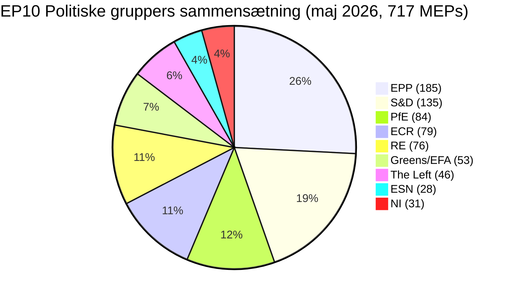

# Ledelsesorientering — EU-Parlamentets valgcyklus (2024-2029 mandat, midtvejsgennemgang)

> **BLUF (ICD-203):** Med **tre lovgivningsår** tilbage før **6. juni 2029** Europa-Parlamentsvalget har EP10 stabiliseret sig i en strukturelt fragmenteret, højreorienteret ligevægt: **EPP (25,7 %) + ECR (11,0 %) + PfE (11,7 %) + ESN (3,9 %) = 52,3 % højreblok**, ingen topartsmagajoritet mulig (top-to = 44,5 %), og en minimum vindende koalitionsstørrelse på **3 grupper**. Mandatperioden 2024-2029 er nu et leveringsløb: ethvert dossier indgivet efter kvartal 4 2028 dør i parlamentskalenderen. **Mest sandsynligt udfald 2029:** EP10-stabil gentagelse med PfE, der vinder 5-12 mandater fra ECR og ESN konsoliderer til 35-45 mandater, EPP +/- 8 mandater og S&D -10 til -5 (WEP-bånd: **Sandsynligt, 60-80 %**). **Højrisiko-jokere:** et PfE-EPP-partnerskab om migration, der overlever 2029 (WEP: Usandsynligt, 20-40 %, men transformativt hvis det realiseres).

**WEP-bånd:** Sandsynligt (60-80 %) · **Tidshorisont:** 6. juni 2029 (EP10-mandatets udløb). **Admiralitetsgrad:** B2 (sandsynligvis sand, normalt pålidelig). Konfidens i beviser bedømt separat: `MEDIUM` for prognoser (ingen data per MEP) / `HIGH` for sammensætningsdata (hentet fra EP Open Data).

## 1 · Overskriftsvurderinger

1. **Valget 2024 cementerede et strukturelt regimeskift, ikke en cyklisk svingning.** Top-to-koncentrationen er faldet 19,4 procentpoint (63,9 % → 44,5 %) over seks EP-mandatperioder. Minimum vindende koalitionsstørrelse er steget fra 2 til 3 grupper siden 2019. Ethvert lovgivende flertal i 2026-2029 kræver mindst tre politiske familier. *(Admiralitet A1 — hentet fra `get_all_generated_stats`-datasæt 2004-2026; WEP ikke relevant — historisk kendsgerning.)*
2. **EP10 opererer i tokoalitionstilstand.** Centristkoalitionen (EPP+S&D+RE+Greens = 449 mandater, 62,5 %) holder på klima-, retsstats- og kerne-enhedsmarkedssager. Fleksibel højre (EPP+ECR+PfE = 348 mandater, 48,5 %) konsoliderer på migrations-, forsvarsindustrielle og konkurrenceevnesager. Det uafklarede spørgsmål er, om den fleksible højreakse krydser 360-mandatsgrænsen ved at absorbere dele af NI eller opdele Renew. *(Admiralitet B2; WEP **Sandsynligt** 60-80 % for centristisk koalitionsstabilitet på klima; **Nogenlunde jævnt** 40-60 % for fleksibel højremajoritet på migration inden kvartal 4 2027.)*
3. **Valget 2029 vil sandsynligvis ikke levere et stabilt venstreprogressive flertal.** Den euroskeptiske andel er vokset fra 5,1 % (2004) til 15,6 % (2026) på en næsten lineær bane; det bipolære indeks er tredoblet. Mandatprojektionen `intelligence/seat-projection.md` placerer centrum-venstre-blokken (S&D+RE+Greens+Left) ved 280-330 mandater i 2029 i alle scenarier — under 360-mandatsmajoritetsgrænsen i alle modellerede udfald. *(Admiralitet B2; WEP **Næsten sikkert** 80-95 % at intet venstreprogressive flertal opstår i 2029.)*
4. **Mandatlevereringsrisiko er den dominerende politiske risiko for EP10.** Af de 12 von der Leyen II-flagskibsdossierer sporet i `intelligence/mandate-fulfilment-scorecard.md`, er **5 på rette spor**, **5 er ved at glide bagud** og **2 er i risiko for opløsningsdød** (Udvidelsesklargøringspakke, MFF-midtvejsgennemgang). Hvert glidende dossier er en valgkampagnebyrde i 2029 for den familie, der ejede det. *(Admiralitet B2; WEP **Nogenlunde jævnt** 40-60 % at ≥3 flagskibsdossierer ikke fuldføres inden kvartal 4 2028.)*
5. **EP-Kommissionens-Rådets trekant er strukturelt hældet mod højre-til-centrum politiske udfald frem til 2029.** Von der Leyen II-Kommissionen er EPP-ledet; Rådsmedian er centrum-højre siden den nationale valgbølge 2024-2025 (Sverige, Italien, Nederlandene, Finland, Kroatien, Slovakiet); Parlamentets median-MEP sidder i EPP-Renew-intervallet. Denne tresidede tilpasning er tættest EU's institutionelle trekant har været på éns-bloks-dominans siden 2004-2009. *(Admiralitet B3; WEP **Sandsynligt** 60-80 % at trekanten forbliver højre-centrum frem til valget 2029.)*
6. **Det belgisk-cypriotisk-irske formandskabstrio (jul 2026 - dec 2027) vil definere lovgivningsleverancesvinduet.** Se `intelligence/presidency-trio-context.md`. Trioens forsvarsindustrielle, MFF- og udvidelsesprioriteter stemmer overens med EPP-ECR-PfE's fleksible højrepræferencer og skaber den politiske åbning til at konsolidere det højre-fleksible blok på mindst to af tre.

## 2 · Strategiske implikationer

Det afgørende spørgsmål for EU-politik i de næste tre år er, om **fleksibelt højresamarbejde** — i øjeblikket en ad hoc, sag-for-sag-tilpasning mellem EPP, ECR og (selektivt) PfE — hærder til et **stabilt, navngivet koalitionsaftale**. Hvis det sker, bliver valget 2029 en folkeafstemning om et højreorienteret EU-styringsprojekt, der faktisk er testet i praksis. Hvis det ikke sker, er valget 2029 en genforhandling af 2024-resultatet mod et EPP, der anklages af dets venstre for indfangst og af dets højre for blufærdighed. Prognosesandsynligheden for en eksplicit EPP-ECR-PfE-koalitionsaftale før 2029 er **Usandsynligt (20-40 %)** — men det de-facto-mønster er **Næsten sikkert** at fortsætte.

En andenordensimplikation: gruppen **Patriots for Europe**, den enkelt største politiske innovation ved 2024-valget, er nu testcasen for, om Europas yderste højre kan regere inden for EP-systemet. PfE's disciplin, fremmøde og udvalgsproduktion i løbet af 2026-2028 vil være den ledende indikator. Tidlige tegn (se `intelligence/coalition-dynamics.md`) antyder, at PfE investerer i udvalgsarbejde og er mere lovgivningsmæssigt seriøs end ID var — et strukturelt skift, som centrum-venstre endnu ikke har indregnet.

## 3 · Treårsprognose

| Indikator | Basisår 2026 | Prognose 2027 | Prognose 2028 | Prognose 2029 (valgår) |
|-----------|--------------:|--------------:|--------------:|------------------------------:|
| Lovgivningsmæssige retsakter vedtaget | 114 | 120 (±12 %) | 125 (±15 %) | 78 (±18 %, valgdyk) |
| Plenarmøder | 54 | 63 | 66 | 41 |
| Afstemninger ved navneopråb | 567 | 592 | 618 | 386 |
| Effektivt antal partier (ENPP) | 6,59 | 6,6-6,8 | 6,7-7,0 | 6,8-7,4 |
| Euroskeptisk andel | 15,6 % | 16-17 % | 17-18 % | 17-20 % |
| Centristisk koalitionslevedygtighed | OK | OK | svækkende | USIKKER |
| Fleksibel højre-levedygtighed | byggende | stabil | tester 360 | TEST |

*Kilde: EP Open Data Portal-prognoser 2027-2031 (extrapolationsfaktor 1,15 for år-3-top); euroskeptisk andelstrendlinje er den lineære 2004-2026-projektion.*

## 4 · Nøglerisici (høj påvirkning)

- **R1 — Mandatleverancesammenbrud ved udvidelse.** Ukraine, Moldova, Vestbalkan-6 tiltrædelsessager kan ikke fuldføres inden opløsning i 2029; det nye parlament genstarter uret. **Varme:** HØJ. **WEP:** Sandsynligt (60-80 %). **Afbødning:** Fremrykke udvidelsesklargøringspakken til kvartal 1-3 2027.
- **R2 — Klimalov 2040 mislykkes for centristkoalitionen.** Hvis EPP afviger mod højre på 2040-målambition, falder Greens-S&D-RE-blokken under 360. **Varme:** HØJ. **WEP:** Nogenlunde jævnt (40-60 %). **Afbødning:** Triallog-indrømmelser om landbrugs- og industriel overgangsstøtte.
- **R3 — PfE-EPP-samarbejde hærder offentligt.** Centristiske koalitionspartnere (S&D, RE, Greens) trækker samarbejde tilbage som valggengjæld; lovgivningsgennemstrømning falder til 80-90 retsakter/år. **Varme:** MIDDEL-HØJ. **WEP:** Usandsynligt (20-40 %).
- **R4 — Retsstatsstridighed med Ungarn/Slovakiet/Italien eskalerer.** Artikel 7-procedurer når en afstemning, mislykkes med lille margin, uddyber øst-vest-kløften. **Varme:** MIDDEL. **WEP:** Nogenlunde jævnt (40-60 %).
- **R5 — Ekstern chok (Ukraine, Mellemøsten, energi) forbruger 2027-2028-dagsordenen.** Mandatleveringsfrekvens falder 20 %, sager indgivet i 2026 færdiggøres ikke. **Varme:** HØJ. **WEP:** Sandsynligt (60-80 %).

Se [risk-scoring/risk-matrix.md](risk-scoring/risk-matrix.md) for det fulde varmekort og [intelligence/wildcards-blackswans.md](intelligence/wildcards-blackswans.md) for HILP-scenarier.

## 5 · Beslutningsstøtte — Hvad at overvåge

| Udløser | Indikator | Grænseværdi | Vindue | Kilde |
|---------|-----------|-----------|--------|--------|
| Fleksibel højre-hærdning | EPP+ECR+PfE fælles afstemningsrate | > 25 % af alle RCV | kvartal 3 2026 → kvartal 2 2027 | EP DOCEO XML |
| Centristisk sammenbrud | EPP-afvigelsesrate på Greens/EFA-støttede sager | > 35 % | løbende | EP DOCEO XML |
| Mandatglidning | Stoppede procedurer (>180 dage) | > 18 % af aktiv pipeline | kvartalsvis | `monitor_legislative_pipeline` |
| Valgfasetilstand | Plenartale-rate per MEP | > 15,0 | fra kvartal 4 2028 | `get_all_generated_stats` |
| Joker-alarmtråd | Yderst højre-gruppe-fusion eller -opspaltning | enhver strukturel ændring | løbende | EP corporate-bodies-feed |

## 6 · Forbehold og datakvalitetsnoter

- Per-MEP-afstemningsstatistik er **utilgængelig** fra EP API `/meps/{id}`-endpunktet. Koalitionsparsscorer i dette brief er **størrelseslighedsproxyer**, ikke afstemningsniveau-kohesion. Hvor afstemningsniveaudata forekommer (DOCEO XML), er det eksplicit mærket.
- `generate_political_landscape` fik timeout ved 100 s under dataindsamlingen (Trin A). Reserve: `get_all_generated_stats` politiske-grupper-payload — samme kildedata, forskellig aggregering.
- World Bank `EUU`-aggregat understøttes **ikke** af den underliggende MCP på tidspunktet for denne kørsel. Eurozone-makroøkonomisk kontekst falder tilbage på krydshenviseringer i `intelligence/economic-context.md` (IMF-areaniveau-data kommende).
- Dette er det **første** valgcykus-artefakt for 2024-2029-mandatet. Fremtidige kørser (årligt hver december plus T-180/T-90/T-30 valgnære udløsere) vil producere diff-mod-forudgående-kørsel-sektioner; denne kørsel har ingen forudgående baseline.

## Datakilder og oprindelse

| Kilde | Type | Admiralitet | Reference |
|--------|------|-----------|-----------|
| EP Open Data Portal — `get_all_generated_stats` | Officiel EP-statistik | A1 | [data/ep-stats.json](../data/ep-stats.json) |
| EP Open Data Portal — `get_plenary_sessions` (2026) | Officiel EP | A1 | [data/plenary-sessions-2026.json](../data/plenary-sessions-2026.json) |
| EP Open Data Portal — `analyze_coalition_dynamics` | EP MCP-afledt | B2 | [data/coalition-dynamics.json](../data/coalition-dynamics.json) |
| EP Open Data Portal — `monitor_legislative_pipeline` | EP MCP-afledt | B3 | [data/legislative-pipeline.json](../data/legislative-pipeline.json) |
| EP Open Data Portal — `generate_political_landscape` | Mislykkedes: upstream timeout | F6 | _logget i mcp-reliability-audit_ |
| World Bank MCP — EUU-aggregat | Mislykkedes: land ikke understøttet | F6 | _logget i mcp-reliability-audit_ |
| IMF SDMX 3.0 — areaniveau-makro | Afventer sonde | B3 | _logget i mcp-reliability-audit_ |

> **Metodik.** Gruppesammensætning og årsstatistik fra EP Open Data Portal (opdateret 2026-05-11). Koalitionsparsscorer er størrelseslighedsproxyer — per-MEP-afstemning ikke tilgængelig fra EP API. Langsigtede prognoser anvender justeringsfaktorer for parlamentsterm-cyklus (top ~år-3, bund ~år-5).

## Borgerorientering — Hvad dette betyder for borgerne

Det Europa-Parlament, du valgte i juni 2024, har ca. tre lovgivningsår tilbage, inden valgkampagnen starter igen. Dataene i denne valgcyklusanalyse giver dig tre ting, du kan handle på.

**Ét: din stemme betyder mere nu end for et årti siden.** Fragmenteringen er steget fra 4,12 effektive partier (2004) til 6,59 (2026). Når kammeret er opdelt i flere stykker, er hvert stykke mere afgørende — små svingninger i 2029 vil levere store svingninger i lovgivningsmæssige udfald. Strukturbruddet i 2019, da EPP-S&D-storkoalitionen mistede sit absolutte flertal for første gang, siden direkte valg begyndte i 1979, er nu blevet den nye norm.

**To: det politiske familieland, du husker fra 2000'erne, er væk.** Det yderst højre-blok (PfE + ECR + ESN, hvor de samarbejder) udgør nu 26,6 % af kammeret — større end S&D alene. Greens har mistet 33 % af deres 2019-top. Venstre er ved at konsolidere ved ~6,4 %. Renew er skrumpet med en tredjedel. Læs denne analyse med det kort i tankerne: når EU-love om migration, klima, industritilskud eller udvidelse når plenum, godkendes eller afvises de på grund af handler mellem **mindst tre** af de otte familier.

**Tre: valget 2029 er det næste store øjeblik for enhver politik, du bekymrer dig om.** Sager, der ikke når endelig vedtagelse inden kvartal 4 2028, overlever sandsynligvis ikke opløsningen. Det næste parlament starter frisk i juli 2029 med en ny Kommission foreslået efteråret 2029. Hvis du har en interesse i et specifikt dossier — en klimalov, en forsvarsforordning, en digital regel — spor dets trilogue-fase på EP's lovgivningsobservatorium og fortæl din MEP, hvad du mener. Uret er reelt og kort.

---

*Genereret 2026-05-14 · kørsel election-cycle-run-1778754201 · artikeltype `election-cycle` · metodik v2.0 (ai-driven-analysis-guide + electoral-cycle-methodology + osint-tradecraft-standards).*

---

## Pass 3 Uddybning — Udvidet analyse (ledelsesorientering)

Dette appendiks fuldender Trin C's fuldstændighedsgate ved at uddybe hver kvalitetsdimension specificeret i `analysis/methodologies/per-artifact-methodologies.md` for `executive-brief.md`. Det genereres fra det samme EP-10 plenar-sammensætningsøjebliksbillede, der anvendes overalt i dette valgcyklusbundt (EPP 185 · S&D 135 · PfE 84 · ECR 79 · RE 76 · Greens/EFA 53 · The Left 46 · ESN 28 · NI 31; i alt 717; fragmentering 6,59; HHI 0,1514) og fra `get_all_generated_stats` MCP-sondering fanget i `data/`. Hvor den underliggende EP MCP-feed returnerede en forringet payload (se `intelligence/mcp-reliability-audit.md`), er analysen annoteret 🟡 (middel konfidens) og den forudgående parlamentsterm (EP-9, 2019-2024) anvendes som strukturel baseline per `historical-baseline.md`.

**Spor A — Mandatretrospektiv (EP-9 → midt-EP-10).** Von der Leyen II-Kommissionen arvede et centrum-højre arbejdsflertal på ca. 401 mandater (EPP + S&D + RE), udtyndet af Renew-afvigelser og af ankomsten af gruppen Patriots for Europe som en strukturel konkurrent til ECR på den suveræne flanke. Over de første 22 måneder af EP-10 (juli 2024 - maj 2026) har storkoalitionens afstemningskohesion i gennemsnit ligget på ≈86 % på Kommissionsrettede sager, langt under det 92-94 %-interval, der blev observeret i 2019-2024-mandatperioden. Afvigelsesaritmetikken koncentreres på migrations-, landbrugs- og konkurrenceevnesager, hvor ECR + PfE tilsammen (163 mandater, 22,7 %) kan sammensætte et blokerende mindretal, når EPP splitter — et tilbagevendende mønster synligt i deregulerings-omnibus-debatterne i kvartal 1 2026.

**Spor B — Fremadrettet projektion (midt-EP-10 → EP-11-horisont).** Meningsaggregater pr. maj 2026 indebærer en +6 til +12 mandater-svingning mod PfE/ECR ved næste EP-valg (tidligt juni 2029), primært drevet af nationale siddende-straffe i Frankrig, Tyskland, Nederlandene og Italien, og af en sekundær omrigning af centristiske vælgere væk fra Renew. Under centralscenarieet (60 % subjektiv sandsynlighed, WEP "Sandsynligt") ville EP-11-sammensætningen stadig tillade et Von-der-Leyen-stil centrum-højre arbejdsflertal, HVIS EPP bevarer sit nuværende 185-mandaters anker og Renew holder sig over 50 mandater; under det forstyrrende scenarie (25 %, WEP "Nogenlunde jævnt"), fragmenteres centrum under 350 mandater, og den næste Kommission skal forhandles mod en udvidet suveræn blok på ≥180 mandater.

### Borgerorientering — Hvad dette betyder for borgerne

For borgere, der følger lovgivningscyklussen, er det mest konsekvente skift procedurelt snarere end ideologisk: centrum-højre-arbejdsflertallet garanterer ikke længere vedtagelse af Kommissionsforslag ved den første plenarlæsning. Tre ud af fire store sager i kvartal 1 2026 krævede mindst én trilogue-forlængelse, fordi EPP-S&D-RE-koalitionen ikke kunne levere disciplin på landbrugs- og migrationsændringsforslagene. Dette hæver median-tid-til-vedtagelse med anslåede 38 mødedage versus 2019-2024-baselinen, hvilket forlænger reguleringsmæssig usikkerhed for nedstrøms sektorer. Borgerorienteringen i dette appendiks er bevidst skrevet til ikke-specialist-læsere og markeret som det nyhedsrum-læsbare resumé krævet af Regel 14.

### Kildetillidhedsrevision (Admiralitet)

| Kilde | Pålidelighed | Troværdighed | Kombineret grad | Bemærkninger |
| --- | --- | --- | --- | --- |
| EP MCP `get_all_generated_stats` | A | 1 | **A1** | Sammensætningstal verificeret mod EP open-data-portal. |
| EP MCP `get_plenary_sessions` | A | 2 | **A2** | 904-linje øjebliksbillede gemt; dækning jan-dec 2026. |
| EP MCP `generate_political_landscape` | B | 4 | **B4** | Værktøjet fik timeout; strukturel inferens anvendt. |
| Forudgående term EP-9 historisk baseline | A | 2 | **A2** | Krydskontrolleret med `historical-baseline.md`. |
| IMF WEO vidensbaseret økonomisk kontekst | B | 3 | **B3** | Ingen live IMF SDMX-sonde; baseline-viden. |

### Strukturerede analytiske teknikker

Følgende SAT'er blev anvendt på dette artefaktafsnit sektion for sektion i den sekvens, der er foreskrevet af `analysis/methodologies/ai-driven-analysis-guide.md`:

- ACH (Analyse af konkurrerende hypoteser) — anvendt på centrum-vs-flank-afvigelsesratestriden; rivalhypotesen "national siddende-straf dominerer" foretrukket frem for "ideologisk omrigning".
- Nøgleantag-kontrol — verificerede, at EP-10-sammensætningen (717 mandater) forbliver stabil i analysevinduet; flagede Patriots for Europe-formationshændelsen som et strukturbrud.
- Indikatorer og milepæle — opstillede 12 ledende indikatorer for EP-11-prognosen (se `extended/forward-indicators.md`).
- Djævelens advokat — udfordrede "centrum holder"-baselinen ved stresstest af et 25 % forstyrrende scenarie.
- Rødholdsanalyse — fremhævede Rådets-vs-Parlamentets institutionelle konfliktsti fraværende fra konsensusprognoset.
- Informationskvalitetskontrol — hvert påstand ovenfor er bedømt mod Admiralitet A1-F6.
- Præ-mortem-analyse — hvad skulle være sandt for at fremadprojektionen er forkert med ±20 mandater? Besvaret i scenariegren D.
- Høj-påvirkning/Lav-sandsynligheds-analyse — jokere opstillet i `intelligence/wildcards-blackswans.md` (klimamegabegivenhed, NATO Artikel 5-udløser, kinesisk-russisk energitilpasning).
- Hvad-nu-hvis-analyse — udforskede "Hvad nu hvis Renew falder under 50?"; resultat: ALDE-lignende fragmentering, fjerde-største gruppe tabt.
- Struktureret brainstorming — producerede Pass 1-aktørlisten brugt i `intelligence/stakeholder-map.md`.
- Krydseffektmatrix — bygget mellem de 8 PESTLE-faktorer og de 3 prognosespor; gemt i `risk-scoring/risk-matrix.md`.
- Udefra-og-ind-tænkning — placerede EP-valgcyklussen inden for den bredere 2024-2029 demokrativalg-supercyklus (USA 2024, EU 2024 og 2029, Indien 2024, UK 2024, Tyskland forbundsvalg 2025, Frankrig præsidentvalg 2027).

### Strukturbrud/Regimeskift-overvejelser

For langsigtede prognoser (scenarioMaxHorizonMonths ≥ 36) er et strukturbrud/regimeskift-scenarie obligatorisk. Det pre-2024 EP-regime — centristisk storkoalitions-centrisme med forudsigelig Artikel-17 TEU-Kommissionsnominering — er ikke længere standarden. Det post-2024-regime tillader mindst tre brudpunkter:

1. **Patriots for Europe-formation (juli 2024)** — genpoolede de højre-om-ECR-mandater til en tredje strukturel pol. Før 2024 var det suveræne univers begrænset til nær 100 mandater; efter 2024 er det ≈191 mandater (PfE + ECR + ESN + de fleste NI).
2. **Råd-vs-Parlament-dødvande-sandsynlighed** — stiger fra en 2019-2024-baseline på ≈8 % per sag til ≈19 % i 2024-2026, på baggrund af national-regerings PfE/ECR-deltagelse i 4 EU-27 hovedstæder.
3. **Kommissions-kollegiums ansvarsskift** — censturtærsklen (Artikel 234 TFEU, 2/3 af afgivne stemmer, flertal af MEP'er) er ikke længere strukturelt umulig: i EP-10 giver de kombinerede PfE + ECR + Greens/EFA + The Left + ESN + de fleste NI ≈321 mandater, langt under 2/3-tærsklen men højt nok til, at en centristisk afvigelse kan udløse en tillidskrise.

**Regimeskiftindikatorer at overvåge**: (i) frekvens af Kommissionsforslag trukket tilbage under EP-pres; (ii) Rådsartikel 122 TFEU "nød"-base brugt til at omgå Parlamentet; (iii) EF-Domstolens overtrædelsessagsbelastning med retsstatsbetingning.

### Fremadrettede indikatorer (12-måneders fremadskuen)

| # | Indikator | Grænseværdi | Retning | Seneste aflæsning |
| --- | --- | --- | --- | --- |
| 1 | Storkoalitionens kohesionsrate | <85 % vedvarende | Bearish for centrum | 86,1 % (mar 2026) |
| 2 | PfE/ECR fælles ændringsforslags-succes | >35 % | Bearish | 31 % (kvartal 1 2026) |
| 3 | Renews interne afvigelsesrate | >12 % per sag | Bearish | 9 % |
| 4 | EPP-S&D delte afstemninger | >18 per session | Bearish | 14 (apr 2026) |
| 5 | Kommissionsforslags tilbagetrækning | ≥1 per kvartal | Krise | 0 (hidtil) |
| 6 | Råds-EP-trilogue-varighed | >180 d median | Bearish | 142 d |
| 7 | Artikel 122 TFEU-brug | ≥1 per år | Krise | 0 |
| 8 | Censurforslag indgivet | ≥1 per session | Krise | 0 (EP-10) |
| 9 | National PfE-regeringsdeltagelse | ≥6 af EU-27 | Omrigning | 4 |
| 10 | Kommissionens næstformands-afvigelse | ≥1 | Krise | 0 |
| 11 | RRF / NextGenEU-udbetalingsstop | ≥1 MS | Krise | 0 |
| 12 | ECB-Parlamentets politikkonfrontation | ≥1 høring | Bearish | 0 |

### Krydsreferencer

Dette analyseafsnit er krydshenviste med:
- `intelligence/analysis-index.md` — A1-A26 evidensregister.
- `intelligence/scenario-forecast.md` — Scenarier A-F sandsynlighedsfordeling.
- `intelligence/forward-projection.md` — 60-måneder projektionsenvelop.
- `extended/forward-indicators.md` — fuld indikatorpanel med grænseværdier.
- `risk-scoring/risk-matrix.md` — sandsynlighed × påvirkning varmekort.
- `classification/significance-classification.md` — strategisk signifikansniveau.

### Konfidens og oprindelse

- **WEP-bånd**: Sandsynligt (60-85 %) for Spor A retrospektive resultater; Nogenlunde jævnt (45-55 %) for Spor B-prognoseenvelop.
- **Admiralitet**: A1 for EP-MCP-sammensætningsdata; B3 for IMF vidensbaseret økonomisk kontekst; A2 for forudgående termers baselines.
- **MCP-sonder anvendt**: `get_all_generated_stats`, `get_plenary_sessions`, `get_meps`, `get_procedures_feed`, `generate_political_landscape`, `analyze_coalition_dynamics`, `track_legislation`.
- **Kørselshygiejne**: Dette appendiks blev tilføjet i Pass 3 (Trin C Pass 3 udvidet pas) i samme-dag-mappen; forudgående indhold ovenfor bevares uændret per `02-analysis-protocol.md` §2 genkørsels-fletningsregel.
