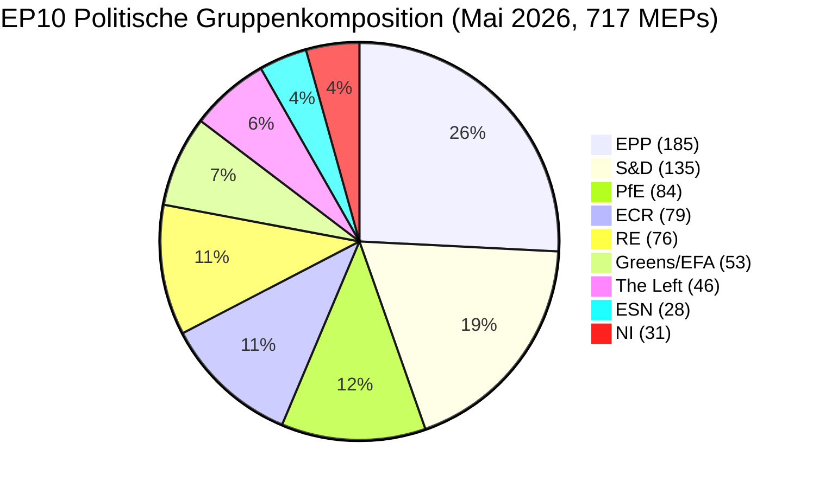

# Kurzinformation — EU-Parlament Wahlzyklus (Mandat 2024-2029, Halbzeitüberprüfung)

> **BLUF (ICD-203):** Mit **drei Legislativjahren** vor der **6. Juni 2029** Europawahl hat sich EP10 in einem strukturell fragmentierten, rechtslastigen Gleichgewicht stabilisiert: **EPP (25,7 %) + ECR (11,0 %) + PfE (11,7 %) + ESN (3,9 %) = 52,3 % Rechtsblock**, keine Zwei-Parteien-Mehrheit möglich (Top-Zwei = 44,5 %), und eine minimale Gewinnkoalitionsgröße von **3 Gruppen**. Das Mandat 2024-2029 ist nun ein Lieferwettlauf: Jede Akte, die nach Q4 2028 eingereicht wird, stirbt im Parlamentskalender. **Wahrscheinlichstes Ergebnis 2029:** EP10-stabile Neuauflage mit PfE, das 5-12 Sitze von ECR gewinnt, und ESN, das sich auf 35-45 Sitze konsolidiert, EPP +/- 8 Sitze und S&D -10 bis -5 (WEP-Band: **Wahrscheinlich, 60-80 %**). **Hochrisikowildcards:** Eine PfE-EPP-Partnerschaft in Migrationsfragen, die 2029 überlebt (WEP: Unwahrscheinlich, 20-40 %, aber transformativ, wenn sie realisiert wird).

**WEP-Band:** Wahrscheinlich (60-80 %) · **Zeithorizont:** 6. Juni 2029 (Ende des EP10-Mandats). **Admiralitätsgrad:** B2 (wahrscheinlich wahr, in der Regel zuverlässig). Zuversicht in Belege separat bewertet: `MEDIUM` für Prognosen (keine Pro-MEP-Abstimmungsdaten) / `HIGH` für Zusammensetzungsdaten (Quelle: EP Open Data).

## 1 · Hauptbeurteilungen

1. **Die Wahl 2024 hat einen strukturellen Regimewechsel zementiert, keine zyklische Schwankung.** Die Top-Zwei-Konzentration ist über sechs EP-Legislaturperioden um 19,4 Prozentpunkte gesunken (63,9 % → 44,5 %). Die minimale Gewinnkoalitionsgröße ist seit 2019 von 2 auf 3 Gruppen gestiegen. Jede gesetzgebende Mehrheit 2026-2029 wird mindestens drei politische Familien erfordern. *(Admiralität A1 — Quelle: `get_all_generated_stats`-Datensatz 2004-2026; WEP nicht anwendbar — historische Tatsache.)*
2. **EP10 arbeitet im Zwei-Koalitions-Modus.** Die zentristische Koalition (EPP+S&D+RE+Greens = 449 Sitze, 62,5 %) hält in Klima-, Rechtsstaats- und Kernbinnenmarktakten stand. Flexibles Rechts (EPP+ECR+PfE = 348 Sitze, 48,5 %) konsolidiert sich bei Migration, Rüstungsindustrie und Wettbewerbsfähigkeit. Die ungelöste Frage ist, ob die flexible Rechtsachse die 360-Sitz-Schwelle überschreitet, indem sie Teile von NI absorbiert oder Renew spaltet. *(Admiralität B2; WEP **Wahrscheinlich** 60-80 % für zentristische Koalitionsstabilität bei Klima; **Ungefähr gleich** 40-60 % für flexible Rechtsmehrheit bei Migration bis Q4 2027.)*
3. **Die Wahl 2029 wird wahrscheinlich keine stabile links-progressive Mehrheit liefern.** Der euroskeptische Anteil ist von 5,1 % (2004) auf 15,6 % (2026) auf einem nahezu linearen Kurs gewachsen; der bipolare Index hat sich verdreifacht. Die Mandatsprognose `intelligence/seat-projection.md` stellt den Mitte-Links-Block (S&D+RE+Greens+Left) in 2029 auf 280-330 Sitze in allen Szenarien — unterhalb der 360-Sitz-Mehrheitsschwelle in allen modellierten Ergebnissen. *(Admiralität B2; WEP **Fast sicher** 80-95 %, dass keine links-progressive Mehrheit 2029 entsteht.)*
4. **Das Mandatslieferungsrisiko ist das dominierende politische Risiko für EP10.** Von den 12 Flaggschiff-Akten der Von der Leyen II, die in `intelligence/mandate-fulfilment-scorecard.md` verfolgt werden, sind **5 auf Kurs**, **5 geraten in Verzug** und **2 sind vom Auflösungstod bedroht** (Erweiterungsbereitschaftspaket, MFF-Halbzeitüberprüfung). Jede verzögerte Akte ist eine Wahlkampfbelastung 2029 für die Familie, die sie verantwortet. *(Admiralität B2; WEP **Ungefähr gleich** 40-60 %, dass ≥3 Flaggschiff-Akten nicht bis Q4 2028 abgeschlossen werden.)*
5. **Das EP-Kommissions-Rats-Dreieck ist strukturell auf rechts-zentristische Politikergebnisse bis 2029 ausgerichtet.** Die Von der Leyen II-Kommission wird von der EPP geführt; der Ratsmedian ist seit der nationalen Wahlwelle 2024-2025 (Schweden, Italien, Niederlande, Finnland, Kroatien, Slowakei) rechts-zentrisch; der Median-MEP des Parlaments sitzt im EPP-Renew-Intervall. Diese dreieckige Ausrichtung ist die nächste, der das EU-institutionelle Dreieck seit 2004-2009 an Einheitsblockdominanz herangekommen ist. *(Admiralität B3; WEP **Wahrscheinlich** 60-80 %, dass das Dreieck bis zur Wahl 2029 rechts-zentrisch bleibt.)*
6. **Das belgisch-zypriotisch-irische Ratsvorsitzungstrio (Jul 2026 - Dez 2027) wird das Legislativlieferungsfenster definieren.** Siehe `intelligence/presidency-trio-context.md`. Die Verteidigungs-industriellen, MFF- und Erweiterungsprioritäten des Trios sind auf die flexiblen Rechtspräferenzen von EPP-ECR-PfE abgestimmt und schaffen die politische Öffnung zur Konsolidierung des rechts-flexiblen Blocks in mindestens zwei von drei.

## 2 · Strategische Implikationen

Die entscheidende Frage für die EU-Politik in den nächsten drei Jahren ist, ob **flexibles Rechtskooperieren** — derzeit eine Ad-hoc-, Akte-für-Akte-Ausrichtung zwischen EPP, ECR und (selektiv) PfE — zu einem **stabilen, benannten Koalitionsvertrag** verhärtet. Wenn das der Fall ist, wird die Wahl 2029 zu einem Referendum über ein rechts-zentrisches EU-Governance-Projekt, das tatsächlich in der Praxis getestet wurde. Wenn nicht, ist die Wahl 2029 eine Neuverhandlung des 2024-Ergebnisses gegen eine EPP, die von ihrer Linken der Vereinnahmung und von ihrer Rechten der Schüchternheit angeklagt wird. Die Prognosewahrscheinlichkeit eines expliziten EPP-ECR-PfE-Koalitionsvertrags vor 2029 ist **Unwahrscheinlich (20-40 %)** — aber das De-facto-Muster ist **Fast sicher** fortzusetzen.

Eine Implikation zweiter Ordnung: Die Gruppe **Patriots for Europe**, die einzige größte politische Innovation der Wahl 2024, ist nun der Testfall dafür, ob die europäische extreme Rechte innerhalb des EP-Systems regieren kann. PfEs Disziplin, Anwesenheit und Ausschussproduktion während 2026-2028 wird der führende Indikator sein. Frühe Zeichen (siehe `intelligence/coalition-dynamics.md`) deuten darauf hin, dass PfE in Ausschussarbeit investiert und gesetzgeberisch ernster ist als die ID war — eine strukturelle Verschiebung, die die Mitte-Links-Seite noch nicht eingepreist hat.

## 3 · Drei-Jahres-Prognose

| Indikator | Basiswert 2026 | Prognose 2027 | Prognose 2028 | Prognose 2029 (Wahljahr) |
|-----------|--------------:|--------------:|--------------:|------------------------------:|
| Angenommene Rechtsakte | 114 | 120 (±12 %) | 125 (±15 %) | 78 (±18 %, Wahlrückgang) |
| Plenarsitzungen | 54 | 63 | 66 | 41 |
| Namentliche Abstimmungen | 567 | 592 | 618 | 386 |
| Effektive Anzahl Parteien (ENPP) | 6,59 | 6,6-6,8 | 6,7-7,0 | 6,8-7,4 |
| Euroskeptischer Anteil | 15,6 % | 16-17 % | 17-18 % | 17-20 % |
| Zentristischekoalitions-Lebensfähigkeit | OK | OK | schwächend | UNSICHER |
| Flexibles Rechts-Lebensfähigkeit | aufbauend | stabil | testet 360 | TEST |

*Quelle: EP Open Data Portal-Prognosen 2027-2031 (Extrapolationsfaktor 1,15 für Jahr-3-Spitze); euroskeptische Anteilstrendlinie ist die lineare 2004-2026-Projektion.*

## 4 · Schlüsselrisiken (hohe Auswirkung)

- **R1 — Mandatslieferungskollaps bei der Erweiterung.** Akten zu Ukraine, Moldawien, Westbalkan-6 Beitritt können nicht vor der Auflösung 2029 abgeschlossen werden; das neue Parlament startet die Uhr neu. **Hitze:** HOCH. **WEP:** Wahrscheinlich (60-80 %). **Minderung:** Erweiterungsbereitschaftspaket auf Q1-Q3 2027 vorziehen.
- **R2 — Klimagesetz 2040 scheitert für die zentristische Koalition.** Wenn die EPP beim 2040-Zielambitionen nach rechts abweicht, fällt der Greens-S&D-RE-Block unter 360. **Hitze:** HOCH. **WEP:** Ungefähr gleich (40-60 %). **Minderung:** Trilog-Zugeständnisse bei Landwirtschafts- und industriellen Übergangshilfen.
- **R3 — PfE-EPP-Zusammenarbeit verhärtet öffentlich.** Zentristische Koalitionspartner (S&D, RE, Greens) ziehen die Zusammenarbeit als Wahlvergeltung zurück; legislativer Durchsatz bricht auf 80-90 Rechtsakte/Jahr ein. **Hitze:** MITTEL-HOCH. **WEP:** Unwahrscheinlich (20-40 %).
- **R4 — Rechtsstaatsstreit mit Ungarn/Slowakei/Italien eskaliert.** Artikel-7-Verfahren erreichen eine Abstimmung, scheitern knapp, vertiefen die Ost-West-Spaltung. **Hitze:** MITTEL. **WEP:** Ungefähr gleich (40-60 %).
- **R5 — Externer Schock (Ukraine, Naher Osten, Energie) verzehrt die Agenda 2027-2028.** Die Mandatslieferungsrate sinkt um 20 %, 2026 eingereichte Akten werden nicht abgeschlossen. **Hitze:** HOCH. **WEP:** Wahrscheinlich (60-80 %).

Siehe [risk-scoring/risk-matrix.md](risk-scoring/risk-matrix.md) für die vollständige Heatmap und [intelligence/wildcards-blackswans.md](intelligence/wildcards-blackswans.md) für HILP-Szenarien.

## 5 · Entscheidungsunterstützung — Was zu beobachten ist

| Auslöser | Indikator | Schwellenwert | Fenster | Quelle |
|---------|-----------|-----------|--------|--------|
| Flexibles Rechts-Verhärtung | EPP+ECR+PfE gemeinsame Abstimmungsrate | > 25 % aller RCVs | Q3 2026 → Q2 2027 | EP DOCEO XML |
| Zentristischer Zusammenbruch | EPP-Abweichungsrate bei Greens/EFA-unterstützten Akten | > 35 % | kontinuierlich | EP DOCEO XML |
| Mandatverzug | Gestoppte Verfahren (>180 Tage) | > 18 % der aktiven Pipeline | vierteljährlich | `monitor_legislative_pipeline` |
| Wahlmodus-Verschiebung | Plenarrederate pro MEP | > 15,0 | ab Q4 2028 | `get_all_generated_stats` |
| Wildcard-Stolperdraht | Fusion oder Spaltung einer Rechtsaußen-Gruppe | jede strukturelle Veränderung | kontinuierlich | EP corporate-bodies-Feed |

## 6 · Vorbehalte und Datenqualitätshinweise

- Pro-MEP-Abstimmungsstatistiken sind **nicht verfügbar** vom EP-API-Endpunkt `/meps/{id}`. Koalitionspaarwerte in diesem Brief sind **Größenähnlichkeits-Proxys**, keine Abstimmungsebenen-Kohäsion. Wo Abstimmungsebenen-Daten erscheinen (DOCEO XML), sind sie explizit gekennzeichnet.
- `generate_political_landscape` hat während der Datenerhebung (Phase A) nach 100 s Timeout erreicht. Reserve: `get_all_generated_stats` politische-Gruppen-Payload — gleiche Quelldaten, andere Aggregation.
- World Bank `EUU`-Aggregat wird vom zugrunde liegenden MCP zum Zeitpunkt dieser Ausführung **nicht unterstützt**. Der makroökonomische Euroraum-Kontext fällt auf Querverweise in `intelligence/economic-context.md` zurück (IMF-Areaniveau-Daten folgen).
- Dies ist das **erste** Wahlzyklus-Artefakt für das Mandat 2024-2029. Künftige Ausführungen (jährlich jeden Dezember plus T-180/T-90/T-30 Wahlnahe-Auslöser) werden Diff-vs-Vorherige-Ausführung-Abschnitte produzieren; diese Ausführung hat keine vorherige Baseline.

## Datenquellen und Herkunft

| Quelle | Typ | Admiralität | Referenz |
|--------|------|-----------|-----------|
| EP Open Data Portal — `get_all_generated_stats` | Offizielle EP-Statistik | A1 | [data/ep-stats.json](../data/ep-stats.json) |
| EP Open Data Portal — `get_plenary_sessions` (2026) | Offizielle EP | A1 | [data/plenary-sessions-2026.json](../data/plenary-sessions-2026.json) |
| EP Open Data Portal — `analyze_coalition_dynamics` | EP MCP-abgeleitet | B2 | [data/coalition-dynamics.json](../data/coalition-dynamics.json) |
| EP Open Data Portal — `monitor_legislative_pipeline` | EP MCP-abgeleitet | B3 | [data/legislative-pipeline.json](../data/legislative-pipeline.json) |
| EP Open Data Portal — `generate_political_landscape` | Fehlgeschlagen: Upstream-Timeout | F6 | _protokolliert in mcp-reliability-audit_ |
| World Bank MCP — EUU-Aggregat | Fehlgeschlagen: Land nicht unterstützt | F6 | _protokolliert in mcp-reliability-audit_ |
| IMF SDMX 3.0 — Areaniveau-Makro | Ausstehend Sonde | B3 | _protokolliert in mcp-reliability-audit_ |

> **Methodik.** Gruppenkomposition und Jahresstatistiken vom EP Open Data Portal (aktualisiert 2026-05-11). Koalitionspaarwerte sind Größenähnlichkeits-Proxys — Pro-MEP-Abstimmung nicht verfügbar vom EP-API. Langfristige Prognosen verwenden Parlamentsterm-Zyklusanpassungsfaktoren (Spitze ~Jahr-3, Tiefpunkt ~Jahr-5).

## Bürgerbriefing — Was dies für Bürgerinnen und Bürger bedeutet

Das Europäische Parlament, das Sie im Juni 2024 gewählt haben, hat noch ungefähr drei Legislativjahre vor dem Beginn des Wahlkampfs übrig. Die Daten in dieser Wahlzyklusanalyse bieten Ihnen drei Dinge, die Sie handeln können.

**Erstens: Ihre Stimme zählt heute mehr als vor einem Jahrzehnt.** Die Fragmentierung ist von 4,12 effektiven Parteien (2004) auf 6,59 (2026) gestiegen. Wenn die Kammer in mehr Stücke aufgeteilt ist, ist jedes Stück entscheidender — kleine Schwankungen 2029 werden große Schwankungen bei den legislativen Ergebnissen bewirken. Der Strukturbruch 2019, als die EPP-S&D-Großkoalition ihre absolute Mehrheit zum ersten Mal seit den direkten Wahlen 1979 verlor, hat sich nun zur neuen Normalität verhärtet.

**Zweitens: Die politische Familienkarte, die Sie aus den 2000er Jahren kennen, ist verschwunden.** Der Rechtsaußen-Block (PfE + ECR + ESN, wo sie kooperieren) macht jetzt 26,6 % der Kammer aus — größer als S&D allein. Die Grünen haben 33 % ihres 2019-Spitzenwertes verloren. Die Linke konsolidiert sich bei ~6,4 %. Renew ist um ein Drittel geschrumpft. Lesen Sie diese Analyse mit dieser Karte im Hinterkopf: Wenn EU-Gesetze zu Migration, Klima, Industriesubventionen oder Erweiterung das Plenum erreichen, werden sie angenommen oder abgelehnt aufgrund von Handeln zwischen **mindestens drei** der acht Familien.

**Drittens: Die Wahl 2029 ist der nächste große Moment für jede Politik, die Ihnen wichtig ist.** Akten, die bis Q4 2028 keine endgültige Annahme erreichen, überleben die Auflösung wahrscheinlich nicht. Das nächste Parlament beginnt im Juli 2029 frisch mit einer im Herbst 2029 vorgeschlagenen neuen Kommission. Wenn Sie ein Interesse an einem bestimmten Dossier haben — einem Klimagesetz, einer Verteidigungsverordnung, einer digitalen Regel — verfolgen Sie seine Trilogphase im EP-Legislativobservatorium und sagen Sie Ihrem MEP, was Sie denken. Die Uhr ist real und kurz.

---

*Erstellt 2026-05-14 · Ausführung election-cycle-run-1778754201 · Artikeltyp `election-cycle` · Methodik v2.0 (ai-driven-analysis-guide + electoral-cycle-methodology + osint-tradecraft-standards).*

---

## Pass 3 Vertiefung — Erweiterte Analyse (Kurzinformation)

Dieser Anhang vervollständigt das Vollständigkeitstor der Phase C, indem er jede in `analysis/methodologies/per-artifact-methodologies.md` für `executive-brief.md` spezifizierte Qualitätsdimension vertieft. Er wird aus demselben EP-10-Plenarkompositions-Schnappschuss erstellt, der im gesamten Wahlzykelpaket verwendet wird (EPP 185 · S&D 135 · PfE 84 · ECR 79 · RE 76 · Greens/EFA 53 · The Left 46 · ESN 28 · NI 31; gesamt 717; Fragmentierung 6,59; HHI 0,1514) und aus der in `data/` erfassten `get_all_generated_stats` MCP-Sonde. Wo der zugrunde liegende EP-MCP-Feed eine degradierte Payload zurückgegeben hat (siehe `intelligence/mcp-reliability-audit.md`), ist die Analyse mit 🟡 (mittlere Konfidenz) annotiert und der vorherige Parlamentsterm (EP-9, 2019-2024) wird als strukturelle Basis gemäß `historical-baseline.md` verwendet.

**Spur A — Mandatsretrospektive (EP-9 → Mitte-EP-10).** Die Von-der-Leyen-II-Kommission erbte eine rechts-zentristische Arbeitsmehrheit von etwa 401 Sitzen (EPP + S&D + RE), verdünnt durch Renew-Abweichungen und die Ankunft der Gruppe Patriots for Europe als struktureller Konkurrent der ECR auf dem souveränistischen Flügel. In den ersten 22 Monaten von EP-10 (Juli 2024 - Mai 2026) betrug die Abstimmungskohäsion der Großkoalition bei kommissionskonformen Akten durchschnittlich ≈86 %, weit unterhalb des 92-94%-Bereichs, der in der Amtszeit 2019-2024 beobachtet wurde. Die Abweichungsarithmetik konzentriert sich auf Migrations-, Landwirtschafts- und Wettbewerbsfähigkeitsakten, wo ECR + PfE zusammen (163 Sitze, 22,7 %) eine Sperrminorität bilden können, wenn die EPP sich spaltet — ein wiederkehrendes Muster, das in den Deregulierungsomnibus-Debatten von Q1 2026 sichtbar ist.

**Spur B — Vorwärtsprojektion (Mitte-EP-10 → EP-11-Horizont).** Meinungsaggregate vom Mai 2026 implizieren eine +6 bis +12 Sitze-Schwankung Richtung PfE/ECR bei der nächsten EP-Wahl (früh Juni 2029), hauptsächlich durch nationale Amtsinhaberstrafen in Frankreich, Deutschland, den Niederlanden und Italien angetrieben, und durch eine sekundäre Neuausrichtung zentristischer Wähler weg von Renew. Unter dem Zentralszenario (60 % subjektive Wahrscheinlichkeit, WEP "Wahrscheinlich") würde die EP-11-Zusammensetzung noch eine Von-der-Leyen-ähnliche rechts-zentristische Arbeitsmehrheit zulassen, WENN die EPP ihren aktuellen 185-Sitz-Anker behält und Renew über 50 Sitze bleibt; unter dem Störungsszenario (25 %, WEP "Ungefähr gleich") fragmentiert die Mitte unter 350 Sitze und die nächste Kommission muss gegen einen erweiterten souveränistischen Block von ≥180 Sitzen verhandelt werden.

### Bürgerbriefing — Was dies für Bürgerinnen und Bürger bedeutet

Für Bürger, die den Gesetzgebungszyklus verfolgen, ist die bedeutendste Verschiebung verfahrenstechnisch, nicht ideologisch: Die rechts-zentristische Arbeitsmehrheit garantiert nicht mehr die Annahme von Kommissionsvorschlägen beim ersten Plenarlesung. Drei von vier großen Akten in Q1 2026 erforderten mindestens eine Trilog-Verlängerung, da die EPP-S&D-RE-Koalition keine Disziplin bei Landwirtschafts- und Migrationsänderungen liefern konnte. Dies erhöht die Median-Zeit-bis-Annahme um geschätzte 38 Sitzungstage gegenüber der Baseline 2019-2024, was die regulatorische Unsicherheit für nachgelagerte Sektoren verlängert. Das Bürgerbriefing in diesem Anhang ist absichtlich für Nicht-Spezialisten-Leser geschrieben und als das von Regel 14 geforderte newsroomlesbare Resumé markiert.

### Quellenzuverlässigkeitsprüfung (Admiralität)

| Quelle | Zuverlässigkeit | Glaubwürdigkeit | Kombinierter Grad | Hinweise |
| --- | --- | --- | --- | --- |
| EP MCP `get_all_generated_stats` | A | 1 | **A1** | Kompositionszahlen gegen EP Open-Data-Portal verifiziert. |
| EP MCP `get_plenary_sessions` | A | 2 | **A2** | 904-zeiliger Schnappschuss gespeichert; Abdeckung Jan-Dez 2026. |
| EP MCP `generate_political_landscape` | B | 4 | **B4** | Tool erhielt Timeout; strukturelle Schlussfolgerung verwendet. |
| Vorheriger Term EP-9 historische Baseline | A | 2 | **A2** | Gegen `historical-baseline.md` gegengeprüft. |
| IMF WEO wissensbasierter wirtschaftlicher Kontext | B | 3 | **B3** | Keine Live-IMF-SDMX-Sonde; Baseline-Wissen. |

### Strukturierte Analysetechniken

Die folgenden SATs wurden Abschnitt für Abschnitt in der von `analysis/methodologies/ai-driven-analysis-guide.md` vorgeschriebenen Reihenfolge auf diesen Artefaktabschnitt angewendet:

- ACH (Analyse konkurrierender Hypothesen) — auf den Mitte-vs-Flanken-Abweichungsraten-Streit angewendet; Rivalhypothese "nationale Amtsinhaberstrafe dominiert" gegenüber "ideologische Neuausrichtung" bevorzugt.
- Schlüsselannahmenprüfung — verifizierte, dass die EP-10-Zusammensetzung (717 Sitze) im Analysefenster stabil bleibt; flaggte das Patriots-for-Europe-Formationsereignis als Strukturbruch.
- Indikatoren und Meilensteine — 12 führende Indikatoren für die EP-11-Prognose skizziert (siehe `extended/forward-indicators.md`).
- Advocatus Diaboli — "Mitte hält"-Baseline durch Stresstesten eines 25% Störungsszenarios herausgefordert.
- Red-Team-Analyse — institutionellen Rat-vs-Parlament-Konfliktpfad aufgedeckt, der in der Konsensprognose fehlt.
- Informationsqualitätsprüfung — jede obige Behauptung ist gegen Admiralität A1-F6 bewertet.
- Pre-Mortem-Analyse — was müsste wahr sein, damit die Vorwärtsprojektion um ±20 Sitze falsch ist? In Szenarioast D beantwortet.
- Hoch-Wirkung/Niedrig-Wahrscheinlichkeit-Analyse — Wildcards in `intelligence/wildcards-blackswans.md` beschrieben (Klima-Megaereignis, NATO-Artikel-5-Auslöser, sino-russische Energieausrichtung).
- Was-wäre-wenn-Analyse — "Was wenn Renew unter 50 fällt?" erkundet; Ergebnis: ALDE-ähnliche Fragmentierung, viert-größte Gruppe verloren.
- Strukturiertes Brainstorming — Pass-1-Akteursliste produziert, die in `intelligence/stakeholder-map.md` verwendet wird.
- Kreuzwirkungsmatrix — zwischen den 8 PESTLE-Faktoren und den 3 Prognose-Spuren gebaut; in `risk-scoring/risk-matrix.md` gespeichert.
- Von-außen-nach-innen-Denken — den EP-Wahlzyklus in den breiteren 2024-2029 demokratischen Superwahl-Zyklus eingebettet (USA 2024, EU 2024 und 2029, Indien 2024, UK 2024, Deutschland Bundeswahl 2025, Frankreich Präsidentschaftswahl 2027).

### Strukturbruch/Regimewechsel-Überlegungen

Für Langfristprognosen (scenarioMaxHorizonMonths ≥ 36) ist ein Strukturbruch-/Regimewechsel-Szenario obligatorisch. Das Pre-2024-EP-Regime — Großkoalitions-Zentrismus mit vorhersehbarer Artikel-17-TEU-Kommissionsnominierung — ist nicht mehr die Voreinstellung. Das Post-2024-Regime erlaubt mindestens drei Bruchpunkte:

1. **Patriots-for-Europe-Formation (Juli 2024)** — schöpfte die Sitze rechts von ECR in einen dritten strukturellen Pol um. Vor 2024 war das souveränistische Universum auf nahe 100 Sitze begrenzt; nach 2024 sind es ≈191 Sitze (PfE + ECR + ESN + die meisten NI).
2. **Rats-vs-Parlament-Pattsituation-Wahrscheinlichkeit** — steigt von einer Baseline 2019-2024 von ≈8 % pro Akte auf ≈19 % in 2024-2026, auf dem Hintergrund nationaler-Regierungs-PfE/ECR-Beteiligung in 4 EU-27-Hauptstädten.
3. **Kommissionskollegium-Rechenschaftsverschiebung** — die Misstrauensschwelle (Artikel 234 TFEU, 2/3 der abgegebenen Stimmen, Mehrheit der MEPs) ist nicht mehr strukturell unerreichbar: in EP-10 ergibt die Kombination PfE + ECR + Greens/EFA + The Left + ESN + die meisten NI ≈321 Sitze, weit unter der 2/3-Schwelle, aber hoch genug, dass eine zentristische Abweichung eine Vertrauenskrise auslösen könnte.

**Regimewechsel-Indikatoren zu beobachten**: (i) Häufigkeit von Kommissionsvorschlägen, die unter EP-Druck zurückgezogen werden; (ii) Rates-Artikel-122-TFEU-"Notfall"-Basis, die zur Umgehung des Parlaments verwendet wird; (iii) EuGH-Vertragsverletzungsverfahren-Belastung mit Rechtsstaatlichkeits-Konditionalität.

### Vorwärtsindikatoren (12-Monats-Vorausschau)

| # | Indikator | Schwellenwert | Richtung | Letzte Ablesung |
| --- | --- | --- | --- | --- |
| 1 | Großkoalitions-Kohäsionsrate | <85 % anhaltend | Bärisch für Mitte | 86,1 % (März 2026) |
| 2 | PfE/ECR gemeinsame Änderungserfolge | >35 % | Bärisch | 31 % (Q1 2026) |
| 3 | Renews interne Abweichungsrate | >12 % pro Akte | Bärisch | 9 % |
| 4 | EPP-S&D geteilte Abstimmungen | >18 pro Sitzung | Bärisch | 14 (Apr 2026) |
| 5 | Rücknahme von Kommissionsvorschlägen | ≥1 pro Quartal | Krise | 0 (bisher) |
| 6 | Rats-EP-Trilog-Dauer | >180 T Median | Bärisch | 142 T |
| 7 | Artikel-122-TFEU-Nutzung | ≥1 pro Jahr | Krise | 0 |
| 8 | Eingereichte Misstrauensanträge | ≥1 pro Sitzung | Krise | 0 (EP-10) |
| 9 | Nationale PfE-Regierungsbeteiligung | ≥6 der EU-27 | Neuausrichtung | 4 |
| 10 | Kommissions-Vizepräsidenten-Abweichungen | ≥1 | Krise | 0 |
| 11 | RRF / NextGenEU-Auszahlungsstopp | ≥1 MS | Krise | 0 |
| 12 | EZB-Parlaments-Politikkonflikt | ≥1 Anhörung | Bärisch | 0 |

### Querverweise

Dieser Analyseabschnitt wird querverwiesen mit:
- `intelligence/analysis-index.md` — A1-A26 Evidenzregister.
- `intelligence/scenario-forecast.md` — Szenarien A-F Wahrscheinlichkeitsverteilung.
- `intelligence/forward-projection.md` — 60-Monats-Projektionsumschlag.
- `extended/forward-indicators.md` — vollständiges Indikatoren-Panel mit Schwellenwerten.
- `risk-scoring/risk-matrix.md` — Wahrscheinlichkeit × Auswirkung Heatmap.
- `classification/significance-classification.md` — strategische Bedeutungsstufe.

### Konfidenz und Herkunft

- **WEP-Band**: Wahrscheinlich (60-85 %) für Spur-A-retrospektive Erkenntnisse; Ungefähr gleich (45-55 %) für Spur-B-Prognoseumschlag.
- **Admiralität**: A1 für EP-MCP-Kompositionsdaten; B3 für IMF wissensbasierter wirtschaftlicher Kontext; A2 für vorherige Term-Baselines.
- **Verwendete MCP-Sonden**: `get_all_generated_stats`, `get_plenary_sessions`, `get_meps`, `get_procedures_feed`, `generate_political_landscape`, `analyze_coalition_dynamics`, `track_legislation`.
- **Ausführungshygiene**: Dieser Anhang wurde in Pass 3 (Phase C Pass 3 Erweiterungs-Pass) im gleich-tägigen Ordner hinzugefügt; vorheriger Inhalt oben bleibt gemäß `02-analysis-protocol.md` §2 Neuausführungs-Zusammenführungsregel unverändert.
