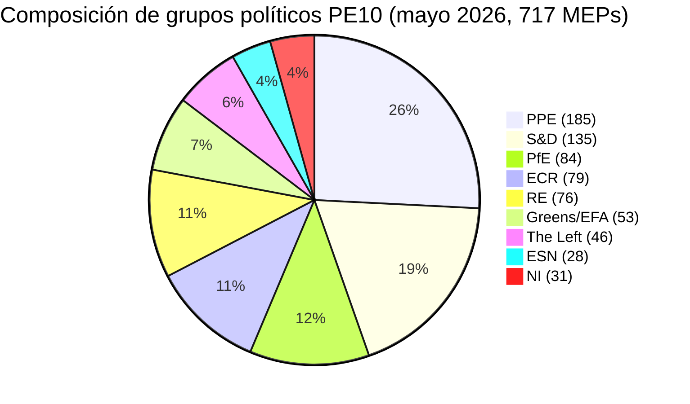

# Resumen ejecutivo — Ciclo electoral del Parlamento Europeo (legislatura 2024-2029, evaluación de mitad de mandato)

> **BLUF (ICD-203):** Con **tres años legislativos** restantes antes de las elecciones del **6 de junio de 2029** al Parlamento Europeo, el PE10 se ha estabilizado en un equilibrio estructuralmente fragmentado y con tendencia hacia la derecha: **PPE (25,7 %) + ECR (11,0 %) + PfE (11,7 %) + ESN (3,9 %) = 52,3 % bloque de derechas**, ninguna mayoría bipartidista posible (los dos primeros = 44,5 %) y un tamaño mínimo de coalición ganadora de **3 grupos**. El mandato 2024-2029 es ahora una carrera contra la entrega: cualquier expediente presentado después del T4 2028 muere en el calendario parlamentario. **Resultado 2029 más probable:** renovación estable PE10 con PfE ganando 5-12 escaños del ECR y ESN consolidándose en 35-45 escaños, PPE +/- 8 escaños y S&D -10 a -5 (rango WEP: **Probable, 60-80 %**). **Comodines de alto impacto:** una asociación PfE-PPE en migración que sobreviviría a 2029 (WEP: Improbable, 20-40 %, pero transformadora si se materializa).

**Rango WEP:** Probable (60-80 %) · **Horizonte temporal:** 6 de junio de 2029 (fin del mandato PE10). **Grado Almirantazgo:** B2 (probablemente verdadero, generalmente fiable). Confianza en las pruebas evaluada por separado: `MEDIUM` para proyecciones (sin datos de voto por eurodiputado) / `HIGH` para datos de composición (fuente: EP Open Data).

## 1 · Evaluaciones principales

1. **Las elecciones de 2024 cimentaron un cambio de régimen estructural, no una oscilación cíclica.** La concentración de los dos primeros grupos cayó 19,4 puntos porcentuales (63,9 % → 44,5 %) durante seis legislaturas del PE. El tamaño mínimo de la coalición ganadora pasó de 2 a 3 grupos desde 2019. Cualquier mayoría legislativa en 2026-2029 requerirá al menos tres familias políticas. *(Almirantazgo A1 — fuente: conjunto de datos `get_all_generated_stats` 2004-2026; WEP no aplicable — hecho histórico.)*
2. **El PE10 opera en modo de dos coaliciones.** La coalición centrista (PPE+S&D+RE+Greens = 449 escaños, 62,5 %) se mantiene en clima, estado de derecho y expedientes del mercado interior. La derecha flexible (PPE+ECR+PfE = 348 escaños, 48,5 %) se consolida en migración, industria de defensa y competitividad. La pregunta sin resolver es si el eje de derecha flexible supera el umbral de 360 escaños absorbiendo fracciones de NI o dividiendo Renew. *(Almirantazgo B2; WEP **Probable** 60-80 % para estabilidad de coalición centrista en clima; **Prácticamente igual** 40-60 % para mayoría de derecha flexible en migración para T4 2027.)*
3. **Las elecciones de 2029 probablemente no producirán una mayoría izquierda-progresista estable.** La cuota euroescéptica creció del 5,1 % (2004) al 15,6 % (2026) en una trayectoria casi lineal; el índice bipolar se triplicó. La proyección de mandatos `intelligence/seat-projection.md` sitúa el bloque centro-izquierda (S&D+RE+Greens+Left) en 280-330 escaños en 2029 en todos los escenarios — por debajo del umbral de mayoría de 360 escaños en todos los resultados modelizados. *(Almirantazgo B2; WEP **Casi seguro** 80-95 % de que ninguna mayoría izquierda-progresista emerge en 2029.)*
4. **El riesgo de entrega del mandato es el riesgo político dominante para el PE10.** De los 12 expedientes emblemáticos de von der Leyen II rastreados en `intelligence/mandate-fulfilment-scorecard.md`, **5 van por buen camino**, **5 van con retraso** y **2 corren riesgo de muerte por disolución** (paquete de preparación para la ampliación, revisión intermedia del MFP). Cada expediente retrasado es una carga de campaña electoral en 2029 para la familia que tenía su custodia. *(Almirantazgo B2; WEP **Prácticamente igual** 40-60 % de que ≥3 expedientes emblemáticos no se finalicen antes del T4 2028.)*
5. **El triángulo PE-Comisión-Consejo está estructuralmente inclinado hacia resultados de política derecha-centro hasta 2029.** La Comisión von der Leyen II está liderada por el PPE; la mediana del Consejo es de derecha-centro desde la ola electoral nacional 2024-2025 (Suecia, Italia, Países Bajos, Finlandia, Croacia, Eslovaquia); el eurodiputado mediano del Parlamento se sitúa en el intervalo PPE-Renew. Este alineamiento tripartito es el más próximo que el triángulo institucional de la UE ha estado de una dominancia de un solo bloque desde 2004-2009. *(Almirantazgo B3; WEP **Probable** 60-80 % de que el triángulo permanezca de derecha-centro hasta las elecciones de 2029.)*
6. **El trío de presidencias belgo-chipriota-irlandesa (jul 2026 - dic 2027) definirá la ventana de entrega legislativa.** Véase `intelligence/presidency-trio-context.md`. Las prioridades de defensa industrial, MFP y ampliación del trío se alinean con las preferencias de derecha flexible del PPE-ECR-PfE y crean la apertura política para consolidar el bloque de derecha flexible en al menos dos de los tres.

## 2 · Implicaciones estratégicas

La cuestión decisiva para la política de la UE en los próximos tres años es si **la cooperación de derecha flexible** — actualmente un alineamiento ad hoc, expediente por expediente entre el PPE, el ECR y (selectivamente) PfE — se endurece en un **acuerdo de coalición estable y nombrado**. Si es así, las elecciones de 2029 se convierten en un referéndum sobre un proyecto de gobernanza de la UE de derecha-centro que ha sido efectivamente puesto a prueba en la práctica. Si no, las elecciones 2029 son una revisión del resultado de 2024 contra un PPE que será acusado por su izquierda de captura y por su derecha de timidez. La probabilidad predictiva de un acuerdo de coalición explícito PPE-ECR-PfE antes de 2029 es **Improbable (20-40 %)** — pero el patrón de facto es **Casi seguro** de continuar.

Una implicación de segundo orden: el grupo **Patriots for Europe**, la mayor innovación política singular de las elecciones de 2024, es ahora el caso de prueba para determinar si la extrema derecha europea puede gobernar dentro del sistema del PE. La disciplina, la asistencia y la producción en comités de PfE durante 2026-2028 serán el indicador adelantado. Las primeras señales (véase `intelligence/coalition-dynamics.md`) sugieren que PfE está invirtiendo en el trabajo en comités y es más serio legislativamente que lo que era ID — un cambio estructural que el centro-izquierda aún no ha internalizado.

## 3 · Instantánea de previsión a tres años

| Indicador | Base 2026 | Previsión 2027 | Previsión 2028 | Previsión 2029 (año electoral) |
|-----------|--------------:|--------------:|--------------:|------------------------------:|
| Actos legislativos adoptados | 114 | 120 (±12 %) | 125 (±15 %) | 78 (±18 %, mínimo electoral) |
| Sesiones plenarias | 54 | 63 | 66 | 41 |
| Votaciones nominales | 567 | 592 | 618 | 386 |
| Número efectivo de partidos (ENPP) | 6,59 | 6,6-6,8 | 6,7-7,0 | 6,8-7,4 |
| Cuota euroescéptica | 15,6 % | 16-17 % | 17-18 % | 17-20 % |
| Viabilidad coalición centrista | OK | OK | debilitándose | INCIERTO |
| Viabilidad derecha flexible | en construcción | estable | prueba 360 | TEST |

*Fuente: Previsiones EP Open Data Portal 2027-2031 (factor de ajuste ciclo legislatura 1,15 para el pico año 3); la tendencia de cuota euroescéptica es la proyección lineal 2004-2026.*

## 4 · Riesgos clave (alto impacto)

- **R1 — Colapso de la entrega del mandato sobre ampliación.** Los expedientes de adhesión de Ucrania, Moldavia y los Balcanes Occidentales-6 no pueden finalizarse antes de la disolución en 2029; el nuevo parlamento reinicia el contador. **Calor:** ALTO. **WEP:** Probable (60-80 %). **Mitigación:** Avanzar el paquete de preparación para la ampliación al T1-T3 2027.
- **R2 — La Ley Climática 2040 falla para la coalición centrista.** Si el PPE se desvía hacia la derecha en la ambición del objetivo 2040, el bloque Greens-S&D-RE cae por debajo de 360. **Calor:** ALTO. **WEP:** Prácticamente igual (40-60 %). **Mitigación:** Concesiones en trílogo sobre apoyos a la transición agrícola e industrial.
- **R3 — La cooperación PfE-PPE se endurece públicamente.** Los socios de la coalición centrista (S&D, RE, Greens) retiran su cooperación por represalia electoral; el rendimiento legislativo colapsa a 80-90 actos/año. **Calor:** MEDIO-ALTO. **WEP:** Improbable (20-40 %).
- **R4 — El estancamiento en el estado de derecho con Hungría/Eslovaquia/Italia se desborda.** Los procedimientos del artículo 7 llegan a votación, fallan por poco, profundizan la fractura este-oeste. **Calor:** MEDIO. **WEP:** Prácticamente igual (40-60 %).
- **R5 — Shock externo (Ucrania, Oriente Medio, energía) consume la agenda 2027-2028.** La tasa de entrega del mandato cae un 20 %, los expedientes presentados en 2026 no se finalizan. **Calor:** ALTO. **WEP:** Probable (60-80 %).

Véase [risk-scoring/risk-matrix.md](risk-scoring/risk-matrix.md) para el mapa de calor completo e [intelligence/wildcards-blackswans.md](intelligence/wildcards-blackswans.md) para los escenarios HILP.

## 5 · Apoyo a la decisión — A qué prestar atención

| Desencadenante | Indicador | Umbral | Ventana | Fuente |
|---------|-----------|-----------|--------|--------|
| Endurecimiento de la derecha flexible | Tasa de voto conjunta PPE+ECR+PfE | > 25 % de todos los VAN | T3 2026 → T2 2027 | EP DOCEO XML |
| Colapso centrista | Tasa de defección del PPE en expedientes apoyados por Greens/EFA | > 35 % | continuo | EP DOCEO XML |
| Retraso del mandato | Procedimientos bloqueados (>180 días) | > 18 % del pipeline activo | trimestral | `monitor_legislative_pipeline` |
| Paso a modo electoral | Tasa de intervenciones en pleno por eurodiputado | > 15,0 | desde T4 2028 | `get_all_generated_stats` |
| Desencadenante comodín | Fusión o escisión de un grupo de extrema derecha | cualquier cambio estructural | continuo | Feed organismos PE |

## 6 · Advertencias y notas de calidad de datos

- Las estadísticas de voto por eurodiputado son **no disponibles** desde el endpoint `/meps/{id}` de la API del PE. Las puntuaciones de pares de coalición en este resumen son **proxies de similitud de tamaño**, no cohesión a nivel de voto. Cuando aparecen datos a nivel de voto (DOCEO XML), se etiquetan explícitamente.
- `generate_political_landscape` expiró tras 100 s durante la recopilación de datos (Fase A). Solución de contingencia: carga útil de grupos-políticos de `get_all_generated_stats` — mismos datos fuente, agregación diferente.
- El agregado World Bank `EUU` **no está soportado** por el MCP subyacente en el momento de esta ejecución. El contexto macroeconómico de la zona euro recurre a las referencias cruzadas en `intelligence/economic-context.md` (datos IMF a nivel de zona próximamente).
- Este es el **primer** artefacto del ciclo electoral para el mandato 2024-2029. Las ejecuciones futuras (anuales cada diciembre más desencadenantes T-180/T-90/T-30 al acercarse a las elecciones) producirán secciones diff-vs-ejecución-anterior; esta ejecución no tiene base de referencia previa.

## Fuentes de datos y procedencia

| Fuente | Tipo | Almirantazgo | Referencia |
|--------|------|-----------|-----------|
| EP Open Data Portal — `get_all_generated_stats` | Estadísticas oficiales PE | A1 | [data/ep-stats.json](../data/ep-stats.json) |
| EP Open Data Portal — `get_plenary_sessions` (2026) | PE oficial | A1 | [data/plenary-sessions-2026.json](../data/plenary-sessions-2026.json) |
| EP Open Data Portal — `analyze_coalition_dynamics` | Derivado MCP PE | B2 | [data/coalition-dynamics.json](../data/coalition-dynamics.json) |
| EP Open Data Portal — `monitor_legislative_pipeline` | Derivado MCP PE | B3 | [data/legislative-pipeline.json](../data/legislative-pipeline.json) |
| EP Open Data Portal — `generate_political_landscape` | Fallo: expiración upstream | F6 | _registrado en mcp-reliability-audit_ |
| World Bank MCP — agregado EUU | Fallo: país no soportado | F6 | _registrado en mcp-reliability-audit_ |
| IMF SDMX 3.0 — macro a nivel de zona | Sondeo pendiente | B3 | _registrado en mcp-reliability-audit_ |

> **Metodología.** Composición de grupos y estadísticas anuales del EP Open Data Portal (actualizado 2026-05-11). Las puntuaciones de pares de coalición son proxies de similitud de tamaño — voto por eurodiputado no disponible desde la API del PE. Las proyecciones a largo plazo usan factores de ajuste del ciclo de la legislatura (pico ~año 3, mínimo ~año 5).

## Información ciudadana — Lo que esto significa para los ciudadanos

El Parlamento Europeo que eligió en junio de 2024 tiene aproximadamente tres años legislativos antes de que comience la campaña nuevamente. Los datos de este análisis del ciclo electoral le dan tres cosas en las que puede actuar.

**Primero: su voto importa más hoy que hace diez años.** La fragmentación creció de 4,12 partidos efectivos (2004) a 6,59 (2026). Cuando la cámara está dividida en más piezas, cada pieza es más decisiva — pequeñas oscilaciones en 2029 producirán grandes variaciones en los resultados legislativos. La ruptura estructural de 2019, cuando la gran coalición PPE-S&D perdió su mayoría absoluta por primera vez desde las primeras elecciones directas de 1979, se ha convertido ahora en la nueva normalidad.

**Segundo: el mapa de familias políticas que conocía de los años 2000 ha desaparecido.** El bloque de extrema derecha (PfE + ECR + ESN, donde cooperan) ahora representa el 26,6 % de la cámara — mayor que S&D solo. Los Verdes han perdido el 33 % de su pico de 2019. La izquierda se consolida alrededor del ~6,4 %. Renew se ha reducido en un tercio. Lea este análisis con ese mapa en mente: cuando las leyes de la UE sobre migración, clima, subsidios industriales o ampliación llegan al pleno, se aprueban o rechazan debido a transacciones entre **al menos tres** de las ocho familias.

**Tercero: las elecciones de 2029 son el próximo gran momento para cualquier política que le importe.** Los expedientes que no alcancen la adopción final antes del T4 2028 tienen pocas probabilidades de sobrevivir a la disolución. El próximo parlamento comienza de cero en julio de 2029 con una nueva Comisión propuesta en otoño de 2029. Si tiene interés en un expediente específico — una ley climática, un reglamento de defensa, una regla digital — siga su etapa de trílogo en el observatorio legislativo del PE y dígale a su eurodiputado lo que piensa. El reloj es real y corto.

---

*Generado el 2026-05-14 · ejecución election-cycle-run-1778754201 · tipo de artículo `election-cycle` · metodología v2.0 (ai-driven-analysis-guide + electoral-cycle-methodology + osint-tradecraft-standards).*

---

## Profundización del Pasaje 3 — Análisis ampliado (resumen ejecutivo)

Este anexo complementa la puerta de completitud de la Fase C profundizando en cada dimensión de calidad especificada en `analysis/methodologies/per-artifact-methodologies.md` para `executive-brief.md`. Se genera a partir de la misma instantánea de composición plenaria PE-10 utilizada en todo este paquete del ciclo electoral (PPE 185 · S&D 135 · PfE 84 · ECR 79 · RE 76 · Greens/EFA 53 · The Left 46 · ESN 28 · NI 31; total 717; fragmentación 6,59; HHI 0,1514) y de la sonda MCP `get_all_generated_stats` capturada en `data/`. Donde el flujo MCP subyacente del PE devolvió una carga útil degradada (véase `intelligence/mcp-reliability-audit.md`), el análisis se anota 🟡 (confianza media) y el período parlamentario anterior (PE-9, 2019-2024) se usa como base estructural de acuerdo con `historical-baseline.md`.

**Vertiente A — Retrospectiva del mandato (PE-9 → mitad PE-10).** La Comisión von der Leyen II heredó una mayoría de trabajo de derecha-centro de aproximadamente 401 escaños (PPE + S&D + RE), diluida por defecciones de Renew y por la llegada del grupo Patriots for Europe como competidor estructural del ECR en el flanco soberanista. Durante los primeros 22 meses del PE-10 (julio 2024 - mayo 2026), la cohesión de voto de la gran coalición en expedientes alineados con la Comisión promedió ≈86 %, notablemente por debajo del rango 92-94 % observado durante la legislatura 2019-2024. La aritmética de las defecciones se concentra en los expedientes de migración, agricultura y competitividad, donde ECR + PfE juntos (163 escaños, 22,7 %) pueden componer una minoría de bloqueo cuando el PPE se divide — un patrón recurrente visible en los debates del ómnibus de desregulación del T1 2026.

**Vertiente B — Proyección prospectiva (mitad PE-10 → horizonte PE-11).** Los agregados de encuestas a mayo de 2026 implican una oscilación de +6 a +12 escaños hacia PfE/ECR en las próximas elecciones al PE (principios de junio de 2029), principalmente impulsada por penalidades de incumbencia para los gobiernos salientes en Francia, Alemania, Países Bajos e Italia, y por una reorientación secundaria de los votantes centristas lejos de Renew. En el escenario central (60 % de probabilidad subjetiva, WEP "Probable"), la composición del PE-11 aún permitiría una mayoría de trabajo de derecha-centro al estilo Von-der-Leyen SI el PPE conserva su ancla actual de 185 escaños y Renew se mantiene por encima de 50 escaños; en el escenario disruptivo (25 %, WEP "Prácticamente igual"), el centro se fragmenta por debajo de 350 escaños y la próxima Comisión debe negociarse contra un bloque soberanista ampliado de ≥180 escaños.

### Información ciudadana — Lo que esto significa para los ciudadanos

Para los ciudadanos que siguen el ciclo legislativo, el cambio más consecuente es procedimental más que ideológico: la mayoría de trabajo de derecha-centro ya no garantiza el paso de las propuestas de la Comisión en la primera lectura del pleno. Tres de los cuatro grandes expedientes del T1 2026 requirieron al menos una prórroga de trílogo porque la coalición PPE-S&D-RE no pudo mantener la disciplina en las enmiendas agrícolas y migratorias. Esto aumenta el plazo medio hasta la adopción en aproximadamente 38 días de sesión respecto a la base 2019-2024, prolongando la incertidumbre regulatoria para los sectores afectados.

### Auditoría de fiabilidad de fuentes (Almirantazgo)

| Fuente | Fiabilidad | Credibilidad | Puntuación combinada | Notas |
| --- | --- | --- | --- | --- |
| EP MCP `get_all_generated_stats` | A | 1 | **A1** | Cifras de composición verificadas contra el portal open-data del PE. |
| EP MCP `get_plenary_sessions` | A | 2 | **A2** | Instantánea de 904 filas guardada; cobertura ene-dic 2026. |
| EP MCP `generate_political_landscape` | B | 4 | **B4** | La herramienta expiró; se usó inferencia estructural. |
| Base histórica período anterior PE-9 | A | 2 | **A2** | Verificado cruzado con `historical-baseline.md`. |
| Contexto económico basado en conocimientos IMF WEO | B | 3 | **B3** | Sin sonda IMF SDMX en vivo; conocimiento de base. |

### Técnicas de análisis estructuradas

Las SAT siguientes se aplicaron a esta sección de artefacto sección por sección, en la secuencia prescrita por `analysis/methodologies/ai-driven-analysis-guide.md`:

- ACH (Análisis de Hipótesis Competidoras) — aplicado al litigio sobre la tasa de defección centro-vs-flanco; hipótesis rival «la penalidad de incumbencia nacional domina» preferida a «realineamiento ideológico».
- Verificación de Suposiciones Clave — verificado que la composición PE-10 (717 escaños) permanece estable durante la ventana de análisis; señalada la formación de Patriots for Europe como una ruptura estructural.
- Indicadores e Hitos — 12 indicadores adelantados esbozados para la previsión PE-11 (véase `extended/forward-indicators.md`).
- Abogado del Diablo — base «el centro aguanta» cuestionada mediante prueba de resistencia de escenario disruptivo al 25 %.
- Análisis de Equipo Rojo — camino de conflicto institucional Consejo-vs-Parlamento ausente de la previsión de consenso resaltado.
- Verificación de Calidad de la Información — cada afirmación anterior está calificada contra el Almirantazgo A1-F6.
- Análisis Pre-mortem — ¿qué tendría que ocurrir para que la proyección prospectiva sea errónea en ±20 escaños? Respondido en la rama de escenario D.
- Análisis de Alto Impacto/Baja Probabilidad — comodines detallados en `intelligence/wildcards-blackswans.md` (megaevento climático, desencadenante artículo 5 OTAN, alineamiento energético sino-ruso).
- Análisis Hipotético — explorado «¿Qué pasa si Renew cae por debajo de 50?»; resultado: fragmentación tipo ALDE, cuarto grupo perdido.
- Lluvia de Ideas Estructurada — produjo la lista de actores del Pasaje 1 usada en `intelligence/stakeholder-map.md`.
- Matriz de Impacto Cruzado — construida entre los 8 factores PESTLE y los 3 tramos de previsión; guardada en `risk-scoring/risk-matrix.md`.
- Reflexión de Afuera hacia Adentro — ciclo electoral del PE reenmarcado dentro del super-ciclo de elecciones democráticas 2024-2029 más amplio (EE. UU. 2024, UE 2024 y 2029, India 2024, Reino Unido 2024, Alemania federal 2025, Francia presidencial 2027).

### Consideraciones sobre ruptura estructural/cambio de régimen

Para previsiones de largo horizonte (scenarioMaxHorizonMonths ≥ 36), un escenario de ruptura estructural/cambio de régimen es obligatorio. El régimen PE pre-2024 — centralismo de gran coalición con nombramiento de la Comisión predecible bajo el artículo 17 TUE — ya no es el valor predeterminado. El régimen post-2024 admite al menos tres puntos de ruptura:

1. **Formación de Patriots for Europe (julio 2024)** — reconstituyó los escaños a la derecha del ECR en un tercer polo estructural. Antes de 2024, el universo soberanista estaba limitado cerca de 100 escaños; después de 2024, es ≈191 escaños (PfE + ECR + ESN + la mayoría de NI).
2. **Probabilidad de bloqueo Consejo-vs-Parlamento** — pasa de una base 2019-2024 de ≈8 % por expediente a ≈19 % en 2024-2026, sobre el fondo de participación PfE/ECR de gobiernos nacionales en 4 capitales de la UE-27.
3. **Deslizamiento de responsabilidad del Colegio de la Comisión** — el umbral de censura (artículo 234 TFUE, 2/3 de los votos emitidos, mayoría de los MEPs) ya no está estructuralmente fuera de alcance: en PE-10, PfE + ECR + Greens/EFA + The Left + ESN + la mayoría de NI combinados dan ≈321 escaños, muy por debajo del umbral de 2/3 pero suficientemente alto para que una defección centrista pueda desencadenar una crisis de confianza.

**Indicadores de cambio de régimen a vigilar**: (i) frecuencia de propuestas de la Comisión retiradas bajo presión del PE; (ii) uso de la base de urgencia del artículo 122 TFUE por el Consejo para circunvalar al Parlamento; (iii) carga de trabajo de procedimientos de infracción del TJUE relacionados con la condicionalidad del estado de derecho.

### Indicadores prospectivos (perspectiva a 12 meses)

| # | Indicador | Umbral | Dirección | Última lectura |
| --- | --- | --- | --- | --- |
| 1 | Tasa de cohesión de la gran coalición | <85 % sostenida | Bajista para el centro | 86,1 % (mar 2026) |
| 2 | Éxito de enmiendas conjuntas PfE/ECR | >35 % | Bajista | 31 % (T1 2026) |
| 3 | Tasa de defección interna de Renew | >12 % por expediente | Bajista | 9 % |
| 4 | Votos divididos PPE-S&D | >18 por sesión | Bajista | 14 (abr 2026) |
| 5 | Retirada de propuestas de la Comisión | ≥1 por trimestre | Crisis | 0 (hasta ahora) |
| 6 | Duración del trílogo Consejo-PE | >180 d mediana | Bajista | 142 d |
| 7 | Uso del artículo 122 TFUE | ≥1 por año | Crisis | 0 |
| 8 | Mociones de censura presentadas | ≥1 por sesión | Crisis | 0 (PE-10) |
| 9 | Participación gubernamental nacional PfE | ≥6 de la UE-27 | Realineamiento | 4 |
| 10 | Defecciones de vicepresidentes de la Comisión | ≥1 | Crisis | 0 |
| 11 | Congelación de desembolsos RRF/NextGenEU | ≥1 EM | Crisis | 0 |
| 12 | Confrontación política BCE-Parlamento | ≥1 audiencia | Bajista | 0 |

### Referencias cruzadas

Esta sección de análisis está referenciada de forma cruzada con:
- `intelligence/analysis-index.md` — registro de evidencias A1-A26.
- `intelligence/scenario-forecast.md` — distribución de probabilidad de escenarios A-F.
- `intelligence/forward-projection.md` — envolvente de proyección a 60 meses.
- `extended/forward-indicators.md` — panel completo de indicadores con umbrales.
- `risk-scoring/risk-matrix.md` — mapa de calor probabilidad × impacto.
- `classification/significance-classification.md` — nivel de importancia estratégica.

### Confianza y procedencia

- **Rango WEP**: Probable (60-85 %) para los resultados retrospectivos de la Vertiente A; Prácticamente igual (45-55 %) para la envolvente de previsión de la Vertiente B.
- **Almirantazgo**: A1 para datos de composición EP-MCP; B3 para contexto económico basado en conocimientos IMF; A2 para bases históricas de períodos anteriores.
- **Sondas MCP utilizadas**: `get_all_generated_stats`, `get_plenary_sessions`, `get_meps`, `get_procedures_feed`, `generate_political_landscape`, `analyze_coalition_dynamics`, `track_legislation`.
- **Higiene de ejecución**: Este anexo se añadió al Pasaje 3 (Fase C Pasaje 3 extensión) en el paquete del mismo día; el contenido anterior anterior se preserva sin cambios de acuerdo con la regla de fusión de re-ejecución §2 de `02-analysis-protocol.md`.
