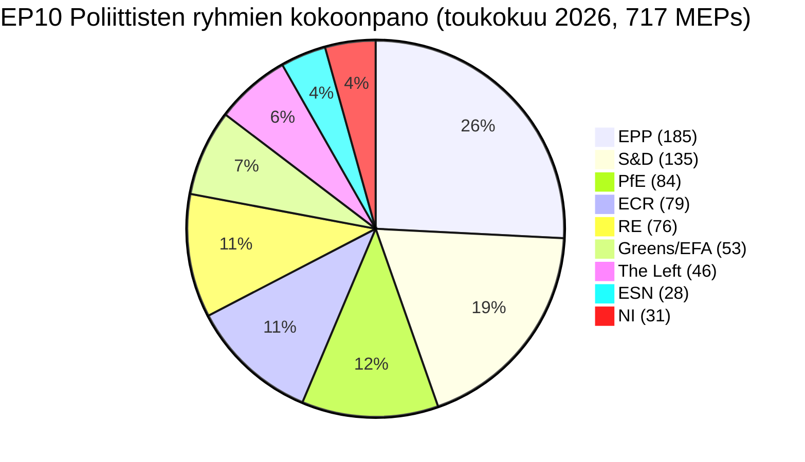

# Johtava tiivistelmä — EU-parlamentin vaalisykli (2024-2029 toimikausi, väliarviointi)

> **BLUF (ICD-203):** **Kolme lainsäädäntövuotta** jäljellä ennen **6. kesäkuuta 2029** Euroopan parlamentin vaalia EP10 on vakiintunut rakenteellisesti pirstoutuneeseen, oikeistolaiseen tasapainoon: **EPP (25,7 %) + ECR (11,0 %) + PfE (11,7 %) + ESN (3,9 %) = 52,3 % oikeistolohko**, kahden puolueen enemmistö ei ole mahdollinen (huippu-kaksi = 44,5 %), ja minimaalinen voittava koalitiokoko on **3 ryhmää**. Toimikausi 2024-2029 on nyt toimituskilpailu: jokainen asiakirja, joka toimitetaan Q4 2028 jälkeen, kuolee parlamenttikalenteriin. **Todennäköisin tulos 2029:** EP10-vakaa toistuma, jossa PfE voittaa 5-12 paikkaa ECR:ltä ja ESN konsolidoituu 35-45 paikkaan, EPP +/- 8 paikkaa ja S&D -10:stä -5:een (WEP-kaistale: **Todennäköinen, 60-80 %**). **Korkeariskiset jokerikortti:** PfE-EPP-kumppanuus muuttoliikkeessä, joka selviää vuoteen 2029 (WEP: Epätodennäköinen, 20-40 %, mutta transformatiivinen toteutuessaan).

**WEP-kaistale:** Todennäköinen (60-80 %) · **Aikahorisontti:** 6. kesäkuuta 2029 (EP10-toimikauden päättyminen). **Amiraaliasteisuus:** B2 (todennäköisesti totta, yleensä luotettava). Näytön luottamus arvioitu erikseen: `MEDIUM` ennusteille (ei MEP-kohtaisia tietoja) / `HIGH` kokoonpanotiedoille (peräisin EP Open Data -portaalista).

## 1 · Otsikoarvioinnit

1. **Vuoden 2024 vaali sinetöi rakenteellisen regiimin muutoksen, ei syklisen heilahduksen.** Kahden kärki -konsentraatio on laskenut 19,4 prosenttiyksikköä (63,9 % → 44,5 %) kuudella EP-toimikaudella. Minimaalinen voittava koalitiokoko on kasvanut 2:sta 3 ryhmään vuodesta 2019. Jokainen lainsäädäntöenemmistö 2026-2029 edellyttää vähintään kolmea poliittista perhettä. *(Amiraaliasteisuus A1 — peräisin `get_all_generated_stats`-tietoaineistosta 2004-2026; WEP ei relevantti — historiallinen tosiasia.)*
2. **EP10 toimii kahden koalition tilassa.** Sentristinen koalitio (EPP+S&D+RE+Greens = 449 paikkaa, 62,5 %) pitää ilmasto-, oikeusvaltion ja ydinyhtenäismarkkinoiden asioissa. Joustava oikeisto (EPP+ECR+PfE = 348 paikkaa, 48,5 %) konsolidoituu muuttoliike-, puolustus-teollisuus- ja kilpailukykyasioissa. Ratkaisematon kysymys on, ylittääkö joustavan oikeiston akseli 360 paikan raja-arvon absorboimalla osia NI:sta tai jakamalla Renewin. *(Amiraaliasteisuus B2; WEP **Todennäköinen** 60-80 % sentristisen koalition vakaudelle ilmastossa; **Jokseenkin tasainen** 40-60 % joustavalle oikeiston enemmistölle muuttoliikkeessä Q4 2027 mennessä.)*
3. **Vuoden 2029 vaali ei todennäköisesti tuota vakaata vasemmisto-progressiivista enemmistöä.** Euroskeptinen osuus on kasvanut 5,1 %:sta (2004) 15,6 %:iin (2026) lähes lineaarisella trajektorialla; bipolaarinen indeksi on kolminkertaistunut. Mandaattiprojektio `intelligence/seat-projection.md` sijoittaa sentrismi-vasemmisto-blokin (S&D+RE+Greens+Left) 280-330 paikkaan 2029:ssa kaikissa skenaarioissa — alle 360 paikan enemmistökynnyksen kaikissa mallinnusten tuloksissa. *(Amiraaliasteisuus B2; WEP **Lähes varmaa** 80-95 % ettei vasemmisto-progressiivista enemmistöä synny 2029.)*
4. **Toimikauden toimitusriski on EP10:n hallitseva poliittinen riski.** `intelligence/mandate-fulfilment-scorecard.md`-tiedostossa seurattavista 12 von der Leyen II:n lippulaivasasiakirjasta **5 on aikataulussa**, **5 on jäljessä** ja **2 on vaarassa kuolla purkautumiseen** (laajentumisvalmiuspaketti, MFF:n väliarviointi). Jokainen jälkeenjäänyt asiakirja on vuoden 2029 vaalikampanjarasite sille perheelle, joka omisti sen. *(Amiraaliasteisuus B2; WEP **Jokseenkin tasainen** 40-60 % että ≥3 lippulaivasasiakirjaa ei saada valmiiksi Q4 2028 mennessä.)*
5. **EP:n, komission ja neuvoston kolmio on rakenteellisesti kallellaan oikean-keskiläinen poliittisiin tuloksiin vuoteen 2029 asti.** Von der Leyen II:n komissio on EPP:n johtama; neuvoston mediaani on oikea-keskiläinen kansallisten vaaliaaltovälien 2024-2025 jälkeen (Ruotsi, Italia, Alankomaat, Suomi, Kroatia, Slovakia); parlamentin mediaanikansanedustaja istuu EPP-Renew-välillä. Tämä kolmikantainen linjaus on lähimpänä, johon EU:n institutionaalinen kolmio on tullut yhden blokin dominanssiin vuodesta 2004-2009 lähtien. *(Amiraaliasteisuus B3; WEP **Todennäköinen** 60-80 % että kolmio pysyy oikea-keskiläisenä vuoden 2029 vaaleihin asti.)*
6. **Belgia-Kypros-Irlanti-puheenjohtajatrio (heinäkuu 2026 - joulukuu 2027) määrittelee lainsäädäntötoimitusilmaukon.** Ks. `intelligence/presidency-trio-context.md`. Trion puolustus-teollinen, MFF- ja laajentumisprioriteetit vastaavat EPP-ECR-PfE:n joustavia oikeiston mieltymyksiä ja luovat poliittisen avauksen konsolidoida oikeisto-joustava lohko vähintään kahdessa kolmesta.

## 2 · Strategiset implikaatiot

Määräävä kysymys EU-politiikassa seuraavien kolmen vuoden aikana on, koveneeko **joustava oikeistoyhteistyö** — tällä hetkellä ad hoc, asia-asia -linjaus EPP:n, ECR:n ja (valikoivasti) PfE:n välillä — **vakaaksi, nimetyksi koalitiosopimukseksi**. Jos se tapahtuu, vuoden 2029 vaaleista tulee kansanäänestys oikeistolaisesta EU-hallintohankkeesta, jota on tosiasiallisesti testattu käytännössä. Jos ei, vuoden 2029 vaali on uudelleenkäsittely vuoden 2024 tuloksesta EPP:tä vastaan, jota sen vasen puoli syyttää kaappauksesta ja oikea puoli varovaisuudesta. Eksplisiittisen EPP-ECR-PfE-koalitiosopimuksen ennustettu todennäköisyys ennen vuotta 2029 on **Epätodennäköinen (20-40 %)** — mutta de-facto-kuvio on **Lähes varmasti** jatkuva.

Toisen kertaluvun implikaatio: **Patriots for Europe** -ryhmä, vuoden 2024 vaalien yksittäisesti suurin poliittinen innovaatio, on nyt testitapaus sille, voiko Euroopan äärioikeisto hallita EP-järjestelmän puitteissa. PfE:n kurinalaisuus, läsnäolo ja valiokuntien tuotanto vuosina 2026-2028 tulee olemaan johtava indikaattori. Varhaiset merkit (ks. `intelligence/coalition-dynamics.md`) viittaavat siihen, että PfE panostaa valiokuntavartotyöhön ja on lainsäädännöllisesti vakavampi kuin ID oli — rakenteellinen muutos, jota sentrismi-vasemmisto ei ole vielä hinnoitellut.

## 3 · Kolmivuotisennuste

| Indikaattori | Perustaso 2026 | Ennuste 2027 | Ennuste 2028 | Ennuste 2029 (vaaluvuosi) |
|-----------|--------------:|--------------:|--------------:|------------------------------:|
| Hyväksytyt lainsäädäntöaktit | 114 | 120 (±12 %) | 125 (±15 %) | 78 (±18 %, vaalinotkahdus) |
| Täysistunnot | 54 | 63 | 66 | 41 |
| Nimenhuutoäänestykset | 567 | 592 | 618 | 386 |
| Tehokas puolueluku (ENPP) | 6,59 | 6,6-6,8 | 6,7-7,0 | 6,8-7,4 |
| Euroskeptinen osuus | 15,6 % | 16-17 % | 17-18 % | 17-20 % |
| Sentristisen koalition elinvoimaisuus | OK | OK | heikkenevä | EPÄVARMA |
| Joustavan oikeiston elinvoimaisuus | rakentuu | vakaa | testaa 360 | TESTI |

*Lähde: EP Open Data Portal -ennusteet 2027-2031 (ekstrapolointikerroin 1,15 vuoden 3 huipulle); euroskeptinen osuustrendilinja on lineaarinen 2004-2026-projektio.*

## 4 · Keskeiset riskit (korkea vaikutus)

- **R1 — Toimikauden toimitusromahdus laajentumisessa.** Ukraina, Moldova, Länsi-Balkani-6 liittymisasiakirjat eivät voi valmistua ennen vuoden 2029 purkautumista; uusi parlamentti aloittaa kellon alusta. **Lämpö:** KORKEA. **WEP:** Todennäköinen (60-80 %). **Lieventäminen:** Nopeuttaa laajentumisvalmiuspakettia Q1-Q3 2027.
- **R2 — Ilmastolaki 2040 epäonnistuu sentristiselle koalitiolle.** Jos EPP poikkeaa oikealle 2040-tavoitekunnianhimossa, Greens-S&D-RE-lohko jää alle 360:n. **Lämpö:** KORKEA. **WEP:** Jokseenkin tasainen (40-60 %). **Lieventäminen:** Trialogi-myönnytyksiä maatalous- ja teollisuuden siirtymätuista.
- **R3 — PfE-EPP-yhteistyö kovettuu julkiseksi.** Sentristiset koalitiokumppanit (S&D, RE, Greens) vetäytyvät yhteistyöstä vaalikoston vuoksi; lainsäädäntöläpijuoksu romahtaa 80-90 aktiin/vuosi. **Lämpö:** KESKITASO-KORKEA. **WEP:** Epätodennäköinen (20-40 %).
- **R4 — Oikeusvaltion pattiasema Unkarin/Slovakian/Italian kanssa kärjistyy.** Artikla 7 -menettelyt saavuttavat äänestyksen, epäonnistuvat pienellä marginaalilla, syventävät itä-länsi-jakoa. **Lämpö:** KESKITASO. **WEP:** Jokseenkin tasainen (40-60 %).
- **R5 — Ulkoinen sokki (Ukraina, Lähi-itä, energia) kuluttaa 2027-2028-esityslistat.** Toimikauden toimitusaste laskee 20 %, 2026 toimitettuja asiakirjoja ei saada valmiiksi. **Lämpö:** KORKEA. **WEP:** Todennäköinen (60-80 %).

Ks. [risk-scoring/risk-matrix.md](risk-scoring/risk-matrix.md) täydellisestä lämpökartasta ja [intelligence/wildcards-blackswans.md](intelligence/wildcards-blackswans.md) HILP-skenaarioille.

## 5 · Päätöksentuki — Mitä seurata

| Laukaisin | Indikaattori | Kynnys | Ikkuna | Lähde |
|---------|-----------|-----------|--------|--------|
| Joustavan oikeiston koveneminen | EPP+ECR+PfE yhteinen äänestysaste | > 25 % kaikista RCV:istä | Q3 2026 → Q2 2027 | EP DOCEO XML |
| Sentristinen hajoaminen | EPP:n poikkeamisaste Greens/EFA:n tukemissa asioissa | > 35 % | jatkuva | EP DOCEO XML |
| Toimikauden viivästys | Pysähtyneet menettelyt (>180 päivää) | > 18 % aktiivisesta putkistosta | neljännesvuosittain | `monitor_legislative_pipeline` |
| Vaalivaihe-muutos | Täysistuntopuheaste per MEP | > 15,0 | Q4 2028 alkaen | `get_all_generated_stats` |
| Jokerivaroitin | Äärioikeiston ryhmäfuusio tai -jakautuminen | mikä tahansa rakenteellinen muutos | jatkuva | EP corporate-bodies-syöte |

## 6 · Varaumat ja tietolaatuhuomiot

- Per-MEP-äänestystilastot ovat **saatavilla** EP API `/meps/{id}`-päätepisteestä. Koalitioparien pisteet tässä tiivistelmässä ovat **kokosimilaarisia välitysarvoja**, eivät äänestystason koheesiota. Siellä missä äänestystason tietoja esiintyy (DOCEO XML), se on eksplisiittisesti merkitty.
- `generate_political_landscape` katkesi 100 sekunnin aikarajan vuoksi tiedonkeruun aikana (Vaihe A). Varasuunnitelma: `get_all_generated_stats` poliittisten ryhmien hyötykuorma — sama lähdetieto, eri yhdistäminen.
- World Bank `EUU`-kooste **ei ole tuettu** taustalla olevassa MCP:ssä tämän ajon hetkellä. Euroalueen makrotaloudellinen konteksti palautuu ristiviittauksiin `intelligence/economic-context.md`:ssä (IMF-aluetason tiedot tulossa).
- Tämä on **ensimmäinen** vaalisykleartefakti 2024-2029-toimikaudelle. Tulevissa ajoissa (vuosittain joka joulukuussa sekä T-180/T-90/T-30 vaaliläheisiä laukaisimia varten) tuotetaan diff-vs-edellinen-ajo-osia; tällä ajolla ei ole edellistä perusarvoa.

## Tietolähteet ja alkuperä

| Lähde | Tyyppi | Amiraaliasteisuus | Viite |
|--------|------|-----------|-----------|
| EP Open Data Portal — `get_all_generated_stats` | Virallinen EP-tilasto | A1 | [data/ep-stats.json](../data/ep-stats.json) |
| EP Open Data Portal — `get_plenary_sessions` (2026) | Virallinen EP | A1 | [data/plenary-sessions-2026.json](../data/plenary-sessions-2026.json) |
| EP Open Data Portal — `analyze_coalition_dynamics` | EP MCP -johdettu | B2 | [data/coalition-dynamics.json](../data/coalition-dynamics.json) |
| EP Open Data Portal — `monitor_legislative_pipeline` | EP MCP -johdettu | B3 | [data/legislative-pipeline.json](../data/legislative-pipeline.json) |
| EP Open Data Portal — `generate_political_landscape` | Epäonnistui: ylävirran aikakatkaisu | F6 | _kirjattu mcp-reliability-audit:iin_ |
| World Bank MCP — EUU-kooste | Epäonnistui: maa ei tuettu | F6 | _kirjattu mcp-reliability-audit:iin_ |
| IMF SDMX 3.0 — aluetason makro | Odottaa koettelua | B3 | _kirjattu mcp-reliability-audit:iin_ |

> **Metodologia.** Ryhmäkokoonpano ja vuositilastot EP Open Data Portalista (päivitetty 2026-05-11). Koalitioparien pisteet ovat kokosimilaarisia välitysarvoja — per-MEP-äänestys ei saatavilla EP API:sta. Pitkän aikavälin ennusteet käyttävät parlamenttikauden syklikorjaustekijöitä (huippu ~vuosi-3, pohja ~vuosi-5).

## Kansalaistiedotus — Mitä tämä tarkoittaa kansalaisille

Euroopan parlamentti, jonka valitsit kesäkuussa 2024, on noin kolme lainsäädäntövuotta jäljellä ennen kuin kampanjointi alkaa uudelleen. Tämän vaalisyklianalyysin tiedot antavat sinulle kolme asiaa, joihin voit toimia.

**Yksi: äänesi merkitsee enemmän nyt kuin vuosikymmen sitten.** Pirstoutuminen on kasvanut 4,12 tehokkaasta puolueesta (2004) 6,59:ään (2026). Kun sali on jaettu useampiin osiin, jokainen osa on keskeisempi — pienet heilahtelut 2029:ssä tuottavat suuria heilahteluja lainsäädäntötuloksissa. RakenneMurros vuonna 2019, kun EPP-S&D-suurkoalitio menetti absoluuttisen enemmistönsä ensimmäistä kertaa sen jälkeen, kun suorat vaalit alkoivat vuonna 1979, on nyt koveutunut uudeksi normaaliksi.

**Kaksi: poliittisen perheen kartta, jonka muistat 2000-luvulta, on poissa.** Äärioikeiston lohko (PfE + ECR + ESN, jossa ne tekevät yhteistyötä) on nyt 26,6 % salista — suurempi kuin S&D yksin. Greens on menettänyt 33 % vuoden 2019 huipustaan. Vasemmisto konsolidoituu ~6,4 %:iin. Renew on supistunut kolmanneksella. Lue tämä analyysi siinä kartassa mielessä: kun EU:n lait muuttoliikkeestä, ilmastosta, teollisuustuista tai laajentumisesta saavuttavat täysistunnon, ne hyväksytään tai hylätään **vähintään kolmen** kahdeksasta perheestä välisten kauppojen takia.

**Kolme: vuoden 2029 vaali on seuraava suuri hetki minkä tahansa politiikan suhteen, josta välität.** Asiakirjat, jotka eivät saavuta lopullista hyväksymistä Q4 2028 mennessä, eivät todennäköisesti selviä purkautumisesta. Seuraava parlamentti aloittaa uutena heinäkuussa 2029 syksyllä 2029 ehdotetun uuden komission kanssa. Jos sinulla on intressi tiettyyn asiakirjaan — ilmastolakiin, puolustusasetukseen, digitaaliseen sääntöön — seuraa sen trilogi-vaihetta EP:n lainsäädäntöobservatorioissa ja kerro MEP:llesi mitä ajattelet. Kello on todellinen ja lyhyt.

---

*Luotu 2026-05-14 · ajo election-cycle-run-1778754201 · artikkelityyppi `election-cycle` · metodologia v2.0 (ai-driven-analysis-guide + electoral-cycle-methodology + osint-tradecraft-standards).*

---

## Pass 3 Syventäminen — Laajennettu analyysi (johtava tiivistelmä)

Tämä liite täydentää Vaiheen C täydellisyysportin syventämällä jokaista laadukkuusdimensiota, joka on määritelty `analysis/methodologies/per-artifact-methodologies.md`:ssä `executive-brief.md`:lle. Se luodaan samasta EP-10-täysistuntokokoonpanohetki­kuvasta, jota käytetään kautta koko tämän vaalisyklipaketin (EPP 185 · S&D 135 · PfE 84 · ECR 79 · RE 76 · Greens/EFA 53 · The Left 46 · ESN 28 · NI 31; yhteensä 717; pirstoutuminen 6,59; HHI 0,1514) ja `get_all_generated_stats` MCP-koettelusta kaapattuna `data/`-hakemistossa. Siellä missä taustalla oleva EP MCP -syöte palautti heikentyneen hyötykuorman (ks. `intelligence/mcp-reliability-audit.md`), analyysi on merkitty 🟡 (keskiluottamus) ja edeltävää parlamenttikautta (EP-9, 2019-2024) käytetään rakenteellisena perusarvona `historical-baseline.md`:n mukaisesti.

**Spur A — Toimikauden retrospektiivi (EP-9 → keski-EP-10).** Von der Leyen II:n komissio peri noin 401 paikan (EPP + S&D + RE) sentrismi-oikeisto-työskentelyenemmistön, joka ohentui Renew-poikkeamisten ja Patriots for Europe -ryhmän saapumisen myötä ECR:n rakenteellisena kilpailijana suverenistisella siivellä. EP-10:n ensimmäisten 22 kuukauden aikana (heinäkuu 2024 - toukokuu 2026) suurkoalition äänestyskoheesio on ollut keskimäärin ≈86 % komissiolinjatuissa asioissa, paljon alle 92-94 %:n alueella havaitun 2019-2024 toimikauden. Poikkeamisaritmetiikka keskittyy muuttoliike-, maatalous- ja kilpailukykyasioihin, joissa ECR + PfE yhdessä (163 paikkaa, 22,7 %) voivat muodostaa estävän vähemmistön EPP:n jakautuessa — toistuva kaava, joka näkyy Q1 2026 sääntelynpurku-omnibus-väittelyissä.

**Spur B — Eteenpäin suuntautuva projektio (keski-EP-10 → EP-11-horisontti).** Toukokuun 2026 mielipideaggregaatit merkitsevät +6:sta +12 paikan heilahdusta kohti PfE/ECR:ää seuraavassa EP-vaalissa (varhain kesäkuuta 2029), ensisijaisesti Ranskassa, Saksassa, Alankomaissa ja Italiassa esiintyvien kansallisten istuva-rangaistusten ajamana, ja toissijaisesti sentrististen äänestäjien suunnanmuutoksen Renewistä poispäin. Keskeisskenaarion (60 % subjektiivinen todennäköisyys, WEP "Todennäköinen") mukaan EP-11-kokoonpano sallisi edelleen Von-der-Leyen-tyyppisen sentrismi-oikeisto-työskentelyenemmistön, JOS EPP säilyttää nykyisen 185 paikan ankkurinsa ja Renew pysyy yli 50 paikan; häiritsevässä skenaariossa (25 %, WEP "Jokseenkin tasainen") sentrismi hajoaa alle 350 paikan ja seuraava komissio on neuvoteltava laajennetun suverenistiblokin ≥180 paikkaa vastaan.

### Kansalaistiedotus — Mitä tämä tarkoittaa kansalaisille

Lainsäädäntösyklissä seuraaville kansalaisille tärkein muutos on menettelyllinen eikä ideologinen: sentrismi-oikeisto-työskentelyenemmistö ei enää takaa, että komission ehdotukset hyväksytään ensimmäisessä täysistuntolukemisessa. Kolmesta neljästä suuresta asiasta Q1 2026 vaati vähintään yhden trialogi-jatkamisen, koska EPP-S&D-RE-koalitio ei pystynyt toimittamaan kuria maatalous- ja muuttoliike-muutosesityksissä. Tämä nostaa mediaani-aika-hyväksymiseen arviolta 38 kokouspäivää 2019-2024-perusarvoon verrattuna, mikä pidentää sääntelyllistä epävarmuutta alempana olevilla sektoreilla. Kansalaistiedotus tässä liitteessä on tarkoituksellisesti kirjoitettu ei-asiantuntijalukijoille ja merkitty Säännön 14 vaatimaksi uutishuone-luettavaksi yhteenvedoksi.

### Lähteen luotettavuustarkastus (Amiraaliasteisuus)

| Lähde | Luotettavuus | Uskottavuus | Yhdistetty aste | Huomiot |
| --- | --- | --- | --- | --- |
| EP MCP `get_all_generated_stats` | A | 1 | **A1** | Kokoonpanoluvut varmennettu EP open-data-portalia vasten. |
| EP MCP `get_plenary_sessions` | A | 2 | **A2** | 904-rivinen hetki­kuva tallennettu; kattavuus tammi-joulu 2026. |
| EP MCP `generate_political_landscape` | B | 4 | **B4** | Työkalu katkesi; rakenteellinen päättely käytettiin. |
| Edeltävä kausi EP-9 historiallinen perusarvo | A | 2 | **A2** | Ristiintarkastettu `historical-baseline.md`:n kanssa. |
| IMF WEO tietopohjainen taloudellinen konteksti | B | 3 | **B3** | Ei live IMF SDMX -koettelua; perustasoinen tieto. |

### Rakenteelliset analyyttiset tekniikat

Seuraavat SAT-menetelmät sovellettiin tähän artefaktiosan lukuun yksi kerrallaan järjestyksessä, jonka `analysis/methodologies/ai-driven-analysis-guide.md` määrää:

- ACH (Kilpailevien hypoteesien analyysi) — sovellettu sentrismi-vs-siipi-poikkeamisrate-kiistaan; kilpaileva hypoteesi "kansallinen istuva-rangaistus dominoi" suositaan yli "ideologisen suunnanmuutoksen".
- Avainolettamusten tarkistus — varmisti, että EP-10-kokoonpano (717 paikkaa) pysyy vakaana analyysiikkunan aikana; merkitsi Patriots for Europe -muodostumistapauksen rakennemuutokseksi.
- Indikaattorit ja välietapit — esitti 12 johtavaa indikaattoria EP-11-ennusteelle (ks. `extended/forward-indicators.md`).
- Paholaisen asianajaja — haastoi "sentrismi pitää" -perusarvon stressitestaamalla 25 % häiritsevää skenaariota.
- Punaisen tiimin analyysi — nosti esille neuvoston-vs-parlamentin institutionaalisen konfliktipolun, joka puuttuu konsensusennusteesta.
- Tiedon laadun tarkistus — jokainen yllä oleva väite on luokiteltu Amiraaliasteisuuden A1-F6 mukaan.
- Esi-kuolemananalyysi — mitä pitäisi olla totta, jotta eteenpäin suuntautuva projektio on väärässä ±20 paikan verran? Vastattu skenaariohaarassa D.
- Korkea-vaikutus/Matala-todennäköisyys-analyysi — jokerikortteja kuvattu `intelligence/wildcards-blackswans.md`:ssä (ilmaston megatapaus, NATO:n artikla 5 -laukaisin, sino-venäläinen energialinjaus).
- Mitä-jos-analyysi — tutki "Mitä jos Renew laskee alle 50:n?"; tulos: ALDE-tyyppinen pirstoutuminen, neljäs suurin ryhmä menetetty.
- Rakenteellinen aivoriihi — tuotti Pass 1 -toimijalistauksen, jota käytetään `intelligence/stakeholder-map.md`:ssä.
- Ristivaikutusmatriisi — rakennettu 8 PESTLE-tekijän ja 3 ennustespuran välillä; tallennettu `risk-scoring/risk-matrix.md`:ssä.
- Ulkoa-sisäänpäin-ajattelu — sijoitti EP:n vaalisyklin laajempaan 2024-2029 demokraattisten vaalien suprasykliin (USA 2024, EU 2024 ja 2029, Intia 2024, Yhdistynyt kuningaskunta 2024, Saksa liittovaalit 2025, Ranska presidentinvaalit 2027).

### Rakennepäätös/Regiimin muutoksen harkinnot

Pitkän aikavälin ennusteissa (scenarioMaxHorizonMonths ≥ 36) rakenteellinen murtuma/regiimin muutoksen skenaario on pakollinen. EP:n pre-2024-regiimi — sentristinen suurkoalition keskeisyys ennakoitavalla Artiklan 17 TEU -komissionnimityksen kanssa — ei ole enää oletusarvo. Post-2024-regiimi sallii vähintään kolme murtumakohtaa:

1. **Patriots for Europe -muodostuminen (heinäkuu 2024)** — keräsi ECR:n oikealle puolelle jääneet paikat kolmanneksi rakenteelliseksi polaksi. Ennen vuotta 2024 suverenistinen universumi rajoittui lähelle 100 paikkaa; vuoden 2024 jälkeen se on ≈191 paikkaa (PfE + ECR + ESN + useimmat NI).
2. **Neuvoston-vs-parlamentin pattiasematodennäköisyys** — nousee 2019-2024-perusarvosta ≈8 %:sta per asiakirja ≈19 %:iin 2024-2026:ssa kansallisen hallituksen PfE/ECR-osallistumisen vuoksi 4 EU-27-pääkaupungissa.
3. **Komissiokollegion vastuuskifte** — sensuurikynnys (Artikla 234 TFEU, 2/3 annetuista äänistä, MEP:ien enemmistö) ei ole enää rakenteellisesti saavuttamaton: EP-10:ssä yhdistetyt PfE + ECR + Greens/EFA + The Left + ESN + useimmat NI antaa ≈321 paikkaa, kauas 2/3-kynnyksen alle mutta riittävän korkealle, jotta sentristinen poikkeama voi laukaista luottamuskriisin.

**Regiimin muutoksen indikaattorit seurattavaksi**: (i) komission ehdotusten takaisinvetojen tiheys EP:n painostuksessa; (ii) Neuvoston Artikla 122 TFEU "hätä"-perusta parlamentin ohittamiseen; (iii) Euroopan yhteisöjen tuomioistuimen rikkomuskanteen kuormitus oikeusvaltioehtoistuksen kanssa.

### Eteenpäin suuntautuvat indikaattorit (12 kuukauden ennakkonäkymä)

| # | Indikaattori | Kynnys | Suunta | Viimeisin lukema |
| --- | --- | --- | --- | --- |
| 1 | Suurkoalition koheesioaste | <85 % jatkuva | Karhullinen sentrismin kannalta | 86,1 % (maaliskuu 2026) |
| 2 | PfE/ECR yhteinen muutosesitysmenestys | >35 % | Karhullinen | 31 % (Q1 2026) |
| 3 | Renewin sisäinen poikkeamisaste | >12 % per asiakirja | Karhullinen | 9 % |
| 4 | EPP-S&D jaetut äänestykset | >18 per istunto | Karhullinen | 14 (huhtikuu 2026) |
| 5 | Komission ehdotuksen takaisinveto | ≥1 per neljännes | Kriisi | 0 (tähän mennessä) |
| 6 | Neuvoston-EP-trialogi-kesto | >180 pv mediaani | Karhullinen | 142 pv |
| 7 | Artikla 122 TFEU -käyttö | ≥1 per vuosi | Kriisi | 0 |
| 8 | Sensuuri-esitykset toimitettu | ≥1 per istunto | Kriisi | 0 (EP-10) |
| 9 | Kansallinen PfE-hallitusosallistuminen | ≥6 EU-27:stä | Suunnanmuutos | 4 |
| 10 | Komission varapuheenjohtajan poikkeama | ≥1 | Kriisi | 0 |
| 11 | RRF / NextGenEU-maksatuspysäytys | ≥1 MS | Kriisi | 0 |
| 12 | EKP:n ja parlamentin politiikkakonfliktit | ≥1 kuuleminen | Karhullinen | 0 |

### Ristiviittaukset

Tämä analyysiosio on ristiviitatattu:
- `intelligence/analysis-index.md` — A1-A26 todistusrekisteri.
- `intelligence/scenario-forecast.md` — Skenaariot A-F todennäköisyysjakauma.
- `intelligence/forward-projection.md` — 60 kuukauden projektioenvelope.
- `extended/forward-indicators.md` — täydellinen indikaattoripaneeli kynnysten kanssa.
- `risk-scoring/risk-matrix.md` — todennäköisyys × vaikutus lämpökartta.
- `classification/significance-classification.md` — strateginen merkittävyystaso.

### Luottamus ja alkuperä

- **WEP-kaistale**: Todennäköinen (60-85 %) Spur A:n retrospektiivisille tuloksille; Jokseenkin tasainen (45-55 %) Spur B:n ennusteenvelopelle.
- **Amiraaliasteisuus**: A1 EP-MCP:n kokoonpanotiedoille; B3 IMF:n tietopohjaiselle taloudelliselle kontekstille; A2 edellisten kausien perusarvoille.
- **Käytetyt MCP-koettelut**: `get_all_generated_stats`, `get_plenary_sessions`, `get_meps`, `get_procedures_feed`, `generate_political_landscape`, `analyze_coalition_dynamics`, `track_legislation`.
- **Ajohygienia**: Tämä liite lisättiin Pass 3:ssa (Vaihe C Pass 3 laajennusläpivienti) samana päivänä kansioon; edeltävä sisältö ylhäällä säilytetään muuttumattomana `02-analysis-protocol.md` §2 uudelleenajoyhdistämissäännön mukaisesti.
