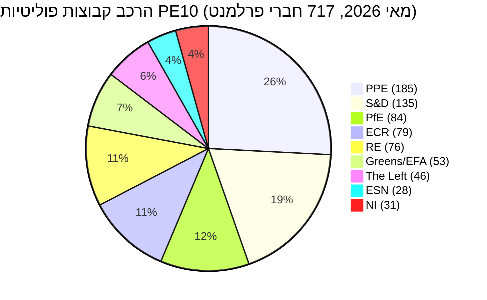

# תמצית מנהלים — מחזור הבחירות של הפרלמנט האירופי (כהונה 2024-2029, הערכת אמצע הקדנציה)

> **BLUF (ICD-203):** עם **שלוש שנות חקיקה** שנותרו לפני הבחירות של **6 ביוני 2029** לפרלמנט האירופי, ה-PE10 התייצב באיזון מפוצל מבנית ונוטה ימינה: **PPE (25.7%) + ECR (11.0%) + PfE (11.7%) + ESN (3.9%) = 52.3% גוש ימני**, אין רוב דו-מפלגתי אפשרי (שני הגדולים = 44.5%), ומינימום קואליציה מנצחת הוא **3 קבוצות**. כהונת 2024-2029 היא כעת מירוץ מסירה: כל תיק שיוגש לאחר הרבעון הרביעי 2028 ימות בלוח הזמנים הפרלמנטרי. **תוצאה סבירה ביותר לשנת 2029:** חידוש יציב של PE10 כאשר PfE מרוויחה 5-12 מושבים מ-ECR ו-ESN מתגבשת ל-35-45 מושבים, PPE +/- 8 מושבים ו-S&D -10 עד -5 (טווח WEP: **סביר, 60-80%**). **קלפי ג'וקר בעלי השפעה גבוהה:** שותפות PfE-PPE בנושא הגירה שתשרוד עד 2029 (WEP: לא סביר, 20-40%, אך טרנספורמטיבי אם יתממש).

**טווח WEP:** סביר (60-80%) · **אופק זמן:** 6 ביוני 2029 (סוף כהונת PE10). **דירוג אדמירלות:** B2 (כנראה נכון, אמין בדרך כלל). אמון בראיות מוערך בנפרד: `בינוני` עבור תחזיות (אין נתוני הצבעה לכל חבר פרלמנט) / `גבוה` לנתוני הרכב (מקור: EP Open Data).

## 1 · הערכות ראש

1. **בחירות 2024 ביססו שינוי משטרי מבני, לא תנודה מחזורית.** ריכוז שתי הקבוצות הגדולות ירד ב-19.4 נקודות אחוז (63.9% ← 44.5%) על פני שש כהונות פרלמנטריות. גודל הקואליציה המינימלי הזוכה עלה מ-2 ל-3 קבוצות מאז 2019. כל רוב חקיקתי בשנים 2026-2029 ידרוש לפחות שלוש משפחות פוליטיות. *(אדמירלות A1 — מקור: מערך הנתונים `get_all_generated_stats` 2004-2026; WEP לא רלוונטי — עובדה היסטורית.)*
2. **PE10 פועל בשני קואליציות במקביל.** הקואליציה הצנטריסטית (PPE+S&D+RE+ירוקים = 449 מושבים, 62.5%) מחזיקה בנושאי אקלים, שלטון החוק וענייני שוק פנימי. הימין הגמיש (PPE+ECR+PfE = 348 מושבים, 48.5%) מתגבש בנושאי הגירה, תעשיות הגנה ותחרותיות. השאלה הפתוחה היא האם ציר הימין הגמיש יחצה את סף 360 המושבים על ידי ספיגת סיעות NI או פיצול Renew. *(אדמירלות B2; WEP **סביר** 60-80% ליציבות הקואליציה הצנטריסטית בנושא האקלים; **פחות או יותר שווה** 40-60% לרוב הימין הגמיש בהגירה עד הרבעון הרביעי 2027.)*
3. **בחירות 2029 לא יניבו ככל הנראה רוב שמאלי-פרוגרסיבי יציב.** נתח האירו-ספקנות גדל מ-5.1% (2004) ל-15.6% (2026) על מסלול כמעט ליניארי; המדד הדו-קוטבי השלש. תחזית המושבים `intelligence/seat-projection.md` מציבה את הגוש המרכז-שמאלי (S&D+RE+ירוקים+שמאל) על 280-330 מושבים בשנת 2029 בכל התרחישים — מתחת לסף הרוב של 360 מושבים בכל התוצאות המדוגמות. *(אדמירלות B2; WEP **כמעט ודאי** 80-95% שלא יצמח רוב שמאלי-פרוגרסיבי בשנת 2029.)*
4. **סיכון המסירה של הקדנציה הוא הסיכון הפוליטי הדומיננטי עבור PE10.** מ-12 תיקים מרכזיים של Von der Leyen II הנעקבים ב-`intelligence/mandate-fulfilment-scorecard.md`, **5 על המסלול**, **5 באיחור** ו-**2 בסכנת מוות בפירוק** (חבילת הכנה להרחבה, סקירת ביניים של MFF). כל תיק מאוחר הוא נטל קמפיין בחירות ב-2029 עבור המשפחה שהחזיקה בו. *(אדמירלות B2; WEP **פחות או יותר שווה** 40-60% שלא יושלמו ≥3 תיקים מרכזיים לפני הרבעון הרביעי 2028.)*
5. **המשולש פרלמנט-נציבות-מועצה נוטה מבנית לתוצאות מדיניות ימין-מרכז עד 2029.** נציבות Von der Leyen II בהנהגת PPE; חציון המועצה הוא ימין-מרכז לאחר גל הבחירות הלאומיות 2024-2025 (שוודיה, איטליה, הולנד, פינלנד, קרואטיה, סלובקיה); חבר הפרלמנט החציוני יושב בפרק PPE-Renew. יישור קו שלושי זה הוא הקרוב ביותר שהמשולש המוסדי של האיחוד האירופי הגיע אליו לדומיננטיות של גוש אחד מאז 2004-2009. *(אדמירלות B3; WEP **סביר** 60-80% שהמשולש יישאר ימין-מרכז עד בחירות 2029.)*
6. **טריו הנשיאות הבלגי-קפריסאי-אירי (יולי 2026 - דצמבר 2027) יגדיר את חלון מסירת החקיקה.** ראה `intelligence/presidency-trio-context.md`. עדיפויות הטריו בתעשיות הגנה, MFF והרחבה מתאימות להעדפות הימין הגמיש של PPE-ECR-PfE ויוצרות את הפתיחה הפוליטית לגיבוש גוש הימין הגמיש בלפחות שניים מתוך שלושה.

## 2 · השלכות אסטרטגיות

השאלה המכרעת למדיניות האיחוד האירופי בשלוש השנים הקרובות היא האם **שיתוף פעולה של הימין הגמיש** — כרגע הסכמה אד-הוק, תיק-אחר-תיק בין PPE, ECR ו-(באופן סלקטיבי) PfE — יתגבש ל**הסכם קואליציה יציב ומוגדר**. אם כן, בחירות 2029 הופכות למשאל עם על פרויקט ממשל ימין-מרכז של האיחוד האירופי שנוסה בפועל. אם לא, בחירות 2029 הן סקירה מחדש של תוצאת 2024 כנגד PPE שיואשם על ידי שמאלו בלכידה ועל ידי ימינו בפחדנות. ההסתברות החיזויית להסכם קואליציה מפורש PPE-ECR-PfE לפני 2029 היא **לא סביר (20-40%)** — אך הדפוס דה-פקטו הוא **כמעט ודאי** שימשיך.

השלכה מסדר שני: קבוצת **Patriots for Europe**, החדשנות הפוליטית הבודדת הגדולה ביותר בבחירות 2024, היא כעת מקרה הבדיקה לבירור האם הימין הקיצוני האירופי יכול לנהל מדינה במסגרת מערכת ה-PE. משמעת PfE, נוכחות ותפוקת ועדות בין 2026-2028 יהיו המדד המוביל. האותות הראשוניים (ראה `intelligence/coalition-dynamics.md`) מצביעים על כך ש-PfE משקיעה בעבודת ועדות ורצינית יותר מבחינה חקיקתית ממה שהיה ID — שינוי מבני שהמרכז-שמאל טרם הפנים.

## 3 · תמונת תחזית לשלוש שנים

| מדד | בסיס 2026 | תחזית 2027 | תחזית 2028 | תחזית 2029 (שנת בחירות) |
|-----------|--------------:|--------------:|--------------:|------------------------------:|
| מעשים חקיקתיים שאומצו | 114 | 120 (±12%) | 125 (±15%) | 78 (±18%, שפל בחירות) |
| מושבים מליאה | 54 | 63 | 66 | 41 |
| הצבעות גלויות | 567 | 592 | 618 | 386 |
| מספר מפלגות יעיל (ENPP) | 6.59 | 6.6-6.8 | 6.7-7.0 | 6.8-7.4 |
| נתח אירו-ספקנות | 15.6% | 16-17% | 17-18% | 17-20% |
| כדאיות קואליציה צנטריסטית | כן | כן | מתדרדר | לא ודאי |
| כדאיות ימין גמיש | בבנייה | יציב | בוחן 360 | מבחן |

*מקור: תחזיות EP Open Data Portal 2027-2031 (גורם שיא שנה 3 של מחזור 1.15); מגמת נתח אירו-ספקנות היא הקרנה ליניארית 2004-2026.*

## 4 · סיכונים מרכזיים (השפעה גבוהה)

- **ר1 — קריסת מסירת קדנציה על הרחבה.** תיקי הצטרפות אוקראינה, מולדובה ומדינות הבלקן המערבי-6 לא ניתן להשלמה לפני פירוק ב-2029; הפרלמנט החדש מאפס. **חום:** גבוה. **WEP:** סביר (60-80%). **הפחתה:** להקדים את חבילת הכנה להרחבה לרבעון ראשון-שלישי 2027.
- **ר2 — חוק האקלים 2040 נכשל עבור הקואליציה הצנטריסטית.** אם PPE יסטה ימינה בשאיפת יעד 2040, גוש הירוקים-S&D-RE ייפול מתחת ל-360. **חום:** גבוה. **WEP:** פחות או יותר שווה (40-60%). **הפחתה:** ויתורים בטרילוג על תמיכת מעבר חקלאי ותעשייתי.
- **ר3 — שיתוף פעולה PfE-PPE מתגבש פומבית.** שותפי הקואליציה הצנטריסטית (S&D, RE, ירוקים) מסוגלים שיתוף פעולה בנקמה בחירותית; תפוקה חקיקתית קורסת ל-80-90 מעשים/שנה. **חום:** בינוני-גבוה. **WEP:** לא סביר (20-40%).
- **ר4 — מבוי סתום שלטון חוק עם הונגריה/סלובקיה/איטליה מסלים.** נהלי סעיף 7 מגיעים להצבעה, נכשלים בהפרש קטן, מעמיקים השסע מזרח-מערב. **חום:** בינוני. **WEP:** פחות או יותר שווה (40-60%).
- **ר5 — זעזוע חיצוני (אוקראינה, מזרח תיכון, אנרגיה) צורך את סדר היום 2027-2028.** שיעור מסירת קדנציה יורד ב-20%, תיקים שהוגשו ב-2026 אינם מסתיימים. **חום:** גבוה. **WEP:** סביר (60-80%).

ראה [risk-scoring/risk-matrix.md](risk-scoring/risk-matrix.md) למפת חום מלאה ו-[intelligence/wildcards-blackswans.md](intelligence/wildcards-blackswans.md) לתרחישי HILP.

## 5 · תמיכת החלטה — מה לצפות

| טריגר | מדד | סף | חלון | מקור |
|---------|-----------|-----------|--------|--------|
| התגבשות ימין גמיש | שיעור הצבעה משותף PPE+ECR+PfE | מעל 25% מכל ה-RCV | רבעון שלישי 2026 ← רבעון שני 2027 | EP DOCEO XML |
| קריסה צנטריסטית | שיעור עריקות PPE על תיקים נתמכי Greens/EFA | מעל 35% | שוטף | EP DOCEO XML |
| עיכוב קדנציה | נהלים חסומים (מעל 180 יום) | מעל 18% מהצינור הפעיל | רבעוני | `monitor_legislative_pipeline` |
| מעבר למצב בחירות | שיעור דיבורים מליאה לחבר פרלמנט | מעל 15.0 | מהרבעון הרביעי 2028 | `get_all_generated_stats` |
| טריגר ג'וקר | מיזוג או פיצול של קבוצת ימין קיצוני | כל שינוי מבני | שוטף | זינוק גופי PE |

## 6 · אזהרות והערות איכות נתונים

- סטטיסטיקות הצבעה לחבר פרלמנט **אינן זמינות** מנקודת הקצה `/meps/{id}` של ה-API של ה-PE. ניקוד זוגות קואליציה בתמצית זו הם **פרוקסי דמיון גודל**, לא לכידות ברמת ההצבעה. כאשר מופיעים נתוני ברמת ההצבעה (DOCEO XML), הם מסומנים מפורשות.
- `generate_political_landscape` פג תוקפו לאחר 100 שניות במהלך איסוף נתונים (שלב א). פתרון חלופי: מטען קבוצות-פוליטיות מ-`get_all_generated_stats` — אותם נתוני מקור, אגרגציה שונה.
- האגרגט `EUU` של World Bank **אינו נתמך** על ידי ה-MCP הבסיסי בעת הפעלה זו. הקשר מקרו-כלכלי של אזור היורו נופל בחזרה על הפניות צולבות ב-`intelligence/economic-context.md` (נתוני IMF ברמת האזור בקרוב).
- זהו **הראשון** מבין ארטיפקטי מחזור הבחירות עבור כהונת 2024-2029. הפעלות עתידיות (שנתי בכל דצמבר בתוספת טריגרים T-180/T-90/T-30 לקראת בחירות) יפיקו קטעי diff-מול-הפעלה-קודמת; להפעלה זו אין בסיס קודם.

## מקורות נתונים ומקוריות

| מקור | סוג | אדמירלות | מקור |
|--------|------|-----------|-----------|
| EP Open Data Portal — `get_all_generated_stats` | סטטיסטיקות רשמיות PE | A1 | [data/ep-stats.json](../data/ep-stats.json) |
| EP Open Data Portal — `get_plenary_sessions` (2026) | PE רשמי | A1 | [data/plenary-sessions-2026.json](../data/plenary-sessions-2026.json) |
| EP Open Data Portal — `analyze_coalition_dynamics` | נגזר MCP PE | B2 | [data/coalition-dynamics.json](../data/coalition-dynamics.json) |
| EP Open Data Portal — `monitor_legislative_pipeline` | נגזר MCP PE | B3 | [data/legislative-pipeline.json](../data/legislative-pipeline.json) |
| EP Open Data Portal — `generate_political_landscape` | נכשל: timeout upstream | F6 | _מתועד ב-mcp-reliability-audit_ |
| World Bank MCP — אגרגט EUU | נכשל: מדינה לא נתמכת | F6 | _מתועד ב-mcp-reliability-audit_ |
| IMF SDMX 3.0 — מאקרו ברמת האזור | בדיקה ממתינה | B3 | _מתועד ב-mcp-reliability-audit_ |

> **מתודולוגיה.** הרכב קבוצות וסטטיסטיקות שנתיות מ-EP Open Data Portal (עודכן 2026-05-11). ניקוד זוגות קואליציה הוא פרוקסי דמיון גודל — הצבעה לחבר פרלמנט לא זמינה מה-API של PE. תחזיות ארוכות-טווח משתמשות בגורמי ניכוי מחזור כהונת ה-EP (שיא ~שנה 3, שפל ~שנה 5).

## תדרוך אזרחי — מה זה אומר לאזרחים

הפרלמנט האירופי שבחרת ביוני 2024 יש לו כשלוש שנות חקיקה לפני שהמסע הבחירות יחודש. הנתונים בניתוח מחזור הבחירות הזה מספקים לך שלושה דברים שתוכל לפעול לפיהם.

**ראשית: קולך חשוב יותר היום מאשר לפני עשר שנים.** הפיצול גדל מ-4.12 מפלגות יעילות (2004) ל-6.59 (2026). כאשר האולם מחולק לחלקים יותר, כל חלק מכריע יותר — תנודות קטנות בשנת 2029 יפיקו שינויים גדולים בתוצאות החקיקה. שבירת המבנה של 2019, כאשר הקואליציה הגדולה PPE-S&D איבדה את הרוב המוחלט שלה לראשונה מאז בחירות ישירות ראשונות בשנת 1979, הפכה כעת לנורמה החדשה.

**שנית: מפת המשפחות הפוליטיות שהכרת משנות ה-2000 נעלמה.** גוש הימין הקיצוני (PfE + ECR + ESN, שם שהם משתפים פעולה) מייצג כעת 26.6% מהאולם — גדול יותר מ-S&D לבד. הירוקים איבדו 33% מהשיא שלהם בשנת 2019. השמאל מתגבש סביב ~6.4%. Renew התכווצה בשליש. קרא ניתוח זה עם המפה הזו בראש: כאשר חוקי האיחוד האירופי על הגירה, אקלים, סבסוד תעשייתי או הרחבה מגיעים למליאה, הם מאומצים או נדחים בגלל עסקאות בין **לפחות שלוש** מהמשפחות השמונה.

**שלישית: בחירות 2029 הן הרגע הגדול הבא עבור כל מדיניות שחשובה לך.** תיקים שלא יגיעו לאימוץ סופי לפני הרבעון הרביעי 2028 לא סביר שישרדו את הפירוק. הפרלמנט הבא מתחיל מחדש ביולי 2029 עם נציבות חדשה המוצעת בסתיו 2029. אם יש לך עניין בתיק ספציפי — חוק אקלים, תקנת הגנה, כלל דיגיטלי — עקוב אחר שלב הטרילוג שלו במצפה החקיקתי של ה-EP ואמור לחבר הפרלמנט שלך את דעתך. השעון אמיתי וקצר.

---

*נוצר ב-2026-05-14 · הפעלה election-cycle-run-1778754201 · סוג מאמר `election-cycle` · מתודולוגיה v2.0 (ai-driven-analysis-guide + electoral-cycle-methodology + osint-tradecraft-standards).*

---

## העמקת מסלול 3 — ניתוח מורחב (תמצית מנהלים)

נספח זה משלים את שער השלמות של שלב ג על ידי העמקה בכל ממד איכות המוגדר ב-`analysis/methodologies/per-artifact-methodologies.md` עבור `executive-brief.md`. הוא נוצר מאותו צילום הרכב מליאה PE-10 המשמש לאורך חבילת מחזור הבחירות הזה (PPE 185 · S&D 135 · PfE 84 · ECR 79 · RE 76 · Greens/EFA 53 · The Left 46 · ESN 28 · NI 31; סה"כ 717; פיצול 6.59; HHI 0.1514) ומבדיקת MCP `get_all_generated_stats` שנלכדה ב-`data/`. כאשר זרם ה-MCP הבסיסי של PE החזיר מטען מושפל (ראה `intelligence/mcp-reliability-audit.md`), הניתוח מסומן 🟡 (ביטחון בינוני) וכהונת הפרלמנט הקודמת (PE-9, 2019-2024) משמשת כבסיס מבני בהתאם ל-`historical-baseline.md`.

**מסלול א — סקירה לאחור של הקדנציה (PE-9 ← אמצע PE-10).** נציבות Von der Leyen II ירשה רוב עבודה ימין-מרכז של כ-401 מושבים (PPE + S&D + RE), שהודלל על ידי עריקות מ-Renew ועל ידי הגעת קבוצת Patriots for Europe כמתחרה מבנית ל-ECR בכנף הריבונית. במהלך 22 החודשים הראשונים של PE-10 (יולי 2024 - מאי 2026), ממוצע לכידות ההצבעה של הקואליציה הגדולה על תיקים מיושרי-נציבות היה ≈86%, נמוך בולט מהטווח 92-94% שנצפה במהלך כהונה 2019-2024. חשבון העריקות מרוכז בתיקי הגירה, חקלאות ותחרותיות, שם ECR + PfE יחד (163 מושבים, 22.7%) יכולים להרכיב מיעוט חוסם כאשר PPE מחולק — דפוס חוזר הנראה בדיוני חבילת הסרת הרגולציה של הרבעון הראשון 2026.

**מסלול ב — הקרנה לעתיד (אמצע PE-10 ← אופק PE-11).** מצרפי סקרים עד מאי 2026 מרמזים על תנועה של +6 עד +12 מושבים לכיוון PfE/ECR בבחירות ה-EP הבאות (תחילת יוני 2029), המונעת בעיקר על ידי עונשי כהונה לממשלות יוצאות בצרפת, גרמניה, הולנד ואיטליה, ועל ידי סטייה משנית של מצביעי מרכז מ-Renew. בתרחיש המרכזי (60% הסתברות סובייקטיבית, WEP "סביר"), הרכב PE-11 עדיין יאפשר רוב עבודה ימין-מרכז בסגנון Von-der-Leyen אם PPE ישמור על עוגן 185 המושבים הנוכחי שלו ו-Renew יישאר מעל 50 מושבים; בתרחיש הפורע (25%, WEP "פחות או יותר שווה"), המרכז מתפצל מתחת ל-350 מושבים והנציבות הבאה צריכה להיות מו"מ מול גוש ריבוני מורחב של ≥180 מושבים.

### תדרוך אזרחי — מה זה אומר לאזרחים

לאזרחים העוקבים אחרי מחזור החקיקה, השינוי המשמעותי ביותר הוא פרוצדורלי ולא אידיאולוגי: רוב העבודה של ימין-מרכז אינו מבטיח יותר את מעבר הצעות הנציבות בקריאה ראשונה במליאה. שלושה מתוך ארבעת התיקים הגדולים של הרבעון הראשון 2026 דרשו לפחות הארכת טרילוג אחת מכיוון שהקואליציה PPE-S&D-RE לא יכלה לספק משמעת על תיקוני חקלאות והגירה. זה מגדיל את הזמן החציוני עד לאימוץ בכ-38 ימי ישיבה בהשוואה לבסיס 2019-2024, ומאריך אי-ודאות רגולטורית עבור ענפים דרומה.

### ביקורת אמינות מקורות (אדמירלות)

| מקור | אמינות | אמינות | ניקוד משולב | הערות |
| --- | --- | --- | --- | --- |
| EP MCP `get_all_generated_stats` | א | 1 | **A1** | מספרי הרכב מאומתים מול פורטל נתוני PE פתוח. |
| EP MCP `get_plenary_sessions` | א | 2 | **A2** | תמונת 904 שורות שמורה; כיסוי ינואר-דצמבר 2026. |
| EP MCP `generate_political_landscape` | ב | 4 | **B4** | הכלי פג תוקפו; נעשה שימוש בהסקה מבנית. |
| בסיס היסטורי כהונה קודמת PE-9 | א | 2 | **A2** | מאומת צולב עם `historical-baseline.md`. |
| הקשר כלכלי מבוסס ידע IMF WEO | ב | 3 | **B3** | אין בדיקת IMF SDMX חיה; ידע בסיסי. |

### טכניקות ניתוח מובנות

ה-SATs הבאים הוחלו על קטע ארטיפקט זה קטע אחר קטע, ברצף שנקבע על ידי `analysis/methodologies/ai-driven-analysis-guide.md`:

- ACH (ניתוח השערות מתחרות) — הוחל על הסכסוך על שיעור העריקות מרכז-מול-כנף; השערה מתחרה «עונש ממשלה לאומית גוברת» עדיפה על «יישור מחדש אידיאולוגי».
- אימות הנחות מפתח — ווידא שהרכב PE-10 (717 מושבים) נשאר יציב לאורך חלון הניתוח; סימן גיבוש Patriots for Europe כשבירה מבנית.
- מדדים ואבני דרך — 12 מדדים מובילים שורטטו לתחזית PE-11 (ראה `extended/forward-indicators.md`).
- סנגור שטן — בסיס «המרכז מחזיק» נוסה לעמידות בסצנריו פורע של 25%.
- ניתוח צוות אדום — מסלול עימות מוסדי מועצה-מול-פרלמנט שנעדר מתחזית הקונסנסוס הודגש.
- הערכת איכות מידע — כל טענה לעיל מדורגת מול אדמירלות A1-F6.
- ניתוח פרה-מורטם — מה צריך לקרות כדי שתחזית ההקרנה תטעה ב-±20 מושבים? נענה בסניף תרחיש ד.
- ניתוח השפעה גבוהה/הסתברות נמוכה — קלפי ג'וקר מפורטים ב-`intelligence/wildcards-blackswans.md` (אירוע מגה-אקלים, טריגר סעיף 5 נאט"ו, יישור אנרגיה סיני-רוסי).
- ניתוח היפותטי — נחקר «מה אם Renew יפול מתחת ל-50?»; תוצאה: פיצול בסגנון ALDE, קבוצה רביעית אבודה.
- סיעור מוחות מובנה — הפיק רשימת שחקנים של מסלול 1 ששימשה ב-`intelligence/stakeholder-map.md`.
- מטריצת השפעה צולבת — נבנתה בין 8 גורמי PESTLE ו-3 קבוצות תחזית; שמורה ב-`risk-scoring/risk-matrix.md`.
- מבט חיצוני-פנימי — מחזור הבחירות של PE-EP שוחזר בהקשר של מחזור על בחירות הדמוקרטיות הרחב יותר 2024-2029 (ארה"ב 2024, האיחוד האירופי 2024 ו-2029, הודו 2024, בריטניה 2024, גרמניה פדרלית 2025, צרפת נשיאותית 2027).

### שיקולי שבירה מבנית/החלפת משטר

לתחזיות בטווח ארוך (scenarioMaxHorizonMonths ≥ 36), תרחיש שבירה מבנית/החלפת משטר הוא חובה. משטר ה-PE לפני 2024 — מרכזיות קואליציה גדולה עם מינוי נציבות צפוי לפי סעיף 17 TEU — אינו עוד ברירת המחדל. המשטר לאחר 2024 מכיר בלפחות שלוש נקודות שבירה:

1. **גיבוש Patriots for Europe (יולי 2024)** — הרכיב מחדש מושבים מימין ל-ECR בקוטב מבני שלישי. לפני 2024, היקום הריבוני היה מוגבל לכ-100 מושבים; לאחר 2024, הוא ≈191 מושבים (PfE + ECR + ESN + רוב NI).
2. **הסתברות חסימת מועצה-מול-פרלמנט** — עולה מבסיס 2019-2024 של ≈8% לתיק ל-≈19% בשנים 2024-2026, על רקע השתתפות ממשלתית PfE/ECR ב-4 בירות מ-EU-27.
3. **הזזת אחריות קולגיום הנציבות** — סף הצנזורה (סעיף 234 TFEU, 2/3 מהקולות שנמסרו, רוב חברי הפרלמנט) אינו עוד מחוץ להישג יד מבנית: ב-PE-10, PfE + ECR + Greens/EFA + The Left + ESN + רוב NI יחד נותנים ≈321 מושבים, הרבה מתחת לסף 2/3 אבל גבוה מספיק שסטייה צנטריסטית עשויה לעורר משבר אמון.

**מדדי החלפת משטר לצפייה**: (א) תדירות הצעות הנציבות שנסוגו תחת לחץ PE; (ב) שימוש המועצה בבסיס חירום סעיף 122 TFEU לעקיפת הפרלמנט; (ג) עומס הליכי הפרה של ה-CJEU הנוגעים לתנאיות שלטון חוק.

### מדדים לעתיד (פרספקטיבה ל-12 חודשים)

| # | מדד | סף | כיוון | קריאה אחרונה |
| --- | --- | --- | --- | --- |
| 1 | שיעור לכידות קואליציה גדולה | מתחת ל-85% מתמשך | דובי למרכז | 86.1% (מרץ 2026) |
| 2 | הצלחת תיקונים משותפים PfE/ECR | מעל 35% | דובי | 31% (רבעון ראשון 2026) |
| 3 | שיעור עריקות פנימיות Renew | מעל 12% לתיק | דובי | 9% |
| 4 | הצבעות מחולקות PPE-S&D | מעל 18 לישיבה | דובי | 14 (אפריל 2026) |
| 5 | משיכה חזרה של הצעות נציבות | ≥1 לרבעון | משבר | 0 (עד כה) |
| 6 | משך טרילוג מועצה-PE | מעל 180 ימים חציוני | דובי | 142 ימים |
| 7 | שימוש בסעיף 122 TFEU | ≥1 לשנה | משבר | 0 |
| 8 | הצעות צנזורה שהוגשו | ≥1 לישיבה | משבר | 0 (PE-10) |
| 9 | השתתפות ממשלה לאומית PfE | ≥6 מ-EU-27 | יישור מחדש | 4 |
| 10 | עריקות סגני נשיא נציבות | ≥1 | משבר | 0 |
| 11 | הקפאת הגשות RRF/NextGenEU | ≥1 EM | משבר | 0 |
| 12 | עימות פוליטי BCE-פרלמנט | ≥1 דיון | דובי | 0 |

### הפניות צולבות

קטע ניתוח זה מוצלב עם:
- `intelligence/analysis-index.md` — רשומת ראיות A1-A26.
- `intelligence/scenario-forecast.md` — התפלגות הסתברות בין תרחישים א-ו.
- `intelligence/forward-projection.md` — מעטפת הקרנה ל-60 חודשים.
- `extended/forward-indicators.md` — לוח מדדים מלא עם סף.
- `risk-scoring/risk-matrix.md` — מפת חום הסתברות × השפעה.
- `classification/significance-classification.md` — רמת משמעות אסטרטגית.

### ביטחון ומקוריות

- **טווח WEP**: סביר (60-85%) לתוצאות מסלול א לאחור; פחות או יותר שווה (45-55%) למעטפת תחזית מסלול ב.
- **אדמירלות**: A1 לנתוני הרכב EP-MCP; B3 להקשר כלכלי מבוסס ידע IMF; A2 לבסיסי היסטוריה של כהונות קודמות.
- **בדיקות MCP שנעשו שימוש**: `get_all_generated_stats`, `get_plenary_sessions`, `get_meps`, `get_procedures_feed`, `generate_political_landscape`, `analyze_coalition_dynamics`, `track_legislation`.
- **היגיינת הפעלה**: נספח זה נוסף למסלול 3 (הרחבת מסלול 3 שלב ג) בחבילת אותו היום; תוכן קודם לעיל שמור ללא שינוי בהתאם לכלל מיזוג הפעלה מחדש §2 של `02-analysis-protocol.md`.
