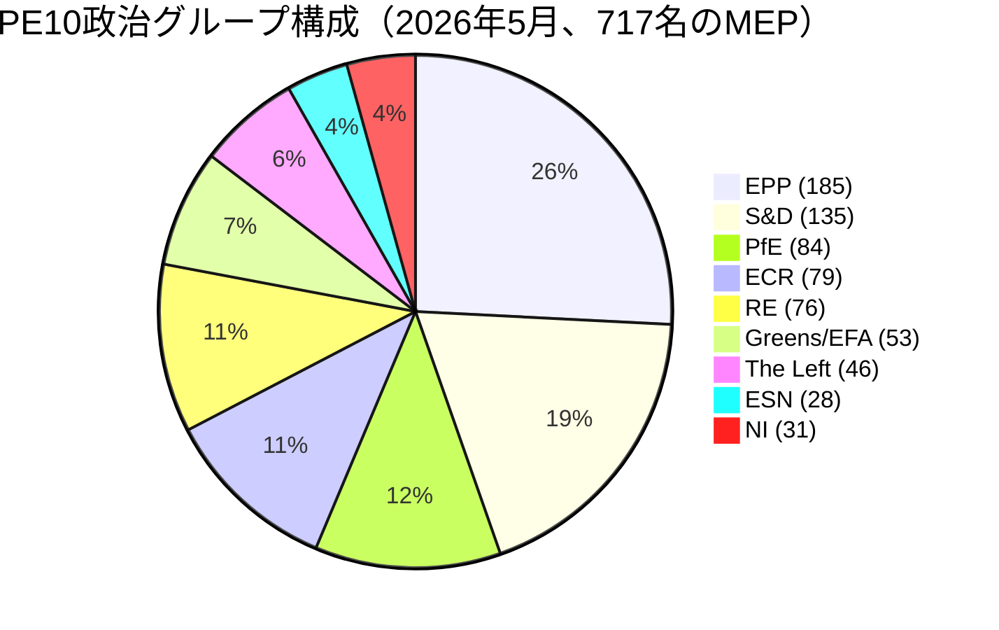

# エグゼクティブブリーフ — 欧州議会の選挙サイクル（2024-2029年会期、任期中間評価）

> **BLUF（ICD-203）：** 欧州議会選挙（**2029年6月6日**）まで**3年間の立法期間**を残す中、PE10は構造的に断片化した右傾きの均衡に安定している：**EPP（25.7%）＋ECR（11.0%）＋PfE（11.7%）＋ESN（3.9%）＝52.3%右派ブロック**。二大勢力による過半数は不可能（上位2グループ合計44.5%）で、勝利連立の最小規模は**3グループ**。2024-2029年の任期は今や成果競争だ：2028年第4四半期以降に提出されるすべての案件は議会日程上死を迎える。**2029年の最有力シナリオ：** PfEがECRから5〜12議席を獲得してESNが35〜45議席に集約し、EPPが±8議席、S&Dが-10〜-5議席というPE10の安定した継続（WEP範囲：**蓋然的、60〜80%**）。**高インパクトのワイルドカード：** 移民問題でPfE-EPPパートナーシップが2029年まで存続する（WEP：低蓋然、20〜40%、実現すれば変革的）。

**WEP範囲：** 蓋然的（60〜80%）· **時間的地平：** 2029年6月6日（PE10任期終了）。**情報信頼性評価：** B2（おそらく真実、概ね信頼できる）。証拠への信頼は個別に評価：予測については`MEDIUM`（MEP別投票データなし）、構成データについては`HIGH`（出典：EP Open Data）。

## 1 · 主要判断

1. **2024年選挙は周期的変動ではなく、構造的な体制転換を固定した。** 二大グループの集中度は6期の会期を通じて19.4ポイント低下した（63.9%→44.5%）。最小勝利連立規模は2019年以来2グループから3グループに上昇した。2026〜2029年の立法上の多数派には少なくとも3つの政治グループが必要となる。*（情報信頼性A1 — 出典：`get_all_generated_stats`データセット2004〜2026年；WEP非適用 — 歴史的事実。）*
2. **PE10は二重連立モードで運営されている。** 中道連立（EPP+S&D+RE+Greens＝449議席、62.5%）は気候、法の支配、内部市場案件で維持されている。柔軟な右派（EPP+ECR+PfE＝348議席、48.5%）は移民、防衛産業、競争力に集約されている。未解決の問いは、NI分派を吸収するかRenewを分裂させることで柔軟右派軸が360議席の閾値を超えるかどうかだ。*（情報信頼性B2；WEP **蓋然的** 60〜80%：気候に関する中道連立の安定性；**ほぼ互角** 40〜60%：2027年第4四半期までの移民に関する柔軟右派多数派。）*
3. **2029年選挙は安定した左派・進歩主義的多数派を生み出す可能性は低い。** EU懐疑主義の比率は2004年の5.1%から2026年の15.6%へほぼ直線的な軌跡で上昇し、二極化指数は3倍になった。議席予測 `intelligence/seat-projection.md` は中道左派ブロック（S&D+RE+Greens+Left）を全シナリオで2029年に280〜330議席に置いており、すべてのモデル化された結果において多数派閾値360議席を下回る。*（情報信頼性B2；WEP **ほぼ確実** 80〜95%：2029年に左派・進歩主義的多数派は生まれない。）*
4. **任期成果リスクがPE10の支配的な政治リスクだ。** `intelligence/mandate-fulfilment-scorecard.md`で追跡されているVon der Leyen IIの12の優先案件のうち、**5件は順調**、**5件は遅延中**、**2件は解散による頓挫リスク**（拡大準備パッケージ、MFF中間見直し）に晒されている。遅延した各案件は、所有責任を負っていた政治グループにとって2029年の選挙活動の負担となる。*（情報信頼性B2；WEP **ほぼ互角** 40〜60%：2028年第4四半期までに優先案件3件以上が完了しない。）*
5. **欧州議会-委員会-理事会の三角形は2029年まで構造的に中道右派の政策成果に傾いている。** Von der Leyen II委員会はEPPが主導し、理事会の中央値は2024〜2025年の国内選挙の波（スウェーデン、イタリア、オランダ、フィンランド、クロアチア、スロバキア）以降中道右派となり、議会の中央値MEPはEPP-Renewの区間に位置している。この三者整合は、EUの制度三角形が2004〜2009年以来最も単一ブロック優位に近づいている状態だ。*（情報信頼性B3；WEP **蓋然的** 60〜80%：三角形は2029年選挙まで中道右派のまま。）*
6. **ベルギー・キプロス・アイルランド三国議長国トリオ（2026年7月〜2027年12月）が立法成果の窓を定義する。** `intelligence/presidency-trio-context.md` 参照。トリオの防衛産業、MFF、拡大の優先事項はEPP-ECR-PfEの柔軟右派好みに沿っており、少なくとも3つのうち2つで柔軟右派ブロックを固める政治的機会を生み出す。

## 2 · 戦略的含意

今後3年間のEU政策における決定的問いは、**柔軟右派協力**（現在はEPP、ECR、そして選択的にPfEの間での臨時的な案件別整合）が**安定した、名前付きの連立協定**に硬化するかどうかだ。もしそうなれば、2029年選挙は実際に試された中道右派EUガバナンスプロジェクトに関する国民投票となる。もしそうでなければ、2029年選挙は、左派から取り込みと批判され、右派から臆病と批判されるEPPに対する2024年結果の再審となる。2029年以前にEPP-ECR-PfE明示的連立協定が締結される予測確率は**低蓋然（20〜40%）**だが、事実上のパターンは**ほぼ確実**に継続する。

二次的含意：2024年選挙で最大の単独政治革新となった**Patriots for Europe**グループは、欧州の急進右派がEP制度の枠組み内で統治できるかどうかを判定するテストケースとなっている。2026〜2028年のPfEの規律、出席、委員会での生産性が先行指標となる。初期シグナル（`intelligence/coalition-dynamics.md` 参照）は、PfEが委員会作業に投資しており、IDよりも立法上真剣であることを示唆しており、中道左派がまだ内面化していない構造的変化だ。

## 3 · 3年間予測スナップショット

| 指標 | 基準2026 | 予測2027 | 予測2028 | 予測2029（選挙年） |
|-----------|--------------:|--------------:|--------------:|------------------------------:|
| 採択立法行為 | 114 | 120（±12%） | 125（±15%） | 78（±18%、選挙底） |
| 本会議セッション | 54 | 63 | 66 | 41 |
| 記名投票 | 567 | 592 | 618 | 386 |
| 有効政党数（ENPP） | 6.59 | 6.6〜6.8 | 6.7〜7.0 | 6.8〜7.4 |
| EU懐疑主義比率 | 15.6% | 16〜17% | 17〜18% | 17〜20% |
| 中道連立の実行可能性 | OK | OK | 弱体化 | 不確実 |
| 柔軟右派の実行可能性 | 構築中 | 安定 | 360議席テスト | テスト |

*出典：EP Open Data Portal 2027〜2031年予測（第3年ピーク会期サイクル調整係数1.15）；EU懐疑主義比率トレンドは2004〜2026年の直線外挿。*

## 4 · 主要リスク（高インパクト）

- **R1 — 拡大に関する任期成果の崩壊。** ウクライナ、モルドバ、西バルカン6カ国の加盟案件は2029年の解散前に完了できない。新議会はゼロから始める。**熱度：** 高。**WEP：** 蓋然的（60〜80%）。**緩和策：** 拡大準備パッケージを2027年第1〜3四半期に前倒し。
- **R2 — 2040年気候法が中道連立で失敗。** EPPが2040年目標の野心で右傾化すれば、Greens-S&D-REブロックは360議席を下回る。**熱度：** 高。**WEP：** ほぼ互角（40〜60%）。**緩和策：** 農業・産業転換支援に関する三者協議での譲歩。
- **R3 — PfE-EPP協力が公に硬化。** 中道連立パートナー（S&D、RE、Greens）が選挙報復として協力を撤回。立法成果は年間80〜90行為に崩壊。**熱度：** 中〜高。**WEP：** 低蓋然（20〜40%）。
- **R4 — ハンガリー・スロバキア・イタリアとの法の支配の膠着が激化。** 第7条手続きが投票に至り、わずかな差で失敗し、東西の亀裂を深める。**熱度：** 中。**WEP：** ほぼ互角（40〜60%）。
- **R5 — 外部ショック（ウクライナ、中東、エネルギー）が2027〜2028年のアジェンダを消費。** 任期成果率が20%低下し、2026年に提出された案件が完了しない。**熱度：** 高。**WEP：** 蓋然的（60〜80%）。

完全なヒートマップについては [risk-scoring/risk-matrix.md](risk-scoring/risk-matrix.md)、HILPシナリオについては [intelligence/wildcards-blackswans.md](intelligence/wildcards-blackswans.md) を参照。

## 5 · 意思決定支援 — 注目すべき指標

| トリガー | 指標 | 閾値 | ウィンドウ | 出典 |
|---------|-----------|-----------|--------|--------|
| 柔軟右派の硬化 | EPP+ECR+PfE共同投票率 | 全RCVの25%超 | 2026年Q3→2027年Q2 | EP DOCEO XML |
| 中道崩壊 | Greens/EFA支持案件でのEPP離脱率 | 35%超 | 継続的 | EP DOCEO XML |
| 任期遅延 | ブロック中の手続き（180日超） | 活動パイプラインの18%超 | 四半期 | `monitor_legislative_pipeline` |
| 選挙モードへの移行 | MEP当たり本会議スピーチ率 | 15.0超 | 2028年Q4から | `get_all_generated_stats` |
| ワイルドカード | 急進右派グループの合併または分裂 | いかなる構造変化も | 継続的 | EP機関フィード |

## 6 · 注意事項とデータ品質メモ

- MEP別投票統計はEP APIの `/meps/{id}` エンドポイントから**利用不可**。このブリーフの連立ペアスコアは**規模類似度プロキシ**であり、投票レベルの凝集性ではない。投票レベルのデータが現れる場合（DOCEO XML）は明示的にラベル付けする。
- `generate_political_landscape` はデータ収集中（フェーズA）に100秒後にタイムアウトした。フォールバック：`get_all_generated_stats` の政治グループペイロード — 同じソースデータ、異なる集計。
- World Bank `EUU` 集合体は、今回の実行時点では基礎となるMCPで**サポートされていない**。ユーロ圏のマクロ経済的背景は `intelligence/economic-context.md` のクロスリファレンスに戻る（ゾーンレベルのIMFデータは近日公開）。
- これは2024〜2029年任期の**最初の**選挙サイクルアーティファクトだ。将来の実行（毎年12月、プラス選挙接近時のT-180/T-90/T-30トリガー）は前回実行との差分セクションを生成する。今回の実行には以前の基準がない。

## データソースと出典

| ソース | タイプ | 情報信頼性 | 参照 |
|--------|------|-----------|-----------|
| EP Open Data Portal — `get_all_generated_stats` | 公式EP統計 | A1 | [data/ep-stats.json](../data/ep-stats.json) |
| EP Open Data Portal — `get_plenary_sessions`（2026年） | 公式EP | A1 | [data/plenary-sessions-2026.json](../data/plenary-sessions-2026.json) |
| EP Open Data Portal — `analyze_coalition_dynamics` | EP MCP派生 | B2 | [data/coalition-dynamics.json](../data/coalition-dynamics.json) |
| EP Open Data Portal — `monitor_legislative_pipeline` | EP MCP派生 | B3 | [data/legislative-pipeline.json](../data/legislative-pipeline.json) |
| EP Open Data Portal — `generate_political_landscape` | 失敗：上流タイムアウト | F6 | _mcp-reliability-auditに記録_ |
| World Bank MCP — EUU集合体 | 失敗：国未サポート | F6 | _mcp-reliability-auditに記録_ |
| IMF SDMX 3.0 — ゾーンレベルマクロ | プローブ保留中 | B3 | _mcp-reliability-auditに記録_ |

> **方法論。** グループ構成と年間統計はEP Open Data Portalより（2026年5月11日更新）。連立ペアスコアは規模類似度プロキシ — EP APIからMEP別投票は利用不可。長期予測は会期サイクル調整係数（ピーク〜第3年、底〜第5年）を使用。

## 市民への報告 — これが市民にとって意味すること

2024年6月に選出した欧州議会は、選挙活動が再開するまで約3年間の立法期間を有している。この選挙サイクル分析のデータは、行動できる3つのことを提供する。

**第一に：あなたの票は10年前より重要だ。** 断片化は2004年の4.12有効政党から2026年の6.59へ拡大した。議会がより多くの部分に分かれると、各部分がより決定的になる — 2029年のわずかな変動が立法結果に大きな差異をもたらす。2019年の構造的亀裂（EPP-S&D大連立が1979年の最初の直接選挙以来初めて絶対多数を失った時）は今や新常態となっている。

**第二に：2000年代から知っていた政治グループのマップは消えた。** 急進右派ブロック（協力する場合のPfE + ECR + ESN）は今や議会の26.6%を占め、S&D単独より大きい。緑の党は2019年のピークから33%を失った。左派は〜6.4%に集約されている。Renewは3分の1縮小した。このマップを念頭に置いてこの分析を読んでほしい：移民、気候、産業補助金、拡大に関するEU法律が本会議に届く時、それらは**少なくとも3つ**の8つのグループ間の取引によって採択または否決される。

**第三に：2029年選挙はあなたが気にかける政策にとって次の大きな瞬間だ。** 2028年第4四半期以前に最終採択に達しない案件は解散を生き延びる可能性が低い。次の議会は2029年7月に、2029年秋に提案される新委員会でゼロから始まる。特定の案件 — 気候法、防衛規則、デジタルルール — に関心があるなら、EUの立法観測所でその三者協議段階を追い、あなたのMEPに意見を伝えてほしい。時計は本物であり、短い。

---

*2026年5月14日生成 · 実行 election-cycle-run-1778754201 · 記事タイプ `election-cycle` · 方法論 v2.0（ai-driven-analysis-guide + electoral-cycle-methodology + osint-tradecraft-standards）。*

---

## パス3の深化 — 拡張分析（エグゼクティブブリーフ）

この付録は、`analysis/methodologies/per-artifact-methodologies.md` の `executive-brief.md` に指定された各品質次元を深めることで、フェーズCの完全性ゲートを補完する。この選挙サイクルパッケージ全体で使用されたのと同じPE-10本会議構成スナップショット（EPP 185 · S&D 135 · PfE 84 · ECR 79 · RE 76 · Greens/EFA 53 · The Left 46 · ESN 28 · NI 31；合計717；断片化6.59；HHI 0.1514）と `data/` に記録されたMCPプローブ `get_all_generated_stats` から生成される。基礎となるEP MCPストリームが劣化ペイロードを返した場合（`intelligence/mcp-reliability-audit.md` 参照）、分析は🟡（中程度の信頼）と注釈され、前の議会期（PE-9、2019〜2024年）が `historical-baseline.md` に従って構造的基準として使用される。

**トラックA — 任期の振り返り（PE-9→PE-10中盤）。** Von der Leyen II委員会はEPP + S&D + REの約401議席の中道右派労働多数派を継承したが、Renewからの離脱と主権主義的翼でのECRの構造的競合者としてPatriots for Europeグループの到来によって希薄化された。PE-10の最初の22カ月（2024年7月〜2026年5月）において、委員会整合案件に関する大連立の投票凝集度の平均は≈86%で、2019〜2024年会期中に観察された92〜94%の範囲を著しく下回った。離脱の算術は移民、農業、競争力案件に集中しており、EPPが分裂した時にECR + PfEが一緒に（163議席、22.7%）阻止少数派を形成できる — 2026年第1四半期の規制緩和オムニバス議論で見られる繰り返しパターン。

**トラックB — 先向き予測（PE-10中盤→PE-11の地平）。** 2026年5月時点の世論調査集計は、次のEP選挙（2029年6月初旬）でPfE/ECR向けに+6〜+12議席のスイングを示唆しており、フランス、ドイツ、オランダ、イタリアでの現職政府に対する在任ペナルティと、Renewから中道有権者の二次的な移行によって主に推進されている。中央シナリオ（主観的確率60%、WEP「蓋然的」）では、EPPが現在の185議席のアンカーを維持し、Renewが50議席超を維持する限り、PE-11の構成は依然としてVon-der-Leyen型の中道右派労働多数派を可能にする。崩壊シナリオ（25%、WEP「ほぼ互角」）では、中道が350議席を下回って断片化し、次の委員会は≥180議席の拡大された主権主義的ブロックに対して交渉しなければならない。

### 市民への報告 — これが市民にとって意味すること

立法サイクルを追う市民にとって、最も影響の大きい変化はイデオロギー的ではなく手続き的だ：中道右派の労働多数派はもはや最初の本会議読会での委員会提案の通過を保証しない。2026年第1四半期の4大案件のうち3件は、EPP-S&D-RE連立が農業・移民修正案での規律を維持できなかったため、少なくとも1回の三者協議延長を必要とした。これは2019〜2024年基準と比べて採択までの中央値時間を約38会議日増加させ、下流部門の規制上の不確実性を長期化させる。

### ソース信頼性監査（情報信頼性）

| ソース | 信頼性 | 信憑性 | 総合スコア | メモ |
| --- | --- | --- | --- | --- |
| EP MCP `get_all_generated_stats` | A | 1 | **A1** | EP Open Dataポータルに対して構成数値を検証。 |
| EP MCP `get_plenary_sessions` | A | 2 | **A2** | 904行スナップショット保存；2026年1月〜12月をカバー。 |
| EP MCP `generate_political_landscape` | B | 4 | **B4** | ツールがタイムアウト；構造的推論を使用。 |
| 前期PE-9の歴史的基準 | A | 2 | **A2** | `historical-baseline.md` とクロス検証済み。 |
| IMF WEO知識に基づく経済的背景 | B | 3 | **B3** | ライブIMF SDMXプローブなし；基礎知識。 |

### 構造的分析技術

以下のSATは、`analysis/methodologies/ai-driven-analysis-guide.md` で規定された順序に従い、このアーティファクトセクションにセクションごとに適用された：

- ACH（競合仮説分析） — 中道対翼の離脱率をめぐる論争に適用；「国内在任ペナルティが支配」という競合仮説が「イデオロギー的再整合」よりも優先された。
- 主要前提条件の検証 — PE-10構成（717議席）が分析ウィンドウ全体で安定していることを確認；Patriots for Europeの結成を構造的断絶として注記。
- 指標とマイルストーン — PE-11予測のための12の先行指標を概説（`extended/forward-indicators.md` 参照）。
- 悪魔の代弁者 — 「中道が維持される」という基準線を25%崩壊シナリオのストレステストで挑戦。
- レッドチーム分析 — コンセンサス予測から欠落している理事会対議会の制度的紛争経路を強調。
- 情報品質評価 — 上記の各主張を情報信頼性A1〜F6に対して評価。
- プレモルテム分析 — 先向き予測が±20議席外れるには何が起こらなければならないか？シナリオDブランチで回答。
- 高影響・低確率分析 — ワイルドカードを `intelligence/wildcards-blackswans.md` に詳述（メガ気候事象、NATO第5条トリガー、中露エネルギー整合）。
- 仮説分析 — 「Renewが50を下回ったら？」を探求；結果：ALDE型断片化、第4グループ消失。
- 構造的ブレインストーミング — `intelligence/stakeholder-map.md` で使用されたパス1アクターリストを生成。
- クロスインパクトマトリクス — 8つのPESTLE要因と3つの予測トラック間で構築；`risk-scoring/risk-matrix.md` に保存。
- 外側から内側への視点 — EP選挙サイクルをより広い2024〜2029年民主主義選挙スーパーサイクル（米国2024年、EU 2024年・2029年、インド2024年、英国2024年、ドイツ連邦2025年、フランス大統領2027年）の中で再フレーミング。

### 構造的断絶/体制転換の考察

長地平予測（scenarioMaxHorizonMonths ≥ 36）では、構造的断絶/体制転換シナリオが必須だ。2024年以前のEP体制 — 大連立中心主義、条約第17条に基づく予測可能な委員会任命 — はもはやデフォルトではない。2024年以降の体制は少なくとも3つの断絶点を認める：

1. **Patriots for Europeの結成（2024年7月）** — ECR右側の議席を第3の構造的極として再構成した。2024年以前、主権主義的宇宙は〜100議席に上限があった；2024年以降は≈191議席（PfE + ECR + ESN + ほとんどのNI）。
2. **理事会対議会の阻止確率** — 2019〜2024年の基準値≈8%/案件から2024〜2026年は≈19%に上昇、EU-27の4つの首都でのPfE/ECR政府参加を背景に。
3. **委員会コレジアル責任のシフト** — 不信任閾値（TFEU第234条、投票の3分の2、MEPの過半数）はもはや構造的に手の届かないところにない：PE-10では、PfE + ECR + Greens/EFA + The Left + ESN + ほとんどのNIの合計が≈321議席となり、3分の2の閾値をはるかに下回るが、中道の離脱が信任危機を引き起こす可能性があるほど高い。

**体制転換指標の監視リスト**：（i）EP圧力の下で撤回された委員会提案の頻度；（ii）議会を回避するための理事会によるTFEU第122条緊急基盤の使用；（iii）法の支配条件性に関わるCJEU侵害手続きの作業負荷。

### 先向き指標（12カ月展望）

| # | 指標 | 閾値 | 方向 | 最新読み |
| --- | --- | --- | --- | --- |
| 1 | 大連立凝集率 | 85%未満が持続 | 中道にとってベアリッシュ | 86.1%（2026年3月） |
| 2 | PfE/ECR共同修正案の成功 | 35%超 | ベアリッシュ | 31%（2026年Q1） |
| 3 | Renew内部離脱率 | 案件ごとに12%超 | ベアリッシュ | 9% |
| 4 | EPP-S&D分裂投票 | セッションごとに18超 | ベアリッシュ | 14（2026年4月） |
| 5 | 委員会提案の撤回 | 四半期に≥1 | 危機 | 0（これまで） |
| 6 | 理事会-PE三者協議期間 | 中央値180日超 | ベアリッシュ | 142日 |
| 7 | TFEU第122条の使用 | 年間≥1 | 危機 | 0 |
| 8 | 提出された不信任動議 | セッションごとに≥1 | 危機 | 0（PE-10） |
| 9 | PfE国内政府参加 | EU-27の≥6 | 再整合 | 4 |
| 10 | 委員会副委員長の離脱 | ≥1 | 危機 | 0 |
| 11 | RRF/NextGenEU支出凍結 | ≥1加盟国 | 危機 | 0 |
| 12 | ECB-議会政治的対立 | ≥1聴聞会 | ベアリッシュ | 0 |

### クロスリファレンス

この分析セクションは以下とクロスリファレンスされている：
- `intelligence/analysis-index.md` — 証拠登録簿A1〜A26。
- `intelligence/scenario-forecast.md` — シナリオA〜Fの確率分布。
- `intelligence/forward-projection.md` — 60カ月予測エンベロープ。
- `extended/forward-indicators.md` — 閾値付きの完全指標パネル。
- `risk-scoring/risk-matrix.md` — 確率×影響ヒートマップ。
- `classification/significance-classification.md` — 戦略的重要度レベル。

### 信頼性と出典

- **WEP範囲**：トラックAの遡及結果については蓋然的（60〜85%）；トラックBの予測エンベロープについてはほぼ互角（45〜55%）。
- **情報信頼性**：EP-MCP構成データについてA1；IMF知識に基づく経済的背景についてB3；前期の歴史的基準についてA2。
- **使用したMCPプローブ**：`get_all_generated_stats`、`get_plenary_sessions`、`get_meps`、`get_procedures_feed`、`generate_political_landscape`、`analyze_coalition_dynamics`、`track_legislation`。
- **実行衛生**：この付録は同日パッケージのパス3（フェーズCパス3拡張）に追加された；上記の以前のコンテンツは `02-analysis-protocol.md` の再実行マージルール§2に従って変更なしで保存される。
