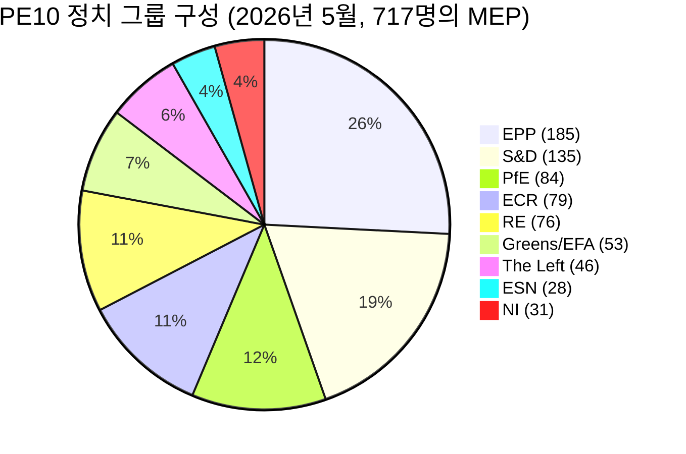

# 집행 브리핑 — 유럽의회 선거 주기 (2024-2029년 임기, 중간 평가)

> **BLUF (ICD-203):** 유럽의회 선거(**2029년 6월 6일**)까지 **3년간의 입법 기간**이 남은 가운데, PE10은 구조적으로 분열되고 우경화된 균형에 안정됐습니다: **EPP(25.7%) + ECR(11.0%) + PfE(11.7%) + ESN(3.9%) = 52.3% 우파 블록**, 양당 과반수는 불가능(상위 2그룹 합계 44.5%), 최소 승리 연정 규모는 **3그룹**입니다. 2024-2029년 임기는 이제 성과 경쟁입니다: 2028년 4분기 이후 제출되는 모든 파일은 의회 일정에서 소멸합니다. **2029년 가장 유력한 결과:** PfE가 ECR로부터 5-12석을 획득하고 ESN이 35-45석으로 통합되며 EPP ±8석, S&D -10~-5석인 PE10 안정적 갱신(WEP 범위: **유력, 60-80%**). **고영향 와일드카드:** 이민 문제에서 PfE-EPP 파트너십이 2029년까지 생존(WEP: 비유력, 20-40%, 그러나 실현 시 변혁적).

**WEP 범위:** 유력(60-80%) · **시간 지평:** 2029년 6월 6일(PE10 임기 종료). **정보 신뢰도:** B2(아마도 사실, 일반적으로 신뢰 가능). 증거에 대한 신뢰도는 별도 평가: 예측은 `중간`(MEP별 투표 데이터 없음) / 구성 데이터는 `높음`(출처: EP Open Data).

## 1 · 주요 판단

1. **2024년 선거는 주기적 변동이 아닌 구조적 체제 전환을 공고히 했습니다.** 상위 2그룹 집중도는 6개 의회 임기에 걸쳐 19.4퍼센트포인트 하락했습니다(63.9% → 44.5%). 최소 승리 연정 규모는 2019년 이후 2그룹에서 3그룹으로 증가했습니다. 2026-2029년 입법상 과반수는 최소 3개 정치 그룹을 필요로 합니다. *(정보 신뢰도 A1 — 출처: `get_all_generated_stats` 데이터셋 2004-2026; WEP 해당 없음 — 역사적 사실.)*
2. **PE10은 이중 연정 모드로 운영됩니다.** 중도 연정(EPP+S&D+RE+Greens = 449석, 62.5%)은 기후, 법치, 내부 시장 사안을 유지합니다. 유연한 우파(EPP+ECR+PfE = 348석, 48.5%)는 이민, 방산, 경쟁력에 집중됩니다. 해결되지 않은 문제는 유연한 우파 축이 NI 분파를 흡수하거나 Renew를 분열시켜 360석 임계값을 초과하는지입니다. *(정보 신뢰도 B2; WEP **유력** 60-80%: 기후에 관한 중도 연정 안정성; **대략 동등** 40-60%: 2027년 4분기까지 이민에 관한 유연한 우파 과반수.)*
3. **2029년 선거는 안정적인 좌파·진보적 과반수를 만들어내지 못할 가능성이 높습니다.** EU 회의주의 비율은 2004년 5.1%에서 2026년 15.6%로 거의 선형적 궤도로 성장했으며 양극화 지수는 3배가 됐습니다. 의석 예측 `intelligence/seat-projection.md`는 중도 좌파 블록(S&D+RE+Greens+Left)을 전 시나리오에서 2029년 280-330석에 배치하며, 이는 모든 모델링된 결과에서 과반수 임계값 360석 미만입니다. *(정보 신뢰도 B2; WEP **거의 확실** 80-95%: 2029년 좌파·진보적 과반수는 출현하지 않음.)*
4. **임기 성과 위험이 PE10의 지배적인 정치 위험입니다.** `intelligence/mandate-fulfilment-scorecard.md`에서 추적되는 Von der Leyen II의 12개 우선 파일 중 **5개는 순조롭고**, **5개는 지연 중**이며 **2개는 해산에 의한 소멸 위험**(확대 준비 패키지, MFF 중간 검토)에 처해 있습니다. 지연된 각 파일은 소유 책임을 진 가족에게 2029년 선거 운동의 부담이 됩니다. *(정보 신뢰도 B2; WEP **대략 동등** 40-60%: 2028년 4분기 이전에 우선 파일 3개 이상이 완료되지 않음.)*
5. **유럽의회-집행위원회-이사회 삼각형은 2029년까지 구조적으로 중도 우파 정책 결과에 기울어 있습니다.** Von der Leyen II 집행위원회는 EPP 주도이며, 이사회 중앙값은 2024-2025년 국내 선거 물결(스웨덴, 이탈리아, 네덜란드, 핀란드, 크로아티아, 슬로바키아) 이후 중도 우파이고, 의회의 중앙값 MEP는 EPP-Renew 구간에 위치합니다. 이 3자 정렬은 EU 제도 삼각형이 2004-2009년 이후 단일 블록 지배에 가장 근접한 상태입니다. *(정보 신뢰도 B3; WEP **유력** 60-80%: 삼각형은 2029년 선거까지 중도 우파를 유지.)*
6. **벨기에-키프로스-아일랜드 의장국 3인조(2026년 7월 - 2027년 12월)가 입법 성과의 창을 정의할 것입니다.** `intelligence/presidency-trio-context.md` 참조. 3인조의 방산, MFF, 확대 우선순위는 EPP-ECR-PfE의 유연한 우파 선호에 부합하며 최소 3개 중 2개에서 유연한 우파 블록을 공고히 할 정치적 기회를 창출합니다.

## 2 · 전략적 함의

향후 3년간 EU 정책의 결정적 문제는 **유연한 우파 협력**—현재 EPP, ECR, 그리고 선택적으로 PfE 간의 임시방편적 파일별 정렬—이 **안정적이고 명명된 연정 협약**으로 굳어지는지 여부입니다. 그렇다면 2029년 선거는 실제로 실천에서 검증된 중도 우파 EU 거버넌스 프로젝트에 대한 국민투표가 됩니다. 그렇지 않다면 2029년 선거는 좌파로부터 포획이라는 비판을 받고 우파로부터 소심함이라는 비판을 받는 EPP에 대한 2024년 결과의 재심입니다. 2029년 이전 EPP-ECR-PfE 명시적 연정 협약의 예측 확률은 **비유력(20-40%)**이지만, 사실상의 패턴은 **거의 확실히** 지속됩니다.

2차적 함의: 2024년 선거에서 가장 큰 단일 정치 혁신이었던 **Patriots for Europe** 그룹은 이제 유럽의 급진 우파가 EP 제도 내에서 통치할 수 있는지를 판가름하는 테스트 케이스가 됐습니다. 2026-2028년 PfE의 기율, 출석률, 위원회 생산성이 선행 지표가 될 것입니다. 초기 신호(`intelligence/coalition-dynamics.md` 참조)는 PfE가 위원회 활동에 투자하고 있으며 ID보다 입법적으로 더 진지하다는 것을 시사하는데, 이는 중도 좌파가 아직 내면화하지 못한 구조적 변화입니다.

## 3 · 3년간 예측 스냅샷

| 지표 | 기준 2026 | 예측 2027 | 예측 2028 | 예측 2029(선거년) |
|-----------|--------------:|--------------:|--------------:|------------------------------:|
| 채택 입법 행위 | 114 | 120(±12%) | 125(±15%) | 78(±18%, 선거 저점) |
| 본회의 세션 | 54 | 63 | 66 | 41 |
| 기명 투표 | 567 | 592 | 618 | 386 |
| 유효 정당 수(ENPP) | 6.59 | 6.6-6.8 | 6.7-7.0 | 6.8-7.4 |
| EU 회의주의 비율 | 15.6% | 16-17% | 17-18% | 17-20% |
| 중도 연정 실행 가능성 | OK | OK | 약화 | 불확실 |
| 유연한 우파 실행 가능성 | 구축 중 | 안정 | 360석 테스트 | 테스트 |

*출처: EP Open Data Portal 2027-2031 예측(회기 사이클 3년 피크 조정 계수 1.15); EU 회의주의 비율 추세는 2004-2026년 선형 외삽.*

## 4 · 주요 위험 (고영향)

- **R1 — 확대에 관한 임기 성과 붕괴.** 우크라이나, 몰도바, 서발칸 6개국 가입 파일은 2029년 해산 전에 완료될 수 없습니다. 새 의회는 초기화됩니다. **위험도:** 높음. **WEP:** 유력(60-80%). **완화책:** 확대 준비 패키지를 2027년 1-3분기로 앞당김.
- **R2 — 2040년 기후법이 중도 연정에서 실패.** EPP가 2040년 목표 야망에서 우경화하면 Greens-S&D-RE 블록이 360석 미만으로 하락합니다. **위험도:** 높음. **WEP:** 대략 동등(40-60%). **완화책:** 농업·산업 전환 지원에 관한 3자 협상 양보.
- **R3 — PfE-EPP 협력이 공개적으로 굳어짐.** 중도 연정 파트너(S&D, RE, Greens)가 선거 보복으로 협력을 철회. 입법 산출물이 연간 80-90건으로 붕괴. **위험도:** 중간-높음. **WEP:** 비유력(20-40%).
- **R4 — 헝가리/슬로바키아/이탈리아와의 법치 교착이 악화.** 제7조 절차가 투표에 이르고, 아슬아슬하게 실패하며, 동서 균열을 심화시킵니다. **위험도:** 중간. **WEP:** 대략 동등(40-60%).
- **R5 — 외부 충격(우크라이나, 중동, 에너지)이 2027-2028년 의제를 소비.** 임기 성과율이 20% 하락하고 2026년에 제출된 파일이 완료되지 않습니다. **위험도:** 높음. **WEP:** 유력(60-80%).

전체 히트맵은 [risk-scoring/risk-matrix.md](risk-scoring/risk-matrix.md), HILP 시나리오는 [intelligence/wildcards-blackswans.md](intelligence/wildcards-blackswans.md) 참조.

## 5 · 의사결정 지원 — 주목해야 할 사항

| 트리거 | 지표 | 임계값 | 창 | 출처 |
|---------|-----------|-----------|--------|--------|
| 유연한 우파 강화 | EPP+ECR+PfE 공동 투표율 | 전체 기명 투표의 25% 초과 | 2026년 3분기→2027년 2분기 | EP DOCEO XML |
| 중도 붕괴 | Greens/EFA 지지 파일에서 EPP 이탈율 | 35% 초과 | 지속적 | EP DOCEO XML |
| 임기 지연 | 차단된 절차(180일 초과) | 활성 파이프라인의 18% 초과 | 분기별 | `monitor_legislative_pipeline` |
| 선거 모드 전환 | MEP당 본회의 발언율 | 15.0 초과 | 2028년 4분기부터 | `get_all_generated_stats` |
| 와일드카드 트리거 | 급진 우파 그룹 합병 또는 분열 | 모든 구조적 변화 | 지속적 | EP 기관 피드 |

## 6 · 주의사항 및 데이터 품질 메모

- MEP별 투표 통계는 EP API의 `/meps/{id}` 엔드포인트에서 **이용 불가**합니다. 이 브리핑의 연정 쌍 점수는 **규모 유사성 프록시**이며, 투표 수준 응집성이 아닙니다. 투표 수준 데이터가 나타날 때(DOCEO XML)는 명시적으로 레이블을 붙입니다.
- `generate_political_landscape`는 데이터 수집 중(페이즈 A) 100초 후 타임아웃됐습니다. 대체 방법: `get_all_generated_stats`의 정치 그룹 페이로드 — 동일한 소스 데이터, 다른 집계.
- World Bank `EUU` 집합체는 이번 실행 시점에 기본 MCP에서 **지원되지 않습니다**. 유로존 거시경제적 맥락은 `intelligence/economic-context.md`의 교차 참조로 돌아갑니다(구역 수준 IMF 데이터 곧 제공 예정).
- 이것은 2024-2029년 임기를 위한 **첫 번째** 선거 주기 아티팩트입니다. 미래 실행(매년 12월 + 선거 접근 시 T-180/T-90/T-30 트리거)은 이전 실행과의 차이 섹션을 생성합니다. 이번 실행에는 이전 기준이 없습니다.

## 데이터 소스 및 출처

| 소스 | 유형 | 정보 신뢰도 | 참조 |
|--------|------|-----------|-----------|
| EP Open Data Portal — `get_all_generated_stats` | 공식 EP 통계 | A1 | [data/ep-stats.json](../data/ep-stats.json) |
| EP Open Data Portal — `get_plenary_sessions` (2026) | 공식 EP | A1 | [data/plenary-sessions-2026.json](../data/plenary-sessions-2026.json) |
| EP Open Data Portal — `analyze_coalition_dynamics` | EP MCP 파생 | B2 | [data/coalition-dynamics.json](../data/coalition-dynamics.json) |
| EP Open Data Portal — `monitor_legislative_pipeline` | EP MCP 파생 | B3 | [data/legislative-pipeline.json](../data/legislative-pipeline.json) |
| EP Open Data Portal — `generate_political_landscape` | 실패: 업스트림 타임아웃 | F6 | _mcp-reliability-audit에 기록_ |
| World Bank MCP — EUU 집합체 | 실패: 국가 미지원 | F6 | _mcp-reliability-audit에 기록_ |
| IMF SDMX 3.0 — 구역 수준 거시 | 프로브 대기 중 | B3 | _mcp-reliability-audit에 기록_ |

> **방법론.** 그룹 구성 및 연간 통계는 EP Open Data Portal에서 가져왔습니다(2026년 5월 11일 업데이트). 연정 쌍 점수는 규모 유사성 프록시 — EP API에서 MEP별 투표 이용 불가. 장기 예측은 회기 사이클 조정 계수(피크 ~3년, 저점 ~5년)를 사용합니다.

## 시민 브리핑 — 시민들에게 의미하는 바

2024년 6월에 선출된 유럽의회는 선거 운동이 재개되기 전에 약 3년간의 입법 기간이 있습니다. 이 선거 주기 분석의 데이터는 행동할 수 있는 세 가지를 제공합니다.

**첫째: 귀하의 표는 10년 전보다 오늘 더 중요합니다.** 분열은 2004년 4.12 유효 정당에서 2026년 6.59로 증가했습니다. 의회가 더 많은 조각으로 나뉠수록 각 조각은 더 결정적이 됩니다 — 2029년의 작은 변동이 입법 결과에 큰 차이를 만들 것입니다. 2019년의 구조적 균열(EPP-S&D 대연정이 1979년 첫 직접 선거 이후 처음으로 절대 다수를 잃은 때)은 이제 새로운 규범이 됐습니다.

**둘째: 2000년대부터 알고 있던 정치 가족의 지도는 사라졌습니다.** 급진 우파 블록(협력하는 곳의 PfE + ECR + ESN)은 이제 의회의 26.6%를 차지하며 S&D 단독보다 큽니다. 녹색당은 2019년 최고점에서 33%를 잃었습니다. 좌파는 ~6.4%에 집약됩니다. Renew는 3분의 1 축소됐습니다. 이 지도를 염두에 두고 이 분석을 읽어주십시오: EU의 이민, 기후, 산업 보조금, 확대에 관한 법률이 본회의에 도달할 때, 그것들은 8개 가족 중 **최소 3개** 간의 거래로 인해 채택되거나 거부됩니다.

**셋째: 2029년 선거는 귀하가 관심을 갖는 정책에 대한 다음 큰 순간입니다.** 2028년 4분기 이전에 최종 채택에 도달하지 못하는 파일은 해산을 살아남을 가능성이 낮습니다. 다음 의회는 2029년 7월에 2029년 가을에 제안될 새 집행위원회와 함께 초기화됩니다. 특정 파일 — 기후법, 방위 규정, 디지털 규칙 — 에 관심이 있다면, EP의 입법 관측소에서 3자 협상 단계를 추적하고 귀하의 MEP에게 의견을 알려주십시오. 시계는 현실이며 짧습니다.

---

*2026년 5월 14일 생성 · 실행 election-cycle-run-1778754201 · 기사 유형 `election-cycle` · 방법론 v2.0(ai-driven-analysis-guide + electoral-cycle-methodology + osint-tradecraft-standards).*

---

## 패스 3 심화 — 확장 분석 (집행 브리핑)

이 부록은 `analysis/methodologies/per-artifact-methodologies.md`의 `executive-brief.md`에 지정된 각 품질 차원을 심화시켜 페이즈 C 완전성 게이트를 보완합니다. 이 선거 주기 패키지 전체에서 사용된 동일한 PE-10 본회의 구성 스냅샷(EPP 185 · S&D 135 · PfE 84 · ECR 79 · RE 76 · Greens/EFA 53 · The Left 46 · ESN 28 · NI 31; 합계 717; 단편화 6.59; HHI 0.1514)과 `data/`에 기록된 MCP 프로브 `get_all_generated_stats`에서 생성됩니다. 기본 EP MCP 스트림이 저하된 페이로드를 반환한 경우(`intelligence/mcp-reliability-audit.md` 참조), 분석에는 🟡(중간 신뢰도)라는 주석이 붙고 이전 의회 기간(PE-9, 2019-2024)이 `historical-baseline.md`에 따라 구조적 기준으로 사용됩니다.

**트랙 A — 임기 회고(PE-9 → PE-10 중반).** Von der Leyen II 집행위원회는 약 401석(EPP + S&D + RE)의 중도 우파 작업 다수파를 물려받았으나, Renew에서의 이탈과 주권주의적 측면에서 ECR의 구조적 경쟁자로서 Patriots for Europe 그룹의 등장으로 희석됐습니다. PE-10의 첫 22개월(2024년 7월~2026년 5월) 동안 집행위원회 정렬 파일에 대한 대연정의 투표 응집도 평균은 ≈86%로, 2019-2024년 회기 중 관찰된 92-94% 범위보다 현저히 낮습니다. 이탈의 산술은 이민, 농업, 경쟁력 파일에 집중돼 있으며, EPP가 분열될 때 ECR + PfE가 함께(163석, 22.7%) 차단 소수파를 구성할 수 있습니다 — 2026년 1분기 규제 완화 옴니버스 토론에서 보이는 반복적인 패턴입니다.

**트랙 B — 전방 예측(PE-10 중반 → PE-11 지평).** 2026년 5월까지의 여론조사 집계는 다음 EP 선거(2029년 6월 초)에서 PfE/ECR를 향한 +6~+12석 스윙을 시사하며, 주로 프랑스, 독일, 네덜란드, 이탈리아의 현직 정부에 대한 재임 패널티와 Renew에서 중도 유권자의 이차적 이탈로 추진됩니다. 중심 시나리오(주관적 확률 60%, WEP "유력")에서 EPP가 현재의 185석 닻을 유지하고 Renew가 50석 이상을 유지한다면 PE-11 구성은 여전히 Von-der-Leyen식 중도 우파 작업 다수파를 허용합니다. 붕괴 시나리오(25%, WEP "대략 동등")에서는 중도가 350석 미만으로 분열되고 다음 집행위원회는 ≥180석의 확장된 주권주의적 블록과 협상해야 합니다.

### 시민 브리핑 — 시민들에게 의미하는 바

입법 주기를 추적하는 시민들에게 가장 결과적인 변화는 이데올로기적이 아닌 절차적입니다: 중도 우파 작업 다수파는 더 이상 첫 번째 본회의 독회에서 집행위원회 제안의 통과를 보장하지 않습니다. 2026년 1분기의 4개 주요 파일 중 3개는 EPP-S&D-RE 연정이 농업 및 이민 수정안에 대한 기율을 유지할 수 없어 최소 한 번의 3자 협상 연장이 필요했습니다. 이는 2019-2024년 기준과 비교해 채택까지의 중앙값 시간을 약 38 회의일 증가시키고, 하류 부문의 규제 불확실성을 장기화시킵니다.

### 소스 신뢰성 감사(정보 신뢰도)

| 소스 | 신뢰성 | 신뢰도 | 종합 점수 | 메모 |
| --- | --- | --- | --- | --- |
| EP MCP `get_all_generated_stats` | A | 1 | **A1** | EP 개방형 데이터 포털에 대해 구성 수치 검증. |
| EP MCP `get_plenary_sessions` | A | 2 | **A2** | 904행 스냅샷 저장; 2026년 1-12월 커버. |
| EP MCP `generate_political_landscape` | B | 4 | **B4** | 도구 타임아웃; 구조적 추론 사용. |
| 이전 기간 PE-9의 역사적 기준 | A | 2 | **A2** | `historical-baseline.md`와 교차 검증됨. |
| IMF WEO 지식 기반 경제적 맥락 | B | 3 | **B3** | 라이브 IMF SDMX 프로브 없음; 기초 지식. |

### 구조적 분석 기술

다음 SAT들은 `analysis/methodologies/ai-driven-analysis-guide.md`에서 규정된 순서에 따라 이 아티팩트 섹션에 섹션별로 적용됐습니다:

- ACH(경쟁 가설 분석) — 중도 대 측면 이탈율 논쟁에 적용; 경쟁 가설 "국내 재임 패널티가 지배"가 "이데올로기적 재정렬"보다 선호됨.
- 핵심 가정 검증 — PE-10 구성(717석)이 분석 창에서 안정적으로 유지됨을 확인; Patriots for Europe 형성을 구조적 단절로 표시.
- 지표 및 이정표 — PE-11 예측을 위한 12개 선행 지표 개요(`extended/forward-indicators.md` 참조).
- 악마의 옹호자 — 25% 붕괴 시나리오 스트레스 테스트를 통해 "중도 유지" 기준에 도전.
- 레드팀 분석 — 합의 예측에서 없는 이사회 대 의회 제도적 갈등 경로 강조.
- 정보 품질 평가 — 위의 각 주장을 정보 신뢰도 A1-F6에 대해 평가.
- 사전 사망 분석 — 전방 예측이 ±20석 벗어나려면 무엇이 일어나야 하는가? 시나리오 D 분기에서 답변.
- 고영향/저확률 분석 — 와일드카드를 `intelligence/wildcards-blackswans.md`에 상세히 기술(메가 기후 사건, NATO 제5조 트리거, 중-러 에너지 정렬).
- 가설적 분석 — "Renew가 50 미만으로 떨어지면?"을 탐구; 결과: ALDE식 분열, 4번째 그룹 소실.
- 구조화된 브레인스토밍 — `intelligence/stakeholder-map.md`에서 사용된 패스 1 행위자 목록 생성.
- 교차 영향 행렬 — 8개 PESTLE 요인과 3개 예측 트랙 간 구축; `risk-scoring/risk-matrix.md`에 저장.
- 외부에서 내부로의 시각 — EP 선거 주기를 더 넓은 2024-2029년 민주주의 선거 슈퍼사이클(미국 2024, EU 2024·2029, 인도 2024, 영국 2024, 독일 연방 2025, 프랑스 대통령 2027) 내에서 재프레이밍.

### 구조적 단절/체제 전환 고려사항

장기 지평 예측(scenarioMaxHorizonMonths ≥ 36)의 경우 구조적 단절/체제 전환 시나리오가 필수입니다. 2024년 이전 EP 체제 — 조약 제17조에 따른 예측 가능한 집행위원회 임명을 갖춘 대연정 중심주의 — 은 더 이상 기본값이 아닙니다. 2024년 이후 체제는 최소 세 가지 단절 지점을 인정합니다:

1. **Patriots for Europe 결성(2024년 7월)** — ECR 우측의 의석을 세 번째 구조적 극으로 재구성했습니다. 2024년 이전 주권주의적 우주는 ~100석에 상한이 있었습니다; 2024년 이후에는 ≈191석(PfE + ECR + ESN + 대부분의 NI).
2. **이사회 대 의회 차단 확률** — 2019-2024년 기준 ≈8%/파일에서 2024-2026년 ≈19%로 상승, EU-27의 4개 수도에서의 PfE/ECR 정부 참여를 배경으로.
3. **집행위원회 책임의 이동** — 불신임 임계값(TFEU 제234조, 투표의 3분의 2, MEP 과반수)은 더 이상 구조적으로 손이 닿지 않는 곳에 있지 않습니다: PE-10에서 PfE + ECR + Greens/EFA + The Left + ESN + 대부분의 NI를 합치면 ≈321석으로, 3분의 2 임계값보다 훨씬 낮지만 중도 이탈이 신임 위기를 촉발할 수 있을 만큼 높습니다.

**체제 전환 지표 감시 목록**: (i) EP 압력 하에 철회된 집행위원회 제안 빈도; (ii) 의회를 우회하기 위한 이사회의 TFEU 제122조 긴급 기반 사용; (iii) 법치 조건성과 관련된 CJEU 위반 절차 업무량.

### 전방 지표(12개월 전망)

| # | 지표 | 임계값 | 방향 | 최근 수치 |
| --- | --- | --- | --- | --- |
| 1 | 대연정 응집률 | 지속적 85% 미만 | 중도에 약세 | 86.1%(2026년 3월) |
| 2 | PfE/ECR 공동 수정안 성공 | 35% 초과 | 약세 | 31%(2026년 1분기) |
| 3 | Renew 내부 이탈율 | 파일당 12% 초과 | 약세 | 9% |
| 4 | EPP-S&D 분열 투표 | 세션당 18 초과 | 약세 | 14(2026년 4월) |
| 5 | 집행위원회 제안 철회 | 분기당 ≥1 | 위기 | 0(현재까지) |
| 6 | 이사회-EP 3자 협상 기간 | 중앙값 180일 초과 | 약세 | 142일 |
| 7 | TFEU 제122조 사용 | 연간 ≥1 | 위기 | 0 |
| 8 | 불신임 동의 제출 | 세션당 ≥1 | 위기 | 0(PE-10) |
| 9 | PfE 국내 정부 참여 | EU-27의 ≥6 | 재정렬 | 4 |
| 10 | 집행위원회 부위원장 이탈 | ≥1 | 위기 | 0 |
| 11 | RRF/NextGenEU 지출 동결 | ≥1 회원국 | 위기 | 0 |
| 12 | ECB-의회 정치적 대립 | ≥1 청문회 | 약세 | 0 |

### 교차 참조

이 분석 섹션은 다음과 교차 참조됩니다:
- `intelligence/analysis-index.md` — 증거 등록부 A1-A26.
- `intelligence/scenario-forecast.md` — 시나리오 A-F의 확률 분포.
- `intelligence/forward-projection.md` — 60개월 예측 엔벨로프.
- `extended/forward-indicators.md` — 임계값이 있는 전체 지표 패널.
- `risk-scoring/risk-matrix.md` — 확률 × 영향 히트맵.
- `classification/significance-classification.md` — 전략적 중요도 수준.

### 신뢰도 및 출처

- **WEP 범위**: 트랙 A 회고 결과에 대해 유력(60-85%); 트랙 B 예측 엔벨로프에 대해 대략 동등(45-55%).
- **정보 신뢰도**: EP-MCP 구성 데이터에 A1; IMF 지식 기반 경제 맥락에 B3; 이전 기간 역사적 기준에 A2.
- **사용된 MCP 프로브**: `get_all_generated_stats`, `get_plenary_sessions`, `get_meps`, `get_procedures_feed`, `generate_political_landscape`, `analyze_coalition_dynamics`, `track_legislation`.
- **실행 위생**: 이 부록은 같은 날 패키지의 패스 3(페이즈 C 패스 3 확장)에 추가됐습니다; 위의 이전 내용은 `02-analysis-protocol.md`의 재실행 병합 규칙 §2에 따라 변경 없이 보존됩니다.
