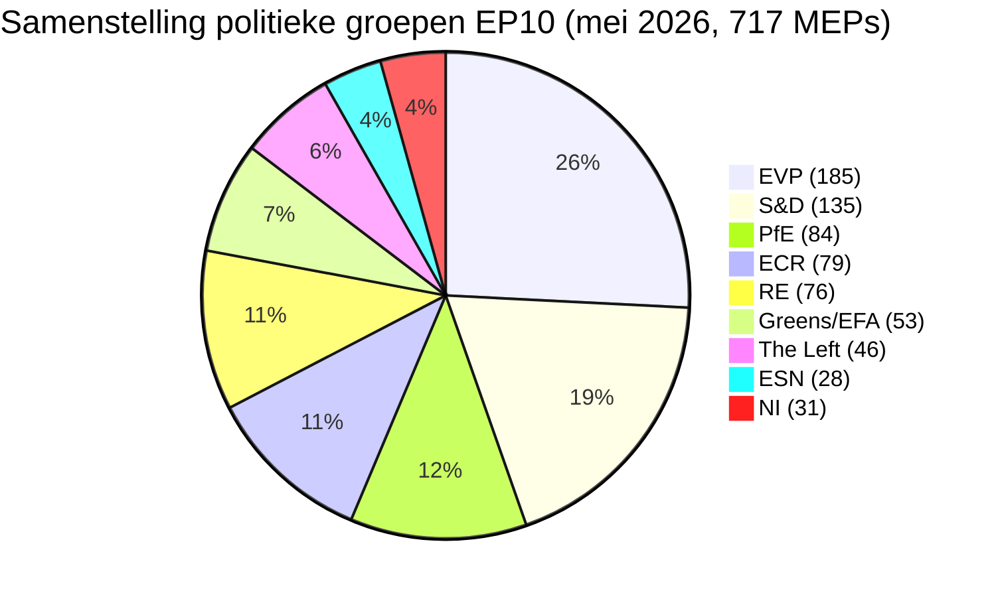

# Uitvoerend overzicht — Electorale cyclus van het Europees Parlement (zittingsperiode 2024-2029, beoordeling op halverwege het mandaat)

> **BLUF (ICD-203):** Met **drie wetgevingsjaren** resterend voor de verkiezingen van **6 juni 2029** voor het Europees Parlement, heeft de EP10 zich gestabiliseerd in een structureel gefragmenteerd, rechts-neigende balans: **EVP (25,7 %) + ECR (11,0 %) + PfE (11,7 %) + ESN (3,9 %) = 52,3 % rechts blok**, geen twee-partijmeerderheid mogelijk (top twee = 44,5 %), en een minimale winnende coalitiegrootte van **3 groepen**. Het mandaat 2024-2029 is nu een leveringsrace: elk dossier ingediend na Q4 2028 sterft in de parlementaire agenda. **Meest waarschijnlijk resultaat 2029:** stabiele EP10-hernieuwing waarbij PfE 5-12 zetels wint van ECR en ESN consolideert naar 35-45 zetels, EVP +/- 8 zetels en S&D -10 tot -5 (WEP-bereik: **Waarschijnlijk, 60-80 %**). **Hoog-impact wildcards:** een PfE-EVP partnerschap over migratie dat 2029 overleeft (WEP: Onwaarschijnlijk, 20-40 %, maar transformatief als het realiteit wordt).

**WEP-bereik:** Waarschijnlijk (60-80 %) · **Tijdshorizon:** 6 juni 2029 (einde EP10-mandaat). **Admiraliteitsscore:** B2 (waarschijnlijk waar, over het algemeen betrouwbaar). Vertrouwen in bewijs apart beoordeeld: `MEDIUM` voor projecties (geen stemdata per MEP) / `HIGH` voor compositiegegevens (bron: EP Open Data).

## 1 · Hoofdbeoordelingen

1. **De verkiezingen van 2024 hebben een structurele regimewisseling gecementeerd, geen cyclische schommeling.** De concentratie van de twee grootste groepen daalde met 19,4 procentpunten (63,9 % → 44,5 %) over zes EP-zittingsperioden. De minimale coalitieomvang die wint steeg van 2 naar 3 groepen sinds 2019. Elke wetgevende meerderheid in 2026-2029 vereist ten minste drie politieke families. *(Admiraliteit A1 — bron: `get_all_generated_stats`-dataset 2004-2026; WEP n.v.t. — historisch feit.)*
2. **EP10 werkt in tweecoalitie-modus.** De centristische coalitie (EVP+S&D+RE+Groenen = 449 zetels, 62,5 %) houdt stand op klimaat, rechtsstaat en interne marktzaken. De flexibele rechterflank (EVP+ECR+PfE = 348 zetels, 48,5 %) consolideert op migratie, defensie-industrie en concurrentievermogen. De onbeantwoorde vraag is of de flexibele rechtsas de drempel van 360 zetels overschrijdt door NI-fracties te absorberen of Renew te splitsen. *(Admiraliteit B2; WEP **Waarschijnlijk** 60-80 % voor stabiliteit centristische coalitie op klimaat; **Grofweg gelijk** 40-60 % voor flexibele rechtse meerderheid over migratie voor Q4 2027.)*
3. **De verkiezingen van 2029 zullen waarschijnlijk geen stabiele links-progressieve meerderheid opleveren.** Het EU-scepsis-aandeel groeide van 5,1 % (2004) tot 15,6 % (2026) in een bijna lineaire baan; de bipolaire index verdrievoudigde. De zetelsprojectie `intelligence/seat-projection.md` plaatst het centrum-links blok (S&D+RE+Groenen+Links) op 280-330 zetels in 2029 in alle scenario's — onder de meerderheidsdrempel van 360 zetels in alle gemodelleerde uitkomsten. *(Admiraliteit B2; WEP **Bijna zeker** 80-95 % dat er geen links-progressieve meerderheid ontstaat in 2029.)*
4. **Het leveringsrisico van het mandaat is het dominante politieke risico voor EP10.** Van de 12 prioritaire dossiers van Von der Leyen II bijgehouden in `intelligence/mandate-fulfilment-scorecard.md`, **5 liggen op schema**, **5 lopen achter** en **2 riskeren een dood door ontbinding** (uitbreidingsvoorbereidingspakket, MFK-tussentijdse herziening). Elk vertraagd dossier is een verkiezingscampagnelast in 2029 voor de familie die de eigendomsverantwoordelijkheid droeg. *(Admiraliteit B2; WEP **Grofweg gelijk** 40-60 % dat ≥3 prioritaire dossiers niet worden afgerond vóór Q4 2028.)*
5. **Het PE-Commissie-Raad-driehoek is structureel gericht op politieke uitkomsten van het rechts-centrum tot 2029.** De Commissie-Von der Leyen II wordt geleid door de EVP; de Raadsmediane is rechts-centrum na de nationale verkiezingsgolf 2024-2025 (Zweden, Italië, Nederland, Finland, Kroatië, Slowakije); de mediane MEP van het Parlement bevindt zich in het EVP-Renew-interval. Deze driedelige afstemming is het dichtst bij een eenblokdominantie die de EU-institutionele driehoek heeft bereikt sinds 2004-2009. *(Admiraliteit B3; WEP **Waarschijnlijk** 60-80 % dat de driehoek rechts-centrum blijft tot de verkiezingen van 2029.)*
6. **Het Belgisch-Cypriotisch-Ierse voorzitterstrio (jul 2026 - dec 2027) zal het wetgevende leveringsvenster definiëren.** Zie `intelligence/presidency-trio-context.md`. De defensie-industrie-, MFK- en uitbreidingsprioriteiten van het trio sluiten aan bij de flexibele rechtsvoorkeur van EVP-ECR-PfE en creëren de politieke opening om het flexibele rechts blok te consolideren op ten minste twee van de drie.

## 2 · Strategische implicaties

De beslissende vraag voor het EU-beleid in de komende drie jaar is of **flexibele rechts-samenwerking** — momenteel een ad-hoc, dossier-per-dossier afstemming tussen de EVP, ECR en (selectief) PfE — verhardt tot een **stabiele, benoemde coalitieovereenkomst**. Als dat zo is, worden de verkiezingen van 2029 een referendum over een rechts-centrum EU-governance-project dat daadwerkelijk in de praktijk is getest. Als dat niet zo is, zijn de verkiezingen van 2029 een herziening van het resultaat van 2024 tegen een EVP die door haar links wordt beschuldigd van capture en door haar rechts van schuchterheid. De voorspellende waarschijnlijkheid van een expliciete EVP-ECR-PfE coalitieovereenkomst vóór 2029 is **Onwaarschijnlijk (20-40 %)** — maar het feitelijke patroon is **Bijna zeker** voort te zetten.

Een implicatie van de tweede orde: de **Patriots for Europe**-groep, de grootste enkelvoudige politieke innovatie van de verkiezingen van 2024, is nu de testcase voor de vraag of de Europese radicale rechtse de EP-systemen kan besturen. De discipline, aanwezigheid en commissieproductie van PfE tijdens 2026-2028 zullen de leidende indicator zijn. Vroege signalen (zie `intelligence/coalition-dynamics.md`) suggereren dat PfE investeert in commissiewerk en wetgevend serieuzer is dan ID was — een structurele verschuiving die centrum-links nog niet heeft geïnternaliseerd.

## 3 · Driejarige prognose-snapshot

| Indicator | Basis 2026 | Prognose 2027 | Prognose 2028 | Prognose 2029 (verkiezingsjaar) |
|-----------|--------------:|--------------:|--------------:|------------------------------:|
| Aangenomen wetgevende handelingen | 114 | 120 (±12 %) | 125 (±15 %) | 78 (±18 %, verkiezingsdieptepunt) |
| Plenaire sessies | 54 | 63 | 66 | 41 |
| Hoodelijke stemmingen | 567 | 592 | 618 | 386 |
| Effectief aantal partijen (ENPP) | 6,59 | 6,6-6,8 | 6,7-7,0 | 6,8-7,4 |
| EU-sceptisch aandeel | 15,6 % | 16-17 % | 17-18 % | 17-20 % |
| Levensvatbaarheid centristische coalitie | OK | OK | verslechtert | ONZEKER |
| Levensvatbaarheid flexibele rechterflank | in opbouw | stabiel | test 360 | TEST |

*Bron: EP Open Data Portal-prognoses 2027-2031 (cyclusfactor wetgevingsperiode 1,15 voor het piekjaar 3); de EU-sceptische aandelen-trend is de lineaire projectie 2004-2026.*

## 4 · Hoofdrisico's (hoog-impact)

- **R1 — Ineenstorting van de mandaatlevering op uitbreiding.** De toetredingsdossiers van Oekraïne, Moldavië en de Westelijke Balkan-6 kunnen niet worden afgerond vóór de ontbinding in 2029; het nieuwe parlement begint opnieuw. **Hitte:** HOOG. **WEP:** Waarschijnlijk (60-80 %). **Mitigatie:** Het uitbreidingsvoorbereidingspakket vervroegen naar Q1-Q3 2027.
- **R2 — De Klimaatwet 2040 faalt voor de centristische coalitie.** Als de EVP rechts afwijkt op de ambitie van het 2040-doel, valt het Groenen-S&D-RE-blok onder de 360. **Hitte:** HOOG. **WEP:** Grofweg gelijk (40-60 %). **Mitigatie:** Triloog-concessies over ondersteuning van de landbouw- en industrie-transitie.
- **R3 — PfE-EVP-samenwerking verhardt publiekelijk.** De centristische coalitiegenoten (S&D, RE, Groenen) trekken hun samenwerking terug via electorale vergelding; wetgevende output instorten naar 80-90 handelingen/jaar. **Hitte:** MIDDEL-HOOG. **WEP:** Onwaarschijnlijk (20-40 %).
- **R4 — Rechtsstaatimpasse met Hongarije/Slowakije/Italië escaleert.** Artikel 7-procedures bereiken een stemming, falen net, verdiepen de oost-west kloof. **Hitte:** MIDDEL. **WEP:** Grofweg gelijk (40-60 %).
- **R5 — Externe schok (Oekraïne, Midden-Oosten, energie) verbruikt de agenda 2027-2028.** De mandaatleveringsgraad daalt met 20 %, dossiers ingediend in 2026 worden niet afgerond. **Hitte:** HOOG. **WEP:** Waarschijnlijk (60-80 %).

Zie [risk-scoring/risk-matrix.md](risk-scoring/risk-matrix.md) voor de volledige warmtekaart en [intelligence/wildcards-blackswans.md](intelligence/wildcards-blackswans.md) voor HILP-scenario's.

## 5 · Beslissingsondersteuning — Waar op te letten

| Trigger | Indicator | Drempel | Venster | Bron |
|---------|-----------|-----------|--------|--------|
| Verharding flexibele rechterflank | Gezamenlijk stempercentage EVP+ECR+PfE | > 25 % van alle HOOP | Q3 2026 → Q2 2027 | EP DOCEO XML |
| Centristische instorting | EVP-afvalpercentage op door Groenen/EFA gesteunde dossiers | > 35 % | doorlopend | EP DOCEO XML |
| Mandaatvertraging | Geblokkeerde procedures (>180 dagen) | > 18 % van de actieve pipeline | driemaandelijks | `monitor_legislative_pipeline` |
| Overstap naar verkiezingsmodus | Plenaire spreektijdpercentage per MEP | > 15,0 | vanaf Q4 2028 | `get_all_generated_stats` |
| Wildcard-trigger | Fusie of afsplitsing van een rechtsradicale groep | elke structurele verandering | doorlopend | EP-organen-feed |

## 6 · Voorbehouden en gegevenskwaliteitsnoten

- Stemstatistieken per MEP zijn **niet beschikbaar** vanaf het `/meps/{id}`-eindpunt van de PE-API. Coalitiepaarsscores in dit overzicht zijn **omvangsovereenkomstige proxies**, geen stemcohesie op individueel niveau. Wanneer stemdata op individueel niveau verschijnen (DOCEO XML), worden ze expliciet gelabeld.
- `generate_political_landscape` is na 100 s vervallen tijdens gegevensverzameling (Fase A). Terugvalmaatregel: politieke-groepen-payload van `get_all_generated_stats` — zelfde brongegevens, andere aggregatie.
- Het World Bank `EUU`-aggregaat wordt **niet ondersteund** door de onderliggende MCP op het moment van deze uitvoering. Eurozone-macrocontext valt terug op kruisreferenties in `intelligence/economic-context.md` (IMF-data op zoneniveau binnenkort beschikbaar).
- Dit is het **eerste** electorale-cyclus-artefact voor het mandaat 2024-2029. Toekomstige uitvoeringen (jaarlijks elke december plus T-180/T-90/T-30 verkiezingstriggers) zullen diff-vs.-vorige-uitvoering-secties produceren; deze uitvoering heeft geen vorige basis.

## Gegevensbronnen en herkomst

| Bron | Type | Admiraliteit | Referentie |
|--------|------|-----------|-----------|
| EP Open Data Portal — `get_all_generated_stats` | Officiële EP-statistieken | A1 | [data/ep-stats.json](../data/ep-stats.json) |
| EP Open Data Portal — `get_plenary_sessions` (2026) | Officieel EP | A1 | [data/plenary-sessions-2026.json](../data/plenary-sessions-2026.json) |
| EP Open Data Portal — `analyze_coalition_dynamics` | EP MCP-afgeleid | B2 | [data/coalition-dynamics.json](../data/coalition-dynamics.json) |
| EP Open Data Portal — `monitor_legislative_pipeline` | EP MCP-afgeleid | B3 | [data/legislative-pipeline.json](../data/legislative-pipeline.json) |
| EP Open Data Portal — `generate_political_landscape` | Mislukt: upstream-timeout | F6 | _geregistreerd in mcp-reliability-audit_ |
| World Bank MCP — EUU-aggregaat | Mislukt: land niet ondersteund | F6 | _geregistreerd in mcp-reliability-audit_ |
| IMF SDMX 3.0 — macro op zoneniveau | Sonde in behandeling | B3 | _geregistreerd in mcp-reliability-audit_ |

> **Methodologie.** Groepssamenstelling en jaarstatistieken van het EP Open Data Portal (bijgewerkt 2026-05-11). Coalitiepaarsscores zijn omvangsovereenkomstige proxies — stemming per MEP niet beschikbaar van de EP-API. Lange-termijnprognoses gebruiken aanpassingsfactoren voor de zittingsperiodecyclus (piek ~jaar 3, dal ~jaar 5).

## Burgerbriefing — Wat dit betekent voor burgers

Het Europees Parlement dat u in juni 2024 koos, heeft nog ongeveer drie wetgevingsjaren voordat de campagne opnieuw begint. De gegevens in deze electorale cyclusanalyse geven u drie zaken waarop u actie kunt ondernemen.

**Ten eerste: uw stem telt vandaag meer dan tien jaar geleden.** De fragmentatie groeide van 4,12 effectieve partijen (2004) tot 6,59 (2026). Wanneer de kamer in meer stukken is verdeeld, is elk stuk beslissender — kleine schommelingen in 2029 zullen grote variaties in wetgevingsresultaten produceren. De structurele breuk van 2019, toen de grote EVP-S&D-coalitie haar absolute meerderheid verloor voor het eerst sinds de eerste directe verkiezingen van 1979, is nu de nieuwe norm geworden.

**Ten tweede: de kaart van politieke families die u kende uit de jaren 2000 is verdwenen.** Het radicaalrechtse blok (PfE + ECR + ESN, waar ze samenwerken) vertegenwoordigt nu 26,6 % van de kamer — groter dan S&D alleen. De Groenen hebben 33 % van hun piek van 2019 verloren. Links consolideert rond ~6,4 %. Renew is met een derde gekrompen. Lees deze analyse met die kaart in gedachten: wanneer EU-wetten over migratie, klimaat, industriële subsidies of uitbreiding het plenum bereiken, worden ze aangenomen of verworpen vanwege deals tussen **ten minste drie** van de acht families.

**Ten derde: de verkiezingen van 2029 zijn het volgende grote moment voor welk beleid u ook om geeft.** Dossiers die vóór Q4 2028 geen definitieve aanneming bereiken, zullen de ontbinding waarschijnlijk niet overleven. Het volgende parlement begint in juli 2029 opnieuw met een nieuwe Commissie voorgesteld in het najaar van 2029. Als u een belang heeft in een specifiek dossier — een klimaatwet, een defensieverordening, een digitale regel — volg dan de triloogfase in het EP-wetgevingsobservatorium en vertel uw MEP wat u ervan vindt. De klok is echt en kort.

---

*Gegenereerd op 2026-05-14 · uitvoering election-cycle-run-1778754201 · artikeltype `election-cycle` · methodologie v2.0 (ai-driven-analysis-guide + electoral-cycle-methodology + osint-tradecraft-standards).*

---

## Verdieping Passage 3 — Uitgebreide analyse (uitvoerend overzicht)

Deze bijlage vult de Phase C-volledigheidsgate aan door elke kwaliteitsdimensie gespecificeerd in `analysis/methodologies/per-artifact-methodologies.md` voor `executive-brief.md` te verdiepen. Ze wordt gegenereerd vanuit dezelfde EP-10-plenaire compositiescheefopname die door dit electorale cycluspakket heen wordt gebruikt (EVP 185 · S&D 135 · PfE 84 · ECR 79 · RE 76 · Greens/EFA 53 · The Left 46 · ESN 28 · NI 31; totaal 717; fragmentatie 6,59; HHI 0,1514) en van de MCP-sonde `get_all_generated_stats` vastgelegd in `data/`. Waar de onderliggende EP MCP-stroom een gedegradeerde payload retourneerde (zie `intelligence/mcp-reliability-audit.md`), wordt de analyse geannoteerd 🟡 (gemiddeld vertrouwen) en wordt de vorige parlementaire termijn (EP-9, 2019-2024) gebruikt als structurele basis conform `historical-baseline.md`.

**Spoor A — Mandaatterugblik (EP-9 → midden EP-10).** De Commissie-Von der Leyen II erfde een rechts-centrum werkmeerderheid van ongeveer 401 zetels (EVP + S&D + RE), verdund door Renew-afvallers en door de komst van de Patriots for Europe-groep als een structureel concurrent van ECR op de soevereinistische flank. Gedurende de eerste 22 maanden van EP-10 (juli 2024 - mei 2026) gemiddelde de stemcohesie van de grote coalitie op Commissie-afgestemde dossiers ≈86 %, merkbaar onder de 92-94 % range die werd waargenomen tijdens de 2019-2024-zittingsperiode. De rekenkundige afvallers concentreert zich op migratie-, landbouw- en concurrentievermogendossiers, waar ECR + PfE samen (163 zetels, 22,7 %) een blokkerende minderheid kunnen samenstellen wanneer de EVP verdeeld is — een terugkerend patroon zichtbaar in de Q1 2026-deregulerings-omnibus-debatten.

**Spoor B — Vooruitkijkende projectie (midden EP-10 → EP-11-horizon).** Pelagregaten tot mei 2026 impliceren een swing van +6 tot +12 zetels naar PfE/ECR bij de aankomende EP-verkiezingen (begin juni 2029), voornamelijk aangedreven door incumbentiestrafjes voor zittende regeringen in Frankrijk, Duitsland, Nederland en Italië, en door een secundaire omlossing van centrumkiezers weg van Renew. In het centrale scenario (60 % subjectieve waarschijnlijkheid, WEP "Waarschijnlijk"), zou de EP-11-samenstelling nog steeds een rechts-centrum werkmeerderheid in Von-der-Leyen-stijl toestaan ALS de EVP haar huidige 185-zetelkern behoudt en Renew boven de 50 zetels blijft; in het storende scenario (25 %, WEP "Grofweg gelijk"), fragmenteert het centrum onder de 350 zetels en moet de volgende Commissie worden onderhandeld tegen een uitgebreid soevereinistisch blok van ≥180 zetels.

### Burgerbriefing — Wat dit betekent voor burgers

Voor burgers die de wetgevingscyclus volgen, is de meest gevolgenrijke verandering procedureel in plaats van ideologisch: de rechts-centrum werkmeerderheid garandeert niet langer de doorgang van Commissievoorstellen bij de eerste pleaire lezing. Drie van de vier grote Q1 2026-dossiers vereisten ten minste één triloogverlenging omdat de EVP-S&D-RE-coalitie de discipline op landbouw- en migratieamendemen niet kon leveren. Dit verhoogt de mediane tijd tot aanneming met circa 38 vergaderdagen vergeleken met de basis 2019-2024, waardoor de regulatoire onzekerheid voor stroomafwaartse sectoren wordt verlengd.

### Betrouwbaarheidsaudit van bronnen (Admiraliteit)

| Bron | Betrouwbaarheid | Geloofwaardigheid | Gecombineerde score | Notities |
| --- | --- | --- | --- | --- |
| EP MCP `get_all_generated_stats` | A | 1 | **A1** | Compositiecijfers geverifieerd tegen EP open-data-portaal. |
| EP MCP `get_plenary_sessions` | A | 2 | **A2** | 904-rijen-snapshot opgeslagen; dekking jan-dec 2026. |
| EP MCP `generate_political_landscape` | B | 4 | **B4** | Tool is verlopen; structurele inferentie gebruikt. |
| Historische basis vorige termijn EP-9 | A | 2 | **A2** | Kruisgevalideerd met `historical-baseline.md`. |
| Economische context op basis van IMF WEO-kennis | B | 3 | **B3** | Geen live IMF SDMX-sonde; basiskennis. |

### Gestructureerde analysetechnieken

De volgende SAT's werden stap voor stap op deze artefactsectie toegepast, in de volgorde voorgeschreven door `analysis/methodologies/ai-driven-analysis-guide.md`:

- ACH (Analyse van Concurrerende Hypothesen) — toegepast op het geschil over het centrum-vs.-flank-afvalpercentage; rivaliserende hypothese «nationale incumbentiestraf domineert» verkozen boven «ideologische realignment».
- Verificatie van sleutelaannames — geverifieerd dat de EP-10-samenstelling (717 zetels) stabiel blijft over het analysevenster; de vorming van Patriots for Europe gemarkeerd als een structurele breuk.
- Indicatoren en mijlpalen — 12 leidende indicatoren geschetst voor EP-11-prognose (zie `extended/forward-indicators.md`).
- Advocaat van de duivel — «centrum houdt stand»-basislijn uitgedaagd via 25 % storend scenario-stresstest.
- Red Team-analyse — Raad-vs.-Parlement institutioneel conflict pad afwezig van consensusprognose uitgelicht.
- Informatiebeoordeling — elke bovenstaande bewering beoordeeld tegen Admiraliteit A1-F6.
- Pre-mortem-analyse — wat zou er moeten gebeuren om de vooruitblikprognose met ±20 zetels te missen? Beantwoord in scenario D-tak.
- Hoog-impact/laagwaarschijnlijkheid-analyse — wildcards gedetailleerd in `intelligence/wildcards-blackswans.md` (megaklimaatvakbeurt, NAVO artikel 5-trigger, Chinees-Russische energieafstemming).
- Hypothetische analyse — verkend «Wat als Renew onder de 50 zakt?»; resultaat: ALDE-achtige fragmentatie, vierde groep verloren.
- Gestructureerd brainstormen — produceerde de actorenlijst van Passage 1 gebruikt in `intelligence/stakeholder-map.md`.
- Kruisimpactmatrix — opgebouwd tussen de 8 PESTLE-factoren en de 3 projectiebalken; opgeslagen in `risk-scoring/risk-matrix.md`.
- Buitenwaartse-blik — EP verkiezingscyclus herbezien binnen de bredere 2024-2029 democratische verkiezingen super-cyclus (VS 2024, EU 2024 en 2029, India 2024, VK 2024, Duitsland federaal 2025, Frankrijk presidentieel 2027).

### Structurele breuk/Regimewisselingsconsideraties

Voor lange-horizonprognoses (scenarioMaxHorizonMonths ≥ 36) is een structurele breuk/regimewisselings-scenario verplicht. Het pre-2024 EP-regime — grote-coalitie-centralisme met voorspelbare Commissiebenoeming onder artikel 17 VEU — is niet langer de standaard. Het post-2024-regime erkent ten minste drie breekpunten:

1. **Vorming van Patriots for Europe (juli 2024)** — heeft zetels rechts van ECR in een derde structurele pool gereconstitueerd. Vóór 2024 was het soevereinistisch universum geplafonneerd bij circa 100 zetels; na 2024 is het ≈191 zetels (PfE + ECR + ESN + de meeste NI).
2. **Raad-vs.-Parlement blokkeringskans** — stijgt van een 2019-2024-basis van ≈8 % per dossier naar ≈19 % in 2024-2026, tegen de achtergrond van PfE/ECR-regerings deelname in 4 EU-27-hoofdsteden.
3. **Commissiecollege-aansprakelijkheidsverschuiving** — de censuurdrempel (artikel 234 VWEU, 2/3 van de uitgebrachte stemmen, meerderheid van MEPs) is structureel niet langer buiten bereik: in EP-10 geven PfE + ECR + Greens/EFA + The Left + ESN + de meeste NI gecombineerd ≈321 zetels, ver onder de 2/3-drempel maar hoog genoeg dat een centristische afwijking een vertrouwenscrisis kan triggeren.

**Te bewaken regimewisselingsindicatoren**: (i) frequentie van Commissievoorstellen ingetrokken onder EP-druk; (ii) gebruik door de Raad van de noodbasis van artikel 122 VWEU om het Parlement te omzeilen; (iii) EHvJ-inbreukprocedurewerkbelasting betreffende de rechtsstaatconditionaliteit.

### Vooruitblikkende indicatoren (12-maands perspectief)

| # | Indicator | Drempel | Richting | Laatste meting |
| --- | --- | --- | --- | --- |
| 1 | Grote coalitiecohesiegraad | <85 % aanhoudend | Bearish voor het centrum | 86,1 % (mrt 2026) |
| 2 | Succes gezamenlijke PfE/ECR-amendementen | >35 % | Bearish | 31 % (Q1 2026) |
| 3 | Intern Renew-afvalpercentage | >12 % per dossier | Bearish | 9 % |
| 4 | Gesplitste EVP-S&D stemmingen | >18 per sessie | Bearish | 14 (apr 2026) |
| 5 | Intrekking Commissievoorstellen | ≥1 per kwartaal | Crisis | 0 (tot nu toe) |
| 6 | Raad-PE trilooogduur | >180 d mediaan | Bearish | 142 d |
| 7 | Gebruik artikel 122 VWEU | ≥1 per jaar | Crisis | 0 |
| 8 | Ingediende censuurmoties | ≥1 per sessie | Crisis | 0 (EP-10) |
| 9 | PfE nationale regeringsdeelname | ≥6 van EU-27 | Herafstemming | 4 |
| 10 | Commissievice-presidentafvallers | ≥1 | Crisis | 0 |
| 11 | RRF/NextGenEU-uitbetalingsbevriezing | ≥1 LS | Crisis | 0 |
| 12 | ECB-Parlement politieke confrontatie | ≥1 hoorzitting | Bearish | 0 |

### Kruisreferenties

Deze analysesectie is kruisreferentieel met:
- `intelligence/analysis-index.md` — bewijsregister A1-A26.
- `intelligence/scenario-forecast.md` — kansenverdeling over scenario's A-F.
- `intelligence/forward-projection.md` — 60-maandsprojectie-envelop.
- `extended/forward-indicators.md` — volledig indicatorpaneel met drempels.
- `risk-scoring/risk-matrix.md` — kans × impact-warmtekaart.
- `classification/significance-classification.md` — strategisch belang-niveau.

### Vertrouwen en herkomst

- **WEP-bereik**: Waarschijnlijk (60-85 %) voor Spoor A-terugblikresultaten; Grofweg gelijk (45-55 %) voor de Spoor B-prognose-envelop.
- **Admiraliteit**: A1 voor EP-MCP-compositiegegevens; B3 voor economische context op basis van IMF-kennis; A2 voor vorige termijn historische basissen.
- **Gebruikte MCP-sondes**: `get_all_generated_stats`, `get_plenary_sessions`, `get_meps`, `get_procedures_feed`, `generate_political_landscape`, `analyze_coalition_dynamics`, `track_legislation`.
- **Uitvoeringshygiëne**: Deze bijlage is toegevoegd aan Passage 3 (Phase C Passage 3-uitbreiding) in het pakket van dezelfde dag; eerder bovenstaande inhoud blijft ongewijzigd conform de heruitvoeringssamenvoegingregel §2 van `02-analysis-protocol.md`.
