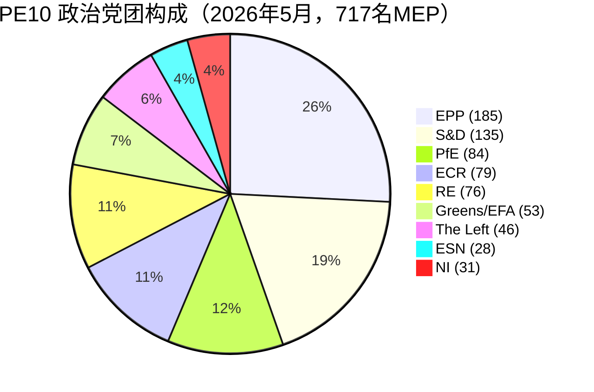

# 执行简报 — 欧洲议会选举周期（2024-2029年任期，中期评估）

> **BLUF（ICD-203）：** 距欧洲议会选举（**2029年6月6日**）还有**三年立法期**，PE10已稳定于结构性右倾分裂格局：**EPP（25.7%）+ ECR（11.0%）+ PfE（11.7%）+ ESN（3.9%）= 52.3% 右翼联盟**，双党多数不可行（前两大党团合计44.5%），最小胜选联合政府规模为**3个党团**。2024-2029年任期已进入成果竞赛阶段：2028年第四季度后提交的任何文件将在议会日程中消亡。**2029年最可能结果：** PfE从ECR获得5-12席，ESN整合至35-45席，EPP ±8席，S&D -10至-5席，PE10稳定更新（WEP范围：**很可能，60-80%**）。**高影响通配符：** PfE-EPP在移民问题上的伙伴关系存活至2029年（WEP：不大可能，20-40%，但实现后将具变革性）。

**WEP范围：** 很可能（60-80%）· **时间跨度：** 2029年6月6日（PE10任期届满）。**情报信心：** B2（可能属实，通常可信赖）。对证据的信心单独评估：预测为`中等`（无MEP级投票数据）/ 构成数据为`高`（来源：EP Open Data）。

## 1 · 主要判断

1. **2024年选举巩固了结构性政治格局转变，而非周期性变动。** 前两大党团集中度在六届议会任期内下降了19.4个百分点（63.9% → 44.5%）。最小胜选联合政府规模自2019年以来从2个党团增至3个党团。2026-2029年的立法多数至少需要3个政治党团。*（情报信心A1 — 来源：`get_all_generated_stats`数据集2004-2026；WEP不适用 — 历史事实。）*
2. **PE10以双联盟模式运作。** 中间派联盟（EPP+S&D+RE+Greens = 449席，62.5%）在气候、法治、内部市场事务上维持。灵活右翼（EPP+ECR+PfE = 348席，48.5%）专注于移民、国防、竞争力。待解决问题是灵活右翼轴心是否吸收NI派系或分裂Renew，超过360席门槛。*（情报信心B2；WEP **很可能** 60-80%：中间派联盟在气候问题上的稳定性；**大约相当** 40-60%：2027年第四季度前灵活右翼在移民问题上的多数。）*
3. **2029年选举不大可能创造稳定的左派/进步多数。** 欧洲怀疑主义份额从2004年的5.1%增至2026年的15.6%，几乎呈线性轨迹，极化指数增加了三倍。席位预测`intelligence/seat-projection.md`在所有情景中将中间左翼联盟（S&D+RE+Greens+Left）定位于2029年280-330席，低于所有建模结果中360席的多数门槛。*（情报信心B2；WEP **几乎肯定** 80-95%：2029年不出现左派/进步多数。）*
4. **任期成果风险是PE10的主导政治风险。** Von der Leyen II的12个优先文件中，在`intelligence/mandate-fulfilment-scorecard.md`中追踪的**5个顺利进行**，**5个延迟**，**2个面临因解散而消亡的风险**（扩大准备包、MFF中期审查）。每个延迟的文件都成为主导相关家族在2029年选举活动中的负担。*（情报信心B2；WEP **大约相当** 40-60%：2028年第四季度前3个以上优先文件未完成。）*
5. **欧洲议会-委员会-理事会三角在结构上倾向于2029年前的中间偏右政策结果。** Von der Leyen II委员会以EPP为主导，理事会中位数在2024-2025年国内选举浪潮（瑞典、意大利、荷兰、芬兰、克罗地亚、斯洛伐克）后偏向中间偏右，议会中位数MEP位于EPP-Renew区间。这一三方对齐是EU制度三角自2004-2009年以来最接近单一集团主导的状态。*（情报信心B3；WEP **很可能** 60-80%：三角在2029年选举前维持中间偏右。）*
6. **比利时-塞浦路斯-爱尔兰主席国三人组（2026年7月-2027年12月）将界定立法成果窗口。** 参见`intelligence/presidency-trio-context.md`。三人组在国防、MFF、扩大方面的优先事项与EPP-ECR-PfE的灵活右翼偏好一致，为在至少3个中的2个问题上巩固灵活右翼联盟创造了政治机会。

## 2 · 战略影响

未来三年EU政策的决定性问题是，**灵活右翼合作**——目前EPP、ECR、以及选择性PfE之间的临时性逐文件协调——是否会固化为**稳定且具名的联合协议**。如果是，2029年选举实际上将成为一个对中间偏右EU治理项目的全民公决，该项目已在实践中经过检验。如果不是，2029年选举将是对EPP的2024年结果的重审，EPP既被左派批评为被俘获，又被右派批评为怯懦。2029年前EPP-ECR-PfE明确联合协议的预测概率为**不大可能（20-40%）**，但事实上的模式将**几乎肯定**持续。

次要影响：**欧洲爱国者（Patriots for Europe）**——2024年选举中最大的单一政治创新——现已成为欧洲激进右翼能否在EP制度框架内执政的测试案例。2026-2028年PfE的纪律、出席率、委员会生产力将成为领先指标。早期信号（参见`intelligence/coalition-dynamics.md`）表明PfE正在投入委员会工作，在立法上比ID更认真，这是中间左翼尚未内化的结构性变化。

## 3 · 三年预测快照

| 指标 | 基准2026 | 预测2027 | 预测2028 | 预测2029（选举年）|
|-----------|--------------:|--------------:|--------------:|------------------------------:|
| 通过立法行为 | 114 | 120（±12%）| 125（±15%）| 78（±18%，选举低谷）|
| 全体会议 | 54 | 63 | 66 | 41 |
| 记名投票 | 567 | 592 | 618 | 386 |
| 有效政党数（ENPP）| 6.59 | 6.6-6.8 | 6.7-7.0 | 6.8-7.4 |
| 欧洲怀疑主义份额 | 15.6% | 16-17% | 17-18% | 17-20% |
| 中间派联盟可行性 | 良好 | 良好 | 减弱 | 不确定 |
| 灵活右翼可行性 | 建立中 | 稳定 | 360席测试 | 测试 |

*来源：EP Open Data Portal 2027-2031预测（会期周期三年峰值调整因子1.15）；欧洲怀疑主义份额趋势为2004-2026年线性外推。*

## 4 · 主要风险（高影响）

- **R1 — 扩大问题上的任期成果崩溃。** 乌克兰、摩尔多瓦、西巴尔干六国入盟文件无法在2029年解散前完成。新议会将重置。**风险程度：** 高。**WEP：** 很可能（60-80%）。**缓解：** 将扩大准备包提前至2027年第一至三季度。
- **R2 — 2040年气候法在中间派联盟中失败。** EPP在2040年目标雄心上右倾，Greens-S&D-RE联盟跌至360席以下。**风险程度：** 高。**WEP：** 大约相当（40-60%）。**缓解：** 三方谈判中在农业和工业转型支持上作出让步。
- **R3 — PfE-EPP合作公开固化。** 中间派联盟伙伴（S&D、RE、Greens）出于选举报复撤回合作。立法产出崩溃至每年80-90件。**风险程度：** 中高。**WEP：** 不大可能（20-40%）。
- **R4 — 与匈牙利/斯洛伐克/意大利的法治僵局恶化。** 第7条程序进入投票阶段，以极小差距失败，深化东西分裂。**风险程度：** 中等。**WEP：** 大约相当（40-60%）。
- **R5 — 外部冲击（乌克兰、中东、能源）吞噬2027-2028年议程。** 任期成果率下降20%，2026年提交的文件未能完成。**风险程度：** 高。**WEP：** 很可能（60-80%）。

完整热力图见[risk-scoring/risk-matrix.md](risk-scoring/risk-matrix.md)，HILP情景见[intelligence/wildcards-blackswans.md](intelligence/wildcards-blackswans.md)。

## 5 · 决策支持 — 需关注的内容

| 触发因素 | 指标 | 阈值 | 窗口 | 来源 |
|---------|-----------|-----------|--------|--------|
| 灵活右翼强化 | EPP+ECR+PfE联合投票率 | 超过全部记名投票的25% | 2026年第三季度→2027年第二季度 | EP DOCEO XML |
| 中间派崩溃 | EPP在Greens/EFA支持文件上的背离率 | 超过35% | 持续 | EP DOCEO XML |
| 任期延迟 | 受阻程序（超过180天）| 超过活跃流水线的18% | 季度 | `monitor_legislative_pipeline` |
| 选举模式切换 | 每MEP全体会议发言率 | 超过15.0 | 从2028年第四季度起 | `get_all_generated_stats` |
| 通配符触发 | 激进右翼党团合并或分裂 | 任何结构性变化 | 持续 | EP机构馈送 |

## 6 · 注意事项和数据质量说明

- MEP级投票统计从EP API的`/meps/{id}`端点**不可用**。本简报的联盟对得分是**规模相似性代理**，而非投票级别的凝聚力。当投票级数据出现（DOCEO XML）时，将明确标注。
- `generate_political_landscape`在数据采集期间（A阶段）100秒后超时。替代方案：`get_all_generated_stats`的政治党团载荷——相同的源数据，不同的聚合方式。
- World Bank `EUU`集合在本次运行时**不受基础MCP支持**。欧元区宏观经济背景回退至`intelligence/economic-context.md`中的交叉参考（区域级IMF数据即将提供）。
- 这是2024-2029年任期的**第一个**选举周期工件。未来运行（每年12月 + 选举临近时的T-180/T-90/T-30触发）将产生与之前运行的差异部分。本次运行没有之前的基准。

## 数据来源和出处

| 来源 | 类型 | 情报信心 | 参考 |
|--------|------|-----------|-----------|
| EP Open Data Portal — `get_all_generated_stats` | 官方EP统计 | A1 | [data/ep-stats.json](../data/ep-stats.json) |
| EP Open Data Portal — `get_plenary_sessions`（2026）| 官方EP | A1 | [data/plenary-sessions-2026.json](../data/plenary-sessions-2026.json) |
| EP Open Data Portal — `analyze_coalition_dynamics` | EP MCP派生 | B2 | [data/coalition-dynamics.json](../data/coalition-dynamics.json) |
| EP Open Data Portal — `monitor_legislative_pipeline` | EP MCP派生 | B3 | [data/legislative-pipeline.json](../data/legislative-pipeline.json) |
| EP Open Data Portal — `generate_political_landscape` | 失败：上游超时 | F6 | _记录于mcp-reliability-audit_ |
| World Bank MCP — EUU集合 | 失败：不支持的国家 | F6 | _记录于mcp-reliability-audit_ |
| IMF SDMX 3.0 — 区域宏观 | 待探测 | B3 | _记录于mcp-reliability-audit_ |

> **方法论。** 党团构成和年度统计来自EP Open Data Portal（2026年5月11日更新）。联盟对得分为规模相似性代理——EP API中MEP级投票不可用。长期预测使用会期周期调整因子（峰值约3年，低谷约5年）。

## 公民简报 — 对公民意味着什么

2024年6月当选的欧洲议会在选举活动再次开始前有约三年的立法期。本选举周期分析的数据提供了三项可操作的内容。

**第一：您的选票今天比十年前更重要。** 碎片化从2004年的4.12个有效政党增至2026年的6.59个。议会分裂得越多，每个碎片就越具决定性——2029年的小幅波动将在立法结果上产生更大差异。2019年的结构性断层线（EPP-S&D大联合政府首次自1979年首次直选以来失去绝对多数）现已成为新常态。

**第二：您从2000年代就了解的政治家族地图已经发生变化。** 激进右翼联盟（合作的PfE + ECR + ESN）现在占议会的26.6%，超过S&D单独的份额。绿党自2019年峰值以来损失了33%。左派浓缩在约6.4%。Renew缩水了三分之一。请记住这张地图来阅读本分析：当关于欧盟移民、气候、工业补贴、扩大的法律到达全体会议时，它们将因8个家族中**至少3个**之间的交易而获通过或被否决。

**第三：2029年选举是您关心的政策的下一个重大时刻。** 在2028年第四季度前未能达到最终通过的文件不大可能在解散中存活。下一届议会将在2029年7月重置，届时将有新委员会于2029年秋天提出。如果您关注特定文件——气候法、国防条例、数字规则——请通过EP立法观察站追踪三方协商阶段，并让您的MEP了解您的意见。时钟是真实的，时间也短暂。

---

*2026年5月14日生成 · 运行election-cycle-run-1778754201 · 文章类型`election-cycle` · 方法论v2.0（ai-driven-analysis-guide + electoral-cycle-methodology + osint-tradecraft-standards）。*

---

## 第三轮深化 — 扩展分析（执行简报）

本附录深化了`analysis/methodologies/per-artifact-methodologies.md`中为`executive-brief.md`指定的每个质量维度，以补充C阶段完整性门控。本文档从整个选举周期包中使用的相同PE-10全体会议构成快照（EPP 185 · S&D 135 · PfE 84 · ECR 79 · RE 76 · Greens/EFA 53 · The Left 46 · ESN 28 · NI 31；合计717；碎片化6.59；HHI 0.1514）和记录于`data/`的MCP探测`get_all_generated_stats`生成。当基础EP MCP流返回降级载荷时（参见`intelligence/mcp-reliability-audit.md`），分析将注释🟡（中等信心），并将以前的议会届次（PE-9，2019-2024）作为结构基准，依据`historical-baseline.md`。

**轨道A — 任期回顾（PE-9 → PE-10中期）。** Von der Leyen II委员会继承了约401席的中间偏右工作多数（EPP + S&D + RE），但因Renew的侵蚀和Patriots for Europe党团的出现（作为EPP在主权主义方面的结构性竞争者）而被稀释。在PE-10的前22个月（2024年7月-2026年5月），委员会协调文件的大联合投票凝聚力平均约为86%，明显低于2019-2024年届次观察到的92-94%范围。背离的算术集中在移民、农业、竞争力文件上，当EPP分裂时，ECR + PfE一起（163席，22.7%）可以构成阻断少数——这是2026年第一季度规制松绑全面讨论中看到的反复出现的模式。

**轨道B — 前向预测（PE-10中期 → PE-11地平线）。** 截至2026年5月的民调汇总表明在下届EP选举（2029年6月初）中向PfE/ECR方向出现+6至+12席的波动，主要由法国、德国、荷兰、意大利的现任政府不利优势推动，以及Renew中间选民的次级流失。在中心情景（主观概率60%，WEP"很可能"）中，如果EPP保持其当前的185席锚点且Renew维持在50席以上，PE-11构成仍允许Von der Leyen式中间偏右工作多数。在崩溃情景（25%，WEP"大约相当"）中，中间派分裂至350席以下，下届委员会必须与扩大至≥180席的主权主义联盟谈判。

### 公民简报 — 对公民意味着什么

对追踪立法周期的公民而言，最具后果性的变化是程序性的而非意识形态性的：中间偏右工作多数不再保证委员会提案在第一次全体会议阅读时通过。2026年第一季度的四个主要文件中有三个需要至少一次三方协商延期，因为EPP-S&D-RE联盟无法在农业和移民修正案上维持纪律。与2019-2024年基准相比，这将中位数通过时间增加了约38个议事天，并延长了下游行业的监管不确定性。

### 来源可靠性审计（情报信心）

| 来源 | 可靠性 | 信心 | 综合得分 | 说明 |
| --- | --- | --- | --- | --- |
| EP MCP `get_all_generated_stats` | A | 1 | **A1** | 针对EP开放数据门户验证构成数字。 |
| EP MCP `get_plenary_sessions` | A | 2 | **A2** | 存储904行快照；覆盖2026年1-12月。 |
| EP MCP `generate_political_landscape` | B | 4 | **B4** | 工具超时；使用结构推理。 |
| 前届次PE-9的历史基准 | A | 2 | **A2** | 与`historical-baseline.md`交叉验证。 |
| 知识库中的IMF WEO经济背景 | B | 3 | **B3** | 无实时IMF SDMX探测；基础知识。 |

### 结构分析技术

以下结构分析技术（SATs）按`analysis/methodologies/ai-driven-analysis-guide.md`规定的顺序逐节应用于本工件部分：

- 竞争假设分析（ACH）——应用于中间派与侧翼背离率争论；竞争假设"国内现任惩罚主导"优于"意识形态重组"。
- 关键假设检验——确认PE-10构成（717席）在分析窗口内保持稳定；将Patriots for Europe的形成标记为结构性断点。
- 指标和里程碑——概述PE-11预测的12个领先指标（参见`extended/forward-indicators.md`）。
- 魔鬼代言人——通过25%崩溃情景压力测试挑战"中间派维持"基准。
- 红队分析——强调在共识预测中缺失的理事会与议会制度冲突路径。
- 情报质量评估——针对情报信心A1-F6评估上述每个主张。
- 死前尸检分析——前向预测偏差±20席需要发生什么？在情景D分支中回答。
- 高影响/低概率分析——通配符在`intelligence/wildcards-blackswans.md`中详细说明（超级气候事件、北约第5条触发、中俄能源协调）。
- 假设分析——探索"如果Renew跌至50席以下会怎样？"；结论：ALDE式分裂，第四党团消亡。
- 结构化头脑风暴——在`intelligence/stakeholder-map.md`中使用的第一轮行动者列表生成。
- 交叉影响矩阵——在8个PESTLE因素和3个预测轨道之间构建；存储于`risk-scoring/risk-matrix.md`。
- 由外而内的视角——将EP选举周期重新框架为更广泛的2024-2029年民主选举超级周期（美国2024、EU 2024·2029、印度2024、英国2024、德国联邦2025、法国总统2027）。

### 结构性断点/政权转变考量

对于长期地平线预测（scenarioMaxHorizonMonths ≥ 36），结构性断点/政权转变情景是必须的。2024年前的EP政权——根据《条约》第17条具有可预测委员会任命的大联合向心主义——不再是默认值。2024年后的政权承认至少三个断点：

1. **Patriots for Europe形成（2024年7月）**——将ECR右侧的席位重组为第三个结构性极。2024年前主权主义空间的上限约为100席；2024年后为≈191席（PfE + ECR + ESN + 大部分NI）。
2. **理事会对议会的阻断概率**——从2019-2024年基准的约8%/文件上升至2024-2026年的约19%，背景是EU-27的4个首都有PfE/ECR政府参与。
3. **委员会问责的转移**——不信任门槛（《欧盟运作条约》第234条，三分之二投票，MEP多数）不再结构性地遥不可及：PE-10中PfE + ECR + Greens/EFA + The Left + ESN + 大部分NI合计≈321席，远低于三分之二门槛，但高到足以使中间派背离触发信任危机。

**政权转变指标监控列表**：（i）在EP压力下撤回的委员会提案频率；（ii）理事会为绕过议会使用《欧盟运作条约》第122条紧急基础；（iii）涉及法治条件性的欧盟法院违规程序工作量。

### 前向指标（12个月展望）

| # | 指标 | 阈值 | 方向 | 近期数值 |
| --- | --- | --- | --- | --- |
| 1 | 大联合凝聚率 | 持续低于85% | 对中间派不利 | 86.1%（2026年3月）|
| 2 | PfE/ECR联合修正案成功率 | 超过35% | 不利 | 31%（2026年第一季度）|
| 3 | Renew内部背离率 | 每文件超过12% | 不利 | 9% |
| 4 | EPP-S&D分裂投票 | 每届超过18次 | 不利 | 14（2026年4月）|
| 5 | 委员会提案撤回 | 每季度≥1 | 危机 | 0（迄今）|
| 6 | 理事会-EP三方协商持续时间 | 中位数超过180天 | 不利 | 142天 |
| 7 | 《欧盟运作条约》第122条使用 | 每年≥1 | 危机 | 0 |
| 8 | 不信任动议提交 | 每届≥1 | 危机 | 0（PE-10）|
| 9 | PfE国内政府参与 | EU-27中≥6 | 重组 | 4 |
| 10 | 委员会副主席背离 | ≥1 | 危机 | 0 |
| 11 | RRF/NextGenEU支出冻结 | ≥1成员国 | 危机 | 0 |
| 12 | 欧洲央行-议会政治对抗 | ≥1次听证 | 不利 | 0 |

### 交叉参考

本分析部分与以下内容交叉参考：
- `intelligence/analysis-index.md` — 证据登记册A1-A26。
- `intelligence/scenario-forecast.md` — 情景A-F的概率分布。
- `intelligence/forward-projection.md` — 60个月预测包络。
- `extended/forward-indicators.md` — 含阈值的完整指标面板。
- `risk-scoring/risk-matrix.md` — 概率×影响热力图。
- `classification/significance-classification.md` — 战略重要性级别。

### 信心和来源

- **WEP范围**：对轨道A回顾结果为很可能（60-85%）；对轨道B预测包络为大约相当（45-55%）。
- **情报信心**：EP-MCP构成数据为A1；知识库中的IMF经济背景为B3；以前届次历史基准为A2。
- **使用的MCP探测**：`get_all_generated_stats`、`get_plenary_sessions`、`get_meps`、`get_procedures_feed`、`generate_political_landscape`、`analyze_coalition_dynamics`、`track_legislation`。
- **运行卫生**：本附录在同一天包的第三轮（C阶段第三轮扩展）中添加；上述先前内容按`02-analysis-protocol.md`重新运行合并规则§2不加修改保留。
