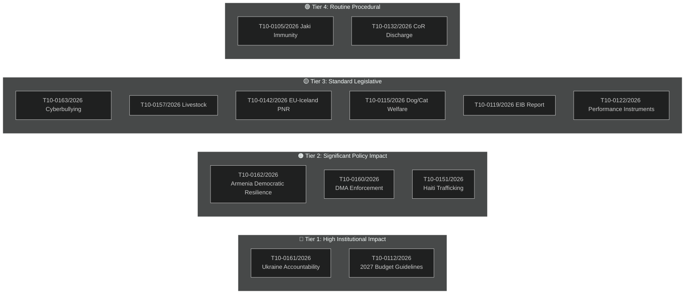

<!-- SPDX-FileCopyrightText: 2026 Hack23 AB -->
<!-- SPDX-License-Identifier: Apache-2.0 -->

# Significance Classification — EU Parliament Motions April 2026
## Tier 1–4 Impact Triage

**Article Type:** Motions | **Confidence:** 🟢 High | **Session:** April 28–30, 2026

---

## 🏷️ Classification Framework

---

## 📊 Full Classification Table

| Text | Tier | Binding? | Urgency Type | Political Significance | Forward Impact |
|------|:----:|:--------:|:------------:|----------------------|----------------|
| T10-0161/2026 (Ukraine) | 1 | No (resolution) | HIGH | Very High — novel accountability architecture | Special Tribunal treaty process |
| T10-0112/2026 (Budget) | 1 | No (guidelines) | STANDARD | Very High — MFF baseline | October 2026 conciliation |
| T10-0162/2026 (Armenia) | 2 | No (resolution) | URGENCY | High — EU-Armenia association push | Q2-Q3 2026 EaP framework |
| T10-0160/2026 (DMA) | 2 | No (resolution) | STANDARD | High — enforcement timeline | Q3 2026 Commission report |
| T10-0151/2026 (Haiti) | 2 | No (resolution) | URGENCY | High — humanitarian/sanctions | Immediate EU emergency activation |
| T10-0163/2026 (Cyberbullying) | 3 | No (resolution) | STANDARD | Medium — DSA extension | Commission consultation paper |
| T10-0157/2026 (Livestock) | 3 | No (A-report) | STANDARD | Medium — Farm-to-Fork recalibration | Commission consultation |
| T10-0142/2026 (PNR) | 3 | Yes (A-report) | STANDARD | Medium — data security | Bilateral treaty ratification |
| T10-0115/2026 (Dog/Cat) | 3 | No (A-report) | STANDARD | Medium — popular mandate | Animal welfare regulation proposal |
| T10-0119/2026 (EIB) | 3 | No (discharge) | STANDARD | Medium — financial oversight | EIB 2025 strategy adjustment |
| T10-0122/2026 (Performance) | 3 | No (A-report) | STANDARD | Medium — financial accountability | Framework regulation |
| T10-0105/2026 (Jaki) | 4 | Yes (immunity) | ROUTINE | Low — individual MEP | Polish court proceedings |
| T10-0132/2026 (CoR) | 4 | Yes (discharge) | ROUTINE | Low — routine discharge | CoR 2025 budget oversight |

---

## 🔑 Tier 1 Deep Dives

### T10-0161/2026 — Tier 1 Justification
Classification rationale: Legal accountability architecture demand (Special Tribunal), sanctions enforcement specificity (17th package loopholes), and EU accession acceleration all represent Category A institutional significance. This resolution has more specific legal mandates than any prior EP Ukraine resolution and creates concrete measurable deliverables for Council follow-up.

**Why Tier 1 and not Tier 2:** The Special Tribunal demand is legally novel at international law level. If implemented, it would be the first new international criminal tribunal since the ICC (1998) — an institutional achievement of historic significance.

### T10-0112/2026 — Tier 1 Justification
The 2027 Budget Guidelines function as the EP's opening position in the annual budget procedure under TFEU Article 314. Unlike political resolutions, they trigger a mandatory institutional process (conciliation committee) with legally defined deadlines. The embedding of ReArm EU provisions makes this strategically significant for EU defence integration — a long-term structural change.
