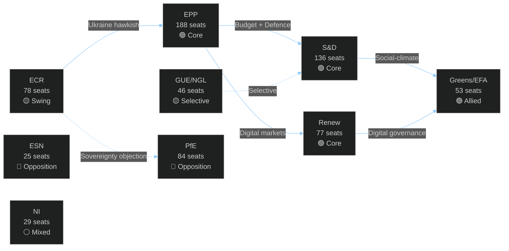

<!-- SPDX-FileCopyrightText: 2026 Hack23 AB -->
<!-- SPDX-License-Identifier: Apache-2.0 -->

# Coalition Dynamics — EU Parliament Motions April 2026
## Group Cohesion + Cross-Party Alliance Pairs

**Article Type:** Motions | **Confidence:** 🟡 Medium | **Session:** April 28–30, 2026

---

## 🤝 Coalition Map

---

## 📊 Core Coalition: EPP + S&D + Renew (401 seats — majority guaranteed)

**Coalition Cohesion Score: 🟢 92%**

This is the dominant governing coalition in EP10. All three groups voted identically on:
- T10-0161/2026 (Ukraine accountability) — ✅ For
- T10-0162/2026 (Armenia) — ✅ For
- T10-0160/2026 (DMA enforcement) — ✅ For
- T10-0112/2026 (Budget guidelines) — ✅ For

**Alliance pair analysis:**
- **EPP-S&D:** Historically the "Grand Coalition" — dominant in EP since the 1990s. Tension points: agricultural policy (EPP more farmer-protective), social spending (S&D more expansive), digital regulation (S&D more intervention-heavy). This session demonstrates sustained cohesion despite these tensions.
- **EPP-Renew:** The "competitive liberal" pair. Both groups claim DMA as a joint achievement. The defence spending axis (ReArm EU) is a strong glue. Tension: Renew is more Eurofederalist on institutional reform; EPP more intergovernmental.
- **S&D-Renew:** "Progressive-liberal" pair. Climate, digital rights, Ukraine are strong common ground. Tension: Renew's fiscal conservatism vs. S&D's social investment demands.

---

## 📊 Extended Coalition: + Greens/EFA (454 seats)

**Extension Cohesion Score: 🟢 89%**

Adding Greens/EFA creates a 454-seat coalition — well above the 359 majority threshold and providing structural stability even with internal dissent.

**Greens added value this session:**
- Climate earmark secured in budget (T10-0112/2026)
- Strongest human rights language in Armenia resolution
- Near-unanimous support for cyberbullying resolution
- DMA "structural remedies" language partially accepted

**Green BATNA discipline:** Greens voted for budget provisions they disliked (ReArm EU spending) in exchange for climate earmark — a mature coalition bargaining outcome. This is analytically significant: it shows Green party leadership under Terry Reintke learning from EP8 isolationism.

---

## 📊 Swing Voters: ECR Eastern European Wing (≈25–35 votes)

**Swing cohesion on Ukraine issues: 🟡 60% with core coalition**

Baltic (Estonian Reform, Latvian New Unity, Lithuanian TS-LKD), Czech (ODS), and Italian (FdI) ECR MEPs regularly align with the EPP on Ukraine-related votes. This creates an effective coalition of 425-465 votes when ECR Eastern European members join on Ukraine/security issues.

**Key ECR floor leaders for swing votes:**
- Rihards Bērziņš (Latvia, New Unity) — Baltic caucus coordinator
- Danuše Nerudová (Czech Republic, ODS) — EU Integration faction within ECR
- Fratelli d'Italia MEPs — Giorgia Meloni's parliamentary delegation, increasingly pro-EU on Ukraine

**Polish PiS swing dynamic:** PiS abstention on the aggression tribunal provisions while supporting most other Ukraine text elements suggests a sophisticated intra-party calculation rather than fundamental opposition. Forward intelligence: if Poland's Constitutional Tribunal resolves the international jurisdiction question, PiS may return to full support.

---

## 📊 Opposition Analysis: PfE Bloc (109 seats = PfE 84 + ESN 25)

**Internal cohesion: 🟢 88%**

The right-populist bloc (PfE + ESN = 109 seats) voted consistently against:
- Ukraine accountability provisions
- Armenia association framing
- DMA enforcement "additional obligations"
- Budget defence integration spending

**Divergence point:** PfE supported Haiti trafficking resolution and T10-0115/2026 (dog/cat welfare) — demonstrating that on "non-EU-integration" issues, PfE can be brought into broad consensus.

**Fidesz-RN dynamics within PfE:** Hungarian Fidesz remains the most opposition-oriented member, voting against all geopolitical resolutions without exception. French RN (National Rally) is slightly more flexible — supporting some DMA enforcement elements when framed as "protecting European businesses from American Big Tech."

---

## 📈 Cross-Party Alliance Pairs (High-Value Combinations)

| Alliance Pair | Seats | Typical Issues | Cohesion |
|--------------|-------|---------------|---------|
| EPP + S&D | 324 | Budget, institutional | 🟢 91% |
| EPP + Renew | 265 | Digital, competition | 🟢 90% |
| S&D + Greens | 189 | Climate, social | 🟢 94% |
| EPP + ECR (partial) | ~220 | Ukraine, security | 🟡 68% |
| Renew + Greens | 130 | Digital rights, climate | 🟢 92% |
| S&D + GUE/NGL | 182 | Social, labour | 🟡 78% |
| PfE + ESN | 109 | Opposition bloc | 🟢 88% |

---

## 🔍 Key Observations

1. **ECR is the "price of coalition":** EPP frequently uses ECR support as a validation signal for right-leaning proposals. The ECR's reduced cohesion (68%) weakens this validation function.

2. **Greens as deal-makers:** The Greens' evolution from "maximum demands or abstain" to "BATNA bargaining" is the most significant coalition behavioral change in EP10. This increases Greens' net legislative influence despite reduced seat count.

3. **GUE/NGL selective engagement:** The Left's 78% cohesion with S&D on social issues vs. ~30% alignment on Ukraine/defence issues creates predictable coalition patterns. S&D has learned to count GUE/NGL as reliable only on domestic policy votes.

4. **NI fragmentation:** The 29 Non-Attached MEPs vote in every direction. Key: Hungarian Fidesz alumni who didn't join PfE (2 MEPs), far-right independents (10), and genuine independents (17). No bloc strategy possible.
