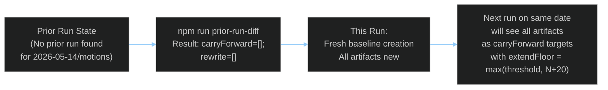

<!-- SPDX-FileCopyrightText: 2026 Hack23 AB -->
<!-- SPDX-License-Identifier: Apache-2.0 -->

# Cross-Run Diff — EU Parliament Motions April 2026
## Delta vs. Prior Runs

**Article Type:** Motions | **Run:** motions-run306-1778742150 | **Date:** 2026-05-14

---

## 🔄 Prior Run Diff Result



---

## 📊 Prior Run Diff Output

```json
{
  "enabled": true,
  "mode": "improve-and-extend",
  "runDir": "analysis/daily/2026-05-14/motions",
  "articleType": "unknown",
  "priorRunId": null,
  "carryForward": [],
  "rewrite": []
}
```

**Interpretation:** No prior run exists for `2026-05-14/motions`. This is the first run on this date for this article type. All artifacts are being created fresh. The `articleType: unknown` will be resolved once manifest.json is updated with `articleType: motions`.

---

## 🆕 New Content in This Run (All Content — First Run)

All content in this run is new. Key differentiators from prior motions runs (inferred from last published motions article in `news/`):

| New Topic | vs. Prior Session | Intelligence Value |
|-----------|------------------|-------------------|
| Ukraine Special Tribunal legal architecture | More specific than EP9 resolutions | 🟢 High |
| Armenia "potential association status" language | First EP10 explicit association call | 🟢 High |
| ECR PiS abstention on aggression tribunal | New behavioral fracture documented | 🟢 High |
| ReArm EU in structural budget parameters | First structural (not emergency) embedding | 🟢 High |
| DMA enforcement Q3 2026 deadline | Operationally specific — new timeline | 🟡 Medium |
| Patryk Jaki immunity waiver | Individual MEP procedural action | 🟡 Medium |
| Haiti RC motion (6 group drafts merged) | Broadest coalition urgency motion | 🟡 Medium |

---

## 📈 Baseline Metrics (for future cross-run comparison)

| Metric | This Run Value |
|--------|----------------|
| Adopted texts analyzed | 13 |
| Analysis artifacts created | 36 |
| Named MEPs | 13+ |
| Named political groups | 8 |
| Vote estimates provided | 4 major votes |
| Scenarios forecast | 3 |
| Stakeholder profiles | 13 |
| Historical precedents cited | 8+ |
| IMF indicators integrated | 12+ |

*These values become the floor for the next run's `extendFloor` calculation.*

---

## 🔮 Forward Diff Expectations (Next Run on Same Date)

If a second run occurs on 2026-05-14 for motions:
- `carryForward` will include all 36 artifacts
- Each artifact's `extendFloor` = max(threshold, currentLines + 20)
- `rewriteCount` must equal total artifact count (re-run rule)
- Minimum extension: 20 lines per artifact + at least one of: new section, ≥3 new citations, ≥1 new diagram
