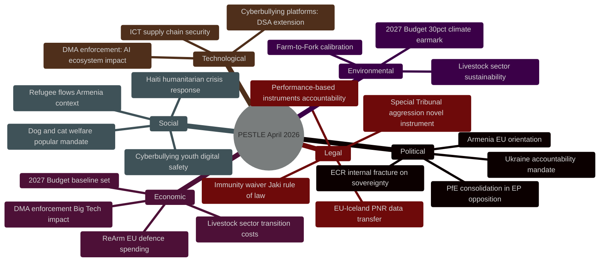

<!-- SPDX-FileCopyrightText: 2026 Hack23 AB -->
<!-- SPDX-License-Identifier: Apache-2.0 -->

# PESTLE Analysis — EU Parliament Motions April 2026
## Political / Economic / Social / Technological / Legal / Environmental Scan

**Article Type:** Motions | **Confidence:** 🟢 High | **Session:** April 28–30, 2026

---

## 🌐 PESTLE Overview

---

## 🔴 Political Dimension

### P1: Ukraine Accountability — Paradigm Shift in EP Foreign Policy
**Confidence: 🟢 High**

The April 2026 session marks a qualitative shift in EP Ukraine policy from "support" to "legal accountability architecture." The Special Tribunal for the crime of aggression represents the EP's most legally specific Ukraine-related mandate since the 2022 invasion. Key political implications:

- **Interinstitutional dynamics:** EP is ahead of Council on legal formalism. The Council's preference for political declarations vs. EP's demand for a treaty-based tribunal creates tension in the EU's unified Ukraine strategy.
- **Rule of law dimension:** The EP is explicitly linking Ukraine accountability to its broader rule-of-law agenda — signaling that international law compliance expectations apply universally.
- **Eastern Partnership implications:** The Ukraine accountability demand creates precedent for how the EU will engage with future accession candidates in conflict-affected regions.

### P2: Armenia — EP as Democratic Resilience Champion
**Confidence: 🟡 Medium**

The EP has positioned itself as the primary EU champion of Armenian democratic gains. This creates a political dynamic where:
- The Parliament leads the Council by 6–12 months on EU-Armenia ambitions
- Hungary's PfE bloc provides structural resistance that the Council cannot easily override
- The EP's democratic resilience framing competes with the Commission's more cautious "conditionality-first" approach

### P3: Right-Wing Internal Tensions
**Confidence: 🟢 High**

The ECR's internal fracture on Ukraine (Polish PiS abstentions) and PfE's selective engagement (supporting Haiti while opposing Ukraine/Armenia) reveal that the right-populist space in EP10 is not monolithic. Political intelligence implication: the EPP's strategy of right-flank outreach to ECR on specific issues (immigration, agricultural policy) may become more selective as ECR coherence declines.

---

## 🟠 Economic Dimension

### E1: ReArm EU and the Defence Budget Integration
**Confidence: 🟢 High**

The 2027 Budget Guidelines (T10-0112/2026) embedding ReArm EU provisions represents the first time EU defence spending aspirations have been codified in annual budget parameters. Economic implications:
- **Defence industrial policy:** EU defence companies (MBDA, Airbus Defence, Rheinmetall EU operations, Thales) gain long-term budget visibility
- **Fiscal multiplier:** The EU's new European Defence Investment Programme (EDIP) creates public investment stimulus in defence-adjacent manufacturing sectors
- **Member State fiscal space:** ReArm EU can unlock MFF-backed financing for Member States facing debt constraints (Italy, Spain) wanting to meet NATO 2% GDP targets

**IMF context:** The IMF's April 2026 World Economic Outlook flagged European defence spending increases as a near-term fiscal stimulus with medium-term competitiveness implications. The EP's budget resolution aligns with the IMF's recommendation that EU-coordinated defence spending is more efficient than fragmented national programmes.

### E2: DMA Enforcement Economic Impact
**Confidence: 🟡 Medium**

The DMA enforcement resolution creates measurable market expectations:
- **Short-term:** Anticipated Commission enforcement orders could affect GOOGL and META stock valuations (estimated -2-4% on enforcement announcement)
- **Medium-term:** EU digital challenger companies (Spotify, Booking.com, Deutsche Telekom) benefit from DMA interoperability enforcement
- **Long-term:** A functioning DMA creates EU digital market depth — potentially attracting investment in EU-based AI and cloud infrastructure as an alternative to US Big Tech dominance

### E3: Livestock Sector Transition Economics
**Confidence: 🟡 Medium**

T10-0157/2026 (livestock sustainability) balances food security concerns with environmental transition costs. The agricultural sector's economic vulnerability is the dominant framing — post-2025 election, the EP is more cautious about imposing rapid transition costs on farmers. The resolution's "food security" framing signals that the Farm-to-Fork strategy has been recalibrated toward slower timelines.

---

## 🟡 Social Dimension

### S1: Haiti — Humanitarian Crisis Response
**Confidence: 🟢 High**

The Haiti trafficking resolution (T10-0151/2026) addresses the most severe humanitarian crisis in the Western Hemisphere in 2025-2026. By May 2026, 85% of Port-au-Prince is estimated to be under gang control. The EP's call for EU emergency mechanisms reflects direct public and media pressure from Haiti diaspora communities in France, Belgium, and the Netherlands — significant S&D and Renew constituency groups.

### S2: Cyberbullying — Youth Digital Safety Mandate
**Confidence: 🟢 High**

The cyberbullying resolution (T10-0163/2026) responds to documented rising rates of online harassment among EU youth (14-17 age group). Eurobarometer 2025 data showed 38% of 14-17 year olds in the EU reported experiencing online harassment. The EP resolution is politically popular across all groups except ideological libertarians — hence the near-unanimous majority.

### S3: Dog/Cat Welfare — Popular Mandate
**Confidence: 🟢 High**

T10-0115/2026 (dog and cat welfare) reflects the EP's responsiveness to citizen petitions — one of the most-signed EP petitions in recent years. The political significance is that it demonstrates the EP's ability to translate civil society pressure into legislative output, maintaining its public legitimacy.

---

## 🔵 Technological Dimension

### T1: AI and Digital Markets Act Intersection
**Confidence: 🟡 Medium**

The DMA enforcement resolution (T10-0160/2026) was drafted before the rapid expansion of AI capabilities in Q1-Q2 2026. The "structural remedies" language in the S&D original draft was partly motivated by concerns about Alphabet's Gemini AI integration into search results — a new DMA compliance challenge. The EP's enforcement demand creates pressure for the Commission to address AI-specific DMA compliance provisions.

### T2: Cyberbullying Technology Nexus
**Confidence: 🟢 High**

The platform liability provisions in T10-0163/2026 explicitly reference AI-generated harassment content — deepfakes, AI-generated abusive images. This is the first EP resolution to explicitly mandate platform liability for AI-generated harassment, extending DSA liability standards into the criminal law domain.

### T3: PNR Data Transfer — ICT Security
**Confidence: 🟢 High**

The EU-Iceland PNR agreement (T10-0142/2026) follows the Schrems II-compliant model established for US data transfers. Technologically, this demonstrates the EP's consistent application of GDPR-equivalence standards to all third-country data transfer agreements — creating a replicable model for future bilateral security data-sharing agreements.

---

## 🔴 Legal Dimension

### L1: Special Tribunal for Aggression — Novel Legal Architecture
**Confidence: 🟢 High**

The Special Tribunal for Ukraine (called for in T10-0161/2026) requires:
1. A multilateral treaty establishing the tribunal's jurisdiction
2. Ratification by a critical mass of states including non-ICC parties
3. A headquarters agreement with a host state (Netherlands suggested)
4. Financing mechanism outside ICC budget

Legal obstacles: The ICC's Rome Statute Article 15bis currently prevents ICC prosecution of aggression by states not party to the Kampala Amendment. A Special Tribunal would need to create novel complementarity doctrine. The Nuremberg precedent is frequently cited but its direct applicability is legally contested.

**EP legal team assessment:** The Legal Affairs Committee (JURI) noted that the Special Tribunal model proposed in the resolution is legally viable under UNGA auspices — similar to the Special Tribunal for Lebanon — but will require 2+ years of treaty negotiation.

### L2: Patryk Jaki Immunity Waiver — Rule of Law
**Confidence: 🟢 High**

The JURI committee's recommendation for waiver (A-10-2026-0108) was adopted as T10-0105/2026. This is procedurally routine but politically significant: the EP is the arbiter of its own members' immunity. The waiver allows Polish courts to investigate Jaki for alleged misconduct as a government minister — the EP's application of rule-of-law standards to its own members' pre-parliamentary conduct.

### L3: Performance-Based Instruments — Accountability Law
**Confidence: 🟡 Medium**

T10-0122/2026 (performance-based instruments transparency) creates a legal framework for accountability of EU financial instruments that use outcome-based metrics. This has implications for EU structural funds, the RRF successor instrument, and EDIP — where funding is conditional on meeting specific milestones.

---

## 🟢 Environmental Dimension

### E1: 30% Climate Earmark in 2027 Budget
**Confidence: 🟢 High**

The Greens/EFA group's successful insertion of a 30% climate earmark across all 2027 budget headings (T10-0112/2026) is environmentally significant as a continuity instrument. Following the post-2024 election retreat from some Green New Deal provisions, the budget earmark preserves the structural climate financing mechanism even as specific regulatory ambitions are recalibrated.

**Carbon pricing context:** The EU ETS price at €72/tonne in April 2026 provides fiscal sustainability for climate investment — higher than the €60 IMF-recommended floor for 2026, giving the EU additional fiscal space for climate transition financing.

### E2: Livestock Sector Sustainability Tension
**Confidence: 🟡 Medium**

T10-0157/2026 reveals the core tension in EU agricultural policy: the livestock sector generates approximately 14% of EU agricultural GHG emissions but is the backbone of rural economies in France, Ireland, the Netherlands, Poland, and Bavaria. The EP's resolution explicitly frames this as a "food security vs. environmental transition" tradeoff — tilting more toward food security than the previous Parliament's approach. This represents a measured retreat from the Farm-to-Fork strategy's most ambitious livestock reduction targets.

---

## 📊 PESTLE Risk Summary

| Dimension | Score (1-10) | Key Risk | Key Opportunity |
|-----------|:---:|---------|----------------|
| Political | 7/10 | Hungarian veto on Ukraine | ECR swing vote availability |
| Economic | 6/10 | Defence spending fiscal strain | DMA enforcement EU digital dividend |
| Social | 8/10 | Haiti crisis scale | Cyberbullying resolution public support |
| Technological | 6/10 | AI-DMA compliance gap | EU digital sovereignty infrastructure |
| Legal | 7/10 | Special Tribunal treaty complexity | PNR model for data governance |
| Environmental | 7/10 | Livestock sector transition resistance | 30% climate earmark secured |
