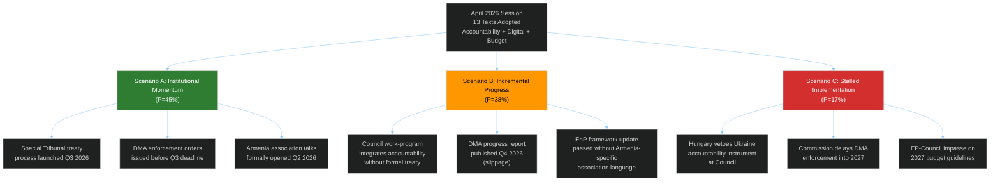

<!-- SPDX-FileCopyrightText: 2026 Hack23 AB -->
<!-- SPDX-License-Identifier: Apache-2.0 -->

# Scenario Forecast — EU Parliament Motions April 2026
## Probability-Weighted Scenarios with Early-Warning Indicators

**Article Type:** Motions | **Confidence:** 🟡 Medium | **Horizon:** 3–6 months

---

## 🔮 Scenario Overview

---

## 📊 Scenario A: Institutional Momentum (P = 45%)

### Narrative
The April 2026 session's outputs translate into concrete institutional action within the 3–6 month horizon. The Special Tribunal for Ukraine aggression achieves treaty-level momentum, the Commission issues DMA enforcement orders, and Armenia association discussions formally open.

### Enabling Conditions
1. Polish Presidency successfully navigates the Special Tribunal proposal through the FAC (May–June 2026) with a qualified majority workaround to bypass the Hungarian veto
2. Commission issues DMA interim findings against Alphabet and Meta by July 2026, meeting the EP's Q3 deadline
3. EaP May 2026 Summit communiqué includes explicit EU-Armenia partnership track with formal negotiating mandate
4. No major escalation in Russia-Ukraine front lines that would overwhelm political bandwidth

### Consequences
- **Political:** EPP-S&D-Renew coalition consolidates its session-2025/2026 dominance; ECR loses relevance as swing vote
- **Legal:** Special Tribunal opens new ICC complementarity doctrine discussions; Kampala Amendments ratification accelerates
- **Market:** DMA enforcement orders create short-term Big Tech volatility (negative 2-4%); medium-term positive for EU digital challenger companies

### Early-Warning Indicators
| Indicator | Timing | Signal Direction |
|-----------|--------|-----------------|
| FAC conclusions on Ukraine tribunal | May 26 FAC | ✅ Positive if endorsed |
| Commission DMA interim report leak | June 2026 | ✅ Positive if published |
| EaP Summit Armenia language | May 28 EaP | ✅ Positive if "negotiating mandate" |
| Hungarian government statement on tribunal | May–June | ❌ Negative if veto threatened |

**Confidence:** 🟡 Medium — enabling conditions are structurally plausible but politically fragile.

---

## 📊 Scenario B: Incremental Progress (P = 38%)

### Narrative
Most of the April session's outputs achieve partial implementation. The accountability mechanism moves forward but as a political/diplomatic instrument rather than a formal treaty. DMA enforcement slips 1-2 quarters. Armenia association language is included in the EaP framework but without a formal negotiating mandate.

### Enabling Conditions
1. Hungary softens tribunal opposition after back-channel negotiations (Orbán secures concession on separate EU agriculture/rural fund issue)
2. Commission assures EP that DMA progress report will be published Q4 2026 instead of Q3 — acceptable compromise given electoral schedule
3. Council EaP framework includes "enhanced partnership" language as a step short of formal association, satisfying EPP and Renew while not provoking Baku
4. Budget guidelines accepted by Council as opening position without major challenge

### Consequences
- **Political:** Moderate progress on all fronts; EP seen as having moved the dial without achieving full mandate implementation; ECR remains relevant as swing vote on specific issues
- **Legal:** Special Tribunal advances as a diplomatic instrument (Council Declaration/Joint Action) rather than formal treaty — narrower legal effect
- **Agricultural:** Livestock sector report (T10-0157/2026) leads to Commission consultation paper but no legislative proposal before 2027

### Early-Warning Indicators
| Indicator | Timing | Signal Direction |
|-----------|--------|-----------------|
| Council general secretariat FAC agenda | May 23 | ✅ Positive if tribunal on agenda |
| Commission enforcement timeline statement | Late May | ✅ Positive if confirms Q3 with caveats |
| EaP sherpa communiqué text | May 26 | ✅ Positive if "enhanced partnership" |
| EP follow-up resolution on DMA | July plenary | ❌ Negative signal if EP escalates |

**Confidence:** 🟡 Medium-High — incremental progress is the modal outcome for EP resolutions.

---

## 📊 Scenario C: Stalled Implementation (P = 17%)

### Narrative
Hungary's veto blocks the Ukraine accountability mechanism at Council level. The Commission's DMA enforcement is delayed beyond Q3 2026. The Armenia resolution creates a diplomatic incident with Azerbaijan that forces a Council retreat. The EP-Council budget impasse begins early.

### Enabling Conditions
1. Hungary formally announces veto threat on any Ukraine-related EU external action instrument by end of May 2026
2. Commission receives legal opinion that its DMA authority does not extend to "structural remedies" (divestiture) — enforcement paused pending Court of Justice clarification
3. Azerbaijan lodges formal diplomatic protest at EU over T10-0162/2026 language; Council distances itself from "association status" wording under Baku pressure
4. Polish Presidency budget concession request rejected by Council — EP-Council budget confrontation begins

### Consequences
- **Political:** EP credibility damaged as flagship resolution outcomes stall; ECR sees vindication of sovereignty arguments; right-populist groups gain narrative advantage
- **Legal:** Special Tribunal delayed to 2027+; ICC complementarity mechanism under strain
- **Economic:** Big Tech gains relief from enforcement delay; EU digital market remains less competitive against US platforms

### Early-Warning Indicators
| Indicator | Timing | Signal Direction |
|-----------|--------|-----------------|
| Orbán press conference on Ukraine tribunal | May 2026 | ❌ Negative if explicit veto |
| Court of Justice DMA reference from national court | May–June | ❌ Negative if referral made |
| Azerbaijani diplomatic protest communiqué | May 2026 | ❌ Negative if formal demarche |
| Polish Presidency failure to include budget in ECOFIN | June 2026 | ❌ Negative if absent |

**Confidence:** 🔴 Low — stalling scenario requires multiple concurrent negative triggers.

---

## 🎯 Scenario Comparison Matrix

| Dimension | Scenario A (45%) | Scenario B (38%) | Scenario C (17%) |
|-----------|-----------------|-----------------|-----------------|
| Ukraine tribunal | Treaty-level instrument | Diplomatic declaration | Blocked by veto |
| DMA enforcement | Q3 2026 orders | Q4 2026 report | 2027 delay |
| Armenia relations | Formal negotiations opened | Enhanced partnership | Council retreat |
| EP institutional role | Strengthened | Maintained | Weakened |
| ECR coherence | Further fragmented | Stable | Somewhat restored |
| Market impact (Big Tech) | -2-4% (enforcement) | -1-2% (report) | +2-3% (delay relief) |

---

## 🕰️ Decision Timeline

| Decision Point | Date | Critical Outcome |
|---------------|------|-----------------|
| FAC May session | May 26, 2026 | Ukraine accountability inclusion |
| EaP Summit | May 28, 2026 | Armenia partnership language |
| EP Petitions/follow-up | June 9-12 plenary | DMA escalation if needed |
| Commission DMA report | July 2026 | Enforcement pace signal |
| Budget negotiations begin | October 2026 | Trilogue power balance |
| ECR group conference | September 2026 | Group cohesion assessment |
