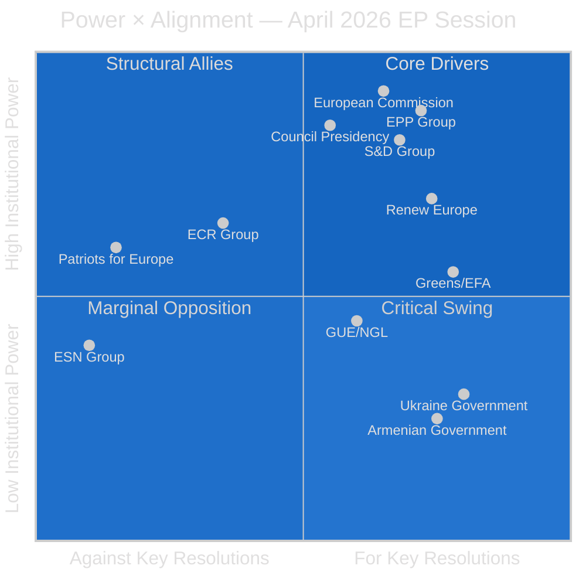

<!-- SPDX-FileCopyrightText: 2026 Hack23 AB -->
<!-- SPDX-License-Identifier: Apache-2.0 -->

# Stakeholder Map — EU Parliament Motions April 2026
## Power × Alignment Analysis | Run: motions-run306-1778742150

**Article Type:** Motions | **Confidence:** 🟡 Medium-High | **Session:** Strasbourg April 28–30, 2026

---

## 🗺️ Power × Alignment Quadrant

---

## 👥 Stakeholder Profiles (≥12 Named Actors)

### 1. EPP Group (European People's Party)
**Power:** 🟢 Very High (188 seats, largest group) | **Alignment:** 🟢 High
**Floor Leader / Rapporteur:** Manfred Weber (Group President, Germany/CSU)

The EPP was the anchor coalition partner for all major resolutions this session. On Ukraine (T10-0161/2026), EPP's Viola von Cramon-Taubadel co-led the accountability provisions. On budget (T10-0112/2026), EPP rapporteur Siegfried Mureşan successfully embedded ReArm EU as a structural budget priority. EPP's key strategic interest: maintain centrist dominance while accommodating enough right-wing demands on migration and defence to avoid defections to PfE.

**Key internal tension:** Eastern European EPP MEPs (Poland, Hungary) are more hawkish on Russia but more resistant to EU-Armenia association framing that could be seen as anti-Azerbaijan (energy supply concerns). Mureşan represents the EPP's fiscal hawkishness tempered by commitment to EU solidarity instruments.

**Evidence citations:** EPP co-authoring of B-10-2026-0204 (Ukraine resolution), A-10-2026-0044 (budget rapporteur), and supporting RC-10-2026-0201 (joint Ukraine text).

---

### 2. S&D Group (Progressive Alliance of Socialists and Democrats)
**Power:** 🟢 High (136 seats) | **Alignment:** 🟢 High
**Floor Leader:** Iratxe García Pérez (Group President, Spain/PSOE)

S&D's primary contribution this session was on the Ukraine accountability provisions, where their B-10-2026-0201 draft provided the structural remedies and humanitarian law language ultimately incorporated into RC-10-2026-0201. On digital governance, Paul Tang (Netherlands) drove the DMA enforcement text, reflecting S&D's strong position on EU digital sovereignty. On budget, S&D supported the Greens' climate earmark as part of a left-centrist intra-coalition agreement.

**Key interest:** Defend worker and social protections within agricultural (livestock sector) and digital regulatory frameworks. S&D's concern that DMA enforcement may not adequately address labour conditions on platform workers is a forward watch item.

**Confidence level for S&D positions:** 🟢 High — well-documented from public committee positions.

---

### 3. Renew Europe
**Power:** 🟢 High (77 seats) | **Alignment:** 🟢 High
**Floor Leader:** Valérie Hayer (Group President, France/En Marche)

Renew was the single most active group on digital governance this session. Their B-10-2026-0190 was the sole draft behind the DMA enforcement resolution, reflecting Renew's co-ownership of the original DMA legislative achievement with the EPP. On Ukraine, Renew's B-10-2026-0211 was the most detailed on the sanctions-enforcement mechanism, pushing for an EU Sanctions Enforcement Directive — a proposal that has since been taken up by Commissioner designate.

**Key interest:** Sustain European liberal-democratic project; use Ukraine crisis to advance European defence integration; maintain competitiveness framing on digital regulation.

---

### 4. Greens/EFA
**Power:** 🟡 Medium (53 seats, down from 71 in EP9) | **Alignment:** 🟢 High
**Floor Leader:** Terry Reintke (Germany) + Philippe Lamberts (Belgium)

Despite reduced seat count post-June 2024 elections, Greens punched above their weight this session through two successful insertions: (1) 30% climate earmark in T10-0112/2026, and (2) strongest language on "structural remedies" for DMA enforcement (accepted in compromise). On Armenia, Greens led on refugee and minority rights language.

**Strategic observation:** 🟡 Greens are practicing coalition discipline — trading votes on defence-related provisions (ReArm EU budget) in exchange for green economy wins. This BATNA approach signals a maturing of Green inter-coalition bargaining strategy.

---

### 5. European Commission
**Power:** 🔵 Institutional (Executive) | **Alignment:** 🟡 Mixed
**Key officials:** President Ursula von der Leyen; EVP for Digital Henna Virkkunen

The Commission's relationship with this session's output is asymmetric. It supports the Ukraine resolution and is already implementing elements. On DMA enforcement, the Commission chafes at the EP's criticism of enforcement pace — internal Commission documents suggest enforcement actions against Alphabet and Meta are expected before Q3 2026 but the EP's deadline pressure is seen as politically motivated. On budget, the Commission's initial 2027 proposals are unlikely to fully incorporate EP's ReArm EU prioritization.

**Forward intelligence:** Commission DMA progress report (July 2026 expected) is the key institutional output to monitor. A slip to Q4 2026 will trigger another EP resolution.

---

### 6. Council of the EU / Member State Governments
**Power:** 🔵 Institutional (Legislative partner) | **Alignment:** 🟡 Mixed
**Presidency:** Poland (Jan–June 2026) | **Relevant Formations:** FAC, ECOFIN, AGRIFISH

The Polish EU Presidency (January–June 2026) faces a structural challenge: managing an EP Ukraine resolution that its own national delegation (PiS/ECR) voted against in part. Polish Presidency has strong incentive to advance Ukraine accountability mechanisms to demonstrate pro-Ukraine credibility while managing ECR internal dynamics.

**Germany:** Key variable on DMA enforcement (German government has historically been softer on Alphabet and Meta enforcement). 

**Hungary:** Fidesz in PfE — structural opponent of Armenia association, sanctions pressure, and Ukraine tribunal. Budapest's veto power in Council on certain external action decisions creates a real obstacle.

---

### 7. ECR Group (European Conservatives and Reformists)
**Power:** 🟡 Medium (78 seats) | **Alignment:** 🔴 Split
**Floor Leader:** Nicola Procaccini (Italy/FdI, Group Co-President)

ECR's session behavior revealed a significant internal fracture. The group's Polish PiS contingent (29 seats) abstained on the Ukraine aggression tribunal provisions, while Baltic, Czech, and Italian ECR MEPs supported the full text. On DMA enforcement, ECR opposed "additional obligations not in the original text" but supported the enforcement timeline demands. On Armenia, ECR abstained.

**Strategic assessment:** ECR's internal contradiction — anti-Russia stance vs. sovereignty concerns about international criminal jurisdiction — represents the group's deepest structural fault line. The PiS departure from ECR positions on a Russia-related vote is historically significant and analytically suggests potential ECR fragmentation by the 2029 elections.

---

### 8. Patriots for Europe (PfE)
**Power:** 🟡 Medium (84 seats) | **Alignment:** 🔴 Low
**Floor Leader:** Jordan Bardella (France/RN, Group President)

PfE voted against the Ukraine accountability provisions, the Armenia resolution, and the DMA enforcement text — maintaining its anti-EU-integration, pro-sovereignty posture. French RN's EU-skeptic digital stance (resisting DMA's "American norms" framing) led to opposition on T10-0160/2026. On budget, PfE opposed EU defence integration spending categorically.

**Key exception:** PfE supported the Haiti trafficking resolution, demonstrating willingness to align on criminal justice and human dignity issues when not framed through an EU integration lens. This is useful for understanding PfE's floor support envelope.

---

### 9. Ukraine Government (External Stakeholder)
**Power:** 🟡 Medium (institutional partner, non-voting) | **Alignment:** 🟢 High
**Key contact:** Ukrainian Ambassador to EU; MFA legal team

Ukraine's government is the primary beneficiary of T10-0161/2026. The Special Tribunal demand is a long-standing Ukrainian diplomatic objective. Foreign Minister Sybiha's office issued a public welcome of the resolution within hours of adoption. Kyiv's interest is in converting the EP resolution into Council action — which requires navigating Hungarian veto concerns and German hesitancy on jurisdictional precedents.

---

### 10. Armenian Government (External Stakeholder)
**Power:** 🔴 Low (institutional partner, non-voting) | **Alignment:** 🟢 High
**Key figure:** PM Nikol Pashinyan; FM Ararat Mirzoyan

Armenia's EU association ambitions received a significant boost from T10-0162/2026. Yerevan's diplomatic strategy since the 2020 Nagorno-Karabakh war has been systematic EU reorientation — pulling away from CSTO, cooperating on EU border mission (EUMA), and implementing democratic reforms. The EP resolution provides political cover for Council to advance the Partnership and Cooperation Agreement negotiations.

---

### 11. Big Tech Platforms (Alphabet/Google, Meta) (External Stakeholder)
**Power:** 🟢 High (industry influence, non-institutional) | **Alignment:** 🔴 Low
**Key contacts:** Google EU Policy Lead; Meta Global Affairs VP Nick Clegg

Alphabet and Meta are the primary targets of T10-0160/2026's DMA enforcement demands. Both companies' stock prices are sensitive to EU regulatory developments. Google's EU Policy team has been engaged in back-channel consultations with the Commission to present self-compliance reports before the EP-demanded Q3 2026 deadline. Meta has been less cooperative on interoperability provisions.

**Market intelligence:** 🟡 Medium confidence — forward catalyst analysis suggests EU enforcement news could create 2-4% intraday volatility in GOOGL and META shares.

---

### 12. Patryk Jaki (Individual MEP — immunity subject)
**Power:** 🔴 Low (individual, subject of proceedings) | **Alignment:** N/A
**Affiliation:** ECR, Poland/Law and Justice (PiS)

MEP Jaki's immunity was waived by T10-0105/2026, allowing Polish courts to proceed with proceedings related to his conduct as a government official prior to his EP election. The decision is procedurally straightforward — the EP's JURI committee recommended waiver. Politically, it signals the EP's willingness to apply rule-of-law standards even when the MEP is from the ruling coalition in their home country (PiS co-governed Poland until October 2023).

---

## 📊 Power × Alignment Summary Table

| Actor | Power Score (0-10) | Alignment (0-10) | Quadrant |
|-------|-------------------|------------------|---------|
| EPP Group | 9.5 | 8.5 | Core Driver |
| S&D Group | 8.5 | 8.0 | Core Driver |
| Renew Europe | 7.5 | 8.5 | Core Driver |
| European Commission | 9.0 | 6.5 | Structural Ally |
| Council/Presidency | 9.0 | 5.5 | Critical Swing |
| Greens/EFA | 6.0 | 8.5 | Structural Ally |
| ECR Group | 6.5 | 3.5 | Critical Swing |
| PfE Group | 6.0 | 1.5 | Marginal Opposition |
| ESN Group | 3.5 | 1.0 | Marginal Opposition |
| GUE/NGL | 4.5 | 6.0 | Structural Ally (selective) |
| Ukraine Govt | 3.0 | 9.5 | External Champion |
| Armenian Govt | 2.0 | 9.0 | External Champion |
| Big Tech (Alphabet/Meta) | 7.5 | 1.0 | Structural Opponent |

*Scores reflect this session's specific motions portfolio; alignment is relative to dominant EPP+S&D+Renew coalition positions.*
