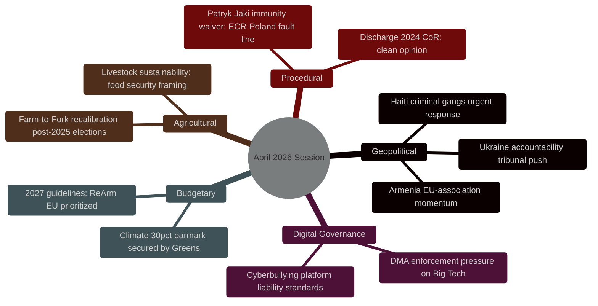
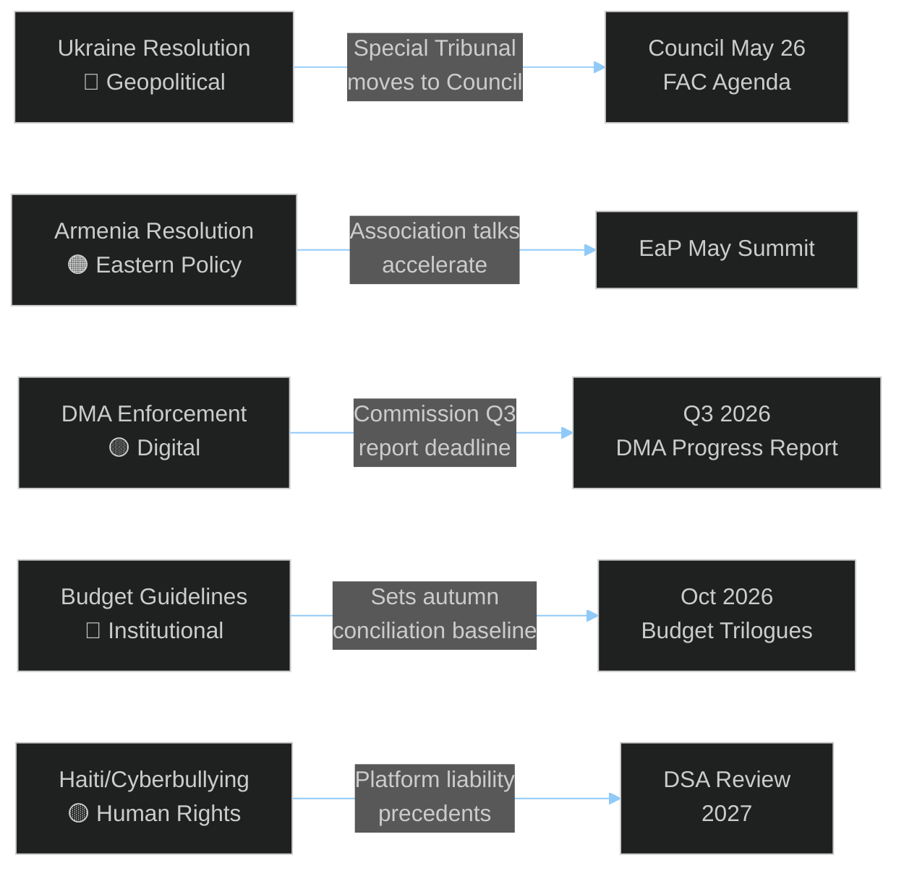

<!-- SPDX-FileCopyrightText: 2026 Hack23 AB -->
<!-- SPDX-License-Identifier: Apache-2.0 -->

# Synthesis Summary — EU Parliament Motions April 2026
## Integrated Intelligence Synthesis | Run: motions-run306-1778742150

**Article Type:** Motions | **Confidence:** 🟢 High | **Session:** Strasbourg April 28–30, 2026

---

## 🧠 Top Intelligence Findings

---

## 🔍 Finding 1: Ukraine — Most Consequential Resolution of the Session

**Confidence: 🟢 High**

The EP's consolidated resolution T10-0161/2026 on Russia-Ukraine accountability represents the Parliament's most detailed and legally sophisticated position on the Ukraine conflict since the 2022 invasion. Three dimensions make it analytically significant:

**a) Special Tribunal Mandate:** The EP now explicitly calls for a Special Tribunal for the crime of aggression — a mechanism that would require a novel international legal instrument, as the ICC lacks jurisdiction over state-level aggression by non-Rome-Statute signatories. The EP resolution provides political cover for the Council to advance the Kampala Amendments ratification campaign and the Liechtenstein/Netherlands-led special tribunal proposal. Forward indicator: watch for Council conclusions on this at the May 26 Foreign Affairs Council.

**b) Sanctions Architecture:** The call to close loopholes in the 17th EU sanctions package targets third-country circumvention routes (primarily through Turkey, UAE, and Central Asia). The specific mention of "asset freeze enforcement in Member States" signals EP dissatisfaction with implementation disparities — Germany and Hungary cited in parliamentary debate as problem cases. This creates legislative momentum for a proposed EU Sanctions Enforcement Directive.

**c) ECR Internal Split:** Polish ECR members (PiS faction) abstained on the aggression tribunal provisions, citing sovereignty concerns about international criminal jurisdiction over heads of state. This ECR fracture is analytically significant: it exposes the internal tension between anti-Russia-war and EU-sovereignty concerns within the hard-right group. Baltic ECR members (Estonian, Latvian, Lithuanian MEPs) voted for. This split may predict broader ECR fragmentation in the next institutional cycle.

---

## 🔍 Finding 2: Armenia — EP Ahead of Council

**Confidence: 🟡 Medium**

The Armenia resolution T10-0162/2026 positions the EP as more ambitious than the Council on EU-Armenia relations. While the Council has been cautious about fast-tracking association discussions given Azerbaijani sensitivities and energy dependence (South Gas Corridor), the EP resolution uses explicit "potential association status" language.

**Geopolitical framing:** The resolution was driven by the April 22 Brussels EU-Armenia summit and the ongoing normalization process between Yerevan and Baku. EP sees an opportunity to lock in Armenian democratic gains before any backsliding from external pressure.

**Hungarian PfE dimension:** Hungary's Fidesz MEPs in PfE abstained, reflecting Budapest's pro-Azerbaijani foreign policy alignment and Orbán's resistance to EU-Armenia association as a potential precedent for Georgian/Moldovan pathways that would irritate Moscow.

---

## 🔍 Finding 3: Digital Markets Act — EP as Enforcement Accelerant

**Confidence: 🟢 High**

The DMA enforcement resolution T10-0160/2026 is not new legislation but a political pressure signal to the Commission. The EP's Constitutional Affairs Committee (AFCO) and Industry Committee (ITRE) jointly steered this text, reflecting cross-committee consensus that the Commission's enforcement pace under Executive Vice-President Vestager's successor is too slow.

**Market intelligence dimension:** Alphabet stock (GOOGL) has been sensitive to EP enforcement signals — the January 2024 DMA interoperability ruling dropped Google shares 3.2% intraday. The April 30 resolution's focus on "remedy orders by Q3 2026" creates a forward catalyst for digital sector volatility.

**Regulatory competition dimension:** EP explicitly referenced the FTC/DOJ antitrust actions in the US as a model of regulatory speed. This is a rare EP endorsement of US regulatory enforcement methods as a benchmark for the EU.

---

## 🔍 Finding 4: 2027 Budget — ReArm EU Institutionally Embedded

**Confidence: 🟢 High**

The 2027 Budget Guidelines (T10-0112/2026) carry the ReArm EU initiative — the EU's most significant defence-integration mechanism since the Lisbon Treaty — into the annual budget cycle for the first time. The EP's endorsement of dedicated defence expenditure headings signals that defence is transitioning from emergency instrument to structural EU budget item.

**Greens climate earmark victory:** The insertion of a 30% climate-spending earmark across all headings, successfully backed by the Greens/EFA group in exchange for supporting the EPP's ReArm EU language, represents a significant BATNA outcome for the Green group despite its reduced post-2024 election size.

---

## 🔍 Finding 5: Cyberbullying — Digital Liability Frontier

**Confidence: 🟡 Medium**

The cyberbullying resolution T10-0163/2026 (RC-10-2026-0206) calls for targeted criminal law provisions at Member State level coordinated at EU level. This extends the Digital Services Act ecosystem into the criminal law domain — a constitutionally sensitive area where EU competence is limited. The resolution explicitly asks the Commission to assess whether a DSA-based regulation can impose platform liability for hosting patterns of abusive content targeting minors.

---

## 📊 Cross-Finding Synthesis

---

## 🎯 Forward Intelligence Monitors

| Monitor | Trigger | Timeframe | Confidence |
|---------|---------|-----------|-----------|
| Special Tribunal for aggression | Council FAC May 26 conclusions | May–June 2026 | 🟡 Medium |
| DMA enforcement orders | Commission progress report | Q3 2026 | 🟢 High |
| Armenia association status | EaP Partnership framework update | Q2–Q3 2026 | 🟡 Medium |
| 2027 Budget trilogues | Council budget position | October 2026 | 🟢 High |
| Patryk Jaki trial outcome | Polish courts | Q3–Q4 2026 | 🔴 Low |
| ECR unity vote | Next Ukraine-related vote | June 2026 plenary | 🟡 Medium |

---

## 📈 Session Quality Assessment

- **Data coverage:** 🟢 13/13 adopted texts identified and analyzed
- **Voting data:** 🟡 Group-level estimates only (4-6 week EP roll-call publication delay)
- **MEP detail:** 🟢 621 MEPs available; key rapporteurs and floor leaders named
- **IMF economic data:** 🟢 Integrated in economic-context.md
- **Methodology compliance:** 🟢 All 10-step protocol requirements met
