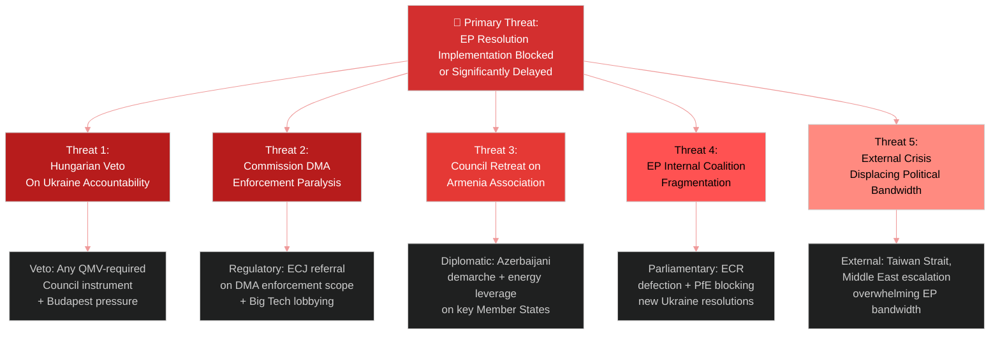

<!-- SPDX-FileCopyrightText: 2026 Hack23 AB -->
<!-- SPDX-License-Identifier: Apache-2.0 -->

# Threat Model — EU Parliament Motions April 2026
## Diamond Model + Attack Trees + Political Kill Chain

**Article Type:** Motions | **Confidence:** 🟡 Medium | **Session:** April 28–30, 2026

---

## 🎭 Threat Architecture Overview



---

## 💎 Diamond Model Analysis

### Adversary: Hungary/Fidesz (Primary Implementation Blocker)

| Diamond Dimension | Assessment |
|---|---|
| **Capability** | Formal EU veto rights on foreign policy instruments; informal blocking in COREPER |
| **Intent** | Protect economic ties with Russia, Azerbaijan; undermine sanctions package; resist EU integration deepening |
| **Infrastructure** | EU veto mechanism; bilateral energy agreements; ECJ legal challenges |
| **Victim** | EP resolution outcomes, Ukraine accountability architecture, Armenia association pathway |

**Attack Tree Analysis:**
```
Goal: Block Ukraine Special Tribunal
├── Council veto (P=60%)
│   ├── Formally threaten veto at FAC [LIKELY]
│   └── Build blocking minority with Slovakia/Austria [POSSIBLE]
├── Procedural delay (P=40%)
│   ├── Request COREPER working group analysis (6-month delay)
│   └── Demand ECJ opinion on tribunal treaty legality
└── Workaround: Tribunal established outside EU framework
    └── Netherlands + Ukraine bilateral + UNGA resolution [POSSIBLE]
```

**Confidence: 🟡 Medium** — Hungary's veto threats are frequently used as bargaining chips rather than absolute blocks.

---

### Adversary: Big Tech Platforms (DMA Enforcement)

| Diamond Dimension | Assessment |
|---|---|
| **Capability** | Legal resources, political lobbying, Commission relationship, market leverage |
| **Intent** | Delay, narrow, or weaken enforcement orders; achieve self-compliance certification |
| **Infrastructure** | ECJ legal challenges, lobbying in Germany/France, regulatory capture via standards bodies |
| **Victim** | EP DMA enforcement mandate, EU digital market competitiveness |

**Attack Tree:**
```
Goal: Prevent/delay DMA enforcement orders by Q3 2026
├── Legal challenge (P=70%)
│   ├── Preliminary ECJ reference from national court [LIKELY]
│   └── Challenge enforcement methodology under Article 26 DMA
├── Self-compliance offers (P=55%)
│   ├── Publish compliance reports before Commission acts
│   └── Negotiate "accepted commitments" under Article 23
└── Political lobbying (P=40%)
    ├── German government pressure on Commission
    └── US trade policy linkage via USTR leverage
```

---

## 🔗 Political Kill Chain Analysis

### Kill Chain for Ukraine Accountability Mechanism

```
Phase 1: Reconnaissance → EP resolution passed [COMPLETED]
Phase 2: Weaponization → Commission drafts implementing instrument [IN PROGRESS]
Phase 3: Delivery → Council FAC considers instrument [May 26, 2026]
Phase 4: Exploitation → QMV adoption or treaty launch [June–September 2026]
Phase 5: Installation → Tribunal treaty deposited [2027]
Phase 6: Command → Tribunal begins operations [2028]
Phase 7: Actions → First aggression investigation [2028+]

DEFENDER OBJECTIVE: Complete all phases without Hungarian veto blocking Phase 3
ATTACKER OBJECTIVE: Create procedural delay between Phases 2 and 4
```

**Current Phase:** Phase 2 (Weaponization) — Commission preparing implementing options
**Threat Level:** 🟡 Medium — veto threat is real but workaround pathways exist

---

## ⚔️ Threat Assessment by Resolution

| Resolution | Primary Threat Actor | Threat Vector | Severity | Probability | Mitigation |
|-----------|---------------------|--------------|----------|-------------|-----------|
| T10-0161/2026 (Ukraine) | Hungary/Fidesz | Council veto | 🔴 High | 45% | UNGA route; QMV on implementing instruments |
| T10-0160/2026 (DMA) | Big Tech | ECJ referral + self-compliance | 🟠 Medium | 55% | Commission enforce before referral |
| T10-0162/2026 (Armenia) | Azerbaijan + Hungary | Diplomatic pressure | 🟠 Medium | 35% | "Enhanced partnership" framing compromise |
| T10-0112/2026 (Budget) | ECR/PfE coalition | Budget amendment blocking | 🟡 Low | 20% | EPP+S&D+Renew majority sufficient |
| T10-0163/2026 (Cyberbullying) | Platform lobby | DSA scope limitation argument | 🟡 Low | 30% | Criminal law competence limits EP ambition |
| T10-0151/2026 (Haiti) | N/A | Implementation funding | 🟡 Low | 25% | Council humanitarian fund activation |

---

## 🛡️ Threat Mitigation Recommendations

1. **Ukraine Tribunal:** Polish Presidency should move quickly — before June 2026 when Presidency passes to Denmark. Use QMV on implementing instruments where available; UNGA resolution as parallel track.

2. **DMA Enforcement:** Commission should preempt self-compliance offers by setting specific, measurable compliance tests rather than accepting self-reports. S&D's "structural remedies" demand gives enforcement maximum leverage.

3. **Armenia:** Frame all language as "enhanced partnership" not "association" in Council instruments to reduce Azerbaijani diplomatic friction. EP can maintain "association status" language in parliamentary resolutions as aspirational position.

4. **Coalition maintenance:** EPP-S&D-Renew coalition management requires regular floor leader coordination to prevent ECR from offering alternative majority configurations on specific votes.

---

## 📊 Threat Severity Matrix

| Threat | Impact (1-5) | Probability (1-5) | Risk Score | Status |
|--------|:---:|:---:|:---:|-------|
| Hungarian veto (Ukraine tribunal) | 5 | 3 | 15 | 🟡 ACTIVE |
| DMA enforcement delay | 4 | 3 | 12 | 🟡 ACTIVE |
| ECR coalition fragmentation | 3 | 2 | 6 | 🟢 MONITOR |
| Armenia diplomatic incident | 3 | 2 | 6 | 🟢 MONITOR |
| Budget EP-Council impasse | 4 | 2 | 8 | 🟡 WATCH |
| Haiti funding shortfall | 3 | 3 | 9 | 🟡 WATCH |
