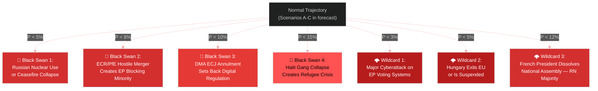

<!-- SPDX-FileCopyrightText: 2026 Hack23 AB -->
<!-- SPDX-License-Identifier: Apache-2.0 -->

# Wildcards & Black Swans — EU Parliament Motions April 2026
## Low-Probability, High-Impact Scenarios

**Article Type:** Motions | **Confidence:** 🔴 Low (by definition) | **Horizon:** 6–24 months

---

## 🦢 Black Swan Overview

---

## 🦢 Black Swan 1: Russian Nuclear Use or Catastrophic Front-Line Change

**Probability: <5%** | **Impact: 🔴 Catastrophic** | **Confidence: 🔴 Low**

### Scenario
Russia uses a tactical nuclear weapon in Ukraine, or the front line catastrophically collapses (Russian breakthrough to Kyiv outskirts), triggering a fundamental reassessment of EU-Russia-Ukraine policy.

### Impact on April 2026 Session Resolutions
- **T10-0161/2026 (Ukraine accountability):** The Special Tribunal demand would be superseded by emergency crisis management; timeline collapses into 3-6 months rather than 2+ years
- **Budget guidelines (T10-0112/2026):** ReArm EU would immediately be converted from "budget planning" to emergency Article 122 TFEU activation — massive off-budget mobilization
- **Armenia (T10-0162/2026):** Armenia association accelerated dramatically if Russia demonstrates willingness to use nuclear tools near CSTO borders

### Early-Warning Signals
- Radioactive isotope monitoring alerts (international) 
- NATO Article 5 consultations announced without public explanation
- Russian state media shift from denial to "defensive use" narrative
- IAEA emergency board convened

### EP Institutional Response
Emergency plenary within 72 hours (as per EP Rules of Procedure emergency session provisions). New resolution superseding T10-0161/2026 within one week. Article 50 TEU-equivalent emergency architecture discussions.

---

## 🦢 Black Swan 2: ECR-PfE Hostile Merger Creates Blocking Minority

**Probability: <8%** | **Impact: 🔴 High** | **Confidence: 🔴 Low**

### Scenario
ECR and PfE negotiate a formal merger or permanent voting alliance, creating a 162-seat right-populist bloc. Combined with ESN (25 seats), this creates a 187-seat bloc. If they can attract 30+ MEPs from NI and disaffected EPP members, they approach a "blocking minority" on certain qualified majority procedures.

### Trigger
An external catalyst — major EU migration crisis, EU constitutional reform attempt, or domestic election results giving PfE/ECR parties governing status in France + Italy simultaneously — could motivate merger talks.

### Impact
- EPP would face pressure to choose: maintain centrist coalition or tack right to absorb ECR
- S&D-Renew-Greens would need GUE/NGL as structural partner (not just selective ally) to maintain majority
- The April 2026 session's resolutions would become the last examples of the current coalition's agenda-setting power

### Analysis
**Why unlikely (8%):** ECR and PfE have fundamental incompatibilities — Italian FdI (ECR) is explicitly pro-EU; French RN (PfE) is more EU-skeptic. The group merger would require one side to abandon its core identity. More likely: issue-by-issue voting cooperation without formal merger.

---

## 🦢 Black Swan 3: DMA Annulment by ECJ

**Probability: <10%** | **Impact: 🔴 High** | **Confidence: 🟡 Medium**

### Scenario
The European Court of Justice annuls key provisions of the Digital Markets Act (Regulation 2022/1925), particularly the "gatekeeper" designation mechanism or the remedy framework, after an action by one of the designated companies (Alphabet, Meta, Apple) under Article 263 TFEU.

### Why Plausible (but unlikely)
- Several DMA provisions are legally innovative and untested in ECJ jurisprudence
- The proportionality principle (Article 5 TEU) could be invoked against structural remedy provisions
- Article 6 DMA's ex-ante obligations without individual harm finding creates novel legal territory
- Probability below 10% because: (a) ECJ has consistently upheld EU competition regulatory power; (b) the DMA's legislative history includes extensive legal-service vetting; (c) prior ECJ judgments on antitrust enforcement have been deferential to Commission discretion

### Impact on T10-0160/2026
An ECJ partial annulment would require new DMA legislation — returning the EP to legislative mode rather than enforcement oversight. Renew and EPP would need to negotiate with S&D on a DMA Recast within 2 years.

---

## 🌩️ Wildcard 1: Major Cyberattack on EP Voting Infrastructure

**Probability: <3%** | **Impact: 🟠 High** | **Confidence: 🟡 Medium**

### Scenario
A state-sponsored cyberattack (Russia, China, or non-state actor) compromises EP's electronic voting system during a plenary vote, either falsifying results or forcing a session suspension.

### Why Notable Now
The EP's cyberbullying resolution (T10-0163/2026) and DMA enforcement pressure on platform security create political salience for a cyberattack scenario. The EP uses electronic voting for roll-call votes — a targeted attack would create a constitutional crisis about vote validity.

### Impact
- Legal: Immediate challenge to affected vote validity under EP Rules of Procedure Rule 185
- Political: Acceleration of EP cybersecurity investment; new urgency resolution on EP institutional cybersecurity
- Geopolitical: If Russia-linked, dramatic intensification of sanctions/accountability demands (counterintuitively improving implementation of T10-0161/2026)

---

## 🌩️ Wildcard 2: Hungary Article 7(1) Suspension

**Probability: <5%** | **Impact: 🟠 High** | **Confidence: 🟡 Medium**

### Scenario
The Council proceeds with an Article 7(1) TEU determination against Hungary, triggering the suspension of Hungarian voting rights in Council. This would remove Hungary's structural veto on EU foreign policy instruments.

### Impact on April 2026 Resolutions
- Ukraine Special Tribunal: No Hungarian veto → dramatically simplified Council adoption pathway
- Armenia association: No Hungarian blocking → faster EaP framework upgrade
- Budget: Hungarian Council vote suspended → budget conciliation easier

### Why Wildcards Rather Than Scenarios
Article 7(1) against Hungary has been pending since 2018 — the persistent political unwillingness of EPP (historically protecting Fidesz) to push it through makes the near-term probability genuinely very low. However, post-Fidesz departure from EPP (2021), the political barriers have reduced marginally.

---

## 🌩️ Wildcard 3: French Government Instability — RN National Majority

**Probability: <12%** | **Impact: 🟠 Medium-High** | **Confidence: 🟡 Medium**

### Scenario
French political instability (prime ministerial collapse by summer 2026) leads Macron to call snap legislative elections; Marine Le Pen's National Rally wins an outright Assembly majority, creating France-wide cohabitation with RN foreign policy influence.

### Impact on EP Context
- Renew Europe group weakened by French En Marche/Renaissance departure or defection risks
- PfE strengthened by French government's informal endorsement
- Armenia resolution becomes politically contested if RN government aligns with French energy interests in South Caucasus (gas corridor)
- Ukraine accountability: RN government would pressure French MEPs to moderate positions

### Partial Signal Already Present
French Renew MEPs' more cautious positions on some provisions (compared to German/Nordic Renew counterparts) already reflect domestic political vulnerability of Macron's movement.

---

## 📊 Wildcard Impact Matrix

| Scenario | Probability | EU-Ukraine Impact | EP Coalition Impact | Market Impact |
|---------|:-----------:|:-----------------:|:-------------------:|:-------------:|
| Russian nuclear use | <5% | 🔴 Catastrophic | 🔴 Collapse | 🔴 Catastrophic |
| ECR-PfE merger | <8% | 🟠 High negative | 🔴 Coalition crisis | 🟡 Moderate |
| DMA ECJ annulment | <10% | N/A | 🟡 Renew/EPP stress | 🟢 Big Tech positive |
| EP cyberattack | <3% | 🟡 Moderate positive | 🟡 Short-term disruption | 🟡 Moderate |
| Hungary Article 7 | <5% | 🟢 High positive | 🟢 Coalition strengthened | Neutral |
| French RN majority | <12% | 🟠 Negative | 🟠 Renew weakened | 🟡 Mixed |
