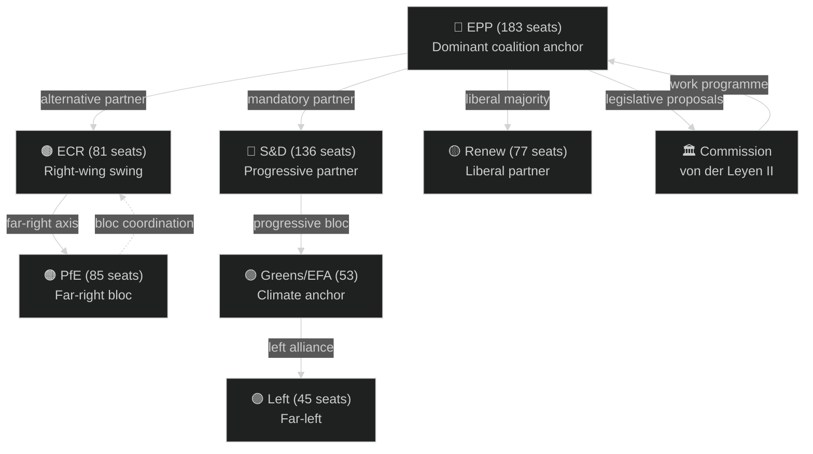

# Actor Mapping — EU Parliament Year Ahead 2026-2027
**Date:** 2026-05-14 | **Article Type:** year-ahead | **Methodology:** Multi-dimensional Actor Analysis

---

## Primary Actors (Tier 1 — Decisive Influence)

### EPP (European People's Party Group)
- **Seats:** 183 (25.52%) | **Countries:** 27
- **Role:** Dominant legislative agenda-setter; every majority requires EPP participation
- **Key interests:** Competitiveness, defence industrial base, Green Deal recalibration, rule of law in Eastern Europe
- **Leadership:** Manfred Weber (EP President's group ally); coordination with von der Leyen Commission
- **Key leverage:** Can grant or deny majority to ANY legislative act; veto power in practice
- **Vulnerabilities:** Internal tension between economic liberals and social conservatives; southern vs. northern member state interests on fiscal policy
- **Year ahead posture:** Assertive on competitiveness agenda; cautious on migration; firm on Ukraine support; negotiating with Council on budget

### S&D (Progressive Alliance of Socialists and Democrats)
- **Seats:** 136 (18.97%) | **Countries:** 25
- **Role:** Lead opposition to EPP right turns; principal progressive bloc architect
- **Key interests:** Social Europe, workers' rights, climate ambition, anti-corruption, digital rights
- **Key leverage:** Can expand or shrink the mainstream majority threshold; without S&D, EPP needs ECR support
- **Vulnerabilities:** Internal east-west tensions on rule of law; weak on defence spending increases
- **Year ahead posture:** Push progressive social agenda where coalition available; firm Ukraine stance; challenge DMA enforcement pace

### ECR (European Conservatives and Reformists)
- **Seats:** 81 (11.30%) | **Countries:** 18
- **Role:** Right-wing competitor to EPP; occasional EPP coalition partner on sovereignty/migration
- **Key interests:** National sovereignty, EU institutional constraints, anti-federalism, traditional values
- **Key leverage:** Provides EPP alternative majority path when Greens/Left resist; can peel NI members
- **Vulnerabilities:** Internal Italy-Poland tensions; Meloni government's Brussels engagement sometimes contradicts ECR EP posture
- **Year ahead posture:** Selective cooperation with EPP on budget austerity; opposition to federalist constitutional reforms

### PfE (Patriots for Europe)
- **Seats:** 85 (11.85%) | **Countries:** 13
- **Role:** Largest far-right grouping; anchored by French RN and Hungarian Fidesz
- **Key interests:** Oppose migration, climate regulation, EU sovereignty expansion; pro-Russia soft positions
- **Key leverage:** With ECR, forms a 166-seat bloc capable of forcing compromises on EPP
- **Vulnerabilities:** Internal Fidesz-RN tensions; French electoral volatility; Orbán's bilateral Hungary-Commission conflicts
- **Year ahead posture:** Obstruct DMA enforcement where possible; block Ukraine financial instruments; challenge immigration regulations

### Renew Europe
- **Seats:** 77 (10.74%) | **Countries:** 21
- **Role:** Liberal centre; EPP's principal partner for pro-European majorities
- **Key interests:** Digital single market, free trade, Ukraine support, EU deepening
- **Key leverage:** Provides decisive votes for mainstream majorities; swing vote on budget austerity vs. investment
- **Vulnerabilities:** Shrinking membership since 2019; French Macron weakness reduces political authority
- **Year ahead posture:** Push DMA/AI Act implementation; advocate Mercosur ratification; defend Ukraine solidarity instruments

---

## Secondary Actors (Tier 2 — Significant Influence)

### Greens/EFA
- **Seats:** 53 (7.39%) | **Countries:** 17
- **Role:** Climate/progressive anchor; increasingly isolated from EPP-led majorities
- **Key interests:** Green Deal ambition, biodiversity, just transition, European federalism
- **Year ahead posture:** Push back against EPP climate recalibrations; ally with S&D on social Europe
- **Key risk:** Internal fractures between Green parties and EFA regionalist component

### The Left (GUE/NGL)
- **Seats:** 45 (6.28%) | **Countries:** 13
- **Role:** Anti-establishment left; marginal on most votes but vocal on social/labour
- **Key interests:** Labour rights, anti-militarism (limits on defence spending), social protection
- **Year ahead posture:** Oppose most defence instruments; push hard on workers' rights legislation

### Non-Inscrits (NI — Non-Attached)
- **Seats:** 30 (4.18%) | **Countries:** 11
- **Role:** Unaffiliated members across the political spectrum; heterogeneous
- **Key risk:** Progressive erosion toward ECR/PfE orbit; Braun immunity waiver (already processed)
- **Year ahead posture:** Unpredictable; track individual voting patterns

### ESN (Europe of Sovereign Nations)
- **Seats:** 27 (3.77%) | **Countries:** 9
- **Role:** Hard far-right fringe; AfD anchored; ECR-PfE orbit adjacent
- **Key interests:** National sovereignty maximalism; anti-EU institutions
- **Year ahead posture:** Bloc voting against European integration measures; occasional ECR/PfE coordination

---

## Key Institutional Actors (External to Parliament)

### European Commission (von der Leyen II)
- **Role:** Initiates legislation; owns the political programme to which EP responds
- **Key agenda items for 2026-2027:** Competitiveness agenda, Defence Union, AI Act implementation, Budget 2027 proposal
- **EP relationship:** Strong alignment with EPP; S&D partnership on social elements; tensions with far right

### European Council / Council of the EU
- **Role:** Co-legislator; the Budget Council negotiations will dominate autumn 2026
- **Key dynamics:** Member state coalition on defence spending, cohesion funds, rule-of-law conditionality

### European Court of Justice
- **Role:** ECJ opinion on Mercosur (requested by EP in Jan 2026) will shape trade policy for a generation
- **Timeline:** ECJ opinion typically takes 12-18 months — expected 2027

### International Partners
- **USA:** US tariff quotas adjustment (TA-10-2026-0096) signals active trade management; EP monitors transatlantic relations closely
- **Ukraine:** Beneficiary of loan mechanism; accountability framework recipient; defence cooperation expanding
- **Mercosur countries:** EU-Mercosur deal awaiting ECJ opinion and final ratification

---

## Actor Influence Matrix

---

*Methodology: Multi-dimensional actor mapping per artifact catalog. Sources: EP Open Data Portal MEP records, political landscape analysis, adopted texts 2026. Confidence: 🟢 High for seat composition; 🟡 Medium for behavioural predictions.*
