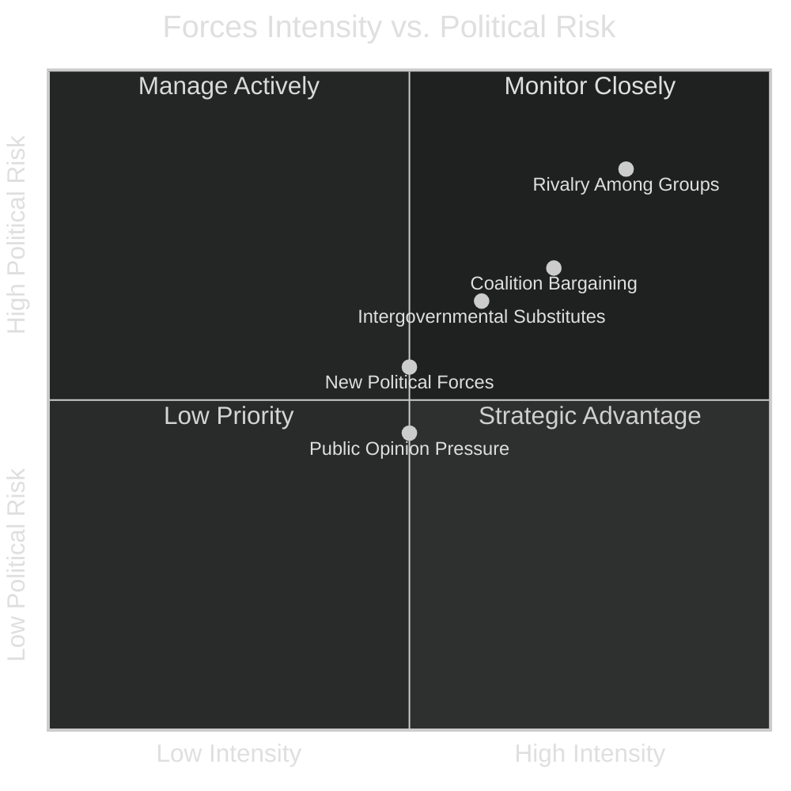

# Forces Analysis — EU Parliament Year Ahead 2026-2027
**Date:** 2026-05-14 | **Article Type:** year-ahead | **Framework:** Porter's Five Forces + Political-Legislative Adaptation

---

## Framework Overview

This forces analysis applies a five-force model adapted for legislative/political environments, assessing the structural dynamics that will shape the EP's 2026-2027 legislative year.

---

## Force 1: Rivalry Among Political Groups (Competitive Intensity)

**Rating: HIGH — Intensity: 8/10**

The 2026-2027 parliamentary year features intense multi-polar competition across multiple ideological axes:

### Centre-Right vs. Far-Right Competition
The most consequential rivalry is between EPP (183 seats) and the ECR-PfE bloc (166 seats combined). EPP must consistently demonstrate to its voter base that it can "outperform" the far right on:
- **Migration control** — risk of voter leakage if EPP appears insufficiently firm
- **National sovereignty** — pressure to limit EU institutional expansion
- **Climate recalibration** — EPP increasingly aligns with ECR on "cost of green transition" narrative

**Competitive dynamic (🟢 High confidence):** EPP will pursue selective issue convergence with ECR/PfE to limit far-right electoral growth, especially ahead of key national elections in Germany (2025 completed), France, and any snap elections. This creates internal S&D/Greens/Renew tension when EPP-ECR majorities form.

### Mainstream Pro-European Competition
Between EPP, S&D, and Renew for ownership of the "European project" narrative:
- Digital economy: Renew strongest brand
- Social Europe: S&D strongest brand
- Security/defence: EPP and Renew competing
- Climate ambition: S&D-Greens collaboration vs. EPP recalibration

**Competitive dynamic (🟡 Medium confidence):** The S&D-Renew competition for centre-left/liberal voters keeps their legislative cooperation structurally necessary but politically tense.

---

## Force 2: Threat of New Entrants (New Political Forces)

**Rating: MEDIUM — Intensity: 5/10**

### Potential New/Shifting Political Forces

**ESN (Europe of Sovereign Nations, 27 seats):** The newest recognised group in EP10. Currently marginalised (AfD-anchored) but represents the far-right fringe beyond PfE. Growth potential modest within current term, but could absorb NI defections.

**NI drift:** 30 non-attached MEPs represent potential recruitment territory for established groups. Historical pattern suggests ECR gains from NI attrition over time.

**National electoral shocks:** If major member state elections produce unexpected results (e.g., far-right surge in France following snap elections, or coalition collapse in a large member state), EP group membership could shift significantly. 

**Assessment (🟡 Medium confidence):** Within a 12-month horizon, new group formations are unlikely. The rules for group formation (23 MEPs from 7+ member states) create entry barriers. Incremental NI drift toward established far-right groups is the primary "new entrant" risk.

---

## Force 3: Threat of Substitutes (Alternative Governance Mechanisms)

**Rating: MEDIUM-HIGH — Intensity: 6/10**

### Intergovernmental Substitution
The most significant substitute force is intergovernmentalism — member states bypassing EP legislative co-decision through:
- **Enhanced cooperation** procedures (Ukraine loan mechanism used this route)
- **Council-only decisions** on foreign policy and some economic coordination
- **European Council political direction** that pre-empts EP legislative initiative

**Example (2026):** The "Loan for Ukraine" enhanced cooperation (TA-10-2026-0010) demonstrates that when EP wants to move fast on geopolitics, it endorses intergovernmental tools. But this also reduces EP's own institutional leverage.

### Regulatory Agency Substitution
EU agencies (BEREC for telecom, ENISA for cybersecurity, ERA for rail) increasingly make quasi-legislative decisions that bypass full EP scrutiny. The DMA enforcement by the Commission (TA-10-2026-0160) illustrates tensions: EP passes resolution but enforcement discretion rests with Commission/CJEU.

### ECJ as Substitution
The ECJ opinion request on Mercosur (TA-10-2026-0008) shows EP strategically using judicial review as a substitute for legislative blocking — when EP cannot block by vote alone, it routes the issue to the Court.

**Assessment (🟢 High confidence):** Intergovernmental bypasses are growing, reducing EP leverage on urgent geopolitical matters but not on core domestic legislation.

---

## Force 4: Bargaining Power of Suppliers (Coalition Partners)

**Rating: HIGH — Intensity: 7/10**

In the legislative context, "suppliers" are the political groups supplying votes to form legislative majorities. EPP is the primary "buyer" of coalition support.

### EPP's Coalition Dependency Map

| Scenario | EPP + Partners | Seats | Viable? |
|----------|---------------|-------|---------|
| Grand coalition baseline | EPP + S&D | 319 | ❌ (short by 41) |
| Mainstream majority | EPP + S&D + Renew | 396 | ✅ STRONG |
| Conservative majority | EPP + ECR + PfE | 349 | ❌ (short by 11) |
| Right-populist stretch | EPP + ECR + PfE + ESN | 376 | ✅ (marginal) |
| Emergency consensus | EPP + S&D + ECR | 400 | ✅ STRONG |

**Bargaining power analysis (🟢 High confidence):**
- S&D has HIGH bargaining power — EPP can't reach majority without them OR needs to bring ECR, which has political costs
- ECR has MEDIUM-HIGH bargaining power — provides EPP an alternative path, but politically costly on pro-European issues
- Renew has MEDIUM bargaining power — useful but can be bypassed if EPP-S&D-ECR align
- Greens/EFA have LOW bargaining power currently — EPP prefers to exclude them; needed only on narrow Green Deal votes

### "Supplier Switching" Dynamics
EPP can switch between S&D-led (pro-European) and ECR-led (nationalist) coalitions depending on the issue. This structural flexibility reduces any single partner's bargaining power but increases political volatility and unpredictability.

---

## Force 5: Bargaining Power of Buyers (Citizens, Civil Society, Media)

**Rating: MEDIUM — Intensity: 5/10**

In the legislative political context, "buyers" are the constituents, civil society organisations, and public opinion that EP groups serve.

### Public Opinion Pressure Points (2026-2027)

**Cost of living / anti-austerity pressure:** Citizens in high-inflation member states pressure their MEPs to resist Budget 2027 cuts. S&D and Left groups amplify this.

**Climate concern (especially youth):** Greens/EFA and Left draw legitimacy from climate-focused voters. EPP's Green Deal recalibration risks backlash in climate-sensitive member states (Germany, Netherlands, Austria).

**Security concerns / Ukraine fatigue:** Some voter segments in Central and Eastern Europe show fatigue on Ukraine financial instruments. PfE and ECR exploit this.

**Digital rights:** Civil society (EFF, EDRi, Privacy International) actively lobbies on DMA, AI Act, Data Act. Parliament has track record of listening on digital rights (GDPR 2016, DMA 2022).

**Trade policy:** Agriculture lobbies (Copa-Cogeca, Agri-committees) exert strong pressure on Mercosur ratification. France and Poland especially sensitive.

**Assessment (🟡 Medium confidence):** Citizen/CSO pressure is diffuse but not negligible. It most clearly shapes the climate recalibration debate and digital rights enforcement. The budget cycle will activate social partner (ETUC, BusinessEurope) lobbying intensively in autumn 2026.

---

## Strategic Forces Summary

---

## Key Structural Conclusions

1. **Competitive rivalry** between EPP and the ECR-PfE bloc is the defining structural force of 2026-2027. EPP's positioning vis-à-vis the far right on migration and sovereignty will shape every coalition formation.

2. **S&D's bargaining power** is structurally high — they are EPP's most reliable path to 360+ votes without the political cost of far-right association. This gives S&D leverage to push social agenda items.

3. **Intergovernmental substitution** is reducing Parliament's formal co-decision role on urgent geopolitical matters, but EP retains strong influence via budget, regulatory, and soft-power instruments.

4. **Coalition switching** capability keeps all medium partners (Renew, ECR) at medium bargaining power — none can hold EPP hostage to a single issue.

5. **Public opinion / civil society** will be most impactful on digital rights (DMA enforcement), climate policy recalibration, and Budget 2027 social dimensions.

---

*Sources: EP Open Data Portal, political landscape analysis, adopted texts 2026, coalition arithmetic. Methodology: Porter's Five Forces adapted per `analysis/methodologies/artifact-catalog.md`. Confidence: 🟢 High for structural data; 🟡 Medium for behavioural predictions.*
