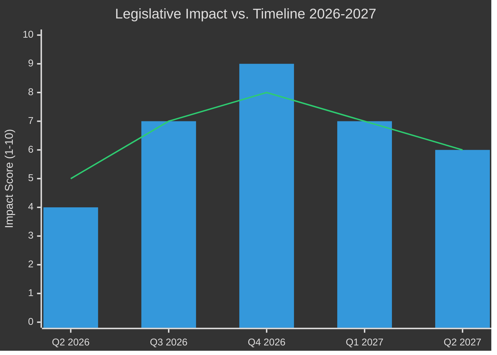

# Impact Matrix — EU Parliament Year Ahead 2026-2027
**Date:** 2026-05-14 | **Article Type:** year-ahead | **Methodology:** Multi-stakeholder Impact Assessment

---

## Impact Assessment Framework

**Scoring:** Impact (1-10) × Likelihood (1-10) = Priority Score
**Timeframes:** Near-term (Q2-Q3 2026), Medium-term (Q4 2026-Q1 2027), Longer-term (Q2-Q4 2027)

---

## Tier 1: Critical Impact Events (Priority Score ≥ 60)

### 1. 2027 Budget Cycle — First Reading Vote
- **Priority Score: 81** (Impact: 9, Likelihood: 9)
- **Affected Stakeholders:** All 27 member states; Commission; all political groups; civil society
- **Impact Description:** The 2027 EU budget first reading in Parliament (expected autumn 2026) sets the fiscal framework for the entire EU policy landscape. April 2026 guidelines (TA-10-2026-0112) signal austerity pressures, defence supplementary requests, and potential cohesion fund disputes.
- **Timeframe:** Q3-Q4 2026 (critical votes); resolution by Q1 2027
- **Channels of Impact:**
  - *Direct legislative:* Sets EU spending ceilings for all programmes
  - *Political:* Tests EPP-S&D grand coalition durability under fiscal stress
  - *Institutional:* If negotiations fail → provisional twelfths → institutional crisis
  - *Economic:* Cohesion fund allocation affects regional development across 27 states
- **Confidence:** 🟢 High (based on adopted budget guidelines and established procedure)

### 2. DMA Enforcement Actions Against Big Tech
- **Priority Score: 72** (Impact: 9, Likelihood: 8)
- **Affected Stakeholders:** European tech consumers; US/global tech companies; DG COMP; innovation ecosystem
- **Impact Description:** Parliament's April 2026 resolution (TA-10-2026-0160) on DMA enforcement signals high-priority political attention. Commission enforcement actions against designated gatekeepers (Apple, Google, Meta, Amazon, Microsoft) will proceed throughout 2026-2027.
- **Timeframe:** Ongoing throughout the year-ahead period
- **Channels of Impact:**
  - *Consumer:* App store competition, interoperability requirements, data portability
  - *Economic:* Billions in potential fines; market structure changes
  - *Geopolitical:* US-EU trade friction if enforcement targets US companies disproportionately
  - *Regulatory:* Precedent for DMA Article 26 interim measures use
- **Confidence:** 🟢 High (enforcement trajectory confirmed by adopted resolution)

### 3. EU-Mercosur Agreement ECJ Opinion
- **Priority Score: 63** (Impact: 9, Likelihood: 7)
- **Affected Stakeholders:** EU agricultural sector; Latin American trade partners; Commission DG Trade; environmental groups
- **Impact Description:** EP's January 2026 request for ECJ opinion on Mercosur's treaty compatibility (TA-10-2026-0008) is the largest trade deal in EU history. ECJ opinion expected within 12-18 months — within the year-ahead window.
- **Timeframe:** Q3 2026 – Q2 2027 (ECJ timeline)
- **Channels of Impact:**
  - *Trade:* €88bn+ trade relationship; EU goods access to 265m consumers
  - *Agriculture:* French/Polish farm sector opposition — beef, poultry, ethanol competition fears
  - *Environmental:* Amazon deforestation concerns; sustainability standards enforcement
  - *Institutional:* Sets precedent for EP role in external trade consent procedures
- **Confidence:** 🟡 Medium (ECJ timeline uncertain; political outcomes contingent)

---

## Tier 2: High Impact Events (Priority Score 40-59)

### 4. Ukraine Accountability and Financial Instruments (Continued)
- **Priority Score: 56** (Impact: 8, Likelihood: 7)
- **Affected Stakeholders:** Ukraine government; EU taxpayers; defence contractors; neighbouring states
- **Impact Description:** Following the Ukraine loan mechanism ratification, Parliament will legislate on additional accountability frameworks, military support instruments, and reconstruction financing throughout 2026-2027.
- **Timeframe:** Continuous
- **Channels of Impact:**
  - *Fiscal:* Multi-billion euro commitments managed through special instruments
  - *Political:* Coalition durability test — PfE/ECR resistance; EPP-S&D-Renew mainstream coalition must hold
  - *Defence industrial:* EP committee scrutiny of new European Defence Industrial Strategy instruments
- **Confidence:** 🟢 High (established policy trajectory)

### 5. AI Act Implementation Milestones
- **Priority Score: 48** (Impact: 8, Likelihood: 6)
- **Affected Stakeholders:** AI developers; high-risk AI deployers; citizens; national competent authorities
- **Impact Description:** The AI Act (entered force August 2024) reaches first major implementation milestones in 2026-2027: prohibited AI systems rules enforceable; GPAI model requirements; establishment of AI Office governance structures.
- **Timeframe:** Q2 2026 – Q1 2027 (milestone cascade)
- **Channels of Impact:**
  - *Regulatory:* National authorities operationalising enforcement
  - *Innovation:* Investment chilling/redirecting effects depending on implementation strictness
  - *Political:* EP and Commission rivalry over AI Office independence vs. Commission control
- **Confidence:** 🟡 Medium (implementation pace uncertain)

### 6. European Electoral Act Ratification Monitoring
- **Priority Score: 42** (Impact: 6, Likelihood: 7)
- **Affected Stakeholders:** EP electoral authorities; national parliaments/governments; voters
- **Impact Description:** EP adopted resolution on ratification hurdles (TA-10-2026-0006) — signals that the Electoral Act reform is stalling in member state ratification. EP will monitor and potentially escalate.
- **Timeframe:** Ongoing 2026-2027
- **Channels of Impact:**
  - *Democratic architecture:* Pan-European constituency election model potentially delayed
  - *Institutional:* Reinforces EP-member state tensions on supranational electoral design
- **Confidence:** 🟡 Medium

---

## Tier 3: Medium Impact Events (Priority Score 20-39)

### 7. Humanitarian Aid Doctrine Development
- **Priority Score: 35** (Impact: 7, Likelihood: 5)
- **Policy context:** Jan 2026 resolution (TA-10-2026-0005) on polycrisis humanitarian response. EP will continue shaping EU humanitarian principles against backdrop of Syria, Haiti, and future crises.

### 8. Animal Welfare Regulation (Cats/Dogs Traceability)
- **Priority Score: 28** (Impact: 4, Likelihood: 7)
- **Policy context:** Adopted April 2026 (TA-10-2026-0115). Implementation phase begins; national transposition monitoring through committee hearings.

### 9. EU Globalisation Adjustment Fund (Labour Market)
- **Priority Score: 24** (Impact: 4, Likelihood: 6)
- **Policy context:** EGF Belgium/Tupperware application approved (TA-10-2026-0073). Template for industrial transitions as manufacturing restructuring continues.

### 10. Measuring Instruments Directive Amendment
- **Priority Score: 21** (Impact: 3, Likelihood: 7)
- **Policy context:** Technical legislative update (TA-10-2026-0029). Low political salience but relevant for industrial standards.

---

## Aggregate Impact Assessment

**Peak impact period: Q3-Q4 2026** — Budget first reading + DMA enforcement + Ukraine instruments converge in autumn 2026.

---

## Stakeholder Impact Summary

| Stakeholder Group | Primary Impact Source | Net Impact | Confidence |
|------------------|----------------------|-----------|-----------|
| EU Citizens (27 states) | Budget 2027 austerity; DMA consumer benefits | Mixed | 🟡 Medium |
| Business community | DMA/AI Act enforcement; budget investment | Negative (regulation) / Positive (investment) | 🟡 Medium |
| Civil society / NGOs | DMA rights; humanitarian; animal welfare | Generally positive | 🟢 High |
| Agriculture sector | Mercosur; cohesion funds | Potentially negative | 🟡 Medium |
| Tech sector (US/global) | DMA enforcement; AI Act | Negative regulatory burden | 🟢 High |
| Ukraine | Accountability instruments; loan | Positive | 🟢 High |
| Eastern Partnership countries | Democracy support resolutions; EaP conditionality | Positive (Georgia/Armenia) | 🟡 Medium |

---

*Methodology: Multi-stakeholder impact matrix per artifact catalog. Sources: EP adopted texts 2026, political landscape, coalition analysis. Confidence codes apply to individual assessments as marked.*
