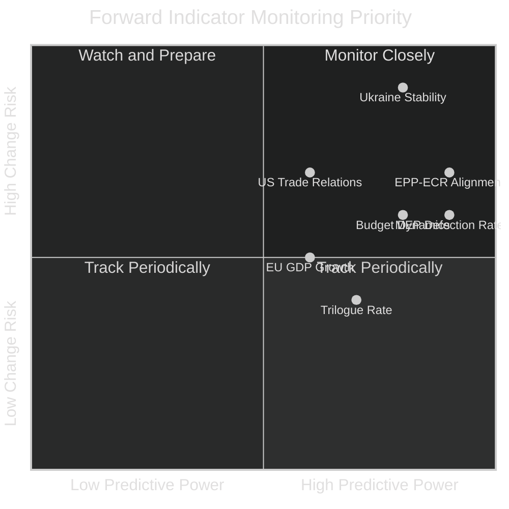

# Forward Indicators — EU Parliament Year Ahead 2026-2027
**Date:** 2026-05-14 | **Article Type:** year-ahead | **Methodology:** Forward Indicator Tracking

---

## Forward Indicator Framework

Forward indicators are leading signals that predict future legislative and political developments in the European Parliament. Monitoring these indicators provides early warning of trajectory changes and helps stakeholders anticipate policy outcomes.

---

## Economic Forward Indicators

### 1. EU Inflation Trajectory
**Current signal:** ECB target rate ~2.5% (approaching 2% target)
**Leading indicator for:** Budget 2027 political environment; social spending debates
**Monitoring threshold:** >3% triggers austerity pressure; <1.5% enables social investment narrative
**Watch frequency:** Monthly ECB releases

### 2. Eurozone GDP Growth
**Current signal:** ~1.2-1.5% growth (modest, post-energy-crisis recovery)
**Leading indicator for:** Competitiveness legislation urgency; social funding pressures
**Monitoring threshold:** <0.5% triggers economic urgency legislation; >2.5% enables ambitious programmes
**Source:** Eurostat quarterly flash estimates; IMF WEO semiannual

### 3. EU Defence Spending Levels
**Current signal:** Multiple EU27 members approaching 2% NATO target
**Leading indicator for:** EDIP scope and ambition; defence financing instruments
**Monitoring threshold:** >20 EU members at 2%+ NATO triggers EDIP acceleration
**Watch frequency:** NATO annual statistics (March)

### 4. EU-US Trade Balance
**Current signal:** Elevated tension; Trump tariff threats pending
**Leading indicator for:** Trade Committee (INTA) legislative agenda; trade defence instruments
**Monitoring threshold:** US tariffs >10% on key EU sectors triggers formal WTO action + EP response
**Watch frequency:** Monthly trade statistics; INTA committee agendas

---

## Political Forward Indicators

### 5. EPP-ECR Vote Alignment Rate
**Current signal:** Estimated 25-30% alignment on contested votes (no DOCEO data available)
**Leading indicator for:** Coalition fracture risk; far-right normalisation
**Monitoring threshold:** >40% alignment on contested votes = mainstream coalition stress
**Watch frequency:** Every plenary session (DOCEO XML when available)

### 6. MEP Defection Rate in Key Votes
**Current signal:** Unknown (DOCEO unavailable)
**Leading indicator for:** Coalition fragility; group discipline
**Monitoring threshold:** >15 EPP defections per major vote = systemic instability
**Watch frequency:** Per plenary session

### 7. National Government Composition Changes
**Current signal:** Stable in major EU27 members (France, Germany, Italy, Spain, Poland)
**Leading indicator for:** Council position shifts; EP group composition stability
**Key watch events:** German federal election aftermath (Feb 2025 completed); French parliamentary dynamics; Italian government stability
**Watch frequency:** Ongoing political monitoring

### 8. Commission-EP Institutional Disputes
**Current signal:** Relations stable under Ursula von der Leyen second term
**Leading indicator for:** Institutional crisis risk; legislation delays
**Monitoring threshold:** EP motion of censure tabled (even if not voted) = major institutional signal
**Watch frequency:** Inter-institutional meeting outcomes

---

## Legislative Forward Indicators

### 9. Committee Rapporteur Assignment Rate
**Current signal:** Normal post-anniversary appointment process underway
**Leading indicator for:** Legislative throughput velocity
**Monitoring threshold:** <10 rapporteurs assigned/month = pipeline slowdown
**Watch frequency:** Monthly EP committee agenda publications

### 10. Trilogue Launch Rate
**Current signal:** EDIP and AI Act delegated acts expected H2 2026
**Leading indicator for:** First-reading adoption pace
**Monitoring threshold:** <2 new trilogues/month = legislative pipeline congestion
**Watch frequency:** EP-Council interinstitutional database

### 11. Council General Approach Adoption Rate
**Current signal:** Normal (Polish Presidency H1 2025 completed; current Presidency active)
**Leading indicator for:** EP-Council negotiations pace
**Monitoring threshold:** <2 general approaches/month = Council blocking legislative flow
**Watch frequency:** Council press releases; EP trilogue notifications

---

## Geopolitical Forward Indicators

### 12. Ukraine Front-Line Stability
**Current signal:** Active conflict; no ceasefire imminent (as of May 2026)
**Leading indicator for:** Emergency EP debates; financial instrument legislation
**Monitoring threshold:** Major territorial change (either direction) triggers EP emergency session
**Watch frequency:** Daily intelligence reports; EP AFET committee signals

### 13. US-EU Trans-Atlantic Relations Index
**Current signal:** Strained; Trump administration selective engagement
**Leading indicator for:** Trade legislation urgency; defence spending debates; digital sovereignty posture
**Monitoring threshold:** US withdrawal from NATO or trade war escalation = emergency legislative response
**Watch frequency:** G7 summits; Trans-Atlantic Economic Council meetings; NATO ministerials

---

## Indicator Dashboard Summary

---

*Forward indicators framework derived from political intelligence methodology. Monitoring frequencies and thresholds are analytical guidance, not definitive rules. Confidence: 🟡 Medium — indicator thresholds are evidence-based but necessarily imprecise for a complex adaptive system like the EP.*
