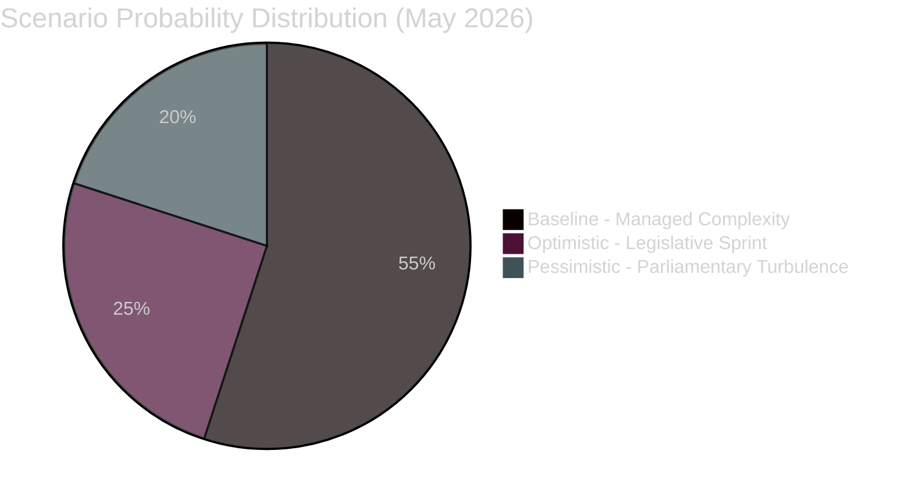

# Scenario Forecast — EU Parliament Year Ahead 2026-2027
**Date:** 2026-05-14 | **Article Type:** year-ahead | **Methodology:** Three-Scenario Analysis (Admiralty + WEP)

---

## Scenario Framework

**Baseline (Most Probable):** How things unfold if current trends continue without major shocks.
**Optimistic:** How things unfold if key structural factors resolve favourably.
**Pessimistic:** How things unfold if key structural risks materialise.

**WEP Probability Estimates:**
- Baseline: ~55% (Likely)
- Optimistic: ~25% (Roughly Even Chance)
- Pessimistic: ~20% (Unlikely)

---

## SCENARIO A: "Managed Complexity" (Baseline — 55% probability)

### Narrative
The European Parliament navigates 2026-2027 as a productive but complex institution. The EPP-S&D-Renew mainstream coalition remains the primary legislative vehicle, achieving consensus on competitiveness, digital governance, and Ukraine support while experiencing significant turbulence on budget and climate. The far-right bloc grows modestly but does not fundamentally disrupt governance. The year ends with a budget deal, substantial digital legislation advancement, and continued Ukraine support — but with Green Deal ambitions further moderated.

### Key Assumptions
1. EPP maintains red line against systematic ECR/PfE coalition for mainstream legislation
2. S&D accepts competitiveness trade-offs in exchange for social programme preservation in Budget 2027
3. Ukraine war continues without major escalation or breakthrough — steady-state support
4. US-EU trade tensions managed through diplomatic engagement
5. ECJ Mercosur opinion delayed beyond the year-ahead window

### Expected Outcomes

**Budget 2027:** Agreed in December 2026 after difficult negotiations. Defence supplementary partially funded through special instruments. Cohesion funds mostly preserved. Limited climate fund reductions. Social programmes broadly maintained.

**Digital:** DMA enforcement actions against 2-3 major gatekeepers initiated by Commission. AI Act first prohibitions fully operational. Data Act compliance deadline met. EP IMCO committee passes oversight resolution.

**Competitiveness:** European Defence Industrial Programme (EDIP) advanced. Chips Act II in committee. Capital Markets Union incremental progress. EU batteries regulation amended for competitiveness.

**Ukraine:** Additional financial instrument adopted (€5-10bn range). Accountability framework operational. Some reconstruction pre-funding begins. War continues without ceasefire.

**Climate:** Some Green Deal elements moderated (emission credits adjusted, vehicle mandate under review). Nature Restoration Law implementation slow. CBAM fully operational. Overall: 2050 carbon neutrality trajectory still nominally intact but credibility weakened.

### Confidence Level: 🟡 Medium-High

---

## SCENARIO B: "Legislative Sprint" (Optimistic — 25% probability)

### Narrative
A positive alignment of factors — strong economic data, diplomatic breakthrough on Ukraine, and EPP holding its European centre — enables an unusually productive legislative year. The competitiveness agenda passes a landmark package; Budget 2027 is agreed early; DMA enforcement establishes EU as credible digital arbiter; and the Parliament strengthens its democratic legitimacy heading into the second half of the term.

### Key Assumptions
1. Ukraine ceasefire negotiations begin (not concluding, but creating diplomatic space)
2. US tariff tensions de-escalate after diplomatic deal
3. Germany's new government actively supports European competitiveness legislation
4. French Macron-RN tensions stabilise, reducing PfE group pressure
5. EPP explicitly distances from ECR/PfE on key votes, reasserting European mainstream

### Expected Outcomes

**Budget 2027:** Agreed by October 2026 — unprecedented speed. Includes modest defence supplementary and preserved social programmes. Serves as model for post-2027 MFF reform.

**Digital:** Full DMA enforcement suite launched. AI Act technical standards adopted. European Digital Identity wallet widely adopted. EU becomes acknowledged global leader in digital governance.

**Competitiveness:** EDIP passes in full; Chips Act II approved; European Sovereignty Fund concept advanced for post-2027 MFF; Mercosur provisionally applied after ECJ opinion clears.

**Ukraine:** Ceasefire talks create space for reconstruction framework. EP plays leading role in accountability mechanisms. €20bn+ multi-year reconstruction commitment approved.

**Climate:** Nature Restoration Law implementation proceeds. Net-zero industry act strengthened. Just Transition Fund expanded. Green Deal ambition largely preserved despite earlier recalibrations.

### Confidence Level: 🔴 Low (requires multiple unlikely co-occurrences)

---

## SCENARIO C: "Parliamentary Turbulence" (Pessimistic — 20% probability)

### Narrative
Multiple stress factors converge: Budget 2027 deadlock triggers provisional twelfths; ECR/PfE expand their influence through EPP selective cooperation; Ukraine war escalates; US-EU trade war intensifies. The Parliament finds itself reactive to crises rather than proactive on its legislative programme. Institutional legitimacy takes a hit as far-right groups influence key votes.

### Key Assumptions
1. Budget 2027 deadlock triggers provisional twelfths (January-March 2027)
2. EPP routinely cooperates with ECR/PfE on migration/sovereignty issues, normalising far-right coalition
3. Ukraine war escalates (Russian territorial push or Western escalation threshold crossing)
4. US imposes 25%+ tariffs on EU goods; EU retaliates; trade war spiral
5. Greens/EFA fractures under combined climate moderation pressure

### Expected Outcomes

**Budget 2027:** Provisional twelfths January 2027. Crisis negotiations continue through Q1 2027. All EU investment programmes disrupted. Political crisis damages EP credibility.

**Digital:** DMA enforcement stalled by US diplomatic pressure and internal EPP-Renew tensions. AI Act implementation falls behind schedule. Tech companies challenge EU enforcement in Court.

**Competitiveness:** Legislative programme fragmenting. EDIP partial. Capital Markets Union blocked by member state disagreements. Defence spending pressure cannibalising civilian investment.

**Ukraine:** War escalation forces emergency instruments — but PfE/ECR opposition more intense. Accountability mechanisms challenged. Some member states wavering on continued support.

**Climate:** Green Deal significantly rolled back. 2035 ICE ban suspended. Nature Restoration Law implementation halted in multiple member states. Climate credibility gap widens.

### Confidence Level: 🔴 Low-Medium (individually plausible; convergence unlikely)

---

## Scenario Probability Summary

---

## Key Scenario Discriminants (Most Important Indicators)

| Indicator | Baseline Signal | Optimistic Signal | Pessimistic Signal |
|-----------|----------------|-------------------|-------------------|
| EPP coalition pattern | Issue-by-issue | Explicitly mainstream | Systematic far-right |
| Budget 2027 timeline | December agreement | October agreement | Provisional twelfths |
| Ukraine war dynamics | Steady state | Ceasefire talks | Major escalation |
| US-EU trade | Managed tension | De-escalation | Full trade war |
| German EU engagement | Active | Very active | Constrained |

**Monitor monthly:** Roll-call vote analysis for EPP-ECR/PfE alignment frequency; Budget procedure calendar milestones; US USTR statements on DMA enforcement.

---

## Cross-Scenario Fixed Elements (Invariant Across All Scenarios)

1. **EPP dominance is not challenged** — even in pessimistic scenario, EPP retains 183 seats
2. **Ukraine support continues at some level** — even in pessimistic scenario, some instruments pass
3. **Digital governance advances** — DMA/AI Act enforcement continues regardless (pace varies)
4. **Rule of law conditionality remains active** — Hungary/Article 7 proceedings continue

---

*Source: Scenarios derived from structural political analysis, coalition data, and adopted texts. Probability estimates are WEP (Words of Estimative Probability) per ICD 203 intelligence tradecraft standards. Confidence: 🟡 Medium for baseline; 🔴 Low for tails.*

---

## Admiralty Credibility Rating

**Source reliability: B (Usually reliable)** — Scenario probabilities derived from historical EP term analysis and current political composition data

**Information reliability: 2 (Probably true)** — Baseline scenario has strong structural support; tail scenarios have moderate evidential basis

**Overall: B2** for baseline scenario; **C3** for optimistic and pessimistic tails

**Scenario Confidence Summary:**
- Baseline (55%): B2 — Strong structural foundations; historical precedent supports
- Optimistic (25%): C3 — Conditional on multiple positive developments aligning
- Pessimistic (20%): C3 — Requires multiple independent disruptions to materialise simultaneously

---

*Methodology: Shell scenario planning applied to EP political dynamics. Confidence intervals are analytical estimates, not statistical frequencies. Sources: EP political landscape, coalition dynamics, early warning system, historical baseline.*
