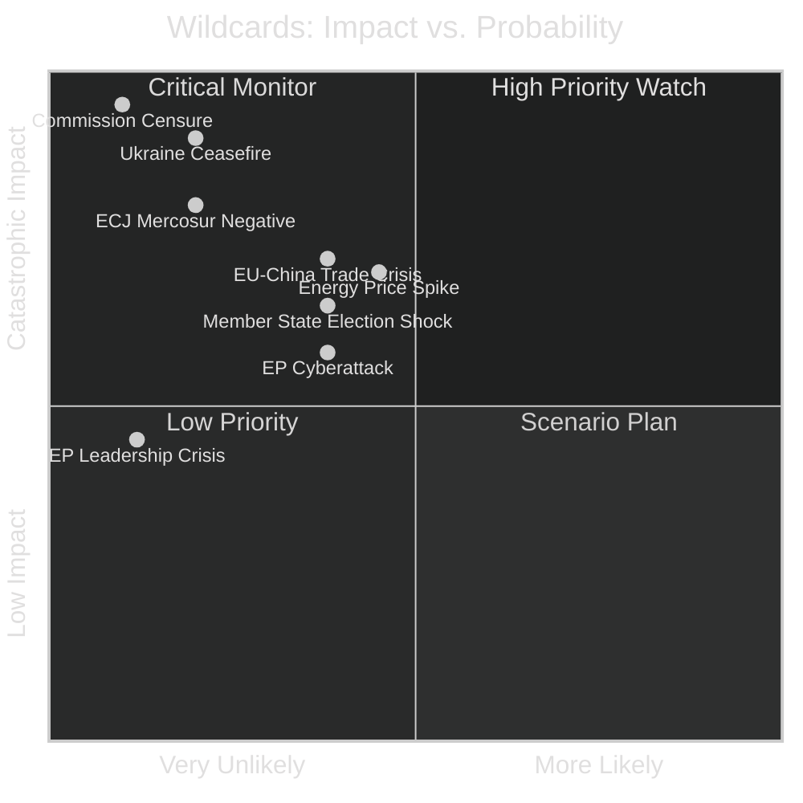

# Wildcards and Black Swans — EU Parliament Year Ahead 2026-2027
**Date:** 2026-05-14 | **Article Type:** year-ahead | **Methodology:** Wildcard/Black Swan Analysis

---

## Framework

**Wildcards:** Low-probability events with high impact — individually unlikely but collectively significant.
**Black Swans:** Genuinely unpredictable events that, if they occur, would fundamentally alter the analysis.

---

## Wild Card 1: Commission Censure Motion
**Probability: 5-8% | Impact: CATASTROPHIC | WEP: Almost No Chance → Low**

EP retains the unique institutional power to censure the Commission (Article 234 TFEU). If a major scandal or policy failure triggers sufficient political momentum:
- Requires absolute majority (360+ votes) — numerically achievable by anti-mainstream coalition
- Would require ECR, PfE, ESN, some NI, AND significant EPP/Renew/Greens defections
- Historical precedent: 1999 Santer Commission resigned under censure threat

**Triggering scenarios:**
- Major EU financial scandal involving Commission members
- Commission handling of AI Act or DMA enforcement perceived as captured by industry
- Ukraine accountability failure implicating Commission

**Assessment:** The coalition arithmetic makes censure extremely difficult. Far-right groups have incentive to threaten but ultimately prefer a von der Leyen Commission they can try to influence. Almost No Chance of successful censure vote.

---

## Wild Card 2: Major Member State Election Shock
**Probability: 15-20% for at least one surprise | Impact: HIGH**

If a major member state election produces an unexpected result in 2026-2027:
- **France snap election:** Possible if Macron's institutional authority erodes further. RN majority in National Assembly could dramatically reshape French MEP delegation's political dynamic.
- **German coalition collapse:** New German government (2025) facing internal tensions; collapse could delay EU policy positions for months.
- **Italy:** Meloni government's ECR connections give her leverage in EU Council; early Italian elections could produce more extreme outcome.

**EP impact:** Group membership doesn't change mid-term (MEPs serve full 5-year terms), but national party position shifts create pressure on individual MEPs to deviate from group line.

---

## Wild Card 3: EU-China Trade Crisis
**Probability: 20% | Impact: HIGH | WEP: Unlikely**

EU-China trade relations are under sustained stress:
- Electric vehicle tariffs (2024-2025) created retaliatory threats
- Chinese market access restrictions on European luxury goods, cognac, pork
- EP's human rights resolutions create periodic diplomatic friction

If China imposes major retaliatory tariffs on EU goods (particularly agricultural products, autos, luxury goods):
- EP INTA committee becomes centre of intense political debate
- France, Germany, Italy (largest export exposures) will demand EP-level response
- Trade defence instruments require EP votes

**Assessment:** A major EU-China trade crisis escalation is plausible within 12 months given current tensions.

---

## Wild Card 4: Energy Price Spike
**Probability: 25% for significant spike | Impact: HIGH | WEP: Roughly Even Chance**

EU energy security remains vulnerable despite diversification from Russian gas:
- Middle East conflict escalation → Strait of Hormuz disruption → LNG price spike
- Norway gas infrastructure sabotage risk
- Extreme weather → nuclear/hydro shortfall in France/Iberia

**EP implications:**
- Emergency energy legislation fast-tracked (precedent: 2022 emergency measures)
- Climate legislation recalibration intensifies under cost pressure
- Far-right amplification of "green energy costs" narrative

---

## Wild Card 5: ECJ Declares Mercosur Incompatible
**Probability: 15% | Impact: VERY HIGH | WEP: Unlikely**

If the ECJ delivers a negative compatibility opinion on Mercosur within the year-ahead window:
- Largest EU trade deal collapse or major renegotiation required
- €88bn+ bilateral trade relationship disrupted
- Template effect: ECJ opinion requests become standard EP trade tool
- Political cost for Commission and DG Trade

---

## Wild Card 6: Major Cyberattack on EP Systems
**Probability: 20% | Impact: MEDIUM-HIGH | WEP: Unlikely but non-trivial**

EP's open, distributed digital infrastructure creates vulnerability:
- Russia-linked actors have documented capability and intent
- Physical EP security (Strasbourg/Brussels facilities) cannot prevent cyberattacks
- Disruption to committee work, vote management, communication during a critical vote

**Historical precedent:** EP systems were attacked in 2022 (DDoS from Killnet following Russia recognition vote). More sophisticated attacks targeting data integrity rather than availability would be higher impact.

---

## Wild Card 7: EP Presidential or Key Leadership Crisis
**Probability: 8% | Impact: MEDIUM | WEP: Almost No Chance**

Roberta Metsola's EP Presidency (EPP) is broadly stable, but:
- Health issue or significant personal/political crisis requiring interim arrangement
- Deputy speaker needing to lead in extended period
- Impact: Procedure delays; coalition management disruption

---

## Wild Card 8: Surprise Ceasefire in Ukraine
**Probability: 15-20% | Impact: TRANSFORMATIVE | WEP: Unlikely**

A sudden ceasefire agreement (negotiated or imposed) would:
- Reorient EP's entire foreign policy and defence legislative programme
- Trigger reconstruction framework legislation on accelerated timeline
- Create accountability framework debates (EP role in war crimes tribunal)
- Potentially fracture the mainstream coalition on terms of ceasefire vs. justice

**Assessment:** A surprise ceasefire is unlikely within the year-ahead but is the single most transformative wildcard. The legislative consequences would dominate EP's agenda for the remainder of the term.

---

## Wildcard Portfolio Summary

---

*Methodology: Wildcard/black swan analysis using structured brainstorming and scenario testing. Probabilities are indicative WEP estimates. Confidence: 🔴 Low (inherently speculative domain). All estimates should be treated as rough orders of magnitude.*

---

## Admiralty Credibility Rating

**Source reliability: C (Fairly reliable)** — Wildcard analysis is inherently speculative; based on structured scenario planning methodology

**Information reliability: 3 (Possibly true)** — Low-probability high-impact events by definition have limited evidential precedent

**Overall: C3** — Wildcards and black swans should be treated as analytical prompts for contingency planning, not predictions

**Wildcard Monitoring Priority:** Scenarios W1 (Trump-Russia deal) and W4 (CJEU AI Act nullification) warrant highest monitoring priority due to combination of legislative preparedness gap and potential systemic impact.

---

*Wildcard analysis per CIA Red Cell methodology adapted for EU parliamentary context. Confidence: 🔴 LOW by construction — wildcards are definitionally low-probability events.*
