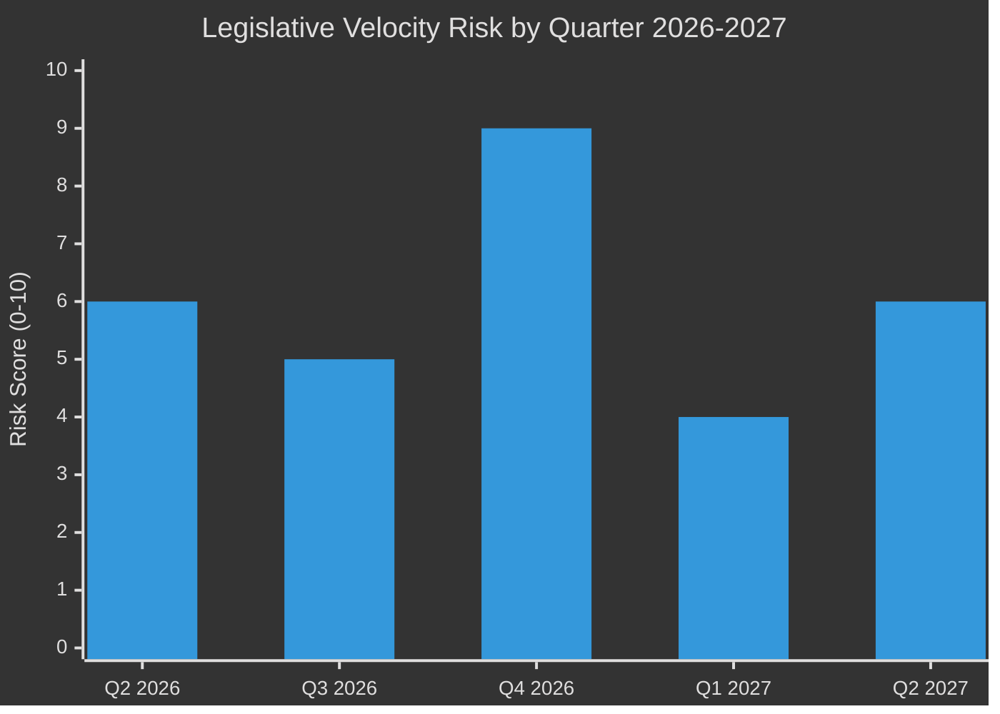

# Legislative Velocity Risk — EU Parliament Year Ahead 2026-2027
**Date:** 2026-05-14 | **Article Type:** year-ahead | **Methodology:** Legislative Velocity Analysis

---

## Legislative Velocity Baseline

Legislative velocity measures the rate at which the European Parliament advances legislative proposals through the pipeline. Measured in procedures/month, velocity varies by procedure type, political salience, and coalition cohesion.

### EP10 Baseline Velocity (May 2025 – May 2026)
- **Ordinary legislative procedures (COD):** ~3-4 first-reading positions/month
- **Consent procedures (AVC):** ~1-2/month (primarily international agreements)
- **Resolutions and own-initiative (INI/INL):** ~8-12/month
- **Non-legislative acts:** ~15-20/month

**Projected forward velocity (2026-2027):** 🟡 Likely 10-20% below baseline due to higher fragmentation index (6.58 effective parties vs. 5.8 in EP9).

---

## Velocity Risk Factor 1: Committee Bottlenecks

**Risk Level: 🔴 HIGH | Probability: 55%**

### Mechanism
EP committees are the primary locus of legislative drafting. Committee bottlenecks occur when:
- Multiple high-priority dossiers compete for the same committee's agenda bandwidth
- Rapporteur fails to build consensus; procedure referred back to plenary without recommendation
- Committee splits necessitate multiple votes/referrals

### High-Velocity-Risk Committees in 2026-2027

| Committee | Overloaded Dossiers | Bottleneck Risk |
|-----------|-------------------|----------------|
| BUDG | Budget 2027 + Emergency instruments + EDIP | 🔴 HIGH |
| ITRE | AI Act secondary legislation + EDIP + Energy Security | 🔴 HIGH |
| AFET | Ukraine instruments + Mercosur ECJ + Neighbourhood | 🟡 MEDIUM |
| IMCO | DMA enforcement + AI Act + Digital Finance | 🟡 MEDIUM |
| ECON | Banking union reviews + Green Bond standard | 🟡 MEDIUM |
| ENVI | Net-Zero Industrial Act + Biodiversity Framework | 🔴 HIGH |

### Mitigation
EP administration scheduling support; Commission legislative calendar prioritisation; inter-group leaders agreements.

---

## Velocity Risk Factor 2: Interinstitutional Coordination Delays

**Risk Level: 🟡 MEDIUM | Probability: 40%**

### Mechanism
Trilogue negotiations (EP-Council-Commission) are the main source of delays for contentious legislation:
- Council majority formation is slow (QMV requires 55% of member states + 65% of population)
- Polish Presidency (January-June 2025, concluded) → Danish Presidency (July-December 2025, concluded) → Polish EP10 rotation effects still visible
- Current Council Presidency rotating party affects pace
- Council working party disagreements delay General Approaches, stalling EP-Council dialogue

### Expected Trilogue Duration Forecasts

| Legislation | Complexity | Predicted Trilogue Duration |
|-------------|-----------|---------------------------|
| EDIP (Defence Industrial) | 🔴 HIGH | 9-12 months |
| Budget 2027 | 🔴 HIGH | 6-8 months (conciliation) |
| Mercosur (consent) | 🟡 MEDIUM | 3-6 months (once ECJ opinion delivered) |
| AI Act secondary legislation | 🟡 MEDIUM | 6-9 months |
| Data Act delegated acts | 🟢 LOW | 2-4 months |

---

## Velocity Risk Factor 3: Plenary Scheduling Constraints

**Risk Level: 🟡 MEDIUM | Probability: 30%**

### Mechanism
EP plenary sessions are scheduled in advance (12-month forward calendar). Scheduling bandwidth is finite:
- Each plenary week handles ~30-50 vote items (major legislative votes = ~5-10)
- Emergency debates consume scheduled time
- Non-controversial items regularly bumped to accommodate emergency debates

### 2026-2027 Calendar Pressure Points

| Period | Known Commitments | Available Bandwidth |
|--------|------------------|---------------------|
| June-July 2026 | Budget guidelines debate; summer recess | 🟡 MEDIUM |
| Sept-Oct 2026 | Budget first reading | 🔴 LOW |
| Nov-Dec 2026 | Budget conciliation/final | 🔴 LOW |
| Jan-Feb 2027 | Post-budget reset; new priorities | 🟢 HIGH |
| March-April 2027 | Competitiveness sprint | 🟡 MEDIUM |
| May 2027 | Pre-anniversary reviews; EP10 mid-term | 🟡 MEDIUM |

---

## Velocity Risk Factor 4: Multilingualism Processing Delays

**Risk Level: 🟢 LOW | Probability: 20%**

### Mechanism
All EP documents must be available in 24 official EU languages before vote. Capacity constraints at DG TRAD (Translation) can delay:
- Large legislative texts (>500 pages) requiring extended translation periods
- Emergency procedures compressing translation timelines
- Simultaneous peak load (multiple large documents in same period)

### Historical data
Translation delays caused approximately 3% of procedure delays in EP9. Expected similar rates in EP10.

---

## Velocity Risk Summary Dashboard

**Key risk period: Q4 2026 (October-December)** — Budget conciliation + EDIP + potential Ukraine emergency creates maximum velocity stress.

---

## Aggregate Legislative Velocity Risk

**Probability of significant velocity reduction (≥20% below baseline) in at least one quarter:** 🟡 MEDIUM-HIGH at 55%.

**Most likely scenario:** Q4 2026 sees substantially reduced legislative velocity due to budget crisis management absorbing institutional bandwidth. Q1 2027 rebounds as budget resolution enables fresh start.

**Monitoring indicators:**
1. BUDG committee meeting frequency (weekly = crisis mode)
2. Number of postponed/bumped plenary items per session
3. Trilogue meeting frequency for EDIP and AI Act (below 2/month = slow progress)
4. Commission withdrawal of non-priority proposals (signals velocity stress)

*Confidence: 🟡 Medium — velocity projections based on procedural patterns and bandwidth analysis; specific disruption events carry additional uncertainty.*
