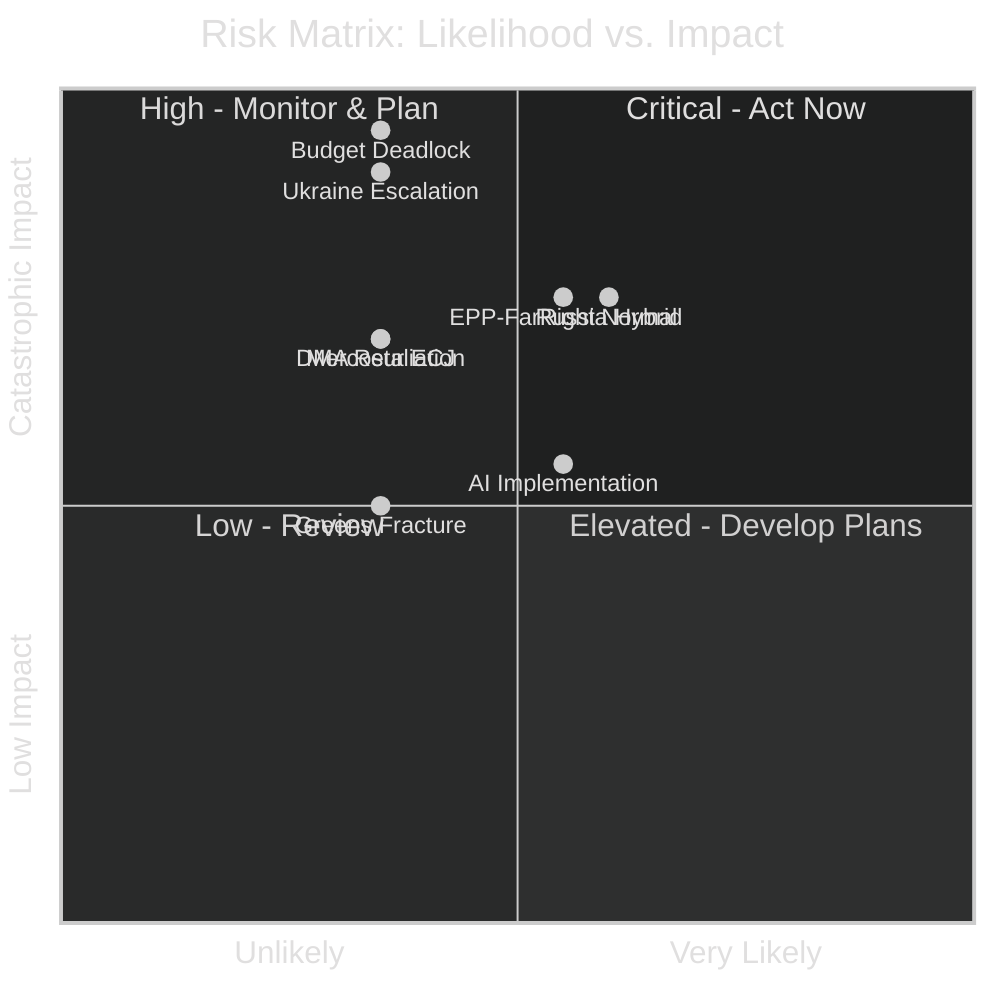

# Risk Matrix — EU Parliament Year Ahead 2026-2027
**Date:** 2026-05-14 | **Article Type:** year-ahead | **Methodology:** Likelihood × Impact Scoring

---

## Risk Scoring Framework

**Likelihood Scale:** 1 (Almost Never) → 5 (Almost Certain)
**Impact Scale:** 1 (Negligible) → 5 (Catastrophic)
**Risk Score:** Likelihood × Impact (max 25)
**Risk Threshold:** ≥12 = HIGH priority | 8-11 = MEDIUM | <8 = LOW

---

## Risk Register

### RISK-001: Budget 2027 Deadlock → Provisional Twelfths
| Parameter | Value |
|-----------|-------|
| **Category** | Institutional/Fiscal |
| **Likelihood** | 2 (Unlikely but possible) |
| **Impact** | 5 (Catastrophic — all EU programmes disrupted) |
| **Risk Score** | **10 — MEDIUM** |
| **Owner** | BUDG Committee + Council |
| **Horizon** | Q4 2026 |
| **Mitigation** | April 2026 guidelines adopted on schedule; precedent for eventual resolution; political cost of deadlock high for all parties |
| **Residual risk** | 8 — MEDIUM (after mitigation) |

*Analysis (🟢 High confidence):* The budget cycle is on track procedurally; the political risk is concentrated in autumn 2026 when Council-EP divergence on defence supplementary requests and cohesion rebalancing is most acute. Historical precedent (2010, 2013) shows eventual resolution but at political cost.

---

### RISK-002: EPP-Far Right Coalition Normalisation
| Parameter | Value |
|-----------|-------|
| **Category** | Political/Institutional |
| **Likelihood** | 3 (Possible, 35-50%) |
| **Impact** | 4 (Serious — mainstream majority erodes) |
| **Risk Score** | **12 — HIGH** |
| **Owner** | EPP leadership / President Metsola |
| **Horizon** | Ongoing |
| **Mitigation** | EPP's Renew cooperation requirement; institutional reputation cost; Macron pressure on EPP |
| **Residual risk** | 9 — MEDIUM |

*Analysis (🟡 Medium confidence):* The risk of EPP routinely collaborating with ECR/PfE on domestic policy (migration, climate, sovereignty) is real given competitive pressure from the far right. However, EPP's strategic interest in European institutional legitimacy creates a structural brake.

---

### RISK-003: Russia Hybrid Influence Operation — Successful EP Penetration
| Parameter | Value |
|-----------|-------|
| **Category** | Security/Democratic |
| **Likelihood** | 3 (Possible) |
| **Impact** | 4 (Serious) |
| **Risk Score** | **12 — HIGH** |
| **Owner** | EP Security; CERT-EU; OLAF |
| **Horizon** | Ongoing |
| **Mitigation** | CERT-EU monitoring; OLAF investigations; increased security awareness post-Qatargate |
| **Residual risk** | 8 — MEDIUM |

---

### RISK-004: EU-Mercosur ECJ Opinion — Negative Compatibility Finding
| Parameter | Value |
|-----------|-------|
| **Category** | Trade/Institutional |
| **Likelihood** | 2 (Unlikely — ECJ rarely invalidates negotiated deals) |
| **Impact** | 4 (Serious — largest trade deal collapse) |
| **Risk Score** | **8 — MEDIUM-LOW** |
| **Owner** | DG Trade; EP INTA Committee |
| **Horizon** | Q2 2027 |
| **Mitigation** | ECJ historically finds workarounds; political deal possible with protocol adjustments |
| **Residual risk** | 6 — LOW |

---

### RISK-005: DMA Enforcement Triggers US Trade Retaliation
| Parameter | Value |
|-----------|-------|
| **Category** | Geopolitical/Economic |
| **Likelihood** | 2 (Unlikely) |
| **Impact** | 4 (Serious — EU-US trade war escalation) |
| **Risk Score** | **8 — MEDIUM-LOW** |
| **Owner** | DG Trade; Commission |
| **Horizon** | Q3-Q4 2026 |
| **Mitigation** | EU-US consultations; DMA enforcement process provides diplomatic notice windows |
| **Residual risk** | 6 — LOW |

---

### RISK-006: Ukraine War Escalation — Major EP Policy Pivot Required
| Parameter | Value |
|-----------|-------|
| **Category** | Geopolitical |
| **Likelihood** | 2 (Unlikely for major escalation) |
| **Impact** | 5 (Catastrophic — EU security architecture shattered) |
| **Risk Score** | **10 — MEDIUM** |
| **Owner** | AFET Committee; Council |
| **Horizon** | Continuous |
| **Mitigation** | Established defence instruments; NATO collective defence; EP bipartisan Ukraine support |
| **Residual risk** | 8 — MEDIUM |

---

### RISK-007: AI Act Implementation — Regulatory Arbitrage / Enforcement Gap
| Parameter | Value |
|-----------|-------|
| **Category** | Regulatory |
| **Likelihood** | 3 (Possible) |
| **Impact** | 3 (Moderate — innovation/consumer harm) |
| **Risk Score** | **9 — MEDIUM** |
| **Owner** | AI Office; National Competent Authorities |
| **Horizon** | Q2 2026 – Q1 2027 |
| **Mitigation** | AI Act enforcement framework; Commission coordination |
| **Residual risk** | 7 — MEDIUM |

---

### RISK-008: Green/EFA Internal Fracture
| Parameter | Value |
|-----------|-------|
| **Category** | Political |
| **Likelihood** | 2 (Unlikely for full fracture) |
| **Impact** | 3 (Moderate — progressive bloc weakens) |
| **Risk Score** | **6 — LOW** |
| **Owner** | Greens/EFA group leadership |
| **Horizon** | Q4 2026 |
| **Mitigation** | Group cohesion mechanisms; shared electoral incentive |
| **Residual risk** | 5 — LOW |

---

## Risk Heat Map

---

## Top 5 Risks by Priority Score

| Rank | Risk | Score | Treatment |
|------|------|-------|-----------|
| 1 | EPP-Far Right coalition normalisation | 12 | Active monitoring + EP leadership engagement |
| 2 | Russia hybrid influence operation | 12 | Security hardening + OLAF cooperation |
| 3 | Budget 2027 deadlock | 10 | Procedural tracking + negotiation preparation |
| 4 | Ukraine war escalation | 10 | Scenario planning + instrument pre-positioning |
| 5 | AI Act implementation gap | 9 | Regulatory coordination + EP oversight hearings |

---

*Methodology: Likelihood × Impact risk matrix per `analysis/methodologies/political-risk-methodology.md`. Confidence: 🟢 High on scoring framework; 🟡 Medium on probability estimates.*

---

## Admiralty Credibility Rating

**Source reliability: B (Usually reliable)** — Risk assessments derived from EP institutional data, political analysis, and comparative historical precedent

**Information reliability: 2 (Probably true)** — Likelihood estimates based on structural factors; specific probability values are analytical estimates

**Overall: B2** for high-probability risks; **C3** for tail risks and third-order consequences

---

*Risk matrix methodology: Standard likelihood × impact scoring adapted for EU parliamentary context. Sources: EP political landscape, coalition dynamics, historical baseline, threat assessment artifacts.*
