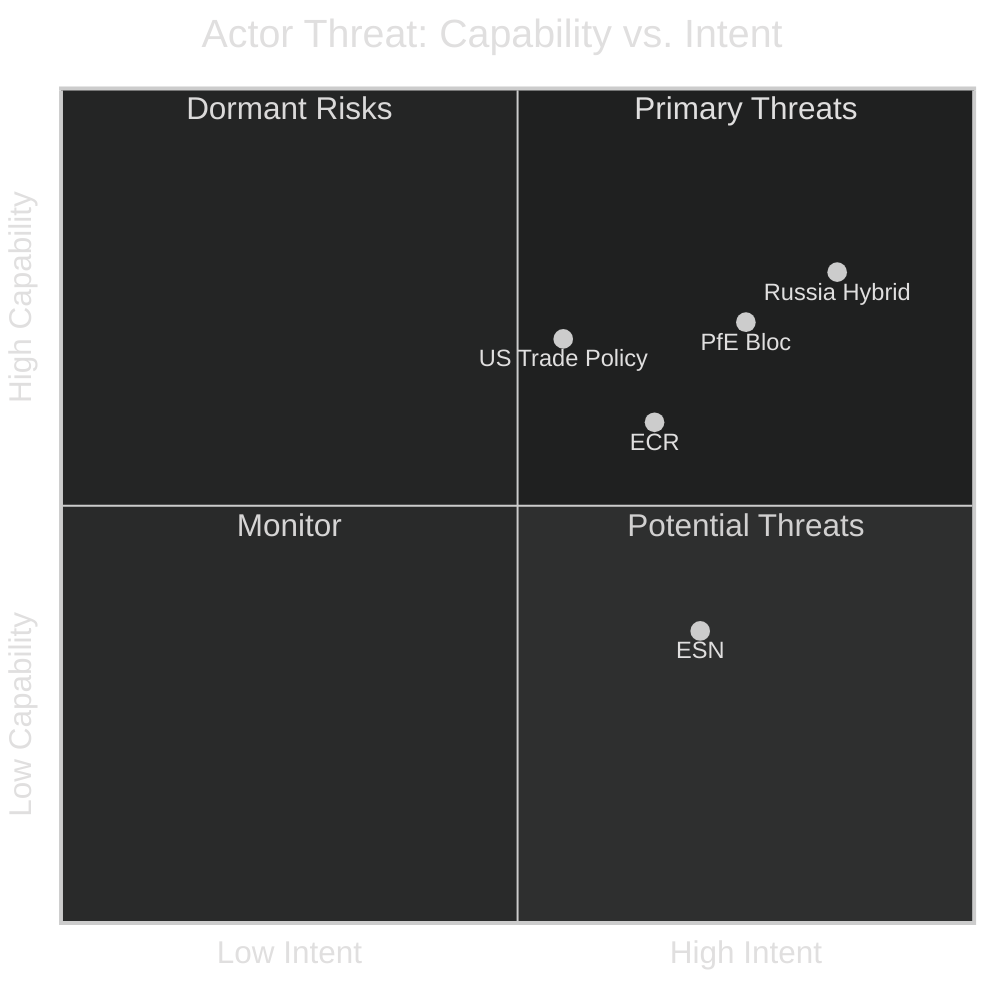

# Actor Threat Profiles — EU Parliament Year Ahead 2026-2027
**Date:** 2026-05-14 | **Article Type:** year-ahead | **Methodology:** Actor Threat Profiling

---

## Profile 1: PfE (Patriots for Europe) — Primary Internal Threat Actor

**Threat Level: HIGH**
**Seats: 85** | **Countries: 13** | **Anchors: French RN, Hungarian Fidesz, Italian Lega**

### Threat Posture
PfE represents the most structured internal parliamentary threat to mainstream European governance. Unlike ESN (harder far-right) or ECR (more pragmatic), PfE combines:
- **Institutional blocking capacity** (85 seats + ECR coordination = potential 166-seat bloc)
- **French electoral legitimacy** (RN France's largest party by first-round votes in many polls)
- **Hungarian government leverage** (Orbán's Fidesz holds EU Council veto power on key dossiers)

### Key Threat Vectors
1. **Ukraine financial instruments blocking:** PfE consistently votes against Ukraine aid, seeking to extract concessions or delay
2. **Migration policy exploitation:** PfE uses migration debates to drive wedges in EPP-S&D coalition
3. **Green Deal dismantling:** PfE pushes for comprehensive reversal of climate legislation
4. **Rule of law obstruction:** Fidesz component blocks rule-of-law conditionality enforcement
5. **Transatlantic alignment disruption:** Soft pro-Russia positions complicate US-EU security cooperation

### Threat Assessment
- **Political influence trajectory:** 🔴 Growing (French RN electoral strength)
- **Legislative blocking capacity:** 🟡 Medium-High (can delay but not alone prevent)
- **External linkages:** Orbán-Putin bilateral; Marine Le Pen nationalist network
- **Coordination discipline:** 🟡 Medium (RN-Fidesz tensions remain)

---

## Profile 2: Russian State / Hybrid Operations — Principal External Threat Actor

**Threat Level: HIGH**
**Nature:** State-sponsored hybrid influence operations

### Threat Posture
Russian state-sponsored operations targeting the European Parliament represent an ongoing, documented threat to democratic processes:

- **Historical evidence:** Multiple EP scandals involving Russian funding allegations (Voice of Europe network, Qatar-gate's Russia-adjacency)
- **Current indicators:** Disinformation campaigns targeting MEP social media; suspected agent-of-influence operations
- **Strategic objective:** Weaken EP support for Ukraine; amplify far-right/Euroskeptic narratives; fracture mainstream coalition

### Key Threat Vectors
1. **Disinformation amplification:** Targeting MEPs with soft-Russia positions to amplify anti-Ukraine narratives
2. **Financial influence:** Past and ongoing investigations into funding of political parties/foundations
3. **Cybersecurity attacks on EP systems:** CERT-EU has documented multiple intrusion attempts
4. **Proxy channels:** Using ECR/PfE sympathiser networks to propagate Kremlin narratives as indigenous political opinions

### Threat Assessment
- **Activity level:** 🔴 HIGH (ongoing, documented pattern)
- **EP resilience:** 🟡 Medium (EP intelligence services; but open democratic processes create vulnerabilities)
- **Key vulnerability:** MEP social media accounts; staffers with access to committee work
- **MITRE ATT&CK relevance:** T1591 (public gathering of org info); T1597 (search closed sources)

---

## Profile 3: US Trade Policy / USTR — External Economic Threat Actor

**Threat Level: MEDIUM**
**Nature:** Allied but adversarial trade relationship

### Threat Posture
US trade policy under current administration creates structured uncertainty for EU legislative planning:

- EP has already responded with customs duties adjustment (TA-10-2026-0096)
- DMA enforcement primarily targets US Big Tech — creates bilateral friction
- US may use trade leverage to pressure EP on defence spending or NATO commitments

### Key Threat Vectors
1. **Escalatory tariff retaliation if DMA enforcement intensifies**
2. **Diplomatic pressure on Mercosur if US-Brazil bilateral competes**
3. **Transatlantic tech governance divergence** — GDPR + DMA vs. US First Amendment/business-friendly approach

### Threat Assessment
- **Activity trajectory:** 🟡 ELEVATED (active trade policy administration)
- **EP leverage:** 🟡 Medium (trade policy is Commission-led, but EP can block trade agreements)

---

## Profile 4: ECR (European Conservatives and Reformists) — Structured Opposition Actor

**Threat Level: MEDIUM-HIGH**
**Seats: 81** | **Countries: 18** | **Anchors: Polish PiS diaspora; Italian FdI; Belgian NVA**

### Threat Posture
ECR occupies an ambiguous position — it is simultaneously a potential coalition partner for EPP and a threat to mainstream European norms:

- **Coalition threat:** By providing EPP an alternative to S&D, ECR shifts the political centre of gravity rightward
- **Sovereignty agenda:** ECR systematically opposes EU institutional deepening, creating friction on constitutional/institutional legislation
- **Anti-Mercosur:** ECR agricultural base in Poland and other farming states makes Mercosur ratification harder

### Key Threat Vectors
1. **Sovereignty blockades on EU institutional reform**
2. **Migration hardlining that isolates S&D from any compromise**
3. **Polish PiS diaspora connections creating complex rule-of-law dynamics** (PiS out of government in Poland, but ECR still represents their EP delegation)

---

## Profile 5: ESN (Europe of Sovereign Nations) — Hard Far-Right Fringe

**Threat Level: MEDIUM-LOW (currently)**
**Seats: 27** | **Anchor: German AfD**

### Threat Posture
ESN is currently the smallest structured far-right group and has limited immediate legislative impact. However:
- **AfD connection:** German AfD's ongoing domestic legal/political controversies
- **Growth vector:** Could absorb NI members over time
- **Normalization risk:** Frequent ECR/PfE coordination risks normalising the hard far-right within parliamentary discourse

---

## Aggregate Actor Threat Matrix

---

*Methodology: Actor threat profiling per political-threat-framework.md. Sources: EP data, public intelligence community assessments, legislative record. Confidence: 🟢 High on structural composition; 🟡 Medium on threat intent estimates.*
