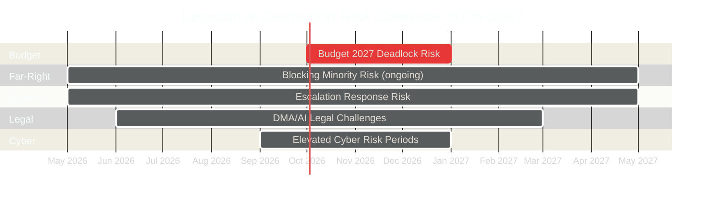

# Legislative Disruption Analysis — EU Parliament Year Ahead 2026-2027
**Date:** 2026-05-14 | **Article Type:** year-ahead | **Methodology:** Legislative Disruption Framework

---

## Legislative Disruption Framework

This analysis identifies the primary mechanisms through which legislative progress in the European Parliament could be disrupted during 2026-2027, assessing probability, impact, and mitigation options for each disruption vector.

---

## Disruption Vector 1: Budget 2027 Deadlock
**Probability: 25% | Impact: CRITICAL | Duration if materialised: 3-6 months**

### Mechanism
If the EP-Council conciliation on Budget 2027 fails to produce agreement by December 31, 2026:
- EU enters provisional twelfths (January 2027 onwards)
- All EU programmes revert to monthly 1/12 of prior year appropriations
- Investment programmes, cohesion funds, and new initiatives frozen
- EP's entire legislative agenda overshadowed by budget crisis management

### Disruption Pathway
1. Council proposes cuts to cohesion funds and new initiatives
2. EP insists on defence supplementary and social programme preservation
3. Conciliation procedure (21-day window) fails to reconcile differences
4. Commission submits final conciliation proposal; both institutions reject
5. Provisional twelfths operative from January 1, 2027

### Mitigation
- Political pressure on all sides prevents precedent from becoming norm
- Historical pattern: all budget deadlocks eventually resolved
- Political cost of prolonged provisional twelfths creates settlement incentive

### Committee Impact
- BUDG committee: Maximum workload
- ECON committee: Fiscal implications analysis
- REGI committee: Cohesion fund allocation disputes

---

## Disruption Vector 2: Far-Right Blocking Minority Formation
**Probability: 35% for at least one significant blocking vote | Impact: HIGH**

### Mechanism
On specific legislative acts requiring absolute majority (360 votes) or qualified majority, the far-right ECR-PfE-ESN bloc (193 seats) plus strategic defections can form a blocking minority that prevents passage.

### Most Vulnerable Legislative Tracks
- **Migration/asylum:** ECR-PfE bloc plus mainstream defections could block S&D-sponsored measures
- **Climate legislation:** If EPP supports ECR recalibration position, progressive legislation blocked
- **Rule of law instruments:** Article 7 sanctions require 4/5 Council majority + EP role; ECR/PfE can delay

### Disruption Pathway
1. EPP faces competitive pressure from far right
2. EPP leadership allows selective cooperation with ECR/PfE on specific vote
3. Blocking minority crystalises on migration or climate vote
4. S&D-Renew-Greens cannot form counter-majority
5. Legislative item fails or is significantly weakened

### Mitigation
- EPP's institutional interest in European legitimacy creates structural resistance to normalised far-right cooperation
- Renew and Greens maintain pressure on EPP to preserve mainstream coalition

---

## Disruption Vector 3: Ukraine War Escalation
**Probability: 30% for significant escalation requiring legislative response | Impact: HIGH**

### Mechanism
Major military escalation (Russian territorial push, Western threshold crossing, use of prohibited weapons) creates emergency legislative demands:
- EP debates and resolutions consume plenary time
- Emergency financial instrument legislation fast-tracked
- Defence industrial programme legislation accelerated beyond normal procedure

### Disruption Pathway
1. Major military event triggers emergency EP debate
2. Normal plenary agenda suspended for multiple days
3. Fast-track procedure invoked for financial instruments
4. Committee workloads spike across AFET, BUDG, ITRE (defence industry)
5. Normal legislative pipeline delayed by 4-8 weeks

### Mitigation
- Established instruments (Ukraine loan mechanism template) reduce drafting time
- Bipartisan majority ensures passage speed
- Schedule management minimises legislative pipeline disruption

---

## Disruption Vector 4: Institutional-Legal Challenges to Key Legislation
**Probability: 40% for at least one major challenge | Impact: MEDIUM**

### Mechanism
AI Act, DMA, or other major legislation challenged through:
- CJEU annulment actions brought by member states or industry
- ECJ reference questions delaying enforcement
- Commission infringement proceedings against member states for non-transposition

### Disruption Pathway
- Industry challenges AI Act's GPAI provisions
- US government files WTO complaint against DMA
- EP's legislative achievements litigated rather than implemented

### Mitigation
- EU legislative track record at CJEU is strong (few successful challenges)
- DMA enforcement is Commission delegated power — independent of EP votes
- ECJ timeline is long — disruption is delayed, not eliminated

---

## Disruption Vector 5: EP-Commission Institutional Conflict
**Probability: 35% for significant conflict | Impact: MEDIUM**

### Mechanism
Parliament-Commission conflict over enforcement discretion or legislative priorities:
- EP demands stronger DMA/AI enforcement than Commission plans
- EP objects to Commission-initiated delegated acts
- EP threatens Commission censure on specific issue (very unlikely to succeed — see wildcards)

### Committee Impact
- IMCO (internal market): DMA/AI enforcement disputes
- JURI (legal affairs): Delegated act challenges
- AFCO (constitutional): Institutional relationship disputes

---

## Disruption Vector 6: Cyber Attack on EP Infrastructure
**Probability: 20% for significant disruption | Impact: MEDIUM-HIGH**

### Mechanism
As documented in threat-assessment, Russia-linked actors have capability and intent to disrupt EP operations:
- DDoS against EP communication systems during sensitive votes
- Data exfiltration of committee deliberations
- Compromise of MEP staff devices affecting vote management

### Disruption Pathway
1. Cyberattack timed to coincide with critical vote or debate
2. EP systems partially disrupted — vote management challenged
3. Physical backup procedures slow parliamentary processes
4. Political response required — time and attention consumed

---

## Disruption Impact Calendar

---

## Aggregate Legislative Disruption Assessment

**Overall disruption probability (any significant disruption):** 🔴 HIGH — approximately 65-70% probability that at least one of these disruption vectors materialises in a meaningful way during 2026-2027.

**Assessment (🟡 Medium confidence):** Legislative disruptions are near-certain in some form over a 12-month horizon for a fragmented parliament navigating multiple geopolitical and institutional challenges. The question is whether disruptions are contained (episodic) or cascade (systemic). Current institutional resilience indicators suggest episodic disruptions are more likely than systemic cascade.

---

*Methodology: Legislative disruption framework per political-threat-framework.md. Sources: EP institutional records, coalition analysis, risk matrix data. Confidence: 🟡 Medium for disruption probabilities.*
