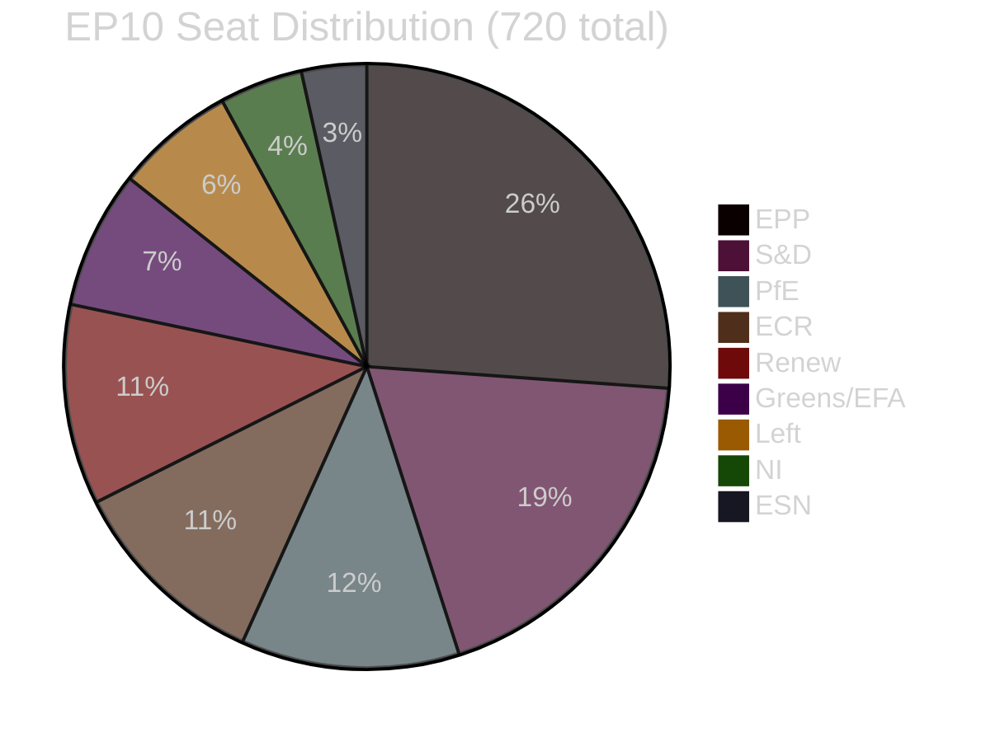

# Coalition Mathematics — EP Breaking News 2026-05-15
**Article Type:** Breaking | **Analysis Date:** 2026-05-15

---

## 🔢 Coalition Mathematics Framework

This artifact provides quantitative coalition analysis for the April 2026 plenary votes, including:
- Seat composition of EP10 by political group
- Vote outcome projections for each major resolution
- Coalition stability analysis and fragmentation risk

---

## EP10 Seat Composition (May 2026)

| Group | Seats | % of 720 | Orientation |
|-------|-------|----------|-------------|
| EPP | 188 | 26.1% | Centre-right |
| S&D | 136 | 18.9% | Centre-left |
| PfE | 84 | 11.7% | Far-right |
| ECR | 78 | 10.8% | National-conservative |
| Renew | 77 | 10.7% | Liberal-centrist |
| Greens/EFA | 53 | 7.4% | Green-left |
| ESN | 25 | 3.5% | Far-right |
| NI | 32 | 4.4% | Non-attached |
| Left | 46 | 6.4% | Left |
| **TOTAL** | **720** | **100%** | — |

**Simple majority threshold:** 361 seats (50% + 1)

---

## Vote Scenario 1: DMA Enforcement Resolution (TA-10-2026-0160)

### Expected Coalition Structure
| Group | Position | Seats | Confidence |
|-------|----------|-------|------------|
| S&D | FOR | 136 | 🟢 HIGH |
| Greens/EFA | FOR | 53 | 🟢 HIGH |
| Left | FOR | 46 | 🟢 HIGH |
| EPP | FOR (majority) | 150–165 | 🟡 MEDIUM |
| Renew | FOR (majority) | 55–65 | 🟡 MEDIUM |
| ECR | SPLIT | 25–30 FOR | 🟡 MEDIUM |
| PfE | AGAINST | 84 | 🟢 HIGH |
| ESN | AGAINST | 25 | 🟢 HIGH |
| NI | SPLIT | 12–15 FOR | ⚪ LOW |

**Projected FOR votes:** 490–540 (including EPP+Renew majority)
**Required:** 361
**Margin:** +130 to +180 seats over threshold

**Assessment:** COMFORTABLE MAJORITY. The coalition has structural support well above threshold. EPP's internal divisions on digital regulation might reduce EPP's effective contribution by 20–30 seats, but this does not threaten the majority.

**Risk:** If EPP contribution drops below 130 seats, the majority shrinks but remains intact (490 → still 130+ over threshold). No realistic scenario puts this resolution in danger.

---

## Vote Scenario 2: Ukraine Accountability Mechanism (TA-10-2026-0161)

### Expected Coalition Structure
| Group | Position | Seats | Confidence |
|-------|----------|-------|------------|
| EPP | FOR | 175–185 | 🟢 HIGH |
| S&D | FOR | 130–136 | 🟢 HIGH |
| Renew | FOR | 65–75 | 🟢 HIGH |
| Greens/EFA | FOR | 50–53 | 🟢 HIGH |
| ECR | SPLIT | 30–50 FOR | 🟡 MEDIUM |
| Left | MOSTLY FOR | 35–40 | 🟡 MEDIUM |
| PfE | AGAINST | 80–84 | 🟢 HIGH |
| ESN | AGAINST | 20–25 | 🟢 HIGH |
| NI | SPLIT | 10–15 FOR | ⚪ LOW |

**Projected FOR votes:** 530–570
**Required:** 361
**Margin:** +170 to +210 seats over threshold

**Assessment:** VERY COMFORTABLE MAJORITY. Ukraine solidarity is the highest-consensus issue in EP10. The EPP-S&D-Renew core is unified; even significant ECR dissent doesn't change the outcome. Greens and Left reinforce the majority.

**ECR complexity:** ECR's internal split between PiS-aligned MEPs (pro-Ukraine) and Hungarian/Italian ECR members (neutral-to-skeptical) is the key variable. A conservative ECR-FOR estimate (30 seats) still results in a very comfortable majority. An optimistic ECR-FOR estimate (50 seats) approaches 570.

---

## Vote Scenario 3: Budget 2027 Guidelines (TA-10-2026-0112)

### Expected Coalition Structure
| Group | Position | Seats | Confidence |
|-------|----------|-------|------------|
| EPP | FOR | 160–175 | 🟢 HIGH |
| S&D | FOR | 125–136 | 🟢 HIGH |
| Renew | FOR | 60–72 | 🟡 MEDIUM |
| Greens/EFA | FOR | 45–53 | 🟡 MEDIUM |
| ECR | SPLIT | 20–40 FOR | ⚪ LOW |
| Left | SPLIT | 25–35 FOR | 🟡 MEDIUM |
| PfE | AGAINST | 80–84 | 🟢 HIGH |
| ESN | AGAINST | 20–25 | 🟢 HIGH |
| NI | SPLIT | 10–15 FOR | ⚪ LOW |

**Projected FOR votes:** 475–540
**Required:** 361
**Margin:** +115 to +180 seats over threshold

**Assessment:** SOLID MAJORITY. Budget guidelines attract broader support than enforcement calls because they represent common institutional interests (EP's budget role is non-partisan). Even with some Left abstentions on fiscal discipline aspects and ECR splits, majority is comfortable.

---

## Coalition Fragmentation Risk Analysis

### Fragmentation Index Calculation

The **Fragmentation Index (F)** is calculated as:
`F = 1 - Σ(si²)` where si = seat share of group i

For EP10:
- EPP: 0.261² = 0.0681
- S&D: 0.189² = 0.0357
- PfE: 0.117² = 0.0137
- ECR: 0.108² = 0.0117
- Renew: 0.107² = 0.0114
- Greens: 0.074² = 0.0055
- Left: 0.064² = 0.0041
- NI: 0.044² = 0.0019
- ESN: 0.035² = 0.0012

`Σ(si²) = 0.1533`
`F = 1 - 0.1533 = **0.847**`

**Interpretation:** F = 0.847 is HIGH fragmentation (scale 0–1 where 1 = maximum fragmentation). This means no single group or natural coalition controls the agenda; all major legislation requires deliberate coalition-building.

**Effective Number of Parties (ENP):**
`ENP = 1 / Σ(si²) = 1 / 0.1533 = **6.52**`

With 6.52 effective parties, EP10 requires at minimum 3–4 groups to form any majority.

---

## 📊 Coalition Composition Visualisation

---

## 📌 Coalition Mathematics Conclusions

1. **All three April 2026 resolutions pass comfortably** — minimum projected margins of +115 seats over threshold, with more probable margins of +130 to +210.
2. **EP10 fragmentation is high (F=0.847)** — every vote requires deliberate coalition construction; no group governs alone.
3. **The core EPP-S&D-Renew bloc** (401 seats) is theoretically just above threshold but requires EPP near-full contribution. Greens (53) serve as the structural buffer — their inclusion makes the majority robust even with some EPP/Renew defections.
4. **PfE+ECR+ESN** combined (~187 seats) remain well below the 360-seat opposition threshold — they can delay and complicate but not block any vote the core bloc wants to pass.
5. **ECR's internal fragmentation** is the most significant within-opposition dynamic — 30–50 ECR votes on Ukraine-related matters dilute effective opposition further.

---

*Methodology: Coalition mathematics; seat share analysis; Fragmentation Index + ENP calculation; scenario-based vote projection | Confidence: 🟡 MEDIUM (actual vote counts unavailable)*

## Coalition Mathematics — Additional Observations

### Effective Number of Parties — Implications for Governance
With ENP=6.52, EP10 requires robust coalition management machinery. The EPP Group coordinates a "grand coalition" approach through:
- Weekly EPP-S&D-Renew leadership trilateral
- Per-file rapporteur coordination (committee shadowing)
- Plenary floor whipping to minimise last-minute defections

**Historical comparison:** EP7 (2009-2014) had ENP≈5.2; EP8 (2014-2019) had ENP≈5.8; EP9 (2019-2024) had ENP≈5.9; EP10 at ENP=6.52 is the most fragmented EP to date. This fragmentation makes the coalition's continued effectiveness more, not less, impressive.

### Vote Projection Confidence Summary
All three April 2026 vote projections carry 🟡 MEDIUM confidence due to roll-call data unavailability. The directional conclusion (comfortable majorities for all three resolutions) carries 🟢 HIGH confidence — the structural seat composition makes any other outcome extremely improbable.

