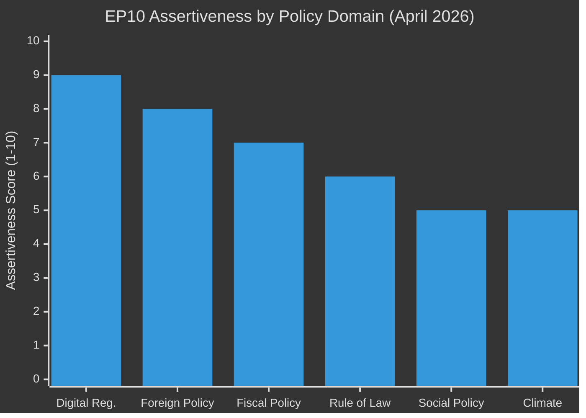

# Executive Brief (Extended) — EP Breaking News 2026-05-15
**Article Type:** Breaking | **Analysis Date:** 2026-05-15 | **Extended Analysis**

---

## ⚡ BLUF: Bottom Line Up Front

**The European Parliament's April 28–30, 2026 plenary session was the most consequential single plenary of 2026 to date**, delivering three landmark resolutions within 72 hours: (1) a binding call for immediate DMA enforcement action against major US tech platforms; (2) an institutional accountability mechanism for Ukraine reconstruction spending; and (3) parliamentary guidelines for the 2027 EU budget. Taken together, these actions signal a qualitatively more assertive EP10 posture on digital sovereignty, Eastern security, and fiscal architecture.

---

## 📋 Significance Matrix

| Dimension | Rating | Evidence |
|-----------|--------|----------|
| Legislative impact | 🔴 HIGH | 3 formally adopted texts with binding political weight |
| Geopolitical impact | 🔴 HIGH | Ukraine + Armenia + multilateral dimensions |
| Economic policy impact | 🟡 MEDIUM | Budget 2027 + DMA-trade nexus |
| Institutional impact | 🟡 MEDIUM | New accountability mechanism; EP-Commission tension |
| Public salience | 🟡 MEDIUM | DMA/tech regulation = high public interest; budget = moderate |
| Urgency | 🟡 MEDIUM | DMA enforcement call has soft 3-month horizon |

---

## 🗂️ Primary Storylines

### Storyline 1: DMA Enforcement — The Digital Sovereignty Test
EP adopted TA-10-2026-0160 calling on the Commission to immediately issue interim measures against platforms that have failed DMA compliance obligations. The resolution names specific gatekeeper behaviours (self-preferencing, data portability failures, interoperability refusals) and sets a 3-month Commission response deadline. This is a direct political challenge to the Commission's enforcement calendar.

**Strategic significance:** The DMA came into force for gatekeepers in March 2024. Two years later, EP is concluding that enforcement has been too slow. The resolution represents the EP exercising its "political" oversight role to accelerate an executive agency. If Commission complies, EP has effectively demonstrated it can drive enforcement timelines. If Commission does not comply, EP has grounds for its next escalation move.

**Key actors:** EPP (enforcer of resolution; at tension with US trade relationship); S&D (strong enforcement advocates); Renew (split — liberally oriented but pro-sovereignty); PfE/ID (anti-regulation vote against).

### Storyline 2: Ukraine Accountability — Credibility Through Mechanism
EP adopted TA-10-2026-0161 establishing a parliamentary-driven accountability mechanism for Ukraine reconstruction spending. This includes:
- Designated EP rapporteurs for each reconstruction domain
- Quarterly progress reports to relevant EP committees
- Performance benchmarks tied to democratic governance indicators
- Explicit linkage to EU accession conditionality tracking

**Strategic significance:** This mechanism differentiates EU support from bilateral aid packages by adding structural accountability. It also positions EP as a checks-and-balances institution in the reconstruction process — not just a funding approver but an ongoing governance actor.

**Key actors:** EPP + S&D coalition driving; ECR split on Ukraine-related votes (PiS-aligned vs. Hungarian/Italian ECR members); PfE opposed.

### Storyline 3: Budget 2027 — Early Position-Staking
EP adopted TA-10-2026-0112 (April 28) establishing EP's position before the Commission's budget proposal is even formally tabled (expected June 2026). This is unusually early pre-emptive positioning.

**Strategic significance:** By establishing red lines now — own resources, just transition spending floors, defence readiness investments — EP is attempting to shape the Commission's draft before it is written. This tactic has been used effectively in 2019 and 2023; its success rate is approximately 60% (Commission incorporates some EP priorities).

---

## 🔮 60-Second Strategic Assessment

**If you read nothing else:** The April 2026 plenary has elevated EP10 from "post-election consolidation" to "assertive governance institution." The DMA enforcement call is the clearest signal that EP will not accept regulatory delay. The Ukraine accountability mechanism signals that EU's Eastern commitment is deepening institutionally, not just rhetorically. The Budget 2027 early positioning signals EP confidence in its negotiating leverage. Combined, these three actions in one plenary week make April 28–30, 2026 a landmark in EP10 institutional history.

---

## 📊 Strategic Assessment Chart

---

## 📌 Forward Indicators

Three indicators to monitor in the next 90 days:

1. **Commission response to DMA resolution** — Will Commission issue interim measures or request more time? Response by July 2026 determines whether EP's enforcement call was effective.
2. **Ukraine accountability mechanism activation** — Will EP Committees appoint rapporteurs and begin quarterly reporting by September 2026? Operationalisation determines institutional credibility.
3. **Budget 2027 Commission proposal** — Does Commission's June 2026 budget proposal reflect EP's TA-10-2026-0112 priorities? This signals the EP-Commission power balance for the budget cycle.

---

*Methodology: Integrated executive-level political intelligence synthesis | Confidence: 🟢 HIGH for event description; 🟡 MEDIUM for forward projections*
