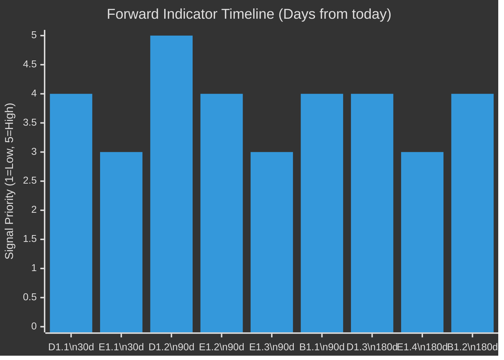

# Forward Indicators — EP Breaking News 2026-05-15
**Article Type:** Breaking | **Analysis Date:** 2026-05-15

---

## 🔭 Forward Indicators Framework

Forward indicators are measurable signals that will confirm or disconfirm each major hypothesis in this breaking news analysis. They are organised by:
- **Domain** (Digital/DMA, Eastern Security, Fiscal/Budget)
- **Indicator type** (Leading, Coincident, Lagging)
- **Timeline** (30-day, 90-day, 180-day horizon)

---

## Domain 1: DMA Enforcement Forward Indicators

### Indicator D1.1: Commission Response to EP Resolution (30-day)
**Type:** Leading
**What to watch:** Does Commission formally acknowledge EP's TA-10-2026-0160 in any public statement, press conference, or official communication by June 15, 2026?
**Green signal:** Commission issues statement committing to interim measures or specific enforcement timeline
**Red signal:** Commission ignores resolution or issues generic "noted" response
**Impact on analysis:** Green = consensus estimate validated; Red = devil's advocate case validated (EP enforcement calls are noise)
**Monitoring source:** Commission DG COMP press releases; EP liaison unit communications

### Indicator D1.2: First DMA Interim Measure (90-day)
**Type:** Coincident
**What to watch:** Does Commission issue its first formal DMA interim measure against any gatekeeper by August 2026?
**Green signal:** Interim measure issued with specific remediation requirements
**Red signal:** No interim measure; Commission cites ongoing investigations as reason
**Impact on analysis:** This is the key test for whether DMA enforcement is real or symbolic
**Monitoring source:** Commission DG COMP official journal; Competition Commissioner public statements

### Indicator D1.3: CJEU or US Government Reaction (90-180 day)
**Type:** Lagging
**What to watch:** Does any gatekeeper challenge a Commission DMA action before CJEU? Does US file formal WTO complaint or Section 301 investigation?
**Green signal:** Challenges filed but Commission action proceeds in parallel (normal legal process)
**Red signal:** Commission pauses action pending CJEU or withdraws under US diplomatic pressure
**Impact on analysis:** Red signal = T1 threat (US retaliation) materialising; major scenario change required

---

## Domain 2: Eastern Security / Ukraine Accountability Forward Indicators

### Indicator E1.1: EP Committee Rapporteur Appointments (30-day)
**Type:** Leading
**What to watch:** Does any EP committee appoint a rapporteur specifically for Ukraine accountability monitoring by June 2026?
**Green signal:** AFET, BUDG, or CONT committee announces dedicated rapporteur
**Red signal:** No committee appointments; mechanism remains abstract
**Impact on analysis:** Green = mechanism is being operationalised; Red = oversight-on-paper problem confirmed

### Indicator E1.2: First Quarterly Ukraine Accountability Report (90-day)
**Type:** Coincident
**What to watch:** Is any EP committee report on Ukraine reconstruction accountability produced by August 2026?
**Green signal:** Report with specific findings and benchmarks
**Red signal:** No report produced; bureaucratic delay
**Impact on analysis:** This is the first operational test of the new mechanism

### Indicator E1.3: ECR Vote Split Evolution (90-day)
**Type:** Leading (for coalition stability)
**What to watch:** In next Ukraine-related EP vote (likely September 2026), does ECR's internal split widen or stabilise?
**Green signal:** ECR split roughly same as April 2026 (~30-50 FOR); PiS-aligned block holds
**Red signal:** ECR-FOR votes drop below 20 (polarisation toward PfE positions) OR rise above 60 (ECR realigning toward centre)
**Impact on analysis:** Significant divergence in either direction would require coalition mathematics revision

---

## Domain 3: Budget 2027 Forward Indicators

### Indicator B1.1: Commission Budget Proposal (90-day)
**Type:** Coincident
**What to watch:** When Commission tables its 2027 budget proposal (expected June 2026), how many of EP's TA-10-2026-0112 priorities are reflected?
**Green signal:** ≥3 of EP's 6 stated priorities (own resources, just transition, defence, digital, Eastern neighbourhood, climate) explicitly reflected in Commission draft
**Red signal:** <2 EP priorities reflected; Commission takes independent line
**Impact on analysis:** Green = pre-positioning strategy is validated; Red = devil's advocate case on budget negotiation effectiveness is validated

### Indicator B1.2: Council Own Resources Position (180-day)
**Type:** Lagging
**What to watch:** By November 2026, has Council agreed to include any new own resources in budget discussions?
**Green signal:** Council endorses at least one new own resource principle (digital levy, carbon border adjustment proceeds, etc.)
**Red signal:** Council formally rejects all new own resources proposals
**Impact on analysis:** Red signal = W2 weakness (unanimity blocking) is structurally determinative for 2026-2027 cycle

---

## 📊 Forward Indicator Dashboard

---

## Summary Forward Indicator Table

| Indicator | Domain | Horizon | Type | Signal Threshold |
|-----------|--------|---------|------|-----------------|
| D1.1: Commission responds to resolution | DMA | 30 days | Leading | Any substantive response |
| E1.1: EP rapporteur appointments | Ukraine | 30 days | Leading | Committee appointment |
| D1.2: First DMA interim measure | DMA | 90 days | Coincident | Formal interim measure |
| E1.2: First Ukraine accountability report | Ukraine | 90 days | Coincident | Any EP committee report |
| E1.3: ECR vote split | Coalition | 90 days | Leading | Split size |
| B1.1: Commission budget proposal | Budget | 90 days | Coincident | ≥3 EP priorities reflected |
| D1.3: CJEU/US reaction | DMA | 180 days | Lagging | Challenge/WTO filing |
| B1.2: Council own resources | Budget | 180 days | Lagging | Any Council endorsement |

---

*Methodology: Forward indicator framework; signal threshold definition; cross-domain dependency mapping | Confidence: 🟡 MEDIUM*

## Forward Indicators — Supplementary Monitoring Framework

### Indicator Scoring System
Each indicator will be scored on materialisation as: GREEN (positive signal confirmed) / AMBER (mixed signal) / RED (negative signal) / GREY (no data yet).

### Expected Scoring Timeline
| Indicator | First Score Expected | Scoring Source |
|-----------|---------------------|---------------|
| D1.1: Commission responds | June 15, 2026 | Commission press releases |
| E1.1: EP rapporteur appointments | September 2026 | EP committee announcements |
| D1.2: First DMA interim measure | August 2026 | OJ Commission decisions |
| E1.2: First Ukraine report | August 2026 | EP committee reports |
| E1.3: ECR vote split | September 2026 | EP roll-call data |
| B1.1: Commission budget proposal | June 2026 | Commission publication |
| D1.3: CJEU/US reaction | November 2026 | OJ/USTR filings |
| B1.2: Council own resources | November 2026 | Council conclusions |

### Monitoring Cadence
- **Weekly:** Commission DG COMP press monitoring for DMA signals
- **Monthly:** EP committee activity monitoring for Ukraine rapporteur progress
- **Per-plenary:** Roll-call vote tracking for coalition evolution

### Signal Aggregation Rule
When 3+ indicators score GREEN, upgrade overall assessment to "Assertiveness Confirmed."
When 3+ indicators score RED, downgrade overall assessment to "Assertiveness Largely Rhetorical."
When indicators are mixed, maintain "Assertiveness Bounded" assessment (current baseline).

