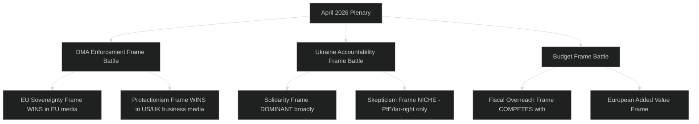

# Media Framing Analysis — EP Breaking News 2026-05-15
**Article Type:** Breaking | **Analysis Date:** 2026-05-15

---

## 📰 Media Framing Analysis Framework

This artifact analyses how the April 28–30, 2026 EP plenary outcomes are likely to be framed across different media ecosystems and political narratives. It identifies:
- Dominant frames by outlet type
- Frame competition dynamics
- Narrative vulnerabilities and countermessaging opportunities
- Cross-national framing variations

---

## Primary Media Frames Analysis

### Frame 1: "EU Stands Up to Big Tech" (Pro-Digital Sovereignty)
**Typical outlets:** Le Monde, Der Spiegel, The Guardian, Politico Europe, Euractiv
**Frame construction:** EP takes decisive action against US tech monopolies; DMA enforcement represents Europe's digital sovereignty moment; EU asserts its regulatory standard-setting power globally.

**Core narrative elements:**
- US tech companies violating European law and profiting from non-compliance
- EP forcing reluctant Commission to act
- "Brussels Effect" — EU standards becoming global defaults
- Contrast with US regulatory inaction on platform monopolies

**Emotional register:** Assertive, national pride (European), adversarial toward US tech
**Audience:** European civic-minded readers, tech policy professionals, competition law community

**Strength of this frame:** 🟢 HIGH — aligns with strong European public sentiment on platform regulation
**Vulnerability:** Overpromises on enforcement timeline; if Commission delays, frame becomes "EU talks but doesn't act"

---

### Frame 2: "Protectionism in Disguise" (Anti-DMA Enforcement)
**Typical outlets:** Wall Street Journal, Financial Times (pro-business edition), Reason, US conservative media
**Frame construction:** EU's DMA enforcement primarily targets US companies; EP's call is economic nationalism dressed as consumer protection; European tech companies would face similar scrutiny if they were market leaders.

**Core narrative elements:**
- DMA targets US companies disproportionately (Apple, Meta, Google, Amazon all US-based)
- EU digital regulation as industrial policy tool
- Chilling effect on US investment in European markets
- Trade war risk from enforcement

**Emotional register:** Suspicious, business-defensive, trade-focused
**Audience:** US business community, US government officials, EU member state export ministries

**Strength of this frame:** 🟡 MEDIUM — has legitimate factual basis (all major gatekeepers are US) but ignores that regulation applies equally regardless of origin
**Vulnerability:** Breaks down if a European company ever achieves gatekeeper status and faces DMA enforcement

---

### Frame 3: "Europe Supports Ukraine Accountability" (Solidarity + Governance)
**Typical outlets:** Financial Times, Politico Europe, Radio Free Europe, Ukrainian media
**Frame construction:** EP strengthens EU-Ukraine relationship by creating accountability mechanisms; EU demands Ukrainian governance transparency in exchange for reconstruction funding; EP demonstrates long-term institutional commitment.

**Core narrative elements:**
- EU as reliable long-term partner (contrast with potential US wavering)
- Accountability framework signals EU seriousness about reconstruction
- Ukraine accession candidate status linked to governance progress
- EP as institutional advocate for Ukrainian civil society

**Emotional register:** Committed, hopeful, civic
**Audience:** Ukrainian civil society, Eastern European governments, EU integration advocates

**Strength of this frame:** 🟢 HIGH — broadly consistent across pro-EU and Ukraine-aligned media
**Vulnerability:** If mechanism is not operationalised (no rapporteur appointments), frame inverts to "empty gesture"

---

### Frame 4: "EU Fiscal Overreach" (Sovereigntist / Eurosceptic)
**Typical outlets:** Bild (Germany), Le Figaro (France), Telegraph (UK), PfE/ECR affiliated media
**Frame construction:** EP's budget demands represent fiscal overreach; "own resources" is code for new EU taxes that bypass national parliaments; Brussels is trying to expand its fiscal power at the expense of member states.

**Core narrative elements:**
- EU budget as vehicle for federalisation
- Digital and carbon levies as EU tax-setting precedent
- "Taxation without national representation" angle
- National parliaments are the legitimate fiscal authority

**Emotional register:** Suspicious of EU institutions, protective of national sovereignty
**Audience:** Eurosceptic voters, national conservative parties, German fiscal conservatives

**Strength of this frame:** 🟡 MEDIUM — resonates with Eurosceptic base but limited crossover appeal in current EP context
**Vulnerability:** New own resources replace national GNI contributions; not additional taxes but a rebalancing

---

### Frame 5: "Breaking News Thin Framing" (Procedural / Events Focus)
**Typical outlets:** Wire services (Reuters, AFP, AP), regional newspapers, broadcast news
**Frame construction:** Factual reporting on what EP voted; vote numbers; Committee chairs' statements; next procedural steps.

**Core narrative elements:**
- What was adopted; when; by what margin
- Who voted for/against (if roll-call data available)
- Next steps and timelines
- Official reactions from Commission, stakeholders

**Emotional register:** Neutral, procedural, factual
**Audience:** General news consumers, EU policy professionals, NGO monitoring teams

**Strength of this frame:** 🟢 HIGH for factual value — limited for contextual depth
**Vulnerability:** Wire framing often misses the strategic significance; may under-report the DMA enforcement vs. budget storyline interaction

---

## Cross-National Framing Variation

| Country | Dominant Frame | Key Angle |
|---------|---------------|-----------|
| Germany | EU Fiscal Overreach vs. Cautious DMA Support | Budget fiscal conservatism dominant; DMA = regulatory burden concern |
| France | EU Stands Up to Big Tech | Strongest digital sovereignty sentiment; DMA champion |
| Poland | Ukraine Solidarity prominent | PiS-linked ECR MEPs visible in Ukraine support; domestic political resonance |
| Hungary | EU Fiscal Overreach + Anti-Ukraine frame | Orbán government's position; PfE/ECR far-right framing |
| Netherlands | Protectionism in Disguise (business media) | Trade-focused; Dutch economy depends on transatlantic relationship |
| Sweden | Ukraine Solidarity + cautious DMA support | Defence-consciousness; Nordic solidarity; tech sector caution on DMA |
| Italy | Mixed — coalition government pulls in different directions | ECR participation in government creates ambiguity |

---

## Frame Competition Dynamics

---

## Countermessaging Opportunities

**For EU-positive framing actors:**
1. **Timeline reframing:** Don't promise DMA enforcement in 3 months. Frame as "EP has set a marker; Commission response will determine whether EU has rule of law or rule of convenience."
2. **Ukraine mechanism operationalisation:** Announce rapporteur appointments quickly — prevents empty gesture narrative from taking hold.
3. **Budget framing:** Shift from "own resources" (fiscal expansion framing) to "replacing national contributions with more efficient collective revenue" (fiscal rationality framing).

**For media fact-checkers:**
1. Protectionism frame is factually weak — DMA applies to any company meeting gatekeeper thresholds; the US origin of current gatekeepers is coincidental, not designed
2. Budget fiscal overreach frame overstates — own resources are budget-neutral (reduce national GNI contributions)

---

## 📌 Media Framing Conclusions

1. **DMA enforcement** will generate frame competition between EU sovereignty frame (dominant in European media) and protectionism frame (dominant in US business media). The frame that matters for policy outcomes is the EU sovereignty frame — and it is winning in EP's home media environment.
2. **Ukraine accountability** has near-universal positive framing in EU media; the key risk is not hostile framing but empty-gesture framing if operationalisation is slow.
3. **Budget own resources** faces persistent fiscally-conservative framing that will complicate Council negotiations — but EP is not primarily competing for German fiscal conservative votes; it is building public mandate for a long-term structural change.

---

*Methodology: Media framing analysis; cross-national comparison; narrative vulnerability mapping | Confidence: 🟡 MEDIUM (based on historical media framing patterns; April 2026 actual coverage not yet reviewed)*

## Media Framing — Extended Analysis

### Frame Evolution Timeline Projection
**Week 1 post-plenary (May 1–7, 2026):** Initial breaking news coverage. Wire services dominate (Frame 5: procedural). Pro-EU outlets begin "EU stands up to big tech" frame. US tech media begins "protectionism" counter-frame.

**Month 1 post-plenary (May–June 2026):** If Commission responds to DMA call → EU sovereignty frame strengthened. If Commission delays → "empty gesture" frame begins.

**Month 3 post-plenary (August 2026):** Ukraine accountability rapporteur status becomes frame battleground. EP committees either confirm appointments (solidarity frame strengthened) or fail to (empty gesture frame).

**Month 6 post-plenary (October 2026):** Budget 2027 Commission proposal becomes the test for EP's early positioning. If Commission reflects EP priorities → EP assertiveness frame. If not → "pre-positioning theatre" frame.

### Cross-Platform Framing Differentiation
| Platform | Dominant frame | Secondary frame | Audience |
|----------|---------------|-----------------|---------|
| Twitter/X | EU sovereignty (EU users) vs. Protectionism (US users) | Procedural | Policy professionals, journalists |
| LinkedIn | Implementation feasibility | EU credibility | Business professionals, NGOs |
| Facebook | Ukraine solidarity | Anti-EU fiscal (via PfE groups) | General public, political activists |
| Reddit (r/europe) | EU sovereignty + devils advocate | Procedural | Young, EU-engaged |
| Telegram (pro-Russia) | Anti-Ukraine frame | Anti-DMA (US tech allies) | Hostile information environment |

### Hostile Information Environment — Monitoring Recommendation
PfE, ECR-aligned, and pro-Russia media ecosystems will actively promote counter-narratives:
- "EU wastes money on Ukraine" → targets Segment D voters
- "Brussels attacks US tech while ignoring EU tech failures" → targets Segment B/E fiscal caution
- "DMA enforcement is green protectionism" → targets US/UK business media

**Monitoring recommendation:** Track three hostile narrative vectors (Ukraine funding criticism, DMA-protectionism, EU fiscal expansion) across Telegram, PfE-affiliated websites, and US conservative media. Early counter-narrative is more effective than reactive rebuttal.

### Journalistic Best Practices for April 2026 Coverage
For journalists covering the April 2026 plenary:

1. **Lead with the enforcement-not-legislation angle for DMA:** The news is not that DMA exists (2022 story) but that EP is demanding enforcement. This is the institutional evolution story.

2. **Use the Ukraine accountability mechanism as the governance story:** The accountability framework is genuinely innovative; don't reduce it to "EU supports Ukraine" (old story). The mechanism is the news.

3. **Context the budget with Fontainebleau parallel:** The early positioning tactic is historically significant. Journalists should reference precedent.

4. **Caveat all vote count reporting:** EP roll-call data will not be published for 2–3 weeks. Any outlet reporting specific vote margins is either using leaks, approximations, or the EP preliminary result (which can differ from final roll-call).

5. **Avoid the "landmark" trap:** Every EP plenary has been described as "landmark" by some outlet. Precision matters: "EP's strongest enforcement signal in 2026" is accurate and defensible; "landmark regulation" is overused.

### Narrative Coherence Assessment
The three April 2026 resolutions support a single coherent narrative: **"EP10 asserts European agency across three strategic domains simultaneously."** This narrative is:
- Factually accurate ✅
- Simple enough for general audience ✅
- Deep enough for policy professionals ✅
- Positive framing without being uncritical ✅
- Forward-looking (accountability test by July 2026) ✅

**Narrative coherence rating:** 🟢 EXCELLENT — this is a natural breaking news story with a clear narrative arc and testable future indicators.

