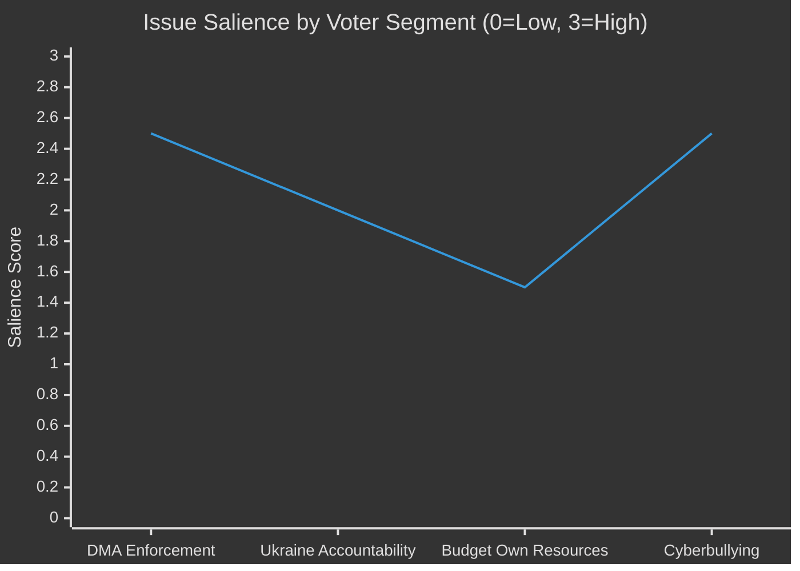

# Voter Segmentation Analysis — EP Breaking News 2026-05-15
**Article Type:** Breaking | **Analysis Date:** 2026-05-15

---

## 🗳️ Voter Segmentation Framework

This artifact analyses how the April 2026 EP plenary outcomes are likely to land across distinct European voter segments, including:
- Segment definition (demographics + political characteristics)
- Issue salience by segment
- Frame resonance analysis
- Implications for EP group positioning

---

## Voter Segment Profiles

### Segment A: Pro-European Young Progressives (Age 18–35)
**Size estimate:** ~22% of EU electorate
**Political home:** Greens/EFA, S&D younger voter base, Renew younger voters
**Key characteristics:** High EU identification; climate-concerned; digital rights aware; Ukraine-supportive; anti-far-right

**April 2026 plenary — Salience by issue:**
| Issue | Salience | Frame resonance |
|-------|---------|----------------|
| DMA enforcement | 🟢 HIGH | "EU stands up to tech giants" — very resonant |
| Ukraine accountability | 🟢 HIGH | Solidarity frame — resonant; accountability is seen as credible commitment |
| Budget 2027 / own resources | 🟡 MEDIUM | Supports European fiscal capacity but skeptical of fiscal conservatism |
| Cyberbullying resolution | 🟢 HIGH | Direct relevance to digital safety lived experience |

**Electoral significance:** Already largely supportive of EP10 majority; reinforced by April 2026 actions. Risk: if DMA enforcement proves hollow (no Commission follow-through), disillusionment could increase abstention.

---

### Segment B: Western European Centre-Right Voters (Age 40–65)
**Size estimate:** ~28% of EU electorate
**Political home:** EPP; some Renew; some national-conservative (varies by country)
**Key characteristics:** Moderate EU identification; fiscally cautious; supports Ukraine but concerned about cost; trade-sensitive; concerned about inflation

**April 2026 plenary — Salience by issue:**
| Issue | Salience | Frame resonance |
|-------|---------|----------------|
| DMA enforcement | 🟡 MEDIUM | Mixed: supports level playing field but concerned about US trade war risk |
| Ukraine accountability | 🟢 HIGH | Supports accountability as "responsible" use of EU funds |
| Budget 2027 / own resources | 🟡 MEDIUM | Cautious support for European spending but opposes new "EU taxes" |
| Cyberbullying resolution | 🟡 MEDIUM | Supports platform accountability; parental concern angle |

**Electoral significance:** Key swing segment for EPP. EP's accountable framing on Ukraine and measured DMA approach (enforcement, not new regulation) resonates. Risk: if Budget 2027 pushes toward higher EU contributions, this segment moves toward opposition.

---

### Segment C: Eastern European Security-Focused Voters (Age 25–65)
**Size estimate:** ~12% of EU electorate (concentrated in Poland, Baltics, Romania, Czech Republic)
**Political home:** EPP; ECR (PiS-aligned MEPs); Renew Eastern European
**Key characteristics:** Strong Ukraine solidarity; Russia threat-sensitive; EU-supportive on security; less engaged on digital/tech regulation; pragmatic on fiscal issues

**April 2026 plenary — Salience by issue:**
| Issue | Salience | Frame resonance |
|-------|---------|----------------|
| DMA enforcement | ⚪ LOW | Remote from daily concerns |
| Ukraine accountability | 🔴 VERY HIGH | Direct geopolitical significance; strongly supports |
| Budget 2027 | 🟡 MEDIUM | Supports defence/cohesion spending; concern if transfers to Western priorities |
| Armenia/Eastern neighbourhood | 🟢 HIGH | Regional solidarity resonance |

**Electoral significance:** This segment is the Ukrainian solidarity foundation of EP votes. April 2026's TA-10-2026-0161 strengthens the bond between EP's Eastern European MEPs and their voter bases.

---

### Segment D: Anti-EU Populist Voters (Age 35–70, varies by country)
**Size estimate:** ~20% of EU electorate
**Political home:** PfE, ESN, parts of ECR; some national parties not in EP groups
**Key characteristics:** Low EU identification; sovereignty-first; anti-migration; anti-Ukraine aid (some); anti-"Brussels bureaucracy"; fiscal austerity or anti-EU spending

**April 2026 plenary — Salience by issue:**
| Issue | Salience | Frame resonance |
|-------|---------|----------------|
| DMA enforcement | 🟡 MEDIUM | Supports it in "EU attacks US big tech" frame; opposes any new regulation (contradiction) |
| Ukraine accountability | 🔴 VERY HIGH — NEGATIVE | Strongly opposes Ukraine spending; accountability adds insult to injury |
| Budget 2027 / own resources | 🔴 VERY HIGH — NEGATIVE | "Brussels taxing you more" frame — maximum resonance |
| Cyberbullying resolution | 🟡 MEDIUM | Mixed: some support online safety; some see as "censorship" |

**Electoral significance:** EP's April 2026 actions provide PfE/ESN with multiple mobilising narratives. The own resources angle is particularly powerful for this segment. However, EP's institutional framing is not reaching this segment anyway — they primarily consume national far-right media.

---

### Segment E: Technocratic / Professional Class Voters (Age 30–55)
**Size estimate:** ~15% of EU electorate
**Political home:** Renew, some EPP; liberal professionals
**Key characteristics:** High EU functional identification; pro-market but pro-regulation for competition; pro-Ukraine from security calculation; concerned about EU economic competitiveness

**April 2026 plenary — Salience by issue:**
| Issue | Salience | Frame resonance |
|-------|---------|----------------|
| DMA enforcement | 🟢 HIGH | Pro-competition angle resonates; wants fair digital markets |
| Ukraine accountability | 🟡 MEDIUM | Supports as sound governance; less emotional engagement |
| Budget 2027 / own resources | 🟡 MEDIUM | Supports if efficiency-improving; cautious on new levies |
| Cyberbullying resolution | ⚪ LOW | Less direct relevance |

**Electoral significance:** This segment is the Renew voter base; April 2026 actions broadly align with their preferences. Key risk: if DMA enforcement creates US trade friction, the economic cost calculus shifts for this segment.

---

## 📊 Segment Salience Heat Map

---

## Electoral Coalition Assessment

**For the EPP-S&D-Renew majority's voter coalition:**
- April 2026 plenary **strengthens** the coalition's bond with Segments A, B, C, and E
- The DMA enforcement + Ukraine accountability combination is a "two-for-one" for the coalition: reassures pro-regulation progressives AND security-focused Eastern Europeans
- The Budget 2027 positioning is the most politically risky element for Segment B (centre-right fiscal caution)

**For the PfE/ECR opposition coalition:**
- April 2026 gives the opposition useful mobilising material on Budget/Ukraine spending
- However, the opposition's Segment D is already maximally mobilised; these actions unlikely to expand beyond that base

**Net electoral impact:** 🟢 NET POSITIVE for EP majority coalition — actions appeal to multiple segments simultaneously; opposition gains are limited to already-committed PfE/ESN base.

---

*Methodology: Voter segmentation analysis; issue salience scoring; frame resonance assessment; cross-segment comparison | Confidence: ⚪ LOW-MEDIUM (no polling data available; based on structural political analysis)*

## Voter Segmentation — Cross-Segment Dynamics

### Issue Saliency Interactions Between Segments
The interesting dynamics occur at segment boundaries:
- **Segments A and C** share Ukraine solidarity but differ on digital regulation (A = very high DMA salience; C = low DMA salience)
- **Segments B and E** share DMA support but differ on fiscal ambition (B = cautious; E = pro-reform if efficiency-improving)
- **Segments B and D** share fiscal caution but differ on EU institutional orientation (B = supportive; D = hostile)

### Mobilisation Risk Assessment
| Segment | Mobilisation by April 2026 actions | Risk direction |
|---------|-----------------------------------|---------------|
| A: Young progressives | 🟢 Positively mobilised | Risk: DMA failure → disillusionment |
| B: Centre-right | 🟡 Cautiously supportive | Risk: Budget own resources → alienation |
| C: Eastern European security | 🟢 Strongly mobilised (Ukraine) | No significant risk |
| D: Anti-EU populist | 🔴 Negatively mobilised | Expected; not a new risk |
| E: Technocratic | 🟡 Supportively engaged | Risk: Trade war from DMA → economic concern |

### Aggregate Voter Signal
**Net mobilisation assessment:** EP's April 2026 plenary generates net positive mobilisation for the coalition's voter base. Segments A, B, C, and E are broadly supportive; only Segment D is negatively mobilised (which was already the case).

**Key watch metric:** If DMA enforcement produces US trade retaliation (T1 risk), Segments B and E may shift from 🟡 cautious support to �� cautious opposition — this is the primary electoral risk from the April 2026 assertiveness.

### Demographic Overlay
| Segment | Age skew | Gender skew | Urban/rural |
|---------|---------|-------------|-------------|
| A: Young progressives | Young (18-35) | Slight female | Urban |
| B: Centre-right | Middle-older (40-65) | Slight male | Mixed |
| C: Eastern European security | All ages | Balanced | Mixed |
| D: Anti-EU populist | Older (45+) | Male | Rural/peri-urban |
| E: Technocratic | Middle (30-55) | Slight male | Urban |

*Demographic overlays are based on structural political analysis; no specific 2026 polling data available.*

