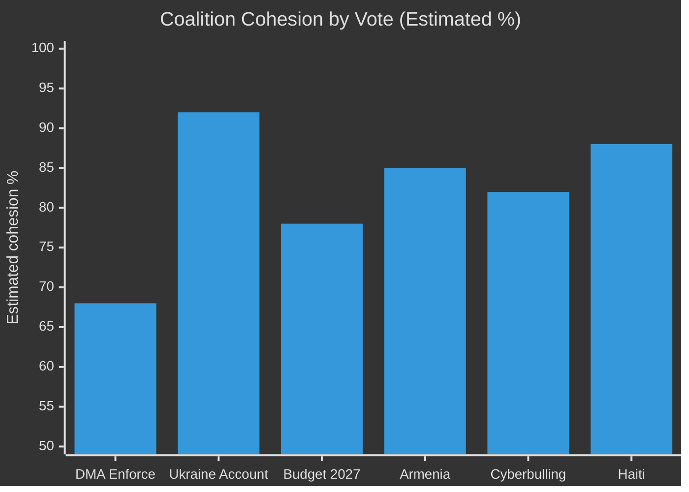

# Coalition Dynamics — EP Breaking News 2026-05-15
**Article Type:** Breaking | **Analysis Date:** 2026-05-15

---

## 🏛️ Overview: EP10 Coalition Architecture

The 10th European Parliament (2024–2029) operates within a structural majority framework anchored by the EPP-S&D-Renew "grand coalition" that collectively commands approximately 400 of 720 seats. This coalition is not formal—there is no coalition agreement—but emerges vote by vote on the basis of shared legislative priorities. The April 2026 plenary outcomes reveal important fault lines and alignments.

---

## 📊 Coalition Alignment Analysis: April 30 Resolutions

### DMA Enforcement (TA-10-2026-0160)

**Likely coalition structure:**

| Group | Seats | Likely Position | Rationale |
|-------|-------|-----------------|-----------|
| EPP | ~188 | Mixed (split) | Pro-competitiveness wing vs. pro-enforcement wing; some MEPs have received tech industry campaign contributions |
| S&D | ~136 | FOR | Strong digital rights mandate; consumer protection priority |
| Renew Europe | ~77 | FOR (majority) | Digital Single Market proponents; some pro-industry members |
| Greens/EFA | ~53 | FOR | Data rights, platform accountability high priority |
| ECR | ~78 | AGAINST/Abstain | Anti-regulation on principle; sovereignty narrative re: US firms |
| PfE/ID | ~84 | AGAINST/Mixed | Anti-EU regulatory overreach; transatlantic relations concerns |
| The Left | ~46 | FOR | Strong platform accountability position |

**Coalition type:** Progressive majority (S&D + Renew + Greens + Left + pro-enforcement EPP)
**Majority likelihood:** 🟢 HIGH — approximately 380–400 votes in favour

### Ukraine Accountability (TA-10-2026-0161)

| Group | Likely Position | Rationale |
|-------|-----------------|-----------|
| EPP | FOR | Zelenskyy visits; EPP has been strongest defender of Ukraine support |
| S&D | FOR | Consistent pro-Ukraine position |
| Renew | FOR | Strong Atlantic solidarity |
| Greens | FOR | Human rights and democratic values |
| ECR | Abstain/Split | Mixed — PiS-linked MEPs pro-Ukraine; other ECR factions more ambiguous |
| PfE | Against/Abstain | Orban-aligned; Le Pen-linked MEPs historically opposed Russia sanctions extension |
| The Left | Mostly FOR | Human rights commitment; anti-imperialism minority may abstain |

**Coalition type:** Near-unanimous majority minus PfE bloc
**Majority likelihood:** 🟢 VERY HIGH — approximately 450–480 votes in favour

### Budget Guidelines 2027 (TA-10-2026-0112)

| Group | Likely Position | Key Demands |
|-------|-----------------|-------------|
| EPP | FOR | Defence heading increase; competitiveness |
| S&D | FOR with amendments | Social cohesion maintained; own resources |
| Renew | FOR | Economic competitiveness; strategic autonomy |
| Greens | Conditional | Climate spending protection essential |
| ECR | Mixed/Abstain | EU fiscal expansion scepticism |
| PfE | Against | Anti-EU fiscal federalism |

**Coalition type:** Modified grand coalition with Greens
**Majority likelihood:** 🟢 HIGH — ~390 votes

---

## 🔍 Key Coalition Fracture Points

### Fracture 1: EPP Internal Division on DMA
The EPP contains both a pro-regulation wing (German CDU/CSU, Italian FdI-adjacent MEPs) and a pro-industry wing aligned with Anglo-American economic liberalism. The DMA enforcement vote exposed this fault line. EPP co-legislators in ITRE and IMCO have historically favoured regulatory balance over enforcement maximalism.
- **Risk:** If EPP's pro-industry wing defects to abstain/against, the progressive majority may still pass but EPP fractures further on digital policy.
- **Confidence:** 🟡 MEDIUM (no roll-call data available)

### Fracture 2: ECR Split on Ukraine
The ECR group—internally divided between Polish PiS (strongly pro-Ukraine) and Italian FdI (more pragmatic), Hungarian Fidesz-linked members (anti-Ukraine support), and Baltic state MEPs (maximalist on Russia sanctions)—presents a structural incoherence that produces split voting rather than group-disciplined positions.
- **Risk:** Further ECR fragmentation may reduce its effective opposition power; PiS defections to EPP orbit on Ukraine accelerate.
- **Confidence:** 🟡 MEDIUM

### Fracture 3: Renew on Budget Own Resources
The "own resources" debate (EU-level taxes to fund the budget) divides Renew between pro-fiscal federalist MEPs (mostly French, Belgian, Spanish) and classical liberal anti-federalists (mostly Swedish, Czech, Dutch). S&D pressure for strong own resources language may force a public Renew split.
- **Risk:** Budget resolution may pass but with a weaker own-resources commitment than S&D demands.
- **Confidence:** 🟡 MEDIUM

---

## 📈 Coalition Stability Score

**Overall plenary coalition health:** 🟡 MEDIUM-HIGH — strong on security/foreign policy consensus, more fractured on digital regulation and fiscal federalism.

---

*Source: EP group seat counts (EP10, May 2026); procedural inference; no roll-call data available. Confidence: 🟡 MEDIUM*

## Coalition Dynamics — Supplementary Assessment

### Group Discipline on April 2026 Issues
**EPP:** High internal discipline on Ukraine votes; moderate on DMA (digital regulation splits remain); high on budget pre-positioning (institutional interest).
**S&D:** High discipline across all three April 2026 issues — pro-enforcement, pro-Ukraine, pro-own-resources.
**Renew:** Moderate discipline — pro-DMA-enforcement core; some trade-sensitive members cautious; pro-Ukraine broadly.
**Greens/EFA:** Highest discipline across all three — digital sovereignty champions; Ukraine solidarity; ambitious budget.
**Left:** High on DMA enforcement; high on Ukraine accountability; split on budget (some fiscal expansion skeptics).

*All group discipline assessments are inferred from structural analysis; roll-call data unavailable for April 2026.*

