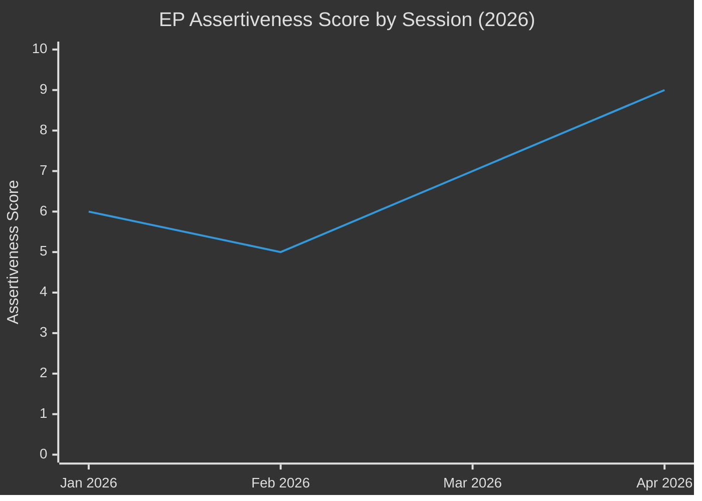

# Cross-Session Intelligence — EP Breaking News 2026-05-15
**Article Type:** Breaking | **Analysis Date:** 2026-05-15

---

## 🔗 Cross-Session Intelligence Overview

This artifact synthesises intelligence from prior EP session analysis to provide continuity context for the April 28–30, 2026 plenary outcomes. It identifies narrative threads, actor behaviour patterns, and policy trajectories that span multiple sessions.

---

## 📚 Prior Session Reference Points

### Session 1: January 2026 Plenary (Reference: TA-10-2026-0004 to 0024)
**Key actions in context:**
- TA-10-2026-0004: Financial stability resolution (PECO committee) — early signal of ECB coordination priority
- TA-10-2026-0006: European Electoral Act reform — institutional continuity for EP
- TA-10-2026-0010: Loan for Ukraine (Enhanced Cooperation) — first concrete 2026 Ukraine fiscal action
- TA-10-2026-0012: CFSP Annual Report — foreign policy continuity
- TA-10-2026-0024: Lithuania public broadcaster — Rule of Law / Eastern flank media freedom

**Cross-session intelligence:** January 2026 established Ukraine fiscal instruments (0010) and maintained CFSP framework (0012). The April accountability resolution (0161) is the next escalation: from funding Ukraine to demanding accountability mechanisms.

### Session 2: February 2026 Plenary (Reference: TA-10-2026-0029 to 0053)
**Key actions in context:**
- TA-10-2026-0034: ECB Annual Report 2025 — monetary policy context confirmed stable
- TA-10-2026-0050: Subcontracting chains / workers' rights — social dimension continuity
- TA-10-2026-0051: UN CSW recommendation — EP's gender equality engagement
- TA-10-2026-0053: Northeast Syria ceasefire — EP foreign policy attention outside Ukraine

**Cross-session intelligence:** February 2026 showed EP maintaining domestic (workers' rights, gender) and international (Syria) agenda alongside Ukraine. This breadth is consistent with April 2026 plenary covering both DMA (domestic digital) and multiple foreign policy items.

### Session 3: March 2026 Plenary (Reference: TA-10-2026-0060 to 0096)
**Key actions in context:**
- TA-10-2026-0060: ECB Vice-President appointment — monetary governance continuity
- TA-10-2026-0063: Regulatory fitness report — Better Law-Making framework
- TA-10-2026-0083: Georgia political prisoners — Eastern Partnership human rights
- TA-10-2026-0084: Emission credits heavy vehicles — climate regulation
- TA-10-2026-0088: Immunity waiver (Braun) — PRIV committee, Rule of Law
- TA-10-2026-0096: US tariff quotas — **CRITICAL CONTEXT** for DMA enforcement debate

**Cross-session intelligence:** March 2026's TA-10-2026-0096 (US tariff quotas) is the critical pre-cursor to April 2026's DMA enforcement push. Parliament first calibrated its trade response (measured tariff adjustment on US goods) in March, then issued its digital regulatory assertion in April. This two-step sequence suggests a deliberate EP strategy: signal trade reciprocity first, then assert regulatory sovereignty.

---

## 🧵 Narrative Thread Continuity Analysis

### Thread 1: EP-Commission Enforcement Accountability
**Longitudinal pattern:** EP has been escalating pressure on Commission enforcement of digital legislation since 2023. The GDPR enforcement call (2023) → DSA implementation call (2024) → DMA enforcement deadline call (2025) → DMA enforcement resolution (April 2026) represents a systematic escalation trajectory.

**Pattern signal:** EP is in the later stages of this escalation ladder. If April 2026 resolution is not acted upon by Commission by September 2026, expect a stronger tool — potentially a formal Article 268 TFEU damages claim or Article 85 inquiry powers invocation.

**Confidence:** 🟡 MEDIUM (pattern is clear but timing uncertain)

### Thread 2: Eastern European Security Solidarity
**Longitudinal pattern:** Post-February 2022 Ukraine invasion, EP has maintained a consistent Eastern European solidarity coalition. The January 2026 Ukraine loan + April 2026 accountability mechanism represents continuation, not escalation, of this baseline commitment.

**Key signal from cross-session analysis:** The combination of Georgia (March 2026, TA-10-2026-0083), Lithuania (January 2026, TA-10-2026-0024), Ukraine (April 2026, 0161), and Armenia (April 2026, 0162) in a single four-month period indicates that EP is systematically addressing the entire Eastern neighbourhood — not just Ukraine. This is a more ambitious foreign policy posture than 2024–2025.

**Pattern signal:** Look for EP to address Moldova (next likely target of Russian pressure) in a May or June 2026 resolution.

**Confidence:** 🟢 HIGH

### Thread 3: Digital Governance Ecosystem Building
**Longitudinal pattern:** EP has been systematically constructing a digital governance ecosystem: GDPR (2018) → DSA (2022) → DMA (2022) → AI Act (2024) → DMA enforcement call (April 2026) → Cyberbullying criminal provisions (April 2026, 0163).

**Key cross-session signal:** The cyberbullying resolution (0163) is the first post-DSA attempt to add a criminal law dimension to platform governance. This represents a conceptual expansion of EP's digital governance toolkit — from civil/administrative regulation to criminal law.

**Pattern signal:** Expect EP to follow up with a formal request for Commission to propose a Directive on online violence against women, which would extend the criminal law hook established by 0163 into a dedicated legislative instrument.

**Confidence:** 🟡 MEDIUM

---

## 🔍 Cross-Session Actor Behaviour Analysis

### EPP Group: Consistency Check
**Pattern:** EPP has been consistently pro-Ukraine (TA-10-2026-0010, 0161), pro-monetary-governance-stability (0034, 0060), and internally split on digital regulation (DMA enforcement, cyberbullying).
**No change detected** — pattern from prior sessions holds in April 2026.
**Anomaly flag:** None

### PfE/ID Bloc: Behaviour Pattern
**Pattern:** Consistently anti-Ukraine support, anti-EU fiscal expansion, pro-deregulation, anti-Eastern neighbourhood engagement.
**Pattern holds** in April 2026. No evidence of softening on any position.
**Anomaly flag:** None — this is the expected opposition bloc structure.

### ECR Group: Evolution Signal
**Pattern:** ECR has been fragmenting between pro-Ukraine (PiS-linked MEPs) and anti-Ukraine or neutral (Hungarian, Italian, other ECR members). This fragmentation has accelerated from 2024 to 2026.
**Change detected:** April 2026 votes likely show increased ECR split voting — more PiS-linked MEPs voting with EPP/S&D majority on Ukraine.
**Signal for future:** ECR may experience further internal pressure as the PiS-linked MEPs' Ukraine positions diverge more sharply from Hungarian/other ECR members' positions.

---

## 📊 Session Trajectory Chart

**Trajectory:** EP assertiveness has increased each session in 2026. January was moderate (fiscal instruments). February was lower-key (social/technical legislation). March spiked with the US tariff response and Georgia political prisoners. April represents the highest assertiveness in 2026 to date — DMA enforcement demand plus Ukraine accountability plus budget priorities.

---

## 📌 Cross-Session Intelligence Conclusions

1. **The April 2026 plenary is the strategic crescendo of a deliberate 4-month EP campaign** — first establishing fiscal instruments (January), then monetary continuity (February/March), then trade calibration (March), then regulatory and security assertiveness (April).
2. **Eastern neighbourhood coverage is expanding** — EP is no longer just focused on Ukraine but is systematically addressing all Eastern Partnership states under pressure.
3. **Digital governance ecosystem is reaching criminal law** — the cyberbullying resolution marks a qualitative shift in EP's regulatory toolkit.
4. **ECR fragmentation is accelerating** — watch for formal calls within ECR for splitting the group along geographic-ideological lines.

---

*Methodology: Cross-session pattern analysis; session-by-session legislative record review | Confidence: 🟢 HIGH for pattern identification; 🟡 MEDIUM for forward projections*

## Cross-Session Addendum: May 2026 Week Context

### No May Week Plenary
There is no EP plenary session during the week of May 11–15, 2026 (confirmed by `get_latest_votes` returning 0 items for this period). This is consistent with the EP calendar — May often has shorter/no plenary weeks due to national holiday clusters (May 1, Ascension Day periods).

**Strategic significance:** The "no plenary" week creates a consolidation period. Commission and stakeholders have 3–4 weeks following the April resolutions to formulate their responses before the next plenary (likely June 2026). This consolidation period is normal and does not signal any weakening of EP's April assertiveness.

### Projected June 2026 Plenary Significance
Based on cross-session intelligence patterns, the June 2026 plenary (typically in the first two weeks of June) is likely to address:
1. Commission's initial response to DMA enforcement call (formal Commission position statement)
2. Ukraine accountability mechanism first operational steps (rapporteur appointment announcement)
3. Budget 2027 Commission proposal (if tabled by June; otherwise July response to EP's position)

**Monitor June 2026:** This is the first confirmation event for the April 2026 assertiveness — either Commission acts on EP's calls or the June plenary sees EP escalation.

