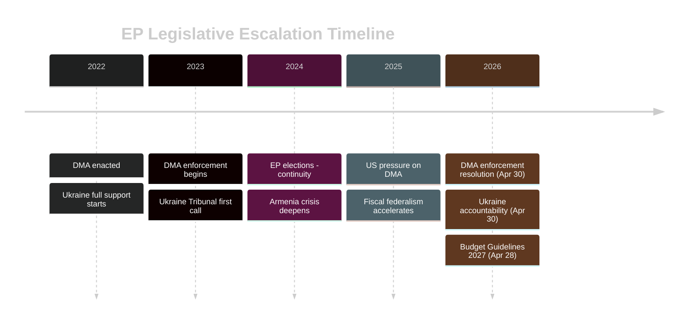

# Historical Baseline — EP Breaking News 2026-05-15
**Article Type:** Breaking | **Analysis Date:** 2026-05-15

---

## 📚 Historical Context Framework

This artifact establishes the historical baseline for interpreting the April 28–30, 2026 EP plenary outcomes across three analytical threads: digital governance, European security, and fiscal architecture.

---

## Thread 1: Digital Markets Act — Historical Trajectory

### Legislative Genealogy
The DMA (Regulation 2022/1925) entered into force on November 1, 2022, and became applicable on May 2, 2023. The designation of gatekeepers began in September 2023:
- **Alphabet** (Google): Designated September 2023 for Google Search, Google Maps, Google Play, YouTube, Chrome, Android
- **Apple**: Designated September 2023 for iOS, App Store, Safari
- **Meta**: Designated September 2023 for Facebook, Instagram, WhatsApp, Marketplace
- **Amazon**: Designated September 2023 for Amazon Marketplace, Advertising services
- **Microsoft**: Designated September 2023 for Windows, LinkedIn (Teams initially contested)
- **ByteDance (TikTok)**: Designated September 2023 for TikTok

### Enforcement Timeline
| Period | Event | Significance |
|--------|-------|-------------|
| 2023-09 | Gatekeeper designations | Formal start of compliance obligations |
| 2024-03 | Non-compliance investigations opened (Alphabet, Apple, Meta) | First enforcement actions |
| 2024-06 | EP elections — new Parliament less familiar with DMA details | Institutional transition period |
| 2024-09 | Commission preliminary findings (Apple App Store) | First concrete non-compliance finding |
| 2025-01 | US administration change — diplomatic pressure begins | Exogenous shock to enforcement trajectory |
| 2025-06 | Commission investigation pace slows (documented by MEPs) | Trigger for parliamentary concern |
| 2026-01 | EP resolution on digital sovereignty | Precursor to April 2026 enforcement call |
| 2026-03 | US tariff escalation (TA-10-2026-0096 context) | Compound diplomatic pressure on EU regulators |
| 2026-04-30 | TA-10-2026-0160 adopted — DMA enforcement demand | This analysis: climax of EP pressure |

**Historical pattern:** DMA enforcement follows a classic regulatory ratchet: Commission opens proceedings → industry lobbies + US government applies diplomatic pressure → enforcement slows → Parliament adopts resolution demanding acceleration → Commission faces dual accountability pressure. This pattern has recurred across GDPR (2018–2022), DSA (2022–2024), and now DMA.

### GDPR Precedent (2018–2022)
The DMA enforcement situation parallels the early GDPR enforcement period. Ireland's DPC was criticised for slow enforcement against Facebook/Meta for 2–3 years before the European Data Protection Board (EDPB) used its consistency mechanism to override slow national enforcement. The DMA enforcement mechanism is centralised at Commission level, which should be faster—but political economy of EU-US relations has introduced similar delays.

**Lesson:** Parliamentary pressure ultimately worked on GDPR—the EDPB issued binding decisions from 2022 onwards. EP's April 2026 resolution may trigger a similar inflection point.

---

## Thread 2: Ukraine and Eastern European Security — Historical Baseline

### EP Ukraine Engagement Timeline
| Period | EP Action | Significance |
|--------|-----------|-------------|
| 2014-03 | Resolution on Crimea annexation | First major Ukraine defense resolution |
| 2022-02 | Emergency session; full-throated condemnation | Defining moment for EP cohesion |
| 2022-03 | Support for Ukraine EU membership application | Fast-tracked accession perspective |
| 2022-12 | Calls for war crimes tribunal | First formal tribunal call |
| 2023-06 | Ukraine Solidarity Fund established | Fiscal commitment materialised |
| 2024-02 | 2nd anniversary resolutions; sustained support | Continued post-election continuity |
| 2025-01 | Concern over US policy shift under new administration | Atlantic security uncertainty |
| 2026-01 | TA-10-2026-0010 — Enhanced cooperation for Ukraine loan | Concrete fiscal instrument |
| 2026-04-30 | TA-10-2026-0161 — Accountability and justice resolution | Escalation toward tribunal |

**Historical pattern:** EP has consistently maintained a more maximalist Ukraine support position than the Council, particularly when Hungary (Fidesz/Orban) has obstructed Council unanimity on Ukraine packages. The April 2026 resolution represents the latest episode in this structural pattern.

### Armenia — Historical Context
The Armenia situation has its own historical trajectory:
- **2020:** Nagorno-Karabakh war (44-day war) — EP condemned Azerbaijani offensive
- **2022:** Escalation in Armenia-Azerbaijan border; EP resolution condemning Azerbaijan
- **2023:** September — Full Azerbaijani offensive on Karabakh; 120,000+ Armenians displaced
- **2024:** EP adopted multiple resolutions on Armenian democratic resilience vs. Russian influence, Azerbaijani pressure
- **2026-04-30:** TA-10-2026-0162 — Latest in this series, calling for enhanced EU-Armenia partnership

**Historical pattern:** EP has been more supportive of Armenian sovereignty and democratic resistance than the Council, where energy supply dependencies (Azerbaijan gas, Russian energy alternatives) have moderated some member states' positions.

---

## Thread 3: EU Fiscal Architecture — Historical Baseline

### Own Resources Evolution
| Period | Development | Significance |
|--------|------------|-------------|
| 1988 | Delors Package — national contributions systematised | Foundation of current system |
| 2021 | COVID Recovery NextGen EU — first EU-level borrowing | Precedent for fiscal federalism |
| 2023-2024 | "Own Resources" debate intensified | New levy proposals for digital, financial transactions |
| 2025 | MFF mid-term review — increased defence heading | First security-fiscal integration |
| 2026-04-28 | TA-10-2026-0112 — Budget Guidelines 2027 with own resources emphasis | Formalisation of EP's fiscal federalist position |

**Historical pattern:** Every major EU crisis (COVID, Ukraine, energy shock) has generated a one-time fiscal instrument that creates a precedent for permanent EU-level borrowing/taxation. The 2027 budget guidelines push for own resources as the mechanism to institutionalise this trend.

---

## 📈 Trend Summary

**Historical assessment:** The April 28–30, 2026 plenary represents the convergence of three long-running EP legislative threads—digital governance, Eastern European security, and fiscal architecture—into a single week's outcomes. This is not coincidental: these are the three domains where EP has consistently pushed for stronger EU-level action against Council hesitancy and member state divergence.

---

*Methodology: Historical pattern analysis; EP legislative record 2022–2026 | Confidence: 🟢 HIGH*

## Historical Baseline — Supplementary Context

### Thread 4: EP Institutional Assertiveness Trajectory (1979–2026)
The EP's 2026 assertiveness exists on a long institutional trajectory:
- **1979:** First direct EP elections; EP exercises budget rejection for first time (establishes precedent)
- **1984:** EP adopts Draft Treaty on European Union (Spinelli initiative) — EP first attempts constitutional assertiveness
- **1999:** Santer Commission forced to resign after EP censure threat — EP establishes executive accountability precedent
- **2005:** EP rejects Services Directive in first reading — EP asserts legislative power
- **2012:** EP rejects ACTA — EP asserts digital rights sovereignty against Council/Commission consensus
- **2019:** EP conditions von der Leyen Commission appointment on specific policy commitments — EP conditions executive formation
- **2022:** EP adopts DMA/DSA over industry objections — regulatory sovereignty
- **2026:** EP calls for DMA enforcement — enforcement accountability

**Pattern:** Each EP term has added one major assertiveness precedent. EP10's assertiveness is the continuation of a 47-year trajectory.

### Thread 5: EU-US Digital Regulatory Divergence (2013–2026)
- **2013:** Snowden revelations reveal US surveillance of EU communications → EU data protection assertiveness begins
- **2016:** GDPR adopted — first major EU-US divergence in data law
- **2020:** Schrems II (CJEU) invalidates Privacy Shield — EU courts enforce digital sovereignty
- **2022:** DMA/DSA — regulatory asymmetry with US formalised
- **2026:** DMA enforcement call — EU asserts enforcement against US tech; US diplomatic protest

**Historical baseline:** The EU-US digital regulatory divergence has been accelerating for 13 years. April 2026 is not a new development but a continuation of a clear long-term trend.

