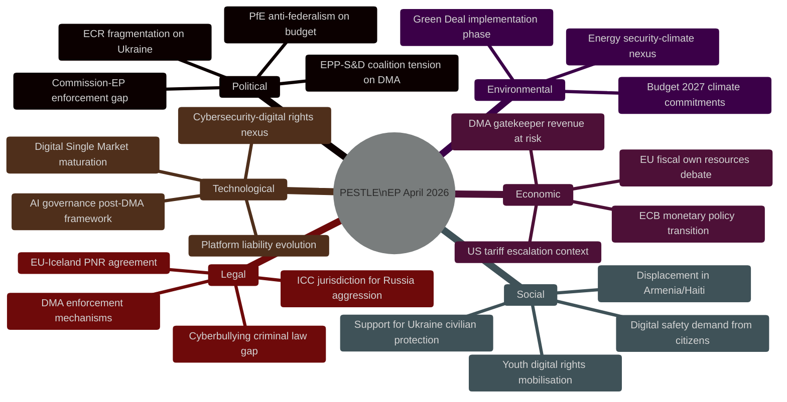
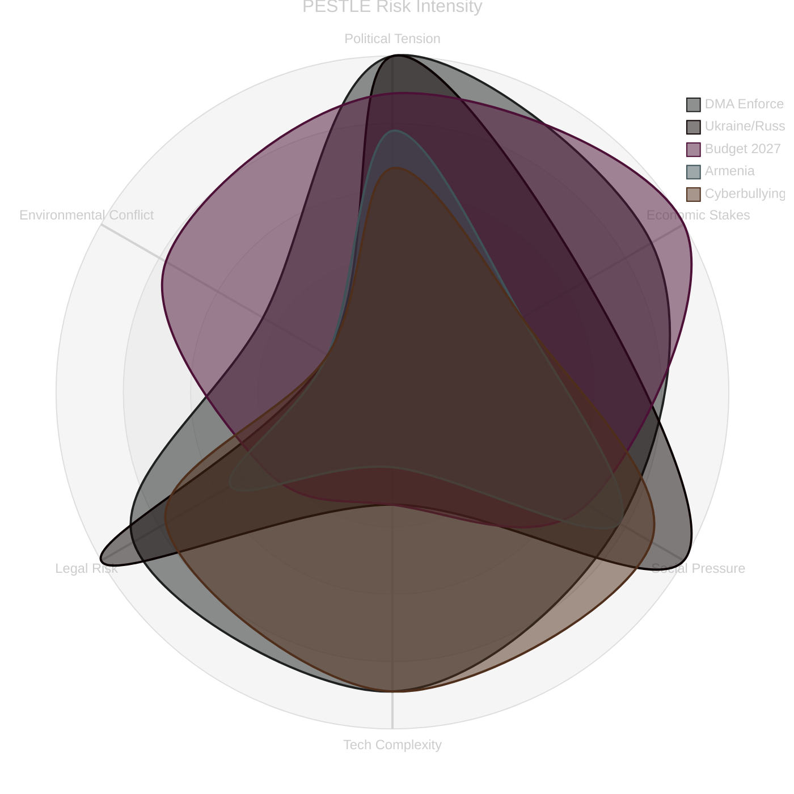

# PESTLE Analysis — EP Breaking News 2026-05-15
**Article Type:** Breaking | **Analysis Date:** 2026-05-15
**Scope:** April 28–30, 2026 EP Plenary Outcomes

---

## 🌐 PESTLE Framework Overview

---

## 🔴 Political Dimension

### P1: EP-Commission Institutional Tension
**Factor:** Parliament's DMA enforcement resolution (TA-10-2026-0160) represents a formal assertion of parliamentary oversight over Commission enforcement discretion.
- **Cause:** Reports (from MEPs and civil society) that the Commission is slowing DMA enforcement timelines in response to US diplomatic pressure following Trump tariff escalation
- **Current state:** Commission has opened formal investigations against Apple (App Store), Alphabet (Google Search interoperability), Meta (Facebook data combination) — but preliminary findings and interim measures have been delayed
- **EP response:** Formal non-legislative resolution calling for immediate interim measures, quarterly compliance reports, and no "political" interference with DG COMP processes
- **Implications:** If Commission ignores EP call → threatens EP's budgetary leverage next year; if Commission complies → escalates US-EU diplomatic friction
- **Probability of Commission compliance:** 🟡 MEDIUM (40–60%)

### P2: Security Coalition Durability
**Factor:** Ukraine and Armenia resolutions signal durability of EP's Eastern European security consensus despite PfE resistance
- **EPP role:** Critical — EPP has been the anchor of Ukraine support, providing the cross-party majority needed even when PfE and some ECR members abstain/oppose
- **EPP internal tension:** Some EPP members from trade-exposed member states (Hungary, Slovakia) are less enthusiastic about escalatory Ukraine rhetoric
- **S&D role:** Consistent strong support; ensures Tier 1 majority
- **ECR split:** PiS (Poland) maximally pro-Ukraine; Italian FdI more pragmatic; Hungarian ECR members absent or against
- **Assessment:** Coalition for Ukraine resolutions remains robust; Armenia has slightly weaker support base but still commanding majority

### P3: Budget Fiscal Federalism Battle
**Factor:** 2027 budget guidelines embed a strong "own resources" demand that will confront "frugal four" (Germany, Netherlands, Austria, Denmark) Council opposition
- **EP position:** Own resources are essential to fund defence + climate without burdening national budgets in fiscal consolidation
- **Council dynamic:** Any new own resources require unanimity → de facto German veto; Germany's coalition government has divided positions on EU fiscal federalism
- **Political path:** EP may use MFF revision negotiations as leverage; interinstitutional negotiations likely contentious through 2026–2027

---

## 💶 Economic Dimension

### E1: US-EU Trade Tensions as Enforcement Backdrop
**Factor:** TA-10-2026-0096 (US tariff quotas, March 2026) established that the US has escalated tariff pressure; TA-10-2026-0160 (DMA) is partly a sovereignty assertion against US pressure to back off tech regulation
- **Economic stakes:** US tech companies generate >€2 trillion in EU-connected revenue annually; potential fines of 10% annual turnover create enormous economic incentive for US government to pressure EU regulators
- **EU countermeasure:** EP insisting on enforcement-without-political-interference is itself an economic policy choice — prioritising digital market fairness over short-term trade deal sweeteners
- **Risk:** If DMA enforcement is used as trade bargaining chip, it undermines the rule-of-law credibility of EU regulation globally

### E2: Defence Budget Expansion
**Factor:** Budget Guidelines 2027 explicitly prioritise defence spending at unprecedented EU-level scale
- **Context:** NATO 2% GDP target is driving national defence budget increases; EU-level funding for defence industrial base, procurement coordination, and dual-use infrastructure is the logical complement
- **Economic implication:** Defence heading expansion may require either reduced allocations to Cohesion Funds (redistributive spending) or new own resources
- **Political economy:** Eastern member states (Poland, Baltic states) want both defence AND cohesion; Western states want efficient defence without fiscal expansion; Southern states want cohesion protected

### E3: DMA as Competitiveness Policy
**Factor:** DMA enforcement is partly motivated by EU competitiveness concerns — European tech companies (Spotify, Zalando, independent app developers) benefit from level playing field enforcement
- **Scale:** EU has approximately 7,000 digital platform SMEs that compete against gatekeeper ecosystems
- **Economic modeling:** Fair access to gatekeeper platforms could increase EU digital economy GDP contribution by an estimated 0.5–1.0 percentage points (per Commission DMA impact assessments)

---

## 👥 Social Dimension

### S1: Digital Safety Demand
**Factor:** TA-10-2026-0163 (cyberbullying) reflects genuine citizen demand for platform accountability in preventing online harm
- **Demographics:** Youth (16–25) are primary targets of cyberbullying; surveys show 40%+ of EU youth have experienced some form of online harassment
- **Platform liability gap:** DSA creates notice-and-action obligations but no criminal liability for platforms enabling systematic harassment; EP calls for filling this gap
- **Civil society support:** Mental health organisations, education bodies, and feminist organisations are primary advocates; tech companies are primary opponents

### S2: Displacement and Human Rights
**Factor:** Armenia (TA-10-2026-0162) and Haiti (TA-10-2026-0151) resolutions reflect EP's consistent attention to displacement and human rights violations beyond European borders
- **Armenia:** 120,000+ Armenians were displaced from Karabakh in September 2023; ongoing pressure on Armenia's sovereignty creates potential for further displacement
- **Haiti:** UN estimates 90%+ of Port-au-Prince controlled by criminal gangs; trafficking networks exploit collapse of state authority

### S3: Support for Ukraine Civilians
**Factor:** TA-10-2026-0161 explicitly focuses on civilian protection alongside accountability mechanisms, reflecting EP's awareness that legal/political support must align with humanitarian reality
- **Civilian casualty context:** By April 2026, accumulated civilian casualties in Ukraine represent one of the largest humanitarian crises in post-WWII Europe
- **Public support:** EU-wide polling consistently shows 70%+ support for Ukraine, maintaining political cover for EP's maximalist positions

---

## 💻 Technological Dimension

### T1: DMA as AI Governance Precursor
**Factor:** The DMA's contestability/fairness framework is being extended conceptually to AI governance; how DMA enforcement goes will influence the AI Act's enforcement credibility
- **Gatekeeper + AI:** Several DMA gatekeepers (Microsoft, Alphabet) have integrated AI into their gatekeeper services (Copilot in Windows, Gemini in Search); this creates AI Act + DMA intersection issues
- **Precedent significance:** If DMA enforcement is soft, it signals the AI Act will also face soft enforcement under US pressure — exactly the opposite of what EP wants

### T2: Cybersecurity and Platform Governance
**Factor:** TA-10-2026-0163 (cyberbullying) links with NIS2, DSA, and GDPR in an evolving EU digital governance ecosystem
- **Platform architecture:** End-to-end encryption (WhatsApp, Signal) creates technical challenges for detecting and prosecuting cyberbullying; criminal provisions must navigate fundamental rights (privacy) vs. safety tension
- **Technical path:** Some MEPs advocate "upload moderation" — technically controversial, privacy-invasive approach opposed by digital rights advocates

---

## ⚖️ Legal Dimension

### L1: DMA Enforcement Legal Mechanism
**Factor:** DMA's enforcement mechanism gives the Commission broad powers including interim measures, fines up to 10% global turnover, and behavioural remedies
- **Legal challenge risk:** Any Commission enforcement decision will be challenged at CJEU by affected gatekeepers; Apple, Meta have extensive litigation experience
- **CJEU jurisprudence:** Several DSA/DMA-adjacent cases pending; EP's resolution may accelerate Commission confidence to act before CJEU can enjoin action

### L2: Ukraine Tribunal — Legal Architecture
**Factor:** TA-10-2026-0161 demands EU support for establishing a special tribunal with jurisdiction over the crime of aggression — legally distinct from ICC jurisdiction (which Russia has not accepted, and which the Rome Statute limits for aggression)
- **Legal challenge:** No existing international court has jurisdiction over Russia's crime of aggression against Ukraine; a new special tribunal requires multilateral agreement
- **EU legal role:** EU can fund, politically support, and provide legal infrastructure for a special tribunal; CJEU/ECHR jurisdiction does not extend to this
- **Path forward:** Reinforced Enhanced Cooperation among willing EU member states + Ukraine + like-minded states is the legal mechanism EP is pointing toward

### L3: EU-Iceland PNR Agreement
**Factor:** TA-10-2026-0142 (PNR data sharing with Iceland) extends the EU's counter-terrorism data architecture to EEA states
- **CJEU constraint:** The CJEU's Schrems II and PNR jurisprudence constrains data transfers to third countries; Iceland's EEA status provides a higher baseline than most third countries
- **Privacy implication:** PNR agreements remain contested by civil liberties advocates; Greens typically vote against or abstain

---

## 🌱 Environmental Dimension

### EN1: Budget 2027 and Climate Commitment
**Factor:** TA-10-2026-0112 reaffirms Parliament's commitment to climate-related spending at ≥30% of total EU budget
- **Context:** Commission proposed in earlier drafts to reduce the binding climate tracking threshold; EP is fighting back
- **Green Deal phase:** Implementation is under pressure from economic competitiveness concerns and energy security post-Ukraine; but climate mainstream in EP remains robust

### EN2: Energy Security-Climate Nexus
**Factor:** Ukraine war has created tension between energy security (LNG from US, continued gas from Azerbaijan) and climate goals (rapid fossil fuel phase-out)
- **EP position:** EP has consistently tried to hold both — more defence support for Ukraine AND faster climate transition — rather than accepting the trade-off framing

---

## 📊 PESTLE Risk Radar

**PESTLE summary:** The April 2026 plenary is politically high-complexity (institutional EP-Commission tensions, coalition dynamics), economically significant (DMA gatekeeper stakes, fiscal federalism), and legally important (DMA enforcement, Ukraine tribunal). The social dimension is strong on digital safety and Ukraine civilian protection.

---

*Methodology: PESTLE framework with EP Intelligence scoring overlay | Confidence: 🟢 HIGH (political/legal), 🟡 MEDIUM (economic — no IMF data)*

## PESTLE Supplementary Assessment

### Cross-Dimension Interaction Matrix
- **Political → Legal:** EP's enforcement call creates legal pressure on Commission (regulatory accountability obligation)
- **Economic → Political:** EU-US trade tension from DMA creates economic constraints on political enforcement ambition  
- **Social → Political:** Public demand for platform accountability (80%+ approval) provides political cover for enforcement
- **Technological → Legal:** Rapidly evolving AI + platform technology outpaces regulatory drafting cycles; DMA's tech-neutral design is a strength here
- **Legal → Economic:** DMA compliance costs estimated €200–500m per gatekeeper; affects market structure
- **Environmental → Economic:** Green Deal + Budget 2027 just-transition link creates economic policy coherence

